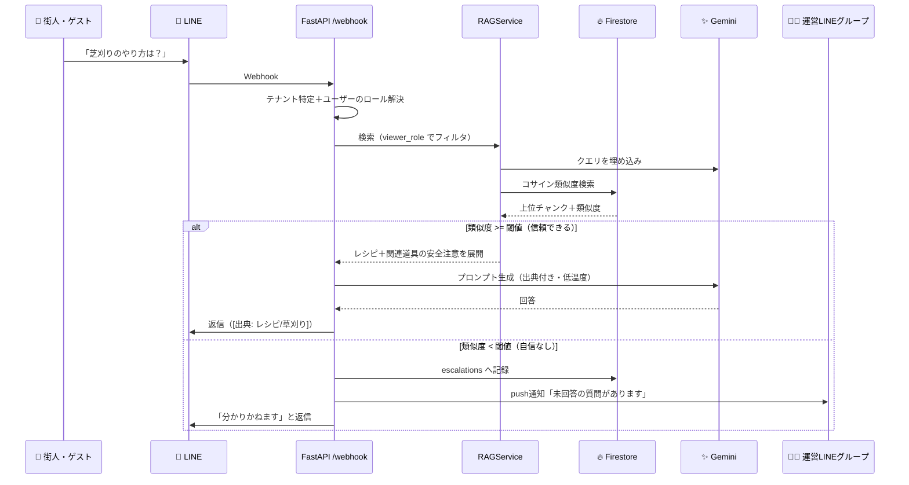
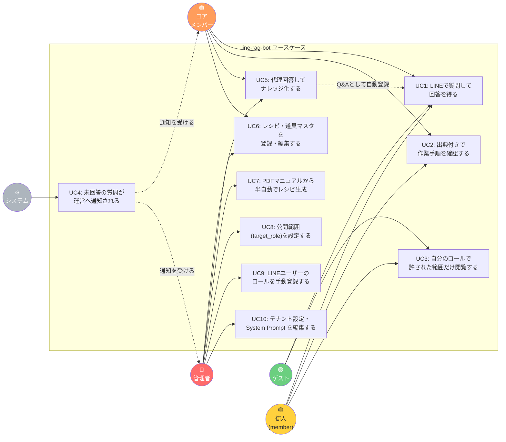

# RAG基盤 / line-rag-bot 概要

> [!info] 📚 このドキュメントについて
> [[Projects/fuyuugai-app/docs/オンボーディング資料_新規メンバー向け概要.md|オンボーディング資料]] §3 から分離した**別紙**です。
>
> - **想定対象**: AI/RAG 領域の担当者、および「浮遊街アプリ側に RAG を作るのか？」を確認したい全メンバー
> - **親ドキュメント**: [[Projects/fuyuugai-app/docs/オンボーディング資料_新規メンバー向け概要.md|オンボーディング資料（新規メンバー向け概要）]]
> - **詳細の正本**: `line-rag-bot` 側の [[Projects/line-rag-bot/docs/08-浮遊街RAG詳細設計.md|08-浮遊街RAG詳細設計]] ／ [[Projects/line-rag-bot/IMPLEMENTATION_STATUS.md|IMPLEMENTATION_STATUS]]
> - 本書は**ハイレベル要約**です。記述が各リポジトリの正本と食い違う場合は**正本が勝ちます**

> [!tip] このドキュメントが必要な理由
> 新規メンバーの多くは「浮遊街アプリ」だけを見て参画します。しかし**5つの柱の1本（⑤ 暗黙知の形式知化）の実体は別リポジトリにあり、そちらが先に動き始めています。**
> 「アプリ側に RAG を作る」という誤った実装を防ぐため、最初に押さえてください。

---

## 1. 現在地：「本番稼働中」ではなく「本番環境で試用中」

> [!warning] ⚠️ 用語の訂正（2026-08-22 オーナー確認）
> `line-rag-bot` は **Cloud Run の本番環境にデプロイ済みで、LINE から実際に応答します。**
> ただし**本運用（運営フローに組み込んだ定常運用）はまだ始まっていません。**
> 現在は「**本番環境をそのまま使いながら、運営が試している**」段階です。
>
> 過去の資料にある「本番稼働中」という表現は、**「デプロイ済み・応答する」という意味**であって、
> 「運用に乗っている」という意味ではありません。読み替えてください。

この違いは実務上の判断を変えます。

| 誤解 | 実態 |
|---|---|
| 「稼働中だから、触ると運用が止まる」 | **浮遊街のテナントは試用中**。壊しても業務は止まらない |
| 「実績があるから仕様は確定済み」 | **試しながら仕様を決めている最中**。回答品質・閾値・ナレッジ粒度はまだ動く |
| 「デプロイは慎重に段階を踏むべき」 | 浮遊街分については**素早く試して直す**方が価値が出る |

> [!danger] ただし「壊してよい」のは浮遊街のテナントだけです
> `line-rag-bot` は**既存クライアントと Cloud Run / Firestore を共有**しています（§7 R5）。
> 既存クライアントの LINE ボットは**本当に運用に乗っています**。
> したがって「浮遊街は試用中だから雑にデプロイしてよい」は成り立ちません。
> **共有部分（core のコード・既定テナントの挙動）に触れる変更は、依然としてリリースゲート級の慎重さが必要です。**

---

## 2. 位置づけ：リポジトリは独立、プロダクトは1つ

> [!success] 確定方針（2026-08-22）
> **`line-rag-bot` は浮遊街アプリへ統合しません。リポジトリ・デプロイは独立を維持します。**
> ただし**プロダクトとしては「浮遊街プロジェクト」1つ**として扱い、ドキュメント・オンボーディング・ロール定義は束ねます。

| 観点 | 判断 | 理由 |
|---|---|---|
| **リポジトリ** | 🔵 独立を維持 | 技術スタック・デプロイ単位が別であり、統合の利点がない。テナント機能のコードも残す（削除すると既存クライアントが停止するため／§7 R5） |
| **技術スタック** | 🔵 独立を維持 | Python/FastAPI/Firestore/Cloud Run と TypeScript/Next.js/Supabase/Vercel。共通化の利点がない |
| **認証モデル** | 🔵 独立を維持 | 浮遊街アプリは **Supabase Auth ＋ RLS**（DB層に認可を埋め込む）。line-rag-bot は **LINE `userId` ＋ Firestore `target_role`**。**寄せると片方の認可設計を捨てることになる**（2026-08-22 オーナー確定） |
| **デプロイ** | 🔵 独立を維持 | 既に本番環境で動いており、既存クライアントと同居している。統合は「動いているものを止める」リスクを伴う |
| **API連携** | ⛔ **行わない** | 2026-08-16 オーナー最終判断（正本 §9 #31）。結合点は管理画面からの**外部リンクのみ** |
| **デザインシステム** | 🟢 **束ねる**（2026-08-23 実施） | 配色・書体・角丸を浮遊街アプリと共有する。リポジトリが別でも、運営から見えているのは1つの製品であるため（§2-1） |
| **ドキュメント** | 🟢 **束ねる** | オンボーディング資料と本書が両者を横断して説明する入口 |
| **ロール定義** | 🟢 **束ねる（必須）** | ロール値は**両システムで整合させる**。ここだけは二重管理を許さない（§5） |

> [!important] 🔑 「RAG は別リポジトリ」＝「RAG は脇役」ではありません
> 5つの柱のうち **1本（⑤ 暗黙知の形式知化）だけが別リポジトリに実装されている**、という構造です。
> リポジトリが分かれているのは**技術スタックとデプロイ単位の都合**であって、プロダクト上の重要度の差ではありません。

### 2-1. デザインの統合（2026-08-23）

API は繋がないが、**見た目は1つの製品として揃える**。運営は浮遊街アプリの管理画面から
外部リンクで Streamlit 管理画面へ飛ぶため、そこで配色と書体が変わると
「別のサービスへ飛ばされた」と受け取られ、操作をためらう。

| 揃えるもの | 値 | 出典 |
| --- | --- | --- |
| 配色 | sage / sand / wood のアースカラー | `prototype_v14.html` の `tailwind.config` |
| 書体 | Zen Maru Gothic（副：Noto Sans JP） | 同上 |
| 角丸・影 | カード 16px ／ ボタンはピル型 ／ `shadow-soft` | 同上 |

実装は line-rag-bot 側の以下2ファイル。**アプリ側のトークンを変えたら手動で追従させる**
（自動同期の仕組みは持たない）。

- `app/admin/theme.py` — トークン定義・CSS・共通見出し
- `.streamlit/config.toml` — 主ボタンとフォーカスリングの色（Streamlit が CSS より前に決めるため、こちらでしか変えられない）

**行き来は双方向にする。**

```
浮遊街アプリ 管理者PC画面
  └─ 「浮遊街コンシェルジュ管理画面を開く」（外部リンク）
        ↓
     Streamlit 管理画面
        └─ サイドバー「← 浮遊街アプリへ戻る」（環境変数 PARENT_APP_URL）
```

`PARENT_APP_URL` / `PARENT_APP_NAME` はデプロイ設定で与える
（line-rag-bot の `docs/07-ブランチ戦略.md`：クライアント差分をコードへ埋め込まない）。
未設定なら戻るリンクを出さないだけで、他の機能には影響しない。

> [!note] これは「統合」ではなく「統一」です
> データも認可も依然として別系統です（§5）。揃えているのは**見た目と行き来の導線**だけで、
> 正本 §9 #31（API連携を行わない）の判断は変わっていません。

---

## 3. 何をするシステムか

**LINE 公式アカウントで受けた質問に、テナントごとのナレッジを使って Gemini が答える RAG チャットボット。**
浮遊街ではこれが「**浮遊街コンシェルジュ**」として動きます。



> [!warning] この分岐は現在**片方しか働いていません**
> 浮遊街のテナントは `RAG_MIN_SIMILARITY=0.0` で運用されており、**閾値による足切りが実質無効**です。
> つまり上図の `else`（自信なし → エスカレーション）へ落ちる経路がほぼ発火しません。
> Phase 1 では**オーナー判断により対応しない**と決まっています（§7 R16）。試用中に体感すべき最重要の癖です。

---

## 4. アーキテクチャ

### 🏗️ ハイレベル構成（5層）

**5層構造**で捉えると全体が掴めます。左が入力、右が知識、下が運用です。

```mermaid
graph TB
    subgraph CH["① 入力チャネル層"]
        CH1["💬 LINE 公式アカウント<br/>（街人・ゲストの唯一の入口）"]
        CH2["🖥️ Streamlit 管理画面<br/>（運営の唯一の登録経路）"]
    end

    subgraph APP["② アプリケーション層（FastAPI / Cloud Run）"]
        AP1["WebhookController<br/><small>テナント特定・ロール解決・信頼度ゲート</small>"]
        AP2["RAGService<br/><small>検索・候補集約・マスタ展開</small>"]
        AP3["LLMService / prompting<br/><small>出典付与・安全注意の自動付加</small>"]
        AP4["KnowledgeIndexer<br/><small>マスタ→チャンク投影・差分再埋め込み</small>"]
        AP5["EscalationStore<br/><small>未回答の記録・通知</small>"]
    end

    subgraph KN["③ ナレッジ層（Firestore）"]
        K1[("recipes_&#123;tenant&#125;<br/><b>レシピマスタ</b>")]
        K2[("tools_&#123;tenant&#125;<br/><b>道具マスタ</b>")]
        K3[("knowledge_&#123;tenant&#125;<br/><b>検索インデックス</b><br/><small>embedding付き</small>")]
        K4[("escalations<br/>未回答ログ")]
        K5[("tenants / user_roles<br/>テナント設定・ロール")]
    end

    subgraph AI["④ 外部AI層"]
        G1["✨ Gemini<br/>生成 gemini-1.5-flash"]
        G2["✨ Gemini Embedding<br/>gemini-embedding-001 / 768次元"]
    end

    subgraph OPS["⑤ 運用・通知層"]
        O1["📢 運営LINEグループ<br/>（エスカレーション通知先）"]
        O2["📄 PDFマニュアル<br/>（初期ナレッジの供給源）"]
    end

    CH1 --> AP1
    AP1 --> K5
    AP1 --> AP2
    AP2 --> G2
    AP2 --> K3
    AP2 -->|source_id で本体取得| K1
    AP2 -->|source_id で本体取得| K2
    AP2 --> AP3
    AP3 --> G1
    AP3 --> CH1

    AP1 -->|信頼度不足| AP5
    AP5 --> K4
    AP5 --> O1

    CH2 -->|CRUD| K1
    CH2 -->|CRUD| K2
    CH2 --> K5
    CH2 -->|代理回答| K4
    K1 --> AP4
    K2 --> AP4
    AP4 --> G2
    AP4 -->|upsert| K3
    O2 -.->|Gemini で半自動抽出<br/>temperature=0.0| CH2

    classDef store fill:#e7f1ff,stroke:#2c6bed;
    classDef ai fill:#f3e8ff,stroke:#8b5cf6;
    class K1,K2,K3,K4,K5 store
    class G1,G2 ai
```



**この図から読み取ってほしい4点**

| # | ポイント | なぜ重要か |
|---|---|---|
| 1 | **入口が2つしかない**（LINE と Streamlit） | 浮遊街アプリからの入口は存在しない。ここに気づけば「アプリ側にRAG UIを作る」という誤りを防げる |
| 2 | **マスタ（①②）と検索インデックス（③）が別コレクション** | 混ぜると1フィールド直すだけで埋め込みが壊れる。`KnowledgeIndexer` が投影を担う |
| 3 | **Gemini を2用途で呼ぶ**（生成と埋め込み） | モデルが別。埋め込みモデルを変えたら**全件再埋め込みが必要**になる |
| 4 | **信頼度不足のルートが独立して存在する** | 「答えない」ことが正常系として設計されている（※現在は閾値0で実質無効／§7 R16） |

### 🧩 技術スタック

| レイヤー | 技術 |
|---|---|
| API | **FastAPI**（`POST /webhook` / `GET /health`） |
| データストア | **Firestore**（テナント設定・会話履歴・ナレッジ・エスカレーション） |
| ベクトル検索 | Firestore 全件スキャン＋Python コサイン類似度<br/>（`FIRESTORE_PROJECT_ID` 未設定時のみローカル ChromaDB にフォールバック） |
| LLM / 埋め込み | **Gemini**（生成: `gemini-1.5-flash` ／ 埋め込み: `gemini-embedding-001`, 768次元） |
| 管理画面 | **Streamlit**（`streamlit_app.py`）**← ナレッジ登録の唯一の経路** |
| 実行環境 | **Cloud Run**（GCP） |
| 言語 | Python |

### 🏛️ 設計上の重要ポイント（3つ）

#### ① マルチテナント：浮遊街は「テナント1件」にすぎない

```
tenants/{tenant_id}
  ├─ LINE channel_secret / access_token
  ├─ system_prompt        ← 世界観・語り口はここ（コード変更不要）
  ├─ rag_collection       ← テナント専用のナレッジコレクション名
  ├─ feature_flags        ← structured_knowledge / escalation / role_filter ...
  └─ escalation.notify_to ← 運営LINEグループID
```

**クライアント別のブランチ・リポジトリは作りません。** リポジトリは常に1つ（`main` ＋ 短命の `feature/*`）。
浮遊街固有の要件も「浮遊街専用コード」ではなく、**汎用 core 機能 ＋ テナント設定（feature flag）**として実装します。

> [!info] 2026-08-22 オーナー確定：**line-rag-bot は「浮遊街オリジナル」。ただしテナント機能のコードは削除しない**
> - 汎用マルチテナント製品としての横展開は**想定しない**。`tenant_id` を浮遊街に固定して運用し、新規テナントは増やさない
> - 一方で `app/tenant/`・`feature_flags`・`knowledge_{tenant_id}` の**コードはそのまま残す**
> - 理由: 削除すると、同じ Cloud Run / Firestore で稼働中の**既存クライアントの LINE ボットが停止する**ため

> [!warning] この方針の副作用（＝§7 R5）
> 既存クライアントと環境を共有しているため、**新バージョンをデプロイした瞬間に既存クライアントも同じコードで動きます。**
> したがって「**`feature_flags` 未設定の既存テナントの挙動が1ミリも変わらないこと**」が実装の絶対要件であり、
> 後方互換の回帰テストは「あると良いテスト」ではなく**リリースのゲート条件**です。

#### ② マスタと検索インデックスを分離する

構造化されたレシピ・道具マスタと、ベクトル検索用テキストを**同じドキュメントに混ぜません**。
混ぜると「1フィールド直したいだけで埋め込みが壊れる／再計算漏れが起きる」ためです。

```mermaid
graph LR
    Admin["Streamlit 管理画面"] -->|CRUD| RM[("recipes_&#123;tenant&#125;<br/>レシピマスタ")]
    Admin -->|CRUD| TM[("tools_&#123;tenant&#125;<br/>道具マスタ")]
    RM --> IDX["KnowledgeIndexer<br/>（差分検知して再埋め込み）"]
    TM --> IDX
    IDX -->|render + embed| KN[("knowledge_&#123;tenant&#125;<br/>検索インデックス")]
    WC["WebhookController"] --> RS["RAGService"]
    RS -->|ベクトル検索| KN
    RS -->|source_id で本体取得| RM
    RS -->|source_id で本体取得| TM
```



- **マスタ**（真実の源）: `recipes_{tenant}` / `tools_{tenant}` … embedding を持たない
- **検索インデックス**（投影）: `knowledge_{tenant}` に `metadata.type`（`recipe` / `tool` / `failure` / `alias` / `qa`）付きで upsert

#### ③ 信頼度ゲートとエスカレーション

類似度が閾値未満なら**LLM を呼ばずに回答を止め**、`escalations` に記録して運営 LINE へ通知します。
運営が管理画面から代理回答すると、その内容が Q&A として自動登録され学習されます。

**ハルシネーションを出すくらいなら「分かりません」と言う**、という設計思想です。
※ ただし現在は閾値が `0.0` のため、この思想は**まだ実際には効いていません**（§7 R16）。

---

## 5. 浮遊街アプリ側との接点（`target_role`）

ナレッジの公開範囲は `target_role` で制御します。**2つのシステムでロール定義がズレると、内部専用ナレッジがゲストに漏れます。** ここは唯一「揃えなければならない」接点です。

> [!important] アプリは5値・LINE は2値 — この非対称は意図的です（2026-08-22 確定）
> | | ロール値 | 用途 |
> |---|---|---|
> | **浮遊街アプリ** | **5値** `admin` / `core_member` / `member` / `guest` / `custom` | 画面認可・機能認可 |
> | **LINE ボット** | **2値** `member` / `guest` | ナレッジの公開範囲の出し分けのみ |
>
> **用途が違うので値の数を揃える必要はありません。** マッピングは
> `admin` / `core_member` / `member` / `custom` → **`member`**、`guest` → **`guest`**。
> `custom` は LINE 側に対応値を作らず `member` として扱います。詳細は正本 v13 §2。

- 質問者のロール以下のナレッジのみが検索空間に入る（**ヒット前にフィルタ**）
- **親方衆は `member` 扱い**（浮遊街アプリ側の `role` 定義と一致）
- 未登録の LINE ユーザーは常に `guest` へフォールバック

> [!danger] ロール定義を触るときのルール
> **`target_role` の正本は浮遊街アプリ側（正本 v13 §2）**です。`line-rag-bot`（`app/roles.py`）は**追従側**。
> **`line-rag-bot` 側を先に変更してはいけません。** 必ず正本 v13 §2 を先に改訂し、そこから追従させます。
>
> なお `app/roles.py` を直接2値化すると**共有デプロイで既存クライアントも巻き添え**になります（§7 R5）。
> `feature_flags` によるテナント単位の切替は**残したまま**にしてください。

### ロール判定の方式（2026-08-22 方針変更）

LINE 側に会員情報を取得する API がないため、従来は**運営が手作業で `user_roles` に登録**していました。
未登録ユーザーは `guest` へフォールバックするため、登録が追いつかないと街人がナレッジに到達できません。

**新方針**: LINEユーザーごとのロール分けを**廃止**し、**初期メッセージの自己申告**で
「**運営・待ち人**」／「**ゲスト**」の2区分に分岐する。あわせて `target_role` を **4値 → 2値**（`guest` / `member`）へ統合する。

> [!info] 詐称の扱い：**Phase 1 では見逃す**（2026-08-22 オーナー判断）
> 根拠は「**LINE ボット経由で個人情報にはアクセスできない**」こと。コード実査でこの根拠は**妥当**と確認済み:
> - RAG が返すのは `knowledge_{tenant}` のナレッジチャンクのみで、**会員データを参照する経路が存在しない**（API連携ゼロ／正本 §9 #31）
> - 会話履歴・エスカレーションには `user_id` と質問文が残るが、閲覧経路は**認証必須の Streamlit 管理画面のみ**（2026-08-16 に未認証公開を修正済み）

> [!warning] ただし「個人情報でない機微情報」は到達しうる
> 詐称した第三者が読めてしまうのは、運営向けナレッジに含まれる
> **運営ノウハウ・鍵や設備の扱い・原価や単価**といった情報です。
> Phase 1 で許容する以上、**この種の情報をナレッジに登録しない運用**を併せて徹底してください。
> 合言葉・招待コード照合の導入は **Phase 2 で再検討**します。

---

## 6. ユースケース

誰が何のためにこのシステムを使うかを、アクター別に整理したものです。



| UC | 概要 | 主アクター | 備考 |
|---|---|---|---|
| **UC1** | LINEで質問して回答を得る | ゲスト・街人 | Phase 1 の中心ユースケース |
| **UC2** | 出典付きで作業手順を確認する | 街人・コアメンバー | ハルシネーション対策として出典表示は必須 |
| **UC3** | ロールで許された範囲だけ閲覧する | 全ロール | **ヒット前**に `target_role` でフィルタ |
| **UC4** | 未回答の質問が運営へ通知される | システム | 類似度 < 閾値で発火。LLMは呼ばない ※現在は閾値0で実質未発火 |
| **UC5** | 代理回答してナレッジ化する | コアメンバー・管理者 | 回答が Q&A として自動登録され学習される |
| **UC6** | レシピ・道具マスタを登録・編集する | コアメンバー・管理者 | Streamlit 管理画面が**唯一の経路** |
| **UC7** | PDFから半自動でレシピ生成 | 管理者 | `temperature=0.0`（創作禁止）。`draft` → レビュー → `reviewed` |
| **UC8** | 公開範囲を設定する | 管理者 | ここを誤ると情報漏洩に直結 |
| **UC9** | LINEユーザーのロールを手動登録 | 管理者 | **API連携がなく手作業**。→ 自己申告2区分へ移行予定（§5） |
| **UC10** | テナント設定・System Prompt 編集 | 管理者 | 世界観・語り口はコードでなくここで調整 |

> [!note] このユースケース図に「浮遊街アプリ」が登場しないことに注目
> アクターは人間とシステムだけで、**浮遊街アプリは1つのユースケースにも関与していません。**
> これが「API連携ゼロ」の設計判断を、図として一目で確認できる形にしたものです。

---

## 7. 実装状況と既知の制限

### 📊 実装状況（2026-08-22 時点）

| 項目 | 状態 |
|---|---|
| v1.0.0（マルチテナント基盤） | ✅ **本番環境へデプロイ済み・試用中**（本運用は未開始） |
| v1.1.0（構造化ナレッジ＋エスカレーション） | ✅ 実装完了（テスト 340 passed / skip 0） |
| v1.1.0 の本番デプロイ | 🔄 準備中（Cloud Run イメージ再ビルド → テナント `fuyugai` 追加 → 初期ナレッジ投入） |
| 初期ナレッジ投入 | ✅ 完了（`default` テナントに16件・768次元の埋め込み付き）→ ⚠️ 専用テナント `fuyugai` への分離は**未実施**（R5） |
| CI（gitleaks ／ Pytest + Firestore エミュレータ） | ✅ 新規作成済み（従来 CI が存在しなかった） |

### ⚠️ 既知の制限（知らないと踏む地雷）

| # | 事項 | 状態 |
|---|---|---|
| 1 | ベクトル検索は**全件スキャン** | 設計上OK。**チャンク数 900 でカテゴリルーティング実装に着手**（2026-08-22 確定／R13）。1000 で遅延が顕在化 |
| 2 | LINEユーザーの**ロール判定は手動マッピング** | 自己申告2区分方式へ移行する方針が確定・実装待ち（§5） |
| 3 | **REST API（浮遊街アプリ統合用）は不採用確定** | Streamlit 管理画面が**唯一の登録経路**（2026-08-16 確定） |
| 4 | `agent_routing`（4系統分岐） | Phase 2。現在はデータ保存のみ。**有効化トリガはチャンク数 900**（#1 と同一タスク） |
| 5 | レシピ本文内の道具安全注意の連携 | 既知の限界。運用で「レシピと参照道具の `target_role` を揃える」で対応 |
| 6 | **関連度の下限が無い**（`RAG_MIN_SIMILARITY=0.0`） | Phase 1 では**対応しない**（R16） |
| 7 | 浮遊街のナレッジが**既定テナント `default`** に入っている | 既存クライアントと同居。**専用テナントへの分離は実施すべき**（R5・残タスク A3） |

### 🔥 RAG 関連リスク

親ドキュメントの [[Projects/fuyuugai-app/docs/オンボーディング資料_新規メンバー向け概要.md|オンボーディング資料]] §8 に登録されているリスクのうち、RAG 側に属するものを再掲します。

| # | リスク | 要点 |
|---|---|---|
| **R5** | 共有デプロイの巻き添え（**残存**） | 既存クライアントと Cloud Run / Firestore を共有。デプロイした瞬間に既存クライアントも同じコードで動く。「既存テナント（`feature_flags` 未設定）の挙動が1ミリも変わらないこと」がリリースゲート条件 |
| ⏸️ **R16** | 関連度の下限が無い（**Phase 1 は保留**） | 範囲外の質問でも `top_k=3` 件が必ずヒットし、それを根拠に回答する（実測：「東京の明日の天気」に類似度≈0.65 のクエスト・ドリンクのチャンクが該当）。**出典付きのもっともらしい誤答が出続けること**を受け入れている。緩和策は回答フッタで「見当違いなら『わからない』と送ってください」とエスカレーションへ誘導すること |
| **R13** | ベクトル検索の全件スキャン | チャンク1,000件で **約6MB/問**の転送が発生しレイテンシが体感を壊す。課金は月1ドル規模で問題にならない。**Phase 1 は監視のみ** |

<details>
<summary><b>R13「1000超で何が問題なのか」の内訳</b></summary>

**データ量が増えること自体は問題ではありません。** 効いてくるのは**1問あたりのコスト**です。
`search()` は**質問のたびにコレクション全件を読み**、全ベクトルをネットワーク転送し、Python で全件分の内積を計算します。

| 効いてくる順 | 内容 | チャンク1,000件のとき |
|---|---|---|
| **① 転送量・レイテンシ**（最初に効く） | 768次元 × float64 ≒ **6KB/件**。全件を毎回ダウンロードする | **約6MB/問**。Cloud Run へ引くだけで数秒。LINE の応答としては体感で厳しい |
| **② Firestore 読み取り課金** | 1問 = 1,000ドキュメント読み取り | 1日100問で**月300万読み取り** ≒ **$1.1/月**（$0.036/10万読み取り） |
| **③ CPU** | Python の純ループでコサイン計算 | 1,000件なら数十msで、**ここは律速ではない** |

つまり **1000 という数字は「①レイテンシが体感を壊し始める境界」**であって、課金や容量の限界ではありません。

**対応方針（2026-08-22 オーナー決定）**: UI でユーザーに最初にカテゴリを選ばせ、
そのカテゴリに沿ったエージェントが該当経路のデータのみを検索。見つからなければ類似カテゴリへ広げる。
**着手トリガはチャンク数 900。**

- ✅ **性能課題の解決としては有効**。`where(category == X)` が効けば読み取り件数・転送量が 1/N になる
- ✅ **既存設計と整合**。`agent_routing`（4系統分岐）と業務カテゴリマスタは**既に実装済み**で、現在は「データ保存のみ・ルーティング無効」。**本提案はその有効化とほぼ同義**
- ⚠️ **今はまだ入れない**。設計文書が「**ナレッジ件数が少ないうちは絞り込みが精度を下げる**」と警告しており（§8-3）、現在の16件規模で分割すると1カテゴリ数件になって当たらなくなる
- ⚠️ **R16 との相互作用**に注意。関連度の下限が無いまま絞り込むと、**カテゴリを選び間違えたときにそのカテゴリ内の無関係チャンクを確信をもって返す**

**着手トリガ＝チャンク数 900（2026-08-22 確定）**

| 閾値 | 意味 | 管理画面の挙動 |
| ---: | --- | --- |
| **900** | **着手ライン**。カテゴリルーティングの実装を開始する | ⚠️ `st.warning`（着手指示） |
| **1000** | **限界ライン**。全件スキャンの遅延が応答体感に出る | 🛑 `st.error`（優先タスク化） |

**なぜ 1000 ではなく 900 か**: 1000 は「体感が壊れ始める」ライン。そこで気づいてから作ると**間に合わない**ため、
**100件分の助走**を確保するトリガとして 900 を置いた。900 は「絞り込みが精度を落とさなくなる母数」でもある。

→ **Phase 1 では実装せず監視のみ。900 到達で着手**し、その際に本提案と
Firestore ネイティブ検索（`find_nearest`）を比較する（**両者は併用が最も効く**）。
同時に **R16（`RAG_MIN_SIMILARITY` の下限導入）もセットで再検討**すること。

> [!tip] 数えて気づく必要はない
> `app/admin/widgets.py` の `CHUNK_COUNT_WARNING_THRESHOLD` を 1000 → **900** へ変更済み。
> 閾値の意味は `tests/test_chunk_threshold.py` で固定してある（片方だけ変更されるのを防ぐため）。

</details>

---

## 8. 開発環境のセットアップ

```bash
cd Projects/line-rag-bot

# venv を必ず使う（Windows の python は Microsoft Store のスタブなので直接叩かない）
python -m venv .venv
.venv/Scripts/python.exe -m pip install -r requirements.txt

# sample.env を参考に .env を作成
# 必須: GEMINI_API_KEY / FIRESTORE_PROJECT_ID

# Firestore 不要のテストだけ実行
.venv/Scripts/python.exe -m pytest tests/ -q

# API サーバ起動
uvicorn app.main:app --host 0.0.0.0 --port 8000

# 管理画面（Streamlit）起動 → http://localhost:8501
streamlit run streamlit_app.py
```

**Firestore を使うテストはエミュレータが必須**です（未起動だと自動 skip されます）。

```powershell
$env:JAVA_HOME = "C:\Program Files\Microsoft\jdk-21.0.12.8-hotspot"
$env:Path = "$env:JAVA_HOME\bin;$env:Path"
gcloud emulators firestore start --host-port=localhost:8080

# 別ターミナルで
$env:FIRESTORE_EMULATOR_HOST = "localhost:8080"
.\.venv\Scripts\python.exe -m pytest tests/ -q   # 期待値: 340 passed / skip 0
```

> [!important] **skip 0 件で全件パス**を確認してからコミットすること
> skip されたまま進むと、Firestore 周りの回帰に気づけません。

---

## 📖 関連ドキュメント

| リソース | 用途 |
|---------|------|
| [[Projects/fuyuugai-app/docs/オンボーディング資料_新規メンバー向け概要.md\|オンボーディング資料（新規メンバー向け概要）]] | **親ドキュメント**。プロジェクト全体像・スケジュール・リスク |
| [[Projects/line-rag-bot/docs/08-浮遊街RAG詳細設計.md\|浮遊街RAG詳細設計]] | レシピ／道具マスタ・エスカレーション設計の詳細 |
| [[Projects/line-rag-bot/IMPLEMENTATION_STATUS.md\|line-rag-bot 実装状況]] | 進捗・残タスク・既知の制限（**こちらが正本**） |
| [[Projects/line-rag-bot/CLAUDE.md\|line-rag-bot 開発ルール]] | ローカル環境・テスト方針 |
| [[Projects/line-rag-bot/README.md\|line-rag-bot README]] | セットアップ・管理画面の使い方 |
| [[Projects/fuyuugai-app/docs/spec/浮遊街アプリ 総合要件定義・設計書_v13.md\|総合要件定義・設計書 v13]] | 浮遊街アプリ側の正本（§2 ロール定義・§5.7 FAQ／暗黙知・§9 #31） |
| [[Projects/fuyuugai-app/docs/spec/detailed-design/外部連携設計.md\|外部連携設計]] | LINE・eumo 等との連携 |

---

**最終更新**: 2026-08-22（v1.0.0）
**対応版**: line-rag-bot v1.1.0（本番デプロイ前）／ fuyuugai-app 正本 v1.16.0
**分離元**: [[Projects/fuyuugai-app/docs/オンボーディング資料_新規メンバー向け概要.md|オンボーディング資料]] §3（2026-08-22 外出し）
