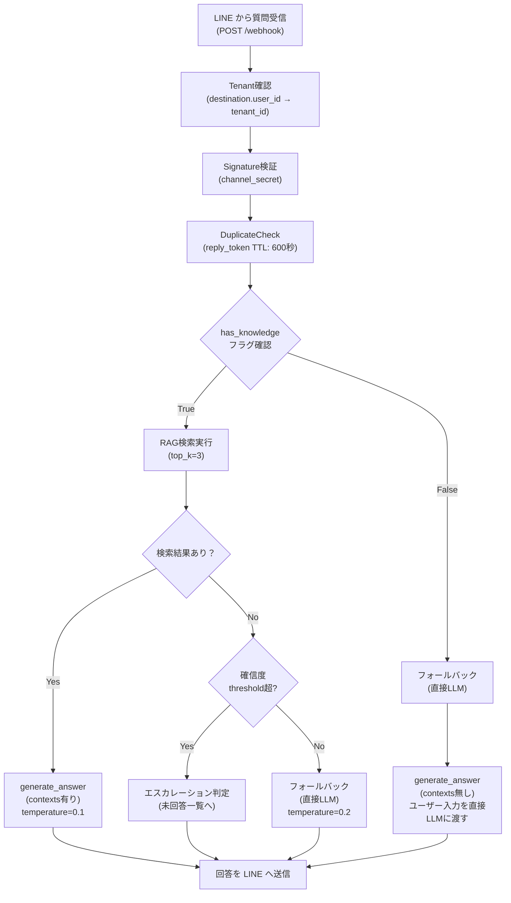

> [!danger] ⛔ 旧版アーカイブ（2026-08-22 退避 ／ 参照専用）
> このファイルは**旧版**です。現行版は `docs/RAG基盤_line-rag-bot概要.md`、未決事項は `QUESTIONS.md`。
>
> **廃止理由**: どこからもリンクされない孤児ノートであり（CLAUDE.md §1.2 違反）、撤回済みの「アプリ内ナレッジ登録UI」記述を含んでいました。未決事項 TODO は QUESTIONS.md へ移管済みです。
>
> **このファイルを根拠に実装判断をしてはいけません。**経緯の追跡のためだけに保存しています（`CLAUDE.md` §1.3）。
> 一覧は [[Projects/fuyuugai-app/docs/spec/OLD/README.md|OLD/README]] を参照。

---

# line-rag-bot ＆ 浮遊街アプリ統合設計 — 考慮事項と検討ノート

**ステータス**: 🔴 検討中（実装検証待ち）  
**対象**: line-rag-bot v1.1.0 (構造化ナレッジ + エスカレーション) の浮遊街テナント適用  
**根拠**: v13 §9 #31 / docs/08-浮遊街RAG詳細設計.md  
**作成**: 2026-08-22

---

## 📋 概況

浮遊街アプリは **RAG 基盤を line-rag-bot（Firestore）へ統合** し、アプリ本体はアプリ内 AI チャット UI を持たない設計。
その代わり：

- **LINE 公式アカウント** → `line-rag-bot` が FAQ/ナレッジを回答
- **浮遊街アプリ内** → 管理者向けに「エスカレーション問い合わせ」「ナレッジ登録UI」を提供

このアーキテクチャ選択は以下の判断に基づく：
- Supabase 無料枠の DB 容量(500MB) 制約下で pgvector + 業務ロジック の共存が困難
- レシピ・道具の**マスタデータ**と**検索インデックス**を分離する設計思想（08 §3-1）
- マルチテナント対応（`tenants` コレクション + feature_flags）で浮遊街を既存デプロイに追加する簡潔さ

---

## 🚨 ユーザー入力フローの明確化

### 現状: フロー図（案）



### 検討項目

#### ① `has_knowledge` フラグの定義

**現状** (docs/08):
- テナント設定 `tenants/{fuyugai}.feature_flags.structured_knowledge` で全テナント共通
- ON/OFF が固定

**検討**:
- [ ] テナント単位で十分か？ ナレッジ**カテゴリ**単位（業務分類別）で分ける必要はないか？
  - 例: 「道具マスタ」は ON だが「レシピ」は未整備 → 道具質問だけ RAG、レシピは LLM
  - 現状 (08) では `enabled` フラグが Recipe/Tool 単位にあるが、カテゴリ単位の制御は別
- [ ] 初期データ投入前（Phase 1 早期）は `has_knowledge=False` で運用するか？
  - PDF マニュアルから半自動抽出する期間は RAG 信頼度が低い可能性
  - その間「フォールバック+エスカレーション」で運用し、信頼度が上がったら切り替える判断基準

#### ② 「ナレッジなし」の意味の確認

**シナリオ A**: ナレッジベースが完全に空
- 例: システム初期化直後、まだ Recipe/Tool が1件も登録されていない
- 対応: すべての質問を LLM に渡す（フォールバック）

**シナリオ B**: ナレッジはあるが、この質問に関連する情報がない
- 例: 「朝のおやつレシピは？」→ レシピマスタに「朝食」カテゴリがない
- 対応: RAG 検索はしたが結果が閾値未満 → エスカレーション提案 or フォールバック

**現状の実装**:
- docs/08 ブランチ6（エスカレーション）では、confidence < threshold で未回答一覧へ
- ただし「その時点で LLM 回答も出すか / エスカレーションのみか」が不明

#### ③ フォールバック時の system_prompt

**現状** (docs/08 §4-3):
```
temperature = 0.2（既存経路。構造化ナレッジ経路は 0.1）
```

**検討**:
- [ ] `has_knowledge=False` 時の system_prompt に「ナレッジがない可能性」の免責を含めるか？
  - 例: 「以下の回答は ナレッジベースにない内容であるため、間違っている可能性があります」
  - v13 §1.2「暗黙知を形式知化」の理想と、「ナレッジ未整備時の応答品質」のバランス
- [ ] LLM に渡す context（メタデータ）に何を含めるか？
  - ナレッジなしの場合、現在の time/date/location などコンテキスト情報を含める？

---

## 🏛️ TenantService と ロール定義

### v13 §2 から の確認事項

**重要な決定** (v13 v1.16.0 確定):
- **アプリ 5値**: `admin` / `core_member` / `member` / `guest` / `custom`
- **LINE 2値**: `member` / `guest`（初期メッセージの自己申告で決定）

**問題**: LINE 側で自己申告による詐称が可能
- 対応: Phase 1 では許容。ただしナレッジに「機微情報」（原価・鍵・設備扱い）を登録しない運用

### line-rag-bot 側の実装確認

**現状** (docs/08 ブランチ2):
```python
Recipe / Tool:
  target_role: string   # "member" / "guest" / ""（全公開）

Firestore 管理画面:
  tenants/{fuyugai}.rag_settings:
    role_filter: bool   # デフォルト env フォールバック
```

**検討**:
- [ ] `target_role` の値は固定（v13 §2 の 2値に従う）か、拡張可能にするか？
  - 現状：`member` / `guest` / `""` の 3値想定
  - 将来：`admin` / `core_member` 専用ナレッジが必要か？
- [ ] LINE ユーザーのロール判定ロジックはどこで行うか？
  - **line-rag-bot 側**: WebhookController で user_id→ロール変換？
  - **浮遊街アプリ側**: 別 API で ロール情報を pull？
  - 現状（#31 確定）: API 連携ゼロ → LINE 初期メッセージの自己申告のみ

---

## 📊 構成図との整合性確認

### 既存資料との参照関係

| ドキュメント | 概要 | 未確認項目 |
|-----------|------|---------|
| v13 §5.7 | ナレッジ登録画面（Q&A/手順/トラブル） | UI 詳細設計（Admin Streamlit） |
| 08 §3 | Firestore スキーマ（Recipe/Tool/Escalation） | 初期データ投入手順 |
| 08 §3-2 | 検索インデックス設計（knowledge_{tenant} への投影） | 埋め込みモデル更新時の差分再インデックス戦略 |
| 08 ブランチ計画 | 7 ステップの実装順序 | テスト・回帰テストの詳細 |

### 構成図の検証ポイント

#### A. Firestore スキーマ一貫性

**recipes_{tenant_id}** 内のフィールド一覧:
```
✓ title, category_id, agent_type, tool_ids, materials, steps, duration_min
✓ tips, failure_patterns, question_variants, source_urls
✓ author_id, review_status, enabled
? target_role           ← v13 §2 決定後に確定？
? source_collection     ← 投影時メタデータ (08 §3-2 knowledge に入る)
```

**道具分野では、`safety_level: "high"` が見つかった場合の system_prompt 切り替えロジック確認**:
- 08 ブランチ4 実装状況: 「安全注意の横断制約」で記載済み
- テスト: 高リスク道具を含むレシピ検索→「資格確認を促す一文」追加の確認

#### B. 重複排除（DuplicateCheck）の実装

**現状**:
```
reply_token TTL: 600秒
→ Firestore collection "duplicates_{tenant}" に記録？
```

**検討**:
- [ ] TTL 管理方式: Firestore TTL (自動削除) / Redis / 手動?
- [ ] 同一 user_id が同じ質問を30秒以内に 2 回送ってきた場合の動作

---

## 🔄 ベクトル再作成フロー（詳細手順）

### ユースケース別の手順

#### **UC1: ナレッジ新規登録 / 更新時**

**トリガー**: 管理画面（Streamlit）で Recipe/Tool を新規保存 or 編集

```
1. Admin UI で「レシピ保存」ボタン
2. Firestore に recipes_{fuyugai}/{recipe_id} を upsert
3. IndexerService.index_recipe() が自動トリガー
   ├─ Recipe を render: "【レシピ】タイトル\n手順\nコツ" 形式
   ├─ Gemini API で embed（テキスト → 768次元ベクトル）
   ├─ failure_patterns[] の各要素を個別チャンク化
   ├─ question_variants[] の各エイリアスをチャンク化
   └─ knowledge_{fuyugai} に複数チャンク upsert
4. 管理画面に「インデックス完了（3チャンク追加）」通知
```

**所要時間**: ~3秒（Gemini embed 待ち）

**失敗時の対応**:
- [ ] embed API quota 超過 → リトライ戦略？ or 手動再試行 UI?
- [ ] Firestore write 失敗 → DLQ へ記録する？

#### **UC2: Embedding モデルの変更時**

**トリガー**: Gemini API が `text-embedding-3-small` → `text-embedding-3-large` へ新版リリース

```
1. Admin UI に「インデックス再作成」ボタン
2. 全 Recipe + 全 Tool を列挙（enabled=true のみ）
3. 各マスタを新モデルで embed
4. knowledge_{fuyugai} を全削除（or alias で blue/green 切り替え）
5. 新チャンクを bulk insert
6. テスト質問で検索精度を検証（類似度スコア分布の確認）
```

**所要時間**: ~30秒-1分（マスタ数による）

**検討**:
- [ ] 処理中の検索リクエストはどうするか？
  - A. 一時的に「インデックス再構築中」メッセージ返す
  - B. 古いインデックスで検索続行（クエリ品質が一時的に低下）

#### **UC3: インデックス最適化 / カテゴリ分け**

**トリガー**: レシピを業務 15 分類ごとにグルーピング（phase 3 の `agent_type` ルーティング準備）

```
1. 既存 Recipe を review_status でフィルタ（draft 除外）
2. category_id に正式カテゴリを割り当て
3. 前後のチャンクをオーバーラップ設定（例: 200文字重複）で再分割
4. インデックス再作成
```

---

## 🎯 初期メッセージと UI/UX 設計

### v13 §2 「LINE 2値 非対称」から の展開

**現状**:
- LINE 初期メッセージで「運営です」「ゲストです」を自己申告
- 詐称は Phase 1 で許容

### 検討: 初期メッセージの構造

#### **案 A: シンプル自由入力**
```
【浮遊街コンシェルジュへようこそ】

ご質問をお気軽にどうぞ！
例：「朝食に何かないですか？」
　　「イベント準備について」

---
[質問を入力]
```

**メリット**: UX シンプル  
**デメリット**: ロール判定できない（全員 `guest` になる可能性）

#### **案 B: カテゴリ先行選択**
```
【浮遊街コンシェルジュへようこそ】
あなたのご立場を教えてください：

[□] 運営・親方・スタッフ（member）
[□] ゲスト・初来場者（guest）

---
選択後に質問フォーム表示
```

**メリット**: ロール別アクセス制御が機能  
**デメリット**: 入力ステップ増加、詐称対応が難しい

#### **案 C: ハイブリッド（推奨）**
```
【浮遊街コンシェルジュへようこそ】

ご質問をお気軽にどうぞ：
[質問入力フォーム]

【運営・スタッフの方へ】
以下のメニューからお選びください：
- 内部ナレッジ（運営マニュアル）
- クエスト管理
- よくある質問回答

---
送信後、推定ロール「member / guest」を画面上に表示。
「違う」ボタンで修正可能。
```

### エスカレーション案内の初期メッセージ組み込み

**現状**: v13 §1.2「FAQ自動回答と暗黙知DB化」の「AI未回答時のLINE即時通知」

**検討する案内文**:
```
【回答が見つかりませんでした】

この質問に関しては、ナレッジベースに情報がないか、
確信を持ってお答えできる内容がありません。

【運営へのエスカレーション】
以下からご連絡いただければ、運営スタッフが
お返事いたします：

📞 LINE グループ: [浮遊街サポート]
📧 メール: support@fuyugai.jp
🌐 フォーム: https://...

---
※ この質問内容は自動記録され、
   運営のナレッジ整備に役立てます
```

**検討**:
- [ ] チケット化・履歴管理は Phase 1 で必要か？（現状: 未回答一覧のみ）
- [ ] 「AI が判定した確信度スコア」をユーザーに見せるか？（透明性 vs 混乱回避）

---

## 📋 要件定義の枠組み：業務別フレームワーク

### 現状の問題

v13 では以下の観点から抜け漏れが散見：
- 非機能要件（SLA、スケーラビリティ）未定義
- エラーハンドリング戦略が曖昧
- テスト基準（認可・金額計算・個人情報の取り扱い）が §8 に分散

### 改善案: FURPS+ フレームワーク適用

| 観点 | line-rag-bot での解釈 | 現状 | TODO |
|------|-------------------|------|------|
| **F**unctionality | レシピ・道具検索、失敗パターン提示、エスカレーション | v13 §5.7, 08 §1 | ✓ 定義済み |
| **U**sability | LINE チャット UI の自然さ、初期メッセージのガイダンス、回答の分かりやすさ | v13 §1.2 定性的 | [ ] 定量指標（キャラクター数制限、改行ルール等） |
| **R**eliability | RAG 検索の再現性、embedding 再計算時の一貫性、エスカレーション漏れなし | 08 §3-1（マスタ・インデックス分離） | [ ] テスト（同一質問の検索結果一貫性） |
| **P**erformance | 回答時間 < 3秒、検索レイテンシ < 500ms、embed API rate limit | — | [ ] SLA 定義・監視設定 |
| **S**ecurity | ロール別アクセス制御、機微情報の登録除外、LINE user_id 認証 | v13 §2 §5.7（運用ルール） | [ ] コード実装での確認 |
| **C**ost（Supportability） | Gemini embed API の quota、Firestore の読み書き costs | — | [ ] 月間予算見積もり |

### 決定記録テンプレート（会議で使用）

```markdown
**[2026-08-22] 初期メッセージはカテゴリ先行か自由入力か**

決定: **案C ハイブリッド**（入力後に推定ロール表示＋修正可能）

理由:
- ロール別ナレッジ公開範囲が機能する（案B の利点）
- UX がシンプル（案A の利点）
- Phase 1 での詐称検知が可能（修正ボタンで明示的になる）

反対意見: 「入力後の確認は UX として冗長では」
→ 1クリック修正なので許容範囲。Phase 2 で A/B テスト で検証

根拠: [[会話ログ日付_タイトル]]

実装: line-rag-bot `feature/initial-message-ux` ブランチで実装予定

反映先: docs/08 §1 / テスト: tests/test_webhook_initial_message.py
```

---

## 📝 未決事項 TODO リスト

### **ArchitectureDecisions** が必要な項目

- [ ] `has_knowledge` フラグはテナント単位 vs カテゴリ単位か？
- [ ] ナレッジ未整備期（初期データ投入前）の有効期限は？
- [ ] フォールバック時の system_prompt に免責を含めるか？
- [ ] 高リスク道具検出時の system_prompt 追加ロジックの詳細
- [ ] モデル変更時の インデックス切り替え戦略（blue/green vs alias）
- [ ] Embedding API quota 超過時の対応方針
- [ ] 「確信度スコアをユーザーに見せるか」の判断基準

### **実装確認** が必要な項目

- [ ] ロール定義の正本は v13 §2 である ← **線-rag-bot 側で再確認**
- [ ] target_role の値セット（member / guest / admin / core_member） の確定
- [ ] DuplicateCheck の TTL 管理実装確認（Redis vs Firestore TTL）
- [ ] エスカレーション通知先「LINE グループ」vs「メール」の仕分け基準
- [ ] テスト（同一質問→同一スコア）の回帰テスト設定

### **会議で決定待ち** の項目

- [ ] Phase 1 初期データ投入の完了目標日
- [ ] 初期メッセージ UI パターンの最終決定（案A/B/C）
- [ ] エスカレーション時のチケット化スコープ（Phase 1 / Phase 2）

---

## 🔗 関連ドキュメント

**正本仕様書**:
- [[浮遊街アプリ 総合要件定義・設計書_v13]] — §2（ロール定義）、§5.7（ナレッジ登録）、§1.2（朝会・AI 活用）
- [[docs/08-浮遊街RAG詳細設計.md]] — マスタ・インデックス分離、ブランチ計画、データモデル

**実装参考**:
- [[line-rag-bot README.md]]
- [[line-rag-bot CLAUDE.md]] — ローカル開発・テスト手順（Firestore emulator）

**会議ログ**:
- [[2026-08-16_浮遊街アプリスコープ最終確認]]
- [[2026-08-22_line-rag-botフローと初期メッセージ検討]]（このセッション）

---

**最終更新**: 2026-08-22  
**作成**: Claude Code  
**根拠**: ユーザーメッセージ「実装はしないで考慮事項として置いておいて」（2026-08-22 当日）

