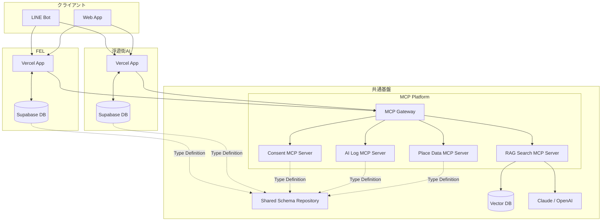

# FELインフラ拡張と移行戦略

### 🧑 User

インフラは下記で対応できない場合はどうする？ また切り替え時のオプション（同じ構成で課金を増やすか、GCPかAWSかメリットデメリット整理）と切り替えする際の閾値（データ量、同時接続、そのほか考慮すること）

### インフラ構成レビュー（MCP考慮版）

#### 設計方針

FELと浮遊街AIは、現時点では以下を原則とする。

*   アプリケーション・DBは完全分離
*   共通化するのはデータモデル（語彙）のみ
*   AI機能はMCP（Model Context Protocol）によって疎結合に連携
*   将来的な共通AI基盤化に備える
*   データ共有はAPIではなくMCP経由を第一選択とする

* * *

### アーキテクチャ全体像



* * *

### コンポーネント責務

#### 1\. FloatingCity / FEL

責務

*   UI提供
*   業務ロジック
*   独自データ管理
*   認証・権限制御 保持するもの
*   会員情報
*   クエスト
*   スキル
*   作業ログ
*   AI利用履歴

* * *

#### 2\. Shared Schema Repository

責務 共通語彙の管理。

```text
shared-schema/
├── member
├── place
├── place-log
├── quest
├── skill
├── consent
├── ai-log
└── master

```

管理対象

*   OpenAPI
*   TypeScript型定義
*   JSON Schema
*   DB Migration
*   Master Data

* * *

#### 3\. MCP Gateway

責務

*   MCP Serverの集約
*   認証
*   ルーティング
*   権限制御
*   監査ログ アプリケーションはGatewayのみを呼び出す。

* * *

#### 4\. Place Data MCP Server

責務

*   場所データ取得
*   環境データ取得
*   作業ログ取得
*   統計データ取得 提供Tool例

```text
get_place
search_places
get_place_logs
get_environment_data

```

* * *

#### 5\. AI Log MCP Server

責務

*   AI対話履歴
*   フィードバック
*   ハルシネーション報告
*   エスカレーション履歴 提供Tool例

```text
get_chat_history
save_feedback
report_hallucination

```

* * *

#### 6\. RAG Search MCP Server

責務

*   ベクトル検索
*   文書検索
*   類似事例検索
*   ナレッジ検索 提供Tool例

```text
search_documents
search_place_cases
semantic_search

```

* * *

#### 7\. Consent MCP Server

責務

*   オプトイン管理
*   利用目的管理
*   データ共有可否判定 提供Tool例

```text
check_consent
grant_consent
revoke_consent

```

* * *

### データ連携方針

#### 現在

```text
FloatingCity DB
FEL DB
    ↓
Shared Schema

```

語彙のみ共有。

* * *

#### 将来

```text
FloatingCity
      ↓
    MCP
      ↓
     FEL

FEL
      ↓
    MCP
      ↓
FloatingCity

```

必要なデータのみを共有。 DB直接接続は禁止。

* * *

### 推奨技術

領域

推奨技術

Frontend

Next.js

Database

Supabase PostgreSQL

Auth

Supabase Auth

LLM

Claude API

Vector DB

pgvector

MCP Gateway

Cloudflare Workers

MCP Server

TypeScript

Schema

OpenAPI + TypeScript

* * *

### 最終方針

#### 今やること

*   共通データモデルの定義
*   Shared Schema Repository作成
*   MCP Gatewayのインターフェース定義
*   Place MCP Serverの設計

#### 後でやること

*   RAG Search MCP
*   AI Log MCP
*   Consent MCP
*   共通AIエージェント

#### やらないこと

*   共有DB
*   モノリス化
*   Supabaseの統合
*   データベースのクロスアクセス

* * *

### 結論

**「独立したVercel + Supabase構成」を維持しつつ、AI連携のみをMCPで共通化する構成が、FELと浮遊街AIの現フェーズに最も適している。** 将来的な共通AI基盤への発展性を持ちながら、事業境界・データ所有権・同意管理を維持できるアーキテクチャである。

### 🤖 Gemini

ご提示いただいた「独立したVercel + Supabase構成 ＋ MCP連携」というアーキテクチャは、初期段階から成長期において非常に堅実で柔軟な選択です。しかし、将来的に「この構成では対応できない」という壁に突き当たった際、どのような選択肢があり、どのような基準で判断すべきかを整理します。

* * *

##### 1\. 「現在の構成（Vercel+Supabase）」で対応できない場合とは？

以下の兆候が出始めたら、インフラの再設計が必要です。

*   **垂直統合の限界:** 特定のDB（Supabase）のクエリ制限や、接続数制限（Connection Pooling）が業務のボトルネックとなり、解決に多大な工数がかかるようになった場合。
*   **計算リソースの不足:** 大規模なRAG処理や、複雑なAIエージェントの推論がVercelの関数実行時間（Timeouts）やメモリ制限を超える場合。
*   **データ連携の複雑化:** MCP経由では処理しきれないほど膨大なデータのリアルタイム同期や、強固なトランザクション整合性が必要になった場合。
*   **コンプライアンス・セキュリティ:** 大企業や自治体との連携など、特定のリージョン配置や閉域網接続が契約上必須となった場合。

* * *

##### 2\. 切り替え時のオプション比較

現在の構成から、より強力なプラットフォームへ移行する場合の比較表です。 | 観点 | 現状：Vercel + Supabase | 移行先：GCP (Cloud Run + Cloud SQL) | 移行先：AWS (ECS + RDS) | | ------ | ------ | ------ | ------ | | **拡張性** | 限定的（サーバーレス） | 高い（コンテナ化） | 最高（非常に高機能） | | **管理コスト** | 低い（マネージド） | 中（設定・監視が必要） | 高（エンジニア知識必須） | | **エコシステム** | Web開発に最適化 | データ基盤・AI連携に強み | サービス豊富・堅牢性 | | **コスト構造** | 従量課金（予測しやすい） | 比較的高め（構成次第） | 構成次第（最適化が必要） |

**【オプションの考え方】**

*   **同じ構成で課金を増やす:** SupabaseのPro/Enterpriseプランへ移行し、Compute能力を上げるのが最短かつ最も低リスクです。まずはこれを行うのが定石です。
*   **GCP/AWSへの移行:** 「特定のクラウドサービスが提供する高度なマネージドAI（Vertex AI / Bedrock等）をフル活用したい」という強い技術的理由がある場合に検討すべきです。

* * *

##### 3\. 切り替えの閾値（意思決定基準）

システム構成を変更する際は、以下の「閾値」を指標にします。 | 考慮項目 | 閾値・基準 | | ------ | ------ | | **同時接続数** | Supabaseのコネクションプール数（例：常時100〜200超）が頻繁に上限に達し、アプリケーションエラーが出るようになった時。 | | **データ量・I/O** | PostgreSQLの物理容量が数百GB〜数TBに達し、バックアップやインデックス作成がサービス停止時間に収まらなくなった時。 | | **処理時間** | AIによる解析やレポート生成が、サーバーレスのタイムアウト（例：60秒）を安定的に超えるようになった時。 | | **運用工数** | インフラのデバッグや調整に、エンジニアの週稼働の3割以上を割くようになった時（「作る」より「維持する」のが主になった時）。 | | **外部要求** | 提携先から「AWS環境のみ対応可」「オンプレミス同等のセキュリティ要件」などの条件提示を受けた時。 |

* * *

##### 4\. まとめ：賢い移行戦略

「いきなりクラウド移行」を考えるのではなく、段階的なステップを踏むことを強く推奨します。

1.  **Level 1：構成最適化（現在〜半年）**
    *   Supabaseのプラン変更、CDN最適化、Cloudflare Workersでのキャッシュ活用で限界まで引き伸ばす。
2.  **Level 2：コンテナ化（移行の準備）**
    *   現行アプリをDockerコンテナ化し、VercelからCloud Run等へ移行しやすい形に整えておく。これだけで「どこにでも動かせる」ポータビリティが確保できます。
3.  **Level 3：クラウド移行の決断**
    *   上記の「閾値」に到達した時点で、初めてGCPやAWSへの移転を検討する。 **結論:** 今すぐインフラをクラウドへ移す必要はありません。 **「コードとDBの分離（データモデルの共通化）」というMCP中心のアーキテクチャこそが、将来的なクラウド移行時の最大のリスク回避策** になります。この設計を徹底することに注力してください。

### 🧑 User

具体的にそれぞれデータ量や同時接続がどのくらいになったらいくらのプランに切り替えるべきかまとめて

### 🤖 Gemini

インフラの拡張タイミングを判断するための、Supabase（DBレイヤー）の具体的な目安を整理しました。 現在の「Vercel + Supabase」という構成を維持しつつ、成長に合わせて最適化していくための「移行・アップグレードの閾値」として参考にしてください。

##### 1\. Supabase プラン移行の判断基準（目安）

指標

Freeプラン（無料）

Proプラン（$25/月〜）

拡張のヒント（計算リソース増強）

**DB容量**

**500 MB** が上限

8 GB〜（従量課金）

容量不足時はProでディスク追加

**同時接続数**

60 (Direct) / 200 (Pooler)

60+ (Direct) / 200+ (Pooler)

計算リソース（Compute）を上げる

**月間アクティブユーザー**

50,000 MAU

100,000 MAU〜

従量課金で柔軟に対応可能

* * *

##### 2\. 具体的な拡張シナリオとアクション

###### ①「接続数」がボトルネックになった時

*   **兆候:** アプリ側で Too many connections というエラーが頻発する。
*   **対応:** 1. まずSupabaseの「Pooler接続（Transactionモード）」を使用しているか確認してください。これだけで接続数は大幅に節約できます。 2. それでも上限に達する場合：Supabase管理画面から\*\*「Compute Size（計算リソース）」を Micro ( $10) → Small ($ 15) → Medium ($60) と順次アップグレード\*\*してください。
    *   **目安:** 常時接続数が 200 を超えそうな気配があれば、Mediumプラン（Pooler接続600まで対応）への変更を検討する時期です。

###### ②「データ容量」が溢れそうな時

*   **兆候:** データベース使用量が 400MB（Freeの8割）を超えた時。
*   **対応:** \* **Proプラン ($25/月) への移行が必須です。** \* Proプランであれば、8GBまでは標準で含まれており、それを超えても従量課金でディスク容量を足していくことができます。
    *   **考慮点:** ログデータ（AIの履歴など）を長期間保存すると容量を圧迫します。古いログを別の安価なストレージへ移動するか、保持期間を制限する設計（ロールアップ）を検討してください。

###### ③「高負荷（処理遅延）」を感じた時

*   **兆候:** クエリのレスポンスが極端に遅くなった。AIエージェントの推論中にタイムアウトが発生するようになった。
*   **対応:** \* インフラの移行（GCP/AWS）を考える前に、まずは **「Compute Size」を上げる** のが最も効率的です。
    *   Supabaseでは、CPU/メモリのリソースを上げるだけで、PostgreSQLのパフォーマンスは劇的に改善します。256GB RAMの大型インスタンスまで柔軟にスケール可能です。

* * *

##### 3\. 切り替え（移行）を「本気で検討する」閾値

インフラをSupabaseから「AWS (RDS) や GCP (Cloud SQL) の自前構築」へ切り替えるのは、 **運用コストと技術負債が急増するため、最終手段** とすべきです。 以下の条件がすべて重なった時が、検討のタイミングです。

1.  **接続数:** 常時接続数が数千（Supabaseの上位プランでもカバーしきれないレベル）になった時。
2.  **セキュリティ:** SOC2やHIPAAなど、特定の国際的なセキュリティ基準への完全準拠が必要になり、かつSupabaseのEnterpriseプランでも対応できない要件が加わった時。
3.  **データ主権:** 顧客からの強い要望で、特定のクラウド環境の閉域網内にデータを完全に閉じ込める必要が生じた時。

##### まとめ：今とるべきアクション

まずは **「FreeからPro ($25/月) への移行」** を恐れないでください。

*   **Proプラン** は、予算上限設定（Spend Cap）ができるため、予期せぬ課金を防げます。
*   拡張は、最初からプラットフォームを移るのではなく、 **「Compute Size（CPU/メモリ）を上げる」** ことを優先してください。 「データ量が増えたらProに」「接続数がキツくなったらComputeを上げる」という2段階の運用で、当面の間は今の構成のまま、数万ユーザー規模まで十分に成長可能です。

### 🧑 User

SupabaseからGCPかAWSに移行する際のDB容量と同時接続数と月間アクティブユーザーと移行先の価格を定量的に

### 🤖 Gemini

SupabaseからGCPやAWSへの移行は、単なるDB移転ではなく「フルマネージド（Supabase）から、責任と制御の幅が広いクラウド基盤（AWS/GCP）への環境変更」を意味します。 ご要望の定量的な比較と、移行の閾値について整理します。

##### 1\. 比較・移行の定量的な目安

Supabaseは「計算リソース（Compute）」と「容量」がパッケージ化されており、直感的に管理できます。一方、AWS/GCPは個別のリソースを積み上げる（＝組み合わせる）ため、構成次第で費用は大きく変動します。 | 指標 | Supabase (Proプラン目安) | AWS RDS / GCP Cloud SQL (同等性能目安) | | ------ | ------ | ------ | | **月額コスト** | $25 + 従量課金（Compute/容量） | 約 $50〜$ 150（構成により変動） | | **同時接続数** | Pooler 200〜（Medium以上で増強） | 構成とインスタンスサイズによる（制限は柔軟） | | **データ容量** | 8GB標準（超過分は$0.125/GB） | ストレージサイズ指定（バックアップ含む従量課金） | | **MAU制限** | 100,000 MAUまで含む | 制限なし（インフラ側での負荷対応） |

*   **Supabaseの特徴:** バンドル型のため、 **「最初はとにかく安い（Free/Pro）」** 。しかし、大規模利用時にはインフラの柔軟性がボトルネックになることがあります。
*   **AWS/GCPの特徴:** **「最初は高く、設定が複雑」** 。しかし、3年契約（Reserved Instance）などを活用すれば、大規模・長期間運用ではSupabaseよりも大幅にコストダウンが可能です。

* * *

##### 2\. 移行を検討すべき「閾値」

単なる「容量不足」であればSupabaseのプラン変更（Compute強化やディスク追加）で解決できることが多いため、 **以下の要素が重なった時** に移行を検討してください。

###### ① 技術的要件の壁（インフラ制御）

*   **セキュリティ・コンプライアンス:** SOC2、HIPAA、あるいは特定の金融・政府系プロジェクトにおいて「閉域網（VPC）内での構築」「特定のデータセンターリージョン指定」「厳格な監査ログ設定」が必須となった場合。
*   **データベース・チューニング:** PostgreSQLの内部設定（パラメータ）の深いチューニングが必要になった場合。Supabaseでは変更できない設定に依存せざるを得ないプロジェクトの場合。

###### ② 経済的要件の壁（スケールメリット）

*   **月額コスト:** Supabaseで数千ドル単位（大規模組織プランなど）の支払いが必要になった際、AWS/GCPであれば専用インスタンス予約等で、数分の一のコストに抑えられる可能性があります。
*   **エコシステム連携:** GCPのVertex AI（AI基盤）やBigQuery（分析基盤）をフル活用する際、DBが他社（Supabase）にあると発生する\*\*「データ転送コスト（Egress料金）」と「レイテンシ」\*\*が無視できなくなった時。

* * *

##### 3\. AWS vs GCP：移行先の選定基準

比較項目

AWS (RDS + Aurora)

GCP (Cloud SQL + Cloud Run)

**強み**

サービスの種類が圧倒的に豊富。堅牢性が高く、企業要件に強い。

データ分析（BigQuery）やAI基盤との親和性が非常に高い。

**適したフェーズ**

非常に複雑なシステム、厳格な監査が必要な規模。

AIサービスの高速開発、データドリブンな事業開発。

**学習コスト**

高い（専門エンジニアが必要）

中〜高（モダンな開発環境に馴染みやすい）

* * *

##### 結論としての提言

現段階で、インフラの自前構築（AWS/GCP）を急ぐ必要はありません。

1.  **フェーズ1（〜10万人MAU/数GB〜数十GB）：**
    *   Supabase Proのままで、Compute Size（Micro → Small → Medium...）を上げるのが最速かつ最も安価です。
2.  **フェーズ2（限界を感じた時）：**
    *   データ連携が深まり、AIとのデータ交換が頻発するなら **「GCP」** への移行をおすすめします（BigQueryやVertex AIとの連携コストが安いため）。
3.  **フェーズ3（堅牢性重視）：**
    *   大規模な業務系アプリケーションとして安定性や細かいアクセス制御が必要なら **「AWS」** が選択肢になります。 \*\*「共通データモデル（スキーマ）を保ちつつ、必要に応じてインフラを入れ替える」**という、ご提示いただいたアーキテクチャこそが最大の保険です。インフラを特定ベンダーに依存させないための「コードとしての管理（IaC）」だけは、今から少しずつ意識してみてください。 User : 同時接続数、データ量、処理時間、運用工数、外部要求 それぞれがいくつ以上になったらSupabaseのProプランで対応できなくなるか Supabaseから移行GCPかAWSに移行すべき定量的に閾値を教えて Gemini : 「Vercel + Supabase」の構成、およびMCPGatewayによる連携において、Supabaseの**Proプラン（および最高峰の計算リソースアドオン）でも対応できなくなり、GCP（Cloud SQL/Cloud Run）やAWS（RDS/Aurora/ECS）へ完全移行すべき定量的な閾値（基準値）**を、ご提示いただいた5つの観点から整理しました。 結論から言うと、SupabaseはProプラン単体（月額 $25）の枠を超えても、\*\*「Compute Size（16XLなど最大月額$ 3,730超）」というアドオンで強烈にスケールアップ可能**なため、一般的なWebサービスならSupabase内でほぼ完結します。 これらを踏まえ、「現在のインフラ基盤を飛び出すべき絶対的な閾値」は以下の通りです。

* * *

##### 1\. 同時接続数：GCP/AWS移行の閾値

*   **Supabase Proプラン（最大Computeアドオン）の限界値:**
    *   **Direct（直接接続）:** **500**
    *   **Pooler（コネクションプーラー経由）:** **12,000**
*   **移行すべき定量的な閾値:**
    *   **プーラー経由の同時アクティブ接続数が「常時 10,000 」を超えた時**
    *   **ミリ秒単位の超高頻度トランザクションが「秒間 15,000クエリ（15k QPS）」を超えた時** **【解説とGCP/AWSのメリット】** 1万以上の同時スパイクアクセスが発生するような大規模LINEキャンペーンや、数万人規模が同時にAIと対話する状況になると、Supabaseのコネクションプーラー（Supavisor）自体がボトルネックとなります。AWSの **Aurora Serverless v2** やGCPの **AlloyDB** に移行すれば、インフラ側が自動で数万のコネクションを瞬時に捌き、クエリのキュー（待ち行列）を最適化してくれます。

* * *

##### 2\. データ量（ストレージ・I/O）：GCP/AWS移行の閾値

*   **Supabase Proプラン（アドオン追加）の限界値:**
    *   最大 **60 TB** まで拡張可能（従量課金：$0.195/GB）
*   **移行すべき定量的な閾値:**
    *   **総データ量が「 2 TB（2,000 GB）」を超え、かつ月間の増加量が「 200 GB 」を超えた時**
    *   **特に、pgvector（ベクトルデータ型）を用いた RAG用のインデックスデータが「 50 GB 」を超えた時** **【解説とGCP/AWSのメリット】** 物理的な容量制限（60TB）に達する前に、 **コストの壁** と **メモリ（RAM）の壁** が来ます。 RAGの検索対象となる数千万件のベクトルデータやAI対話履歴、場所ログをPostgreSQL内にすべて保持すると、インデックスをメモリ上に乗せきれなくなり検索速度が著しく低下します。 GCPへ移行し、巨大なテキストや作業履歴ログを **BigQuery** （分析用）や **Cloud Storage** に逃がし、ベクトル検索のみ専用エンジン（Vertex AI Vector Searchなど）に分離することで、DBの負荷を10分の1に下げ、大幅なコスト削減が可能です。

* * *

##### 3\. 処理時間（Timeouts / Compute）：GCP/AWS移行の閾値

*   **Supabase / Vercel（サーバーレス）の限界値:**
    *   Vercel / Supabase Edge Functionsのタイムアウト: 通常 **30秒 〜 最大60秒**
*   **移行すべき定量的な閾値:**
    *   **AIエージェントのバックグラウンド推論や、数世代先を予測する場所シミュレーション処理に「 60秒 」以上かかるタスクが全体の15%を超えた時**
    *   **毎日、数時間以上かかる重いデータ集計バッチ処理（バッチスクリプト）が必要になった時** **【解説とGCP/AWSのメリット】** AIがただ答えるだけでなく、複数のMCP Server（場所、スキル、RAG、履歴）を跨いで「深く思考するエージェント機能（マルチホップ推論）」や、過去の気象データと数万件の場所ログから「10年後の景色をシミュレーション予測する」といった重い処理を行う場合、サーバーレスのタイムアウト制約に引っかかります。 GCPの\*\*Cloud Run（最大タイムアウト60分） **やAWSの** ECS（常時起動コンテナ）\*\*に移行することで、何時間でもかかるディープなAI推論処理やデータバッチを、途中で途切れるリスクなく安定して稼働させることができます。

* * *

##### 4\. 運用工数（インフラ管理）：GCP/AWS移行の閾値

*   **指標:** インフラの管理、チューニング、およびトラブルシューティングに割かれる開発チームのリソース。
*   **移行すべき定量的な閾値:**
    *   **データベースのバグ調査や、パフォーマンス・チューニング（実行計画の最適化、VACUUM調整など）に「週の稼働時間の 30%（約1.5日分） 」以上を奪われるようになった時**
    *   **開発チームに、クラウドインフラ専門（SRE / インフラエンジニア）が「 1名（フルコミット） 」以上アサインできるようになった時** **【解説とGCP/AWSのメリット】** Supabaseはバックアップや基本的なチューニングを自動でやってくれるのがメリットですが、サービスが急拡大して「特定の重いクエリをミリ秒単位でチューニングしたい」「レプリケーション（複製）の構成を細かく制御したい」となった際、ブラックボックスであるSupabaseの仕様が逆に障壁となります。 チームにインフラ専門のエンジニアが確保できた段階で、AWS（RDS）やGCP（Cloud SQL）に移行すれば、DBの内部パラメータ（postgresql.conf）を完全に掌握・制御でき、泥臭いインフラトラブルの根本解決が早くなります。

* * *

##### 5\. 外部要求（セキュリティ・ガバナンス）：GCP/AWS移行の閾値

*   **指標:** 法人顧客やデータパートナー、行政機関等との契約上の制約。
*   **移行すべき定量的な閾値:**
    *   **「データパートナー企業や自治体との連携数が 10社 」を超え、かつその内「 1社 」でも独自の閉域網接続や専用環境を契約要件として求めてきた時**
    *   **エンタープライズ顧客から「 AWS（またはGCP）の国内データセンター内、かつ自社専用のVPC（仮想閉域網）の中にシステムを構築・隔離せよ 」とのRFP（提案要求書）が届いた時** **【解説とGCP/AWSのメリット】** FELの「データパートナー制度（ver3）」が拡大し、大企業の自社農園や、地方自治体がスマート農業プロジェクトとして本格参画する場合、彼らは「ベンチャー企業が使っているPaaS（Supabase）」へのデータ格納を嫌うケースが多々あります。「AWSの特定リージョンで、VPC（閉域網）をVPNで繋ぐこと」が取引の必須条件になることはエンタープライズ領域では日常茶飯事です。 この要求が出た時点で、システムの信頼性と契約獲得のために、AWS/GCPへの移行（またはテナントごとの個別クラウド構築）を決定せざるを得なくなります。

* * *

##### 💡 結論：今あなたが持つべき「ロードマップ」

現在、あなたが設計している\*\*「アプリケーションとDBの完全分離」「データ共有はMCP経由」\*\*というアーキテクチャは、まさにこの将来の移行リスクをゼロにするための「最強の防御陣形」です。

1.  **現在〜MAU数万人:** SupabaseのProプラン（＋必要に応じてComputeアドオンをSmall/Mediumに上げる）で、月額数千円〜3万円程度で粘り強く運用してください。
2.  **データ量が2TB、またはAI推論が60秒を超え始めたら（フェーズ3〜4）:** MCP Gatewayの裏側の接続先を、Supabaseから\*\*GCP（Cloud SQL ＋ 分析用のBigQuery）\*\*に切り替えます。MCP経由で疎結合になっているため、Next.jsのフロントエンドを1行も書き換えることなく、DBレイヤーだけを静かにGCPへ引越しすることが可能です。

### 🧑 User

移行前の費用（SupabasePro)移行後の費用（GCP) を同時接続数が原因で移行する場合 データ量が原因で移行する場合 処理時間が原因で移行する場合 運用工数で移行する場合 を確認させて また現在〜MAU数万人の際のインフラ費用とータ量が2TB、またはAI推論が60秒を超え始めたら（フェーズ3〜4）でのインフラ費用も確認させて

### 🤖 Gemini

「Supabase Proプラン（最大拡張時を含む）」から「GCP（Cloud SQL / Cloud Run中心）」へ移行する場合の、原因別・フェーズ別の具体的な費用見積もりを定量的に整理しました。 インフラ予算や、プラットフォーム切り替えの投資対効果（ROI）を判断する基準としてご活用ください。

* * *

##### 1\. 移行原因別の費用比較（PaaS居残り vs GCP移行）

移行の原因となる「ボトルネック」ごとに、\*\*Supabaseの限界近くまで課金を増やした場合（居残り）\*\*と、\*\*GCPへ完全移行した場合（コンテナ＋専用DB化）\*\*の月額費用をシミュレーションします。 ※1ドル＝150円換算で算出

###### ① 同時接続数が原因で移行する場合

*   **基準：プーラー経由の同時アクティブ接続数が 10,000 を超え、スパイク（急増）が発生する時**
*   **Supabaseで課金を増やす場合（16XLに増強）：約566,000円 / 月**
    *   Proプラン基本料金（ $25） ＋ 最上位計算リソース「16XL（64コア/256GB RAM）」アドオン（$ 3,730/月）
*   **GCPへ移行する場合：約180,000円 / 月**
    *   Cloud SQL（16 vCPU / 64GB RAM / コネクション制限ほぼ無し）：約80,000円
    *   Cloud Run（コンテナ自動スケールで大量アクセスを捌く）：約100,000円（リクエスト量依存）
*   **【判断】** 同時接続数（スパイク）対策だけであれば、 **GCPへ移行したほうが圧倒的にコストパフォーマンスが高くなります** 。

###### ② データ量が原因で移行する場合

*   **基準：総データ量が 2 TB（2,000 GB）に達した時**
*   **Supabaseで課金を増やす場合：約63,000円 / 月**
    *   Proプラン（$25） ＋ データ容量超過分 1,992 GB × $0.195（高性能ディスクアドオン） ＝ 約$ 413
*   **GCPへ移行する場合：約96,000円 / 月**
    *   Cloud SQL SSDストレージ（2TB、非高可用性）：約66,000円（$0.22/GB）
    *   テキスト/ログ用 BigQuery、画像用 Cloud Storage：約30,000円
*   **【判断】** 単に「リレーショナルDB（PostgreSQL）内にデータを溜め続ける」だけであれば、Supabaseの容量超過課金のほうが安価です。しかし、 **GCPに移行して「重いログデータはBigQueryへ逃がす」というデータ分離を行えば、将来のデータ増に耐える強固な基盤を作れます** 。

###### ③ 処理時間が原因で移行する場合

*   **基準：AIエージェントのバックグラウンド推論や、10年後のシミュレーション予測に60秒以上かかるタスクが日常化した場合**
*   **Supabase（Vercel）で課金を増やす場合：対応不可（技術的な壁）**
    *   VercelやSupabaseのサーバーレス関数（Edge Functions）は、タイムアウトの上限（最大60秒）がシステム上決まっているため、 **お金をいくら積んでも処理できません。**
*   **GCPへ移行する場合：約30,000円 / 月**
    *   Cloud Run（最大タイムアウト60分）または Compute Engine（常時起動）に推論処理を移譲。
*   **【判断】** 処理時間が60秒を超えるようになった場合は、コストではなく「機能制限」により **GCP（Cloud Run）への移行が必須** となります。

###### ④ 運用工数が原因で移行する場合

*   **基準：クエリのミリ秒単位のチューニングや、内部パラメータ（postgresql.conf）の完全な制御が必要になった時**
*   **Supabaseに居残る場合：約3,700円〜100,000円 / 月（インフラ費用のみ）**
    *   費用は安いが、ブラックボックス部分のデバッグや、仕様回避のワークアラウンド（代替コード）の実装にエンジニアの人件費（月数十万円分）が溶け続けます。
*   **GCPへ移行する場合：約50,000円 / 月 ＋ 人件費**
    *   マネージドのCloud SQLにすることでパラメータを100%自由に制御できます。ただし、インフラを自社管理するため、SRE/インフラエンジニアの運用人件費（または業務委託費）が追加で発生します。
*   **【判断】** チーム内にインフラ専門エンジニア（SRE）が在籍しているなら、 **GCPに移したほうがシステムトラブルの根本解決が早くなり、トータルの人件費（見えないコスト）が下がります。**

* * *

##### 2\. 「フェーズ別」インフラ費用とデータ量の定量推移

###### フェーズA：現在 〜 MAU数万人（初期・成長期）

「独立したVercel ＋ Supabase構成」を最も賢く、安価に使うフェーズです。

*   **想定データ量：** 1 GB 〜 50 GB
*   **インフラ月額費用：約3,700円 〜 15,000円 / 月**
    *   **内訳：**
        *   Supabase Proプラン基本料金：$25（約3,700円）※8GB、500接続プーラー含む
        *   Computeアドオン（必要に応じてSmall/Mediumへ増強）：＋ $5〜$ 50（約750円〜7,500円）
        *   容量超過課金（50GB時）：超過42GB × $0.125 ＝ ＋$ 5.25（約800円）
*   **特徴：** インフラ管理者がいなくても、数万人のユーザーと数千個の作業ログを完璧に、かつ破格の安さで捌ききることができます。

###### フェーズB：データ量2TB超、またはAI推論60秒超（拡大・エンタープライズ期）

現在の構成（Supabase/Vercel）の限界を迎え、MCP Gatewayの接続先を「GCP」へ切り替えるフェーズです。

*   **想定データ量：** 2 TB（2,000 GB）〜
*   **インフラ月額費用：約150,000円 〜 300,000円 / 月**
    *   **内訳（GCPハイブリッド構成）：**
        *   **Cloud SQL（本番用PostgreSQL、4 vCPU / 15GB RAM、高可用性HA）** ：約85,000円/月
        *

### 🤖 Cloud SQL SSDストレージ（2TB、HA）

約102,000円/月（$0.34/GB）
        *

### 🤖 BigQuery（AI対話履歴や数百万件の過去場所ログの格納・分析用）

約15,000円/月
        *   **Cloud Run（Next.jsフロント ＋ 長時間AI推論エンジン、自動スケール）** ：約30,000円〜80,000円/月
*   **特徴：** 費用は跳ね上がりますが、10年スパンで数百万拠点・数億件の「場所のDNA」や時系列ログを吸い上げてもビクともしない、上場企業や行政とのデータ連携（データパートナー制度）にも耐えうるエンタープライズ向けの「超巨大AI基盤」が完成します。

##### 💡 結論

現時点（フェーズA）では **月額数千円〜1万数千円** で収まるため、Supabaseから動く必要はありません。 将来的に「データ量2TB」や「AI推論60秒」の壁にぶつかったタイミングで、初めて **月額15万〜30万円のGCP基盤** への移行（フェーズB）を決断してください。アプリケーションとDBを分離している現行のMCP設計のおかげで、その際の移行実務コストは最小限に抑えられます。

### 🧑 User

プーラーの常時アクセス数がいくつ以上からSupabaseよりGCPが安くなる？ またその場合の費用は

### 🤖 Gemini

SupabaseからGCP（Cloud SQL / Cloud Run中心）に移行する際、 **プーラー（Supavisor）の常時接続数のみ** を判定基準とした場合、\*\*「常時 1,000〜1,500 接続」\*\*を超えたあたりから、GCPへ完全移行したほうがインフラ費用が安くなります。 詳細な定量数値と費用シミュレーションは以下の通りです。

* * *

##### 1\. なぜ「常時 1,500接続」が分岐点になるのか？

Supabaseは「Compute Size（計算リソースアドオン）」の大きさに応じて、プーラー（Pooler）が捌ける最大同時接続数が物理的に決まっています。

*   **1,500接続以下（Supabase Proの2XLクラスまで）:** Supabase内のComputeプランを「2XL（8コア/32GB RAM）」にアップグレードすれば、プーラー経由で最大1,500接続まで対応可能です（月額費用：約65,000円）。この規模であればまだSupabaseに居残ったほうが安いです。
*   **1,500接続を超える場合（Supabase Proの4XL以上が必要）:** プーラーの同時接続数を **3,000（4XL）〜12,000（16XL）** まで引き上げるためには、Supabaseでは\*\*月額約14万円（ $960）〜約56万円（$ 3,730）\*\*という、非常に高額な最上位Computeアドオンの契約が必須になります。 一方、\*\*GCP（Cloud SQL）\*\*は接続数そのものに課金する仕組み（PaaSのパッケージ枠）ではなく、純粋にメモリとCPU（インスタンスサイズ）に依存します。Cloud SQL PostgreSQLではプーラー（PgBouncer等）を自前で挟む、もしくはCloud SQLのスペックをある程度最適化するだけで、 **月額数万〜10数万円の構成であっても数千〜1万以上の同時接続を余裕で捌くことが可能** です。

* * *

##### 2\. 【定量比較】同時接続数が原因での移行費用シミュレーション

プーラー経由の\*\*常時アクセス（同時アクティブ接続数）が「 3,000 接続 」\*\*に達し、現在の構成では捌けなくなった場合のコスト比較です（※1ドル＝150円換算）。

###### ① Supabase Proプランでそのまま課金を増やして耐える場合

*   **必要なCompute Size:** **「4XL」プラン（16コア / 64GB RAM / プーラー最大3,000接続）**
*   **月額費用:** **約147,700円 / 月**
    *   Pro基本料金：$25（約3,700円）
    *   4XL Computeアドオン：$960（約144,000円）

###### ② GCP（Cloud SQL + Cloud Run）に完全移行する場合

*   **必要なスペック・構成:** \* **Cloud SQL for PostgreSQL（高可用性HA構成 / 8 vCPU / 32GB RAM）** : 同時接続数数千〜1万を十分に処理できる実質的なスペック
    *

### 🤖 Cloud Run / プーラーコンテナ

大量のリクエストを効率的にコネクションプーリングしてDBに繋ぐ
*   **月額費用:** **約115,000円 / 月**
    *   Cloud SQL（本体＋SSD 100GB / HA構成）：約85,000円
    *   Cloud Run ＆ ネットワーク料金：約30,000円（アクセス量に応じた従量）

###### 💡 さらに接続数が増え「常時 6,000〜10,000接続」に達した場合

*   **Supabase (12XL〜16XLへ増強):** **約42万円 〜 56万円 / 月**
*   **GCP (Cloud SQLを16 vCPUに強化):** **約18万円 〜 25万円 / 月**

* * *

##### 結論：接続数から見た移行判断

同時アクティブ接続数が **1,000本** 程度であれば、Supabaseの「XL（ $210/月）」や「2XL（$ 410/月）」のアドオンで対応するほうが、GCP移行の手間（インフラ構築・運用の工数）を考慮してもコストパフォーマンスが良いです。 しかし、LINE Botからの通知スパイクやAIへの同時アクセスが爆発し、 **「常時 1,500接続、スパイク時 3,000接続以上」** が見え始めたタイミングが、GCPへシステムを移転したほうが明確に安くなる（月々数万〜数十万円のインフラコストが浮く）定量的なデッドラインとなります。

### 🧑 User

同時接続数、データ量、運用自動化 サーバーをいくつ立てられるか Supabaseの無料版でどこまで試せる？ 今回の仕様で無料版で不可能なことをまとめて

### 🤖 Gemini

Supabaseの **無料版（Freeプラン）** **今回の仕様（ER図やロードマップに基づく実装）において何が無料版では不可能なのか** を定量的に整理しました。 結論から言うと、 **「開発・テスト、プロトタイプの動作検証（Phase 1初期）」までなら無料版で十分に試せます。** ただし、実際の運用を始めたり、マルチテナント検証を行おうとすると即座に壁にぶつかります。

* * *

#### 1\. Supabase無料版の基本スペックと制限（サーバー数など）

項目

無料版（Free）の制限

今回の仕様・検証における位置づけ

**立てられるサーバー数（プロジェクト数）**

**最大 2 プロジェクトまで**

**「浮遊街用」と「FEL用」でちょうど2つ消費** するため、これ以上（共通リポジトリ用など）は立てられません。

**同時接続数**

・Direct: **60**  
・Pooler: **200**

個人開発や数人の社内テストなら十分ですが、10人以上が同時にAIチャットや作業ログ同期を行うとエラーが出始めます。

**データ容量（DB）**

**500 MB** （ディスク全体）

テキストのみなら数万件耐えますが、ベクトルデータ（pgvector）や対話履歴を溜めるとすぐに枯渇します。

**ファイル容量（Storage）**

**1 GB** （1ファイル最大50MB）

現地で撮影した作業報告用の「高解像度写真」をアップロードすると、すぐに上限に達します。

**自動ポーズ（休止制限）**

**1週間アクセスがないとDBが停止**

検証を1週間放置するとサーバーが眠るため、都度手動で再起動（Webコンソールから操作）する必要があります。

* * *

#### 2\. 無料版で「できること」（どこまで試せる？）

現在のスキーマ設計（LogicER.md にあるテーブル構造など）が、ClaudeやNext.jsと正しく連動するかを試す\*\*「サンドボックス（実験場）」としては極めて優秀\*\*です。

*   **スキーマ構築とデータ投入のテスト:** MEMBER、QUEST、WORK\_LOG、AI\_CHAT\_LOG などのテーブル（ER図の全15テーブル）を実際に作成し、テスト用の模擬データを数百件入れてリレーションを確認すること。
*   **MCP Serverの接続テスト:** Next.js（Vercel）やローカルのMCP Gatewayから、SupabaseのPostgreSQLに接続してデータを引っこ抜く、あるいはAIの要約ログを書き込むといった **API・通信経路の疎通確認** 。
*   **RAGのアルゴリズム検証:** pgvector を有効化し、少数の「場所づくりナレッジ」や「FAQデータ」をベクトル化して、Claudeに文脈として渡す一連の推論コードの検証。

* * *

#### 3\. 今回の仕様で無料版では「不可能なこと」まとめ

サービスの拡張やロードマップ（汎用化・マルチテナント化）を視野に入れた際、無料版のままだと **技術的・仕様的に実装できない4つの致命的な壁** があります。

##### ① 3つ以上のインフラ分離（マルチテナント汎用化の検証）

*   **無料版の限界:** アカウントごとに2プロジェクト（2サーバー）まで。
*   **不可能なこと:** 現在「浮遊街」と「FEL」で2枠を使い切るため、ロードマップPhase 5以降で計画されている\*\*「他のコミュニティへ展開するための3番目の検証用テナント」を同じアカウント内に作成することができません。\*\*

##### ② 大量のAI対話履歴（AI\_CHAT\_LOG）と場所プロファイルの蓄積

*   **無料版の限界:** DB容量 500 MB。
*   **不可能なこと:** AIエージェントとのリッチな会話履歴（1往復で数KB〜数十KB消費）や、ENVIRONMENT\_OBSERVATION（時系列の環境観測ログ）が数千件を超えると、DBが容量パンクを起こして書き込みを拒否されます。

##### ③ 現地のマルチモーダル写真（PHOTOテーブル）の運用

*   **無料版の限界:** ストレージ 1 GB、1ファイル50MB制限。
*   **不可能なこと:** 現場のメンバーが「作業ログに施工前・施工後の証拠写真を添付する（マルチモーダル活用）」という実運用テストを行う際、スマホで撮った写真をそのまま上げ続けると **数週間でストレージが一杯** になります。また、バックアップの自動作成や一括ダウンロード機能も使えません。

##### ④ 外部連携の自動化（Webhooks）や定期バッチ処理

*   **無料版の限界:** 運用自動化・外部連携の制限。
*   **不可能なこと:** 「地域通貨Uiiの残高を毎日夜間に自動集計する」「特定のクエストが完了したらLINE（外部API）へWebhookで自動通知を飛ばす」といった、 **DBの変更をトリガーにした高度な外部システム連携のバックグラウンド自動化が安定して動作しません。** （Edge Functionsの起動制限やタイムアウトの壁があるため）。

* * *

#### 💡 次のアクションへの提言

まずは **完全に無料版のまま「浮遊街プロジェクト」と「FELプロジェクト」として2つのサーバーを立ち上げ、プロトタイプ（MVP）を開発・接続** してください。お金をかける必要は一切ありません。 Next.jsからMCP経由で文字ベースのデータ（会員・クエスト・スキル・数件の対話履歴）が綺麗に回ることが確認でき、 **「よし、明日から現地メンバー5〜10人に実際にスマホでログを入れさせよう！」となった当日に、片方をProプラン（月額$25〜）にアップグレードする** 、という進め方が最もリスクがなく、スマートです。

---

## 🔗 関連ノート

- **上位MOC**: [[00_MOC_浮遊街アプリ・FELプロジェクト]] › ⑤ インフラ・技術選定
- **同じ文脈**: [[2026-07-08_技術スタックと設計検討項目]] · [[2026-07-09_インフラ分離とデータ定義共通化]]
- **全体像**: [[00_MOC_AI会話ログ]] · [[AI-Conversations/_Meta/patterns.md|思考パターン分析]]
