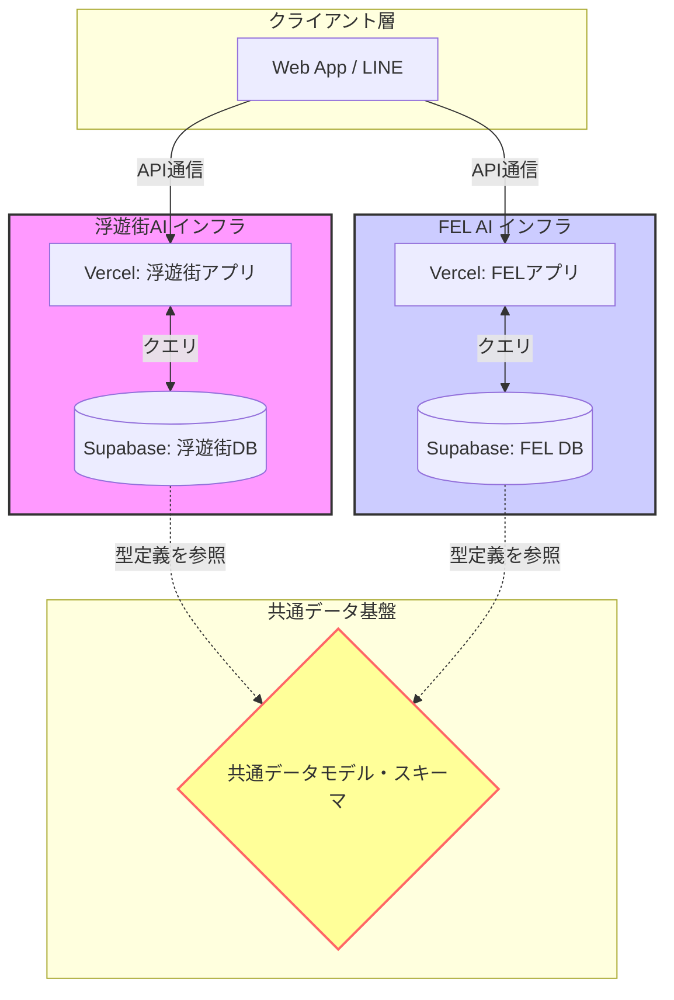
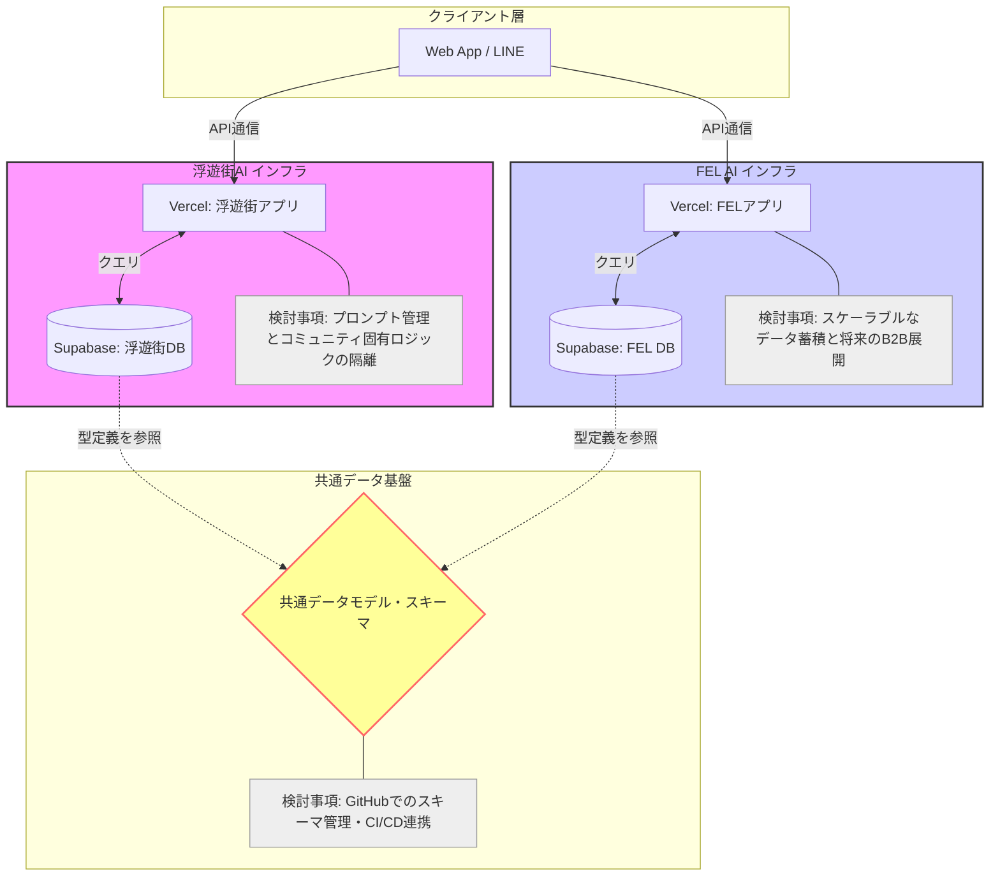
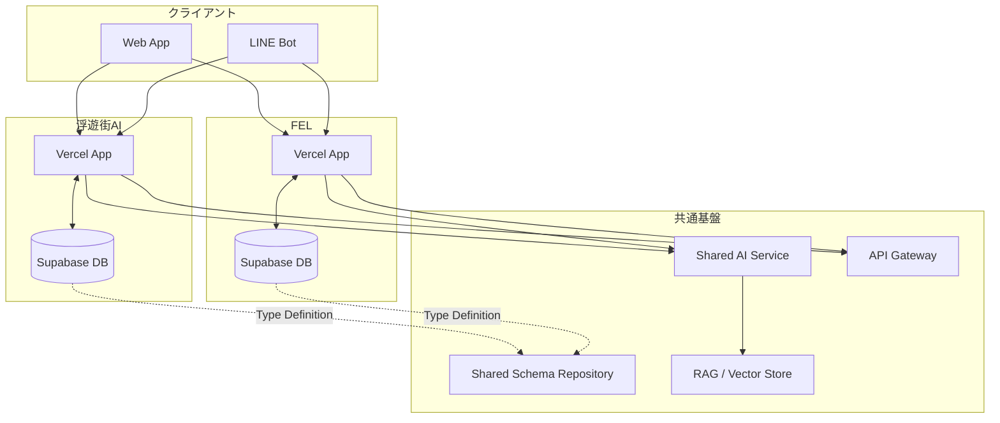

# インフラ分離とデータ定義共通化

### 🧑 User

インフラは浮遊街アプリとFELは分けた方がいい？あるいは相乗りの方がいい？それらの理由は

### 🤖 Gemini

浮遊街AIとFELのAI活用サービスにおける「インフラ（システム基盤）」の設計方針について、これまでの構想資料に基づき整理・回答します。 結論から申し上げますと、インフラそのものを物理的に一つのシステムとして統合（相乗り）するのではなく、\*\*「システムやインフラは独立させつつ、データモデル（項目定義）の共通化を先行して行う」\*\*というアプローチが推奨されています。 理由は以下の通りです。

##### 1\. なぜ「インフラ共有」ではなく「データ定義の共通化」なのか

物理的なインフラを統合（完全な相乗り）してしまうと、浮遊街という特定のコミュニティ固有の運用ルールや、FELの教育事業としての長期的な仕組みが互いに干渉し合い、柔軟性が失われるリスクがあるためです。

*   **開発・運用の独立性:** 浮遊街は実運用に近い先行開発プロジェクトであり、FELは10年スパンの教育事業という異なる時間軸と目的を持っています。それぞれの速度や固有のニーズに合わせて機能やプロンプトを最適化できるよう、システム基盤は疎結合（疎な繋がり）にしておくことが肝要です。
*   **「語彙（データ項目）」レベルの合意:** システムを一つにするのではなく、共通の「場所データモデル」や「収集項目」の型を合わせておくことで、将来的に「データを同じ土俵で比較・分析できる」というメリットを享受できます。これは、インフラを共有しなくても実現可能な、最もコスト効率の高い連携手法です。

##### 2\. なぜ「今」データモデルの共通化が必要か

データが蓄積され始めた後に設計を変えることは、非常に高いコストを伴うからです。

*   **移行コストの回避:** 2026年から両者でデータ収集が本格化しますが、後からFELのデータ設計と合わせようとすると、過去のデータを変換・設計し直す必要が生じます。今、データが溜まり始める前のタイミングで型のすり合わせを行えば、最初から互換性のある形でデータを蓄積でき、将来的な統合コストを最小化できます。
*   **相互活用の基盤:** 「場所データ」の型が共通化されていれば、将来的に浮遊街のデータをFELのマトリクスの1ケースとして扱ったり、FELの観察メソッドを浮遊街の記録運用に活かすといった相互活用が、後付けではなく自然に実現可能になります。

##### 今後のアクション

まずはシステムやインフラの共有ではなく、以下のステップで進めることが提案されています。

1.  **データ項目のすり合わせ:** 浮遊街AIとFELの収集項目を定義レベル（語彙レベル）で統一する。
2.  **疎結合な設計:** 個別のコミュニティロジックは分離しつつ、メタデータ（場所のDNAデータなど）が共通スキーマに従うようにする。 このように、インフラはあえて「分ける（疎結合）」ことでそれぞれの発展性を確保し、データ構造という「言語」を「統一する」ことで将来的な連携のポテンシャルを最大化する戦略をとるのが最も合理的であると考えられます。

### 🧑 User

FELのインフラ構成の候補

### 🤖 Gemini

FELのインフラ構成について、ご提示いただいた資料群に基づき検討すべき論点と構成案を整理しました。 これまでの構想の核心は、\*\*「物理的なインフラ（システム基盤）の統合」ではなく「データモデル（共通言語）の共通化」を優先する「疎結合な設計」\*\*にあります。

##### 1\. インフラ構成の設計思想：疎結合の維持

FEL（教育事業・10年スパン）と浮遊街AI（実運用・先行開発）では、目的や時間軸が異なります。そのため、単一のシステムへ「相乗り」させる構成は、将来的な拡張性や各コミュニティの固有ニーズを阻害するリスクが高いと考えられています。

*   **推奨構成:** **「システム・インフラ独立型」**
    *   浮遊街AI用インフラ：コミュニティの即時性と柔軟性を重視したアジャイル開発環境。
    *   FEL用インフラ：長期的なデータ蓄積と、将来のPro版（B2B）展開を見据えたスケーラブルな構成。
*   **連携の鍵:** 「場所データモデル（スキーマ）」の共通化。
    *   具体的には、システムを分けつつも、データベースで扱う「場所プロファイル（静的データ）」や「作業ログ（時系列データ）」の型（JSONスキーマ等）を一致させることで、将来的な相互利用（データの比較・分析・統合）を可能にします。

##### 2\. 技術スタックの検討項目

開発スピードと柔軟性を最優先し、以下の構成要素を検討すべきとされています。

*   **MCP（Model Context Protocol）の活用:**
    *   Claudeを基盤とする対話エンジンにおいて、データベースや外部ツールと安全に接続するため、MCPの採用が推奨されています。
*   **マルチテナント対応の意識:**
    *   将来的な他団体展開を見据え、コードベースには「特定のコミュニティ固有のロジック」と「汎用的なコアロジック」を明確に分離するルール（例：ディレクトリ構造の強制分離）を組み込むことが重要です。

##### 3\. 今後の構成フェーズ（構築ロードマップに基づく）

今の段階で取り組むべきは、大規模な統合システムを構築することではなく、後からコストが跳ね上がる「データ設計のミス」を防ぐことです。 | フェーズ | 取り組み内容 | 目的 | | ------ | ------ | ------ | | **初期（今すぐ）** | **データ定義（語彙）の共通化** | システムの移行コストを回避し、相互運用性を確保する。 | | **中期** | 疎結合な個別インフラ構築 | 各プロジェクト固有のスピードで開発を推進。 | | **長期** | データ基盤のメタデータ統合 | 個別のシステムから共通スキーマに従ったデータを抽出し、分析・活用。 |

* * *

**検討すべき論点：** もしインフラ分離を進める場合、以下の懸念点についてもルール化を並行して検討することをお勧めします。

*   **データ管理のガバナンス:** コミュニティ間でデータを共有する際の「同意取得」や「権限管理」のルール。
*   **マニュアルとAIの同期:** 浮遊街やFELの運用ルールが変わった際、AIにどう反映させるかという「プロンプト管理」の場所。 具体的なER図の作成や、データベース構成の深掘りが必要な場合は、特定の機能（クエスト管理や場所データ収集など）を指定いただければ、より詳細なスキーマ設計案を提示できます。

### 🧑 User

具体的にどんな技術で実現可能？ GCPがベストか？またAWSやレンタルサーバーやVercelとSupabaseだけでは対応不可能？

### 🤖 Gemini

ご提示いただいた構想（「浮遊街クエストアプリ」および将来的な「FEL連携」）を実現するための技術スタックについて、結論から申し上げます。 **「Vercel + Supabase（+ Claude/MCP）」の組み合わせは、このプロジェクトにおいて現時点で「ベストに近い」構成の一つです。** 他のクラウド（GCPやAWS）が「必須」というわけではなく、むしろ開発の初期段階においては、フルマネージドで開発効率が極めて高いVercel/Supabaseの方が適しています。それぞれの理由と、比較検討のポイントを整理します。

* * *

##### 1\. なぜ「Vercel + Supabase」が推奨されるのか

今回のプロジェクトは「アジャイル開発」「AI連携」「疎結合な設計」が鍵です。

*   **開発速度とAI連携:**
    *   **Vercel:** Next.jsとの親和性が最強で、フロントエンドとAPI（Serverless Functions）のデプロイが瞬時に行えます。
    *   **Supabase:** 「PostgreSQL」をベースにしながら、認証（Auth）、リアルタイム通信、ベクトル検索（AI連携に必須）が最初から組み込まれています。MCP（Model Context Protocol）サーバーとしての構築も容易で、Claudeとデータベースを安全かつ高速につなぐのに適しています。
*   **「相乗り」ではなく「疎結合」を実現:**
    *   この構成であれば、浮遊街用のSupabaseプロジェクトと、FEL用のSupabaseプロジェクトを物理的に分けて管理できます。データ構造（スキーマ）さえ合わせておけば、連携や将来のデータ統合はSQLレベルで可能です。

##### 2\. GCPやAWSを選択する場合の判断基準

GCP（Google Cloud）やAWSが「ベスト」になるのは、主に以下のようなフェーズに移行した時です。

*   **GCPが選ばれる理由（主にVertex AI活用）:**
    *   将来的に「独自のAIモデルを細かく調整（ファインチューニング）したい」「BigQueryで大規模な場所データを高度に分析したい」という場合、GoogleのAI基盤との親和性が高いため非常に有利です。
*   **AWSが選ばれる理由（主にスケールと網羅性）:**
    *   将来的にビジネスが巨大化し、複数のリージョンでの展開、堅牢なセキュリティ要件、複雑なマイクロサービス化が必要になった場合に、サービスの選択肢が最も豊富です。 **現段階の判断:** まだ「種まき（ロードマップPhase1〜2）」の段階ですので、\*\*GCPやAWSの複雑な設定に工数を割くのは「コスト（時間的損失）」\*\*と言えます。まずはVercel/SupabaseでMVP（最小構成）を回し、データが溜まり、より高度な分析基盤が必要になった段階でGCPやAWSへ部分的に移行（または併用）するのが合理的です。

##### 3\. レンタルサーバーでは対応不可能か？

結論、 **レンタルサーバーは推奨しません。**

*   **理由:** 現代的なAI連携アプリには「WebSocket（リアルタイム通信）」や「サーバーサイドのコード実行（API関数）」「ベクトルデータベース（AI検索用）」が必須となります。これらは従来のレンタルサーバー（FTPでファイルをアップロードする形式）では構築が困難か、非常に運用コスト（手動設定）が高くなります。
*   **比較:** Supabaseのようなマネージドサービスは、これらがクリック数回で設定できるため、エンジニアの工数を大幅に削減し、本質的な「場所データの収集やロジック構築」に集中できます。

##### まとめ：今後の設計方針案

構成案

評価

理由

**Vercel + Supabase**

**◎ (推奨)**

開発効率・AI連携・MCP対応が最もスムーズ。

**AWS/GCP**

**△ (将来用)**

大規模なエンタープライズ化の段階では強力だが、初期にはオーバースペック。

**レンタルサーバー**

**×**

AIアプリには不向き。インフラ管理に時間が取られる。

**結論としての推奨:** まずは **「Vercel（ホスティング） + Supabase（DB/Auth/ベクトル検索）」** を採用してください。 この構成で十分に対応可能です。 **さらに一歩進めるためのヒント:**

*   **データ構造の共通化:** 物理サーバーを分けるとしても、 Supabaseのテーブル定義（スキーマ）をJSONやSQLファイルとしてGit管理し、浮遊街とFELで「同じ型」を読み込めるようにルール化することだけを徹底してください。これがインフラ以上に、将来的な連携を左右します。 この構成であれば、技術選定で迷うことなく、まずは「浮遊街AI」という実証実験を最速でスタートさせることができます。

### 🧑 User

Vercel　Supabaseでデータ量や演算時の負荷に耐えられるか 不可能な場合どんなオプションが他にあるか

### 🤖 Gemini

「Vercel + Supabase」という構成が、データ量や負荷の増加に対してどこまで耐えられるか、また限界に達した際にどのような選択肢があるかを整理します。

##### 1\. Vercel + Supabaseの限界と特性

結論から言うと、この構成は「開発効率」と「爆発的な初期成長への対応」には非常に強力ですが、 **「超大規模・高負荷なデータ処理」においては、物理的な設計変更が必要になるタイミングが必ず訪れます。**

###### 耐えられる範囲

*   **中小規模のアプリ:** 数万ユーザー程度であれば、Supabase（PostgreSQL）の垂直スケール（インスタンスのアップグレード）で十分対応可能です。
*   **開発速度:** フロントエンドとAPIが統合されているため、MVP（最小構成）からPMF（市場適合）を目指す段階では、他のどの構成よりも速く、かつ低コストで運用できます。

###### 限界（ボトルネック）の兆候

*   **Vercel Functionsの制限:** 実行時間（秒数制限）やコールドスタート（呼び出しの遅延）が顕著になります。特に重いデータ処理をサーバーレス関数で行うと、タイムアウトやレスポンス低下が起きます。
*   **Supabaseの接続数:** 同時接続数が増えると、コネクションプール（PgBouncer等）の管理が複雑になります。
*   **クエリの複雑化:** データ量が増え、集計や複雑なJOINが頻発し始めると、PostgreSQL単体での処理に限界が来ます。

* * *

##### 2\. 限界を感じた時のオプション（移行先）

「不可能」というよりは、\*\*「現在の構成を維持しつつ、重い処理だけを別の専門サービスに逃がす」\*\*という設計の「多層化」が一般的です。

###### オプションA：インフラの「専門化」と「分離」（推奨）

すべてをSupabaseでこなすのではなく、役割に応じてインフラを分けます。

*   **計算・重いバッチ処理:** Vercelから、AWS Lambda（メモリと時間を長く設定）や、Fly.ioのような常駐型コンテナ環境へ移行します。
*   **複雑な分析・大規模集計:** PostgreSQL（Supabase）ではなく、データウェアハウス（GCPのBigQueryなど）へデータを流し込み、分析処理はそちらで行います。

###### オプションB：フルマネージドから「制御可能」な基盤への移行

*   **AWS RDS (PostgreSQL/Aurora):**
    *   Supabaseの「簡単さ」よりも「細かい性能チューニング（パラメーター調整や可用性）」を優先する場合の選択肢です。
    *   可用性（Multi-AZなど）や読み取り専用レプリカの運用が柔軟に行えるため、ミッドレンジ以上のエンタープライズ用途に向いています。

###### オプションC：インフラ統合のレベルを上げる

*   **Kubernetes (EKS/GKE):**
    *   複雑なマイクロサービスが必要になった場合、インフラそのものをコンテナ基盤に移行します。ただし、これは大幅な運用コスト（DevOpsエンジニアの専任）を伴うため、浮遊街AIのフェーズ5〜6（一般公開・事業化）までは慎重に検討すべきです。

* * *

##### まとめ：浮遊街AIプロジェクトへのアドバイス

今の段階でAWSやGCPへの移行を考える必要はありません。それよりも、以下の\*\*「将来の移行を前提とした設計」\*\*を徹底する方が賢明です。

1.  **DBアクセスを関数化する:** src/lib/db.ts などでデータベース操作をラップし、将来的にSupabaseから別のAPIやRDSに切り替える際、アプリ側のコードを書き直さなくて良いようにしておく。
2.  **重い処理はキューイングする:** ユーザーの画面表示に必要なデータ以外の重い計算（例：AIによる長時間の分析や一括データ更新）は、バックグラウンド処理（Upstashなどのキューイングサービスを利用）へ逃がす設計にする。
3.  **データモデルをクリーンに保つ:** データベースのスキーマが特定のサービスに依存しすぎないよう、標準的なPostgreSQLの記法を守る。 まずはVercel + Supabaseで走り出し、パフォーマンスに限界が見えたその時こそが、プロジェクトが「成功」しているという証明です。その時に初めて、上記のオプションを検討してください。

### 🧑 User

インフラ構成図をMD形式で描ける？ 描けない場合何が問題？

### 🤖 Gemini

はい、Mermaid記法（Markdown内で図を描画するための標準的な記法）を使ってインフラ構成を可視化することは可能です。 今回推奨している\*\*「疎結合かつデータモデルを共通化する構成」\*\*をMermaidで記述しました。この構成では、各プロジェクトのインフラを物理的に分けつつ、データレベルでの連携を重視しています。

##### 浮遊街AI × FEL インフラ構成案（論理図）



* * *

##### なぜこれが問題ないのか（技術的な懸念点への回答）

インフラ構成をMarkdown（Mermaid）で描画する際の問題や限界について、技術的観点から補足します。

1.  **静的な図であることの限界:**
    *   MD形式（Mermaid）はあくまで「構造図」であり、実際の通信量、レイテンシ、オートスケーリングの挙動といった\*\*「動的な負荷情報」を表現できません。\*\*そのため、これを基に「性能が出るか？」を判断することはできません。
2.  **物理構成の詳細が見えない:**
    *   AWSやGCPのような巨大クラウドにおける、VPC、サブネット、IAMロールなどの\*\*「セキュリティ境界」や「ネットワーク経路の詳細」\*\*を厳密に書くと、図が複雑になりすぎて可読性が下がります。あくまで論理構成の理解にとどめるのが正解です。
3.  **データ同期の複雑性:**
    *   図上では「共通データモデルを参照」としていますが、実際には\*\*「どうやって型定義を同期し続けるか」\*\*というCI/CDパイプライン（GitHub Actionsでのスキーマ共有など）が別途必要になります。図にはそれが表れません。

##### まとめ

この構成案は、「まずはインフラを個別に構築し、スキーマという『共通言語』で将来の連携に備える」という目的に最適化しています。もしこの構成図に加えて、\*\*「各インフラのデータがどう流れるか（シーケンス図）」 **や、** 「GitHubでのスキーマ管理フロー」\*\*など、特定の要素を深掘りしたい場合はお教えください。詳細を再描画します。

### 🧑 User

アーキ図に検討事項も追記して

### 🤖 Gemini

インフラ構成図（アーキテクチャ図）に、各要素の設計検討事項やリスクを追記したMermaid図を作成しました。 この図では、単なる接続関係だけでなく、各プロジェクトの疎結合性を保つための「検討ポイント」を補足情報として含めています。

##### 浮遊街AI × FEL インフラ構成図（検討事項付き）



* * *

##### 主要な検討・追記事項の解説

図に記載した検討事項（Note）について、具体的な詳細を以下にまとめます。

###### 1\. 浮遊街アプリ側の検討事項（コミュニティ固有ロジックの隔離）

*   **課題:** コミュニティ特有の「Uii（地域通貨）経済」や「クエスト承認ルール」がアプリ全体に散らばると、将来的な他コミュニティへの展開（汎用化）が困難になります。
*   **解決方針:** クリーンアーキテクチャを採用し、ドメイン層を明確に分離すること。src/domains/floating\_city/ のようにディレクトリを分け、汎用機能と固有ロジックをコードベースで厳格に隔離してください。

###### 2\. FEL側アプリ側の検討事項（長期・事業化を見据えたスケーラビリティ）

*   **課題:** 10年スパンでのデータ蓄積と、将来のPro版（B2B）提供を見据える必要があります。
*   **解決方針:** Supabaseのテーブル設計において、将来的に他組織へ展開できるように「組織ID（Organization ID）」をプライマリキーの構成要素に含めるなど、最初からマルチテナントを想定した設計にしておくことが重要です。

###### 3\. 共通スキーマの検討事項（スキーマ管理・CI/CD）

*   **課題:** インフラが別々である以上、共通スキーマを更新するたびに手作業で同期するのはミスのもとです。
*   **解決方針:**
    *   **スキーマのコード化:** PostgreSQLのスキーマ定義をSQLファイルやTypeScriptの型定義としてGitHub上で一元管理する。
    *   **自動化:** スキーマ更新時にGitHub Actionsが走り、自動的に両方のSupabaseインスタンスの定義を更新または整合チェックする仕組みを作っておくと、運用負荷が激減します。 この図と検討事項を基に、具体的な技術選定（例えばSupabaseの認証をどう共通化するかなど）を進める準備が整いました。次のステップとして、どの機能から詳細を詰めていきましょうか？

### 🧑 User

下記だと問題ある？なければMDでプレビューした際に図解されるように出力 graph TD

```
subgraph Client["クライアント"]
    Web[Web App]
    LINE[LINE Bot]
end

subgraph FloatingCity["浮遊街AI"]
    FC[Vercel App]
    FCDB[(Supabase DB)]
end

subgraph FEL["FEL"]
    FELAPP[Vercel App]
    FELDB[(Supabase DB)]
end

subgraph Shared["共通基盤"]
    SCHEMA[Shared Schema Repository]
    AI[Shared AI Service]
    RAG[RAG / Vector Store]
    API[API Gateway]
end

Web --> FC
Web --> FELAPP
LINE --> FC
LINE --> FELAPP

FC <--> FCDB
FELAPP <--> FELDB

FC --> AI
FELAPP --> AI

AI --> RAG

FC --> API
FELAPP --> API

FCDB -. Type Definition .-> SCHEMA
FELDB -. Type Definition .-> SCHEMA

```

Shared Schema Repository shared-schema/ ├── member ├── place ├── place-log ├── quest ├── skill ├── consent ├── ai-log └── master 推奨技術スタック 領域推奨技術フロントNext.js (Vercel)DBSupabase PostgreSQL認証Supabase AuthAIClaude API / Agent SDKRAGpgvector または OpenSearch共通スキーマTypeScript PackageAPI GatewayCloudflare Workers または API Gatewayイベント連携Supabase Realtime / Event Bus 最終推奨方針 今やること 共通データモデル（語彙）の合意 Shared Schema Repositoryの作成 Place・PlaceLog・Memberの共通化 後でやること 共通AIサービス 共通RAG API Gateway イベント連携 データ共有基盤 やらないこと（現時点） 共有DB 共有コードベース 単一モノリス化 インフラ統合

### 🤖 Gemini

ご提示いただいた構成案は、 **「疎結合（独立性）」を保ちつつ「共通言語（スキーマ）で繋がる」** **非常に合理的で優れた設計** です。 特に、「共有DB」や「単一モノリス化」を「やらないこと」として明確に切り分けた点は、開発の柔軟性を守るために極めて重要です。 以下に、ご提示いただいた内容をマークダウン形式で整形し、Mermaidの図解を含めてまとめました。

* * *

##### 1\. アーキテクチャ構成図



##### 2\. 共通スキーマ定義案

shared-schema で一元管理すべきデータ構造のディレクトリ構成です。

```text
shared-schema/
├── member       # 会員属性、スキルレベル定義
├── place        # 場所プロファイル（静的DNAデータ）
├── place-log    # 作業・環境変化ログ（時系列データ）
├── quest        # クエスト定義、報酬体系
├── skill        # スキルマトリクス
├── consent      # 同意管理
├── ai-log       # AI対話・プロンプト管理
└── master       # 統合マスタ（各IDの整合性）

```

##### 3\. 推奨技術スタック

領域

推奨技術

**フロントエンド**

Next.js (Vercel)

**DB**

Supabase PostgreSQL

**認証**

Supabase Auth

**AI**

Claude API / Agent SDK

**RAG**

pgvector (Supabase内) または OpenSearch

**共通スキーマ**

TypeScript Package (NPM/GitHub)

**API Gateway**

Cloudflare Workers / API Gateway

**イベント連携**

Supabase Realtime / Event Bus

* * *

##### 4\. 最終推奨方針

###### 今やること（フェーズ1）

*   **共通データモデル（語彙）の合意:** FELと浮遊街での定義のすり合わせ。
*   **Shared Schema Repositoryの作成:** TypeScriptパッケージとして切り出し、両プロジェクトからインストール可能な状態にする。
*   **コアデータの共通化:** Place（場所）、PlaceLog（ログ）、Member（会員）の型定義を先行して確定させる。

###### 後でやること（フェーズ2〜）

*   **共通AIサービスの構築:** 共通API Gateway経由でAIを呼び出す設計。
*   **共通RAGの統合:** 蓄積された場所データを横断的に検索する基盤。
*   **データ共有基盤の運用:** 互いのシステムからデータを抽出・統合分析できるパイプライン。

###### やらないこと（現時点）

*   **共有DBの構築:** 物理的なDB統合は、各コミュニティの自律性を損なうため避ける。
*   **共有コードベースの構築:** モノレポ化は初期の機動力を落とす可能性があるため慎重に。
*   **単一モノリス化:** 特定プロジェクトの障害が全体に波及する構成を避ける。

* * *

この設計方針であれば、\*\*「まずは小さく始めて、後からデータ基盤として大きく繋げる」\*\*という、実運用と将来のプロダクト化の両立が可能です。特に「Shared Schema Repository」をパッケージとして管理するのは、型安全な開発ができるためエンジニアにとっても非常に管理しやすいアプローチです。

---

## 🔗 関連ノート

- **上位MOC**: [[00_MOC_浮遊街アプリ・FELプロジェクト]] › ⑤ インフラ・技術選定
- **同じ文脈**: [[2026-07-08_技術スタックと設計検討項目]] · [[2026-07-09_FELインフラ拡張と移行戦略]]
- **全体像**: [[00_MOC_AI会話ログ]] · [[AI-Conversations/_Meta/patterns.md|思考パターン分析]]
