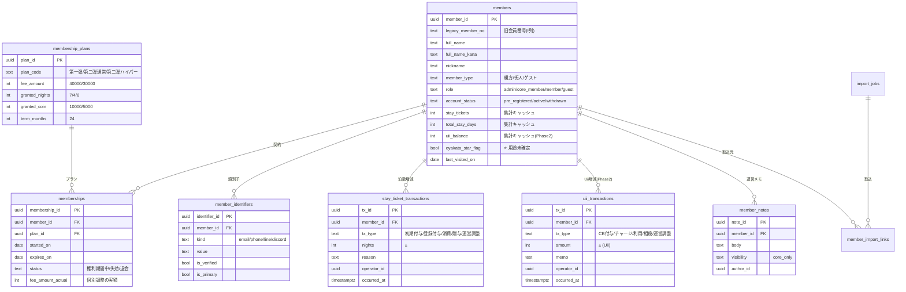

# 会員データモデル・ユーザーテーブル定義

> 受領した実データ（[[会員リスト_街びと]] 400行20列 ／ [[会員リスト_親方衆]] 45行9列）と [[浮遊街アプリ 総合要件定義・設計書_v13]] §5.8・§7 を突合し、統合スキーマを定義する。

> [!success] 2026-08-15：データ起因の未決はすべて決着し、移行に着手できる状態です
> #M1（⭐️）・#M3（プラン例外5件）・#M8（預り金）・#M11（20308の泊数）を含む全項目が確定しました。残る未決は運用judgment（差額繰越の閾値／Phase 1 スコープ）のみで、**いずれも移行実装をブロックしません**。

> [!warning] 個人情報の取扱い
> 元データは氏名・メールアドレスを含む。本ノートには**個票を転記していない**（統計値と構造のみ）。原本 `会員データ/` フォルダはVault同期・バックアップの共有範囲に注意すること。

---

## 1. 受領データのプロファイル結果

### 1.1 街びとリスト

| 項目 | 値 |
| --- | --- |
| 総行数 | 400行（うち**実データ 327件**、73行は空行） |
| 列数 | 20列 |
| 会員番号（`f`列） | **327件すべてユニーク・欠損なし** |

| 列名 | 充足率 | 実測値・備考 |
| --- | :---: | --- |
| `f` | 100% | 会員番号。`10xxx`=237件／`20xxx`=90件 |
| 本名 | 100% | 姓名の間に全角スペース |
| メールアドレス | **81%** | **61件が欠損、1件が重複**（`（実メールアドレスのためマスク）`） |
| ふりがな | 89% | 35件欠損。ひらがな・カタカナが混在 |
| Discordユーザー名 | **6%** | 19件のみ |
| 会員種別 | 100% | 3種（下表） |
| 会員開始日 | 100% | 1件のみ欠損 |
| 更新日 | 73% | 権利満了日。89件欠損 |
| ステータス | 100% | **`権利期間中` の1値のみ**（退会・失効の表現がない） |
| 年会費額 | 100% | 40,000／30,000 |
| コイン残高／CB額／利用済コイン | 100% | 整合性に問題あり（§1.3） |
| 残泊数／宿泊チケット総数／使用済泊数 | 100% | |
| LINE参加 | 100% | TRUE **38件（12%）** |
| Discord参加 | 100% | TRUE **49件（15%）** |
| 最終訪問日 | **6%** | 19件のみ |
| 対応メモ | **3%** | 11件のみ |

### 1.2 ★ 実データから判明した会員プラン体系

**要件定義書に存在しなかった重要な構造です。** 年会費・付与泊数・コインCB額は、会員種別によって完全に決定されています。

| 会員種別 | 年会費額 | 宿泊チケット総数 | コインCB額 | 人数 |
| --- | ---: | ---: | ---: | ---: |
| **[第一弾]** | 40,000円 | **7泊** | 10,000 | 237名 |
| **[第二弾]通常** | 30,000円 | **4泊** | 5,000 | 70名 |
| **[第二弾]ハイパー** | 40,000円 | **6泊** | 10,000 | 16名 |

会員番号の先頭2桁がこの区分と一致します（`10xxx`＝第一弾237名、`20xxx`＝第二弾90名）。

例外が4件あります。第一弾で6泊が1件、第一弾で30,000円・5泊が1件、第二弾通常で2泊が1件、種別のみで金額欄が空が1件。**個別調整の結果か入力ミスかの判別が必要**です（§8 未決 #M3）。

### 1.3 データ整合性の検証結果

| 検証 | 結果 |
| --- | --- |
| 泊数：`残泊数 + 使用済泊数 = 宿泊チケット総数` | **一致325件／不一致1件**（会員番号20304：残2＋使2＝4だが総数2） |
| コイン：`コイン残高 + 利用済コイン = コインCB額` | **一致297件／不一致15件** |

> [!important] コイン残高を直接カラムで持つ運用は既に破綻している
> 15件の不整合は、**残高と利用済を別々の数値として手で更新してきた結果**です。合計が合わない状態が実在するということは、どちらが正なのか誰にも判定できないということでもあります。
> これは §5.8.5 で決めた「残高は取引履歴の積み上げ（イベントソーシング）で算出し、直接上書きしない」という方針の正しさを、実データが裏づけた形です。新スキーマでは**残高カラムを持たせません**（§5）。

### 1.4 親方衆リスト

| 項目 | 値 |
| --- | --- |
| 総行数 | 45行（うち**実データ 44名**、No.44が氏名空欄） |
| 列数 | 9列（うち `列1` は**全行空**） |
| **メールアドレス・連絡先** | **列そのものが存在しない** |
| 氏名の `⭐️` マーク | 44名中**38名**に付与 |
| 街びとリストとの同名一致 | **わずか1名**（中野裕士）。**43名は街びと未登録** |

金額列（`残額`／`チャージなし、差し引き分`／`列6`〜`列9`）の埋まり個数分布：

| 埋まり個数 | 人数 |
| :---: | ---: |
| 0個 | 16名 |
| 1個 | 9名 |
| 2個 | 15名 |
| 3個 | 3名 |
| 5個 | 1名 |

列ごとの充足は `残額`4件 → `差引分`28件 → `列6`19件 → `列7`4件 → `列8`1件 → `列9`1件と、**右にいくほど急速に疎**になります。

---

## 2. 不明だった列の用途整理

### 2.1 街びと `f` 列 → **会員番号（legacy_member_no）**

CSVヘッダの1文字目だけが残った破損と判断します。中身は5桁の連番で、327件すべてユニーク・欠損なしです。

**先頭2桁が会員種別（募集弾）を表すコードとして機能しています。**

| 接頭辞 | 対応する会員種別 | 件数 |
| --- | --- | ---: |
| `10` | [第一弾] | 237 |
| `20` | [第二弾]通常／ハイパー | 90 |

> [!caution] 番号の桁に意味を持たせたまま移行しない
> このID体系は「第三弾」を募集した瞬間に破綻します（`30xxx` を足す運用は可能ですが、プランが4種以上に分岐した時点で番号だけでは区別できません）。
> 新スキーマでは**会員番号は表示・照合用の値として保持するにとどめ、プラン区分は `membership_plans` マスタへの外部キーで表現**します。要件定義書のアーキテクチャ制約「ロジックをハードコーディングせずスキーマで制御する」にも合致します。

### 2.2 親方衆 `列6`〜`列9` → **コイン取引明細の横持ち**

`チャージなし、差し引き分` の右隣に無名で続く4列です。中身は「30000」「10000」「4500」といった金額で、`30000(先払い)`「11000（浮遊祭の打ち上げ代）」のように**摘要が括弧書きで混入している**セルもあります。

構造・分布・注記から、**Excel上で取引が発生するたびに右へ列を足していった履歴**と判断します。「1回目の差引」「2回目の差引」…に相当します。

したがって、**列名に意味はなく、本来は正規化すべき対象**です。ただし **2026-08-14 の決定により、親方衆の預り金はシステムへ移行せずExcel運用を継続**することとなったため（正本 #20・#23）、Phase 1 では取り込みません。将来 Phase 2 で預り金をシステム化する際は、**1セル＝1レコードの縦持ちへ変換**すること。列を増やす運用のままシステム化すると、6回目の取引で再びスキーマ変更が必要になります。

### 2.3 親方衆 `列1` → **削除対象**

全44行が空欄です。移行対象から除外します。

### 2.4 親方衆 氏名の `⭐️` → **用途不明。要確認**

44名中38名に付与されています。付いていない6名（中野裕士・西岡慎也・寺島義智・石口丈登・安藤崇敬・山口ユースケ）は**リストの末尾に固まっており**、No.39以降のみです。

「初期メンバーと後期追加の区別」「出資完了フラグ」「正式な親方と候補の区別」などが考えられますが、データからは断定できません。**§8 未決 #M1 として要確認**とし、暫定的に `oyakata_star_flag` として真偽値で保持します（意味が判明するまで解釈を固定しないため）。

### 2.5 街びと `残額` と `チャージなし、差し引き分`（親方衆）

親方衆の `残額` は44名中4名しか埋まっておらず、しかもその4名は先頭4行に集中しています。**入力が途中で放棄された列**と見られます。移行時は「値があれば期初残高として採用、なければ取引明細から算出」とします。

---

## 3. ★ 要件定義書との差分・矛盾

実データと [[浮遊街アプリ 総合要件定義・設計書_v13]] を突合した結果、**確定済み仕様を見直すべき点が3件**見つかりました。

### 3.1 【重大】30,000円で付与される泊数が「3泊」ではなく「4泊」

| | 泊数 | 出典 |
| --- | :---: | --- |
| 要件定義書 §5.10.2（v1.11.0で確定） | **3泊** | 2026-08-13 クライアント判断 |
| 実データ [第二弾]通常（30,000円） | **4泊** | 受領した会員リスト70名 |

さらに実データでは、30,000円のプランには**コインキャッシュバック 5,000 が併せて付与**されています。要件定義書 §5.10 の特典リストにコインCBの記載はありません。

これは単なる数値の食い違いではありません。**新規登録者に3泊、既存の第二弾会員に4泊＋5,000コインを付与すると、同じ30,000円で条件が異なる会員が並存**します。現場で「なんで自分は3泊なの」と聞かれたときに説明できる根拠が要ります。

> [!success] 決着（2026-08-14）：**実データが正**
> 新規登録プラン（`phase3`）も **30,000円 ＝ 4泊 ＋ コインCB 5,000**（[第二弾]通常と同条件）で確定しました。既存70名との条件差は発生しません。
> 正本 §5.10.2〜§5.10.5 および `membership_plans` へ反映済みです。**泊数・CB額は必ずマスタから取得**し、画面・コードに直書きしないでください。

### 3.2 【重大】名寄せの第1優先キーが実データで成立しない

要件定義書 §5.8.1 は `contact_info`（メール／電話番号）を「**名寄せの第1優先キー（ユニーク制約）**」と定義しています。しかし実データは次の状態です。

| 問題 | 実測 | 影響 |
| --- | --- | --- |
| メール欠損 | 街びと **61件（18.7%）** | この会員は照合キーを持たない |
| メール重複 | 1件（`（実メールアドレスのためマスク）`） | **ユニーク制約が張れない** |
| 電話番号 | **列自体が存在しない** | 第2キーが最初から無い |
| 親方衆の連絡先 | **列自体が存在しない**（44名全員） | 氏名しか照合材料がない |

つまり、**街びとの約2割と親方衆の全員は、現行の名寄せ設計では特定できません。**

これは §9 未決 #2（連絡先を持たないユーザーの同定方式）が未解決のまま残っていた影響が、実データで顕在化した形です。氏名だけで自動照合すると、§5.8.3 で警戒した「他人の宿泊券・コインを引き継ぐ事故」が現実に起こり得ます。

> [!success] 決着（2026-08-14）：**事前整備せず、次回チェックイン時に現地入力**
> 105名（メールなし61＋親方衆44）は `pre_registered` のまま取り込み、**来訪時に対面で電話番号を入力**してもらう方式で確定しました。招待コードの事前一括配布は行いません。詳細は §6.3。
> なお **`member_identifiers` への分離と部分ユニークインデックスは引き続き必要**です。メール重複1件を取り込むために不可欠であり、また今後追加される電話番号を「メールとは別種別の識別子」として同じ構造で扱えるためです。

### 3.3 「年会費」という名称と実際の権利期間が一致しない

列名は `年会費額` ですが、`会員開始日 2025/05/01` に対し `更新日（権利満了日）2027/4/30` で、**権利期間は2年間**です。年会費であれば毎年課金・毎年更新のはずで、実態と名称がずれています。

これは §9 未決 **#14（30,000円の会計区分：売上／預り金／出資）** に直結する材料です。「2年間有効な権利の対価」であれば、会計上は前受収益として期間按分する論点が生じます。#14 の確認時に、この実データを添えて相談することを推奨します。

---

## 4. スキーマ設計方針

| # | 方針 | 理由 |
| --- | --- | --- |
| 1 | **正本は取引履歴。会員マスタの残高カラムは集計キャッシュ** | 実データでUii15件・泊数1件の不整合が既発生（§1.3）。直接UPDATEを禁じ、トリガーで再計算する（2026-08-14 決定／正本 #25） |
| 2 | **プラン条件はマスタへ正規化する** | 年会費・付与泊数・CB額は会員種別で決まる。会員行に直接持つと第三弾追加でデータ更新が必要になる |
| 3 | **識別子（メール等）は別テーブルへ分離する** | 欠損18.7%・重複あり・複数種別（LINE/Discord）。単一カラム＋UNIQUEでは表現できない |
| 4 | **氏名だけの自動名寄せは禁止する** | 親方衆44名は氏名しか持たない。誤照合の被害が宿泊券・コインに直結する |
| 5 | **legacy列は捨てずに保持する** | 移行後の突合・監査のため。ただし業務ロジックからは参照しない |
| 6 | **`role`（システム権限）と `member_type`（立場）を分離する** | §5.8.1 で既に規定済み。親方＝管理権限ではない |

---

## 5. テーブル定義

### 5.1 ER図



### 5.2 `members`（会員マスタ）

会員の**不変・準不変な属性のみ**を持ちます。残高・泊数・プラン条件は持ちません。

| カラム | 型 | NULL | 内容・由来 |
| --- | --- | :---: | --- |
| `member_id` | `uuid` PK | × | システム内部の一意識別子（`gen_random_uuid()`） |
| `legacy_member_no` | `text` UNIQUE | ○ | **街びと `f` 列**。親方衆は採番なしのため NULL |
| `full_name` | `text` | × | 街びと`本名` ／ 親方衆`名前`（`⭐️`除去後） |
| `full_name_kana` | `text` | ○ | 街びと`ふりがな`。**ひらがな/カタカナ混在のため取込時に正規化** |
| `nickname` | `text` | ○ | 実データに列なし。アプリ側で本人が設定（要件 §5.8.1） |
| `member_type` | `text` | × | `親方` ／ `街人` ／ `ゲスト`。**リストの出自で決定** |
| `role` | `text` | × | `admin`／`core_member`／`member`／`guest`。移行時は全件 `member`（§6.2） |
| `account_status` | `text` | × | `pre_registered`／`active`／`withdrawn`。**移行時は全件 `pre_registered`** |
| `oyakata_star_flag` | `boolean` | × | 親方衆の `⭐️`。既定 `false`。**用途未確定（#M1）** |
| `birth_ym` | `text` | ○ | 実データに列なし。要件 §5.8.1 の項目として確保 |
| `address` / `hometown` | `text` | ○ | 同上。宿泊法対応（§5.2）で後日収集 |
| `skills` | `text[]` | ○ | 同上。要件 §5.8.1 |
| `certifications` | `text[]` | ○ | 資格ゲート用（[[ER図_概念データモデル]]） |
| `earned_xp` | `integer` | × | 既定 0。実データに列なし |
| `stay_tickets` | `integer` | × | **集計キャッシュ**。`stay_ticket_transactions` の合計。直接UPDATE禁止 |
| `total_stay_days` | `integer` | × | **集計キャッシュ**。通算宿泊日数 |
| `uii_balance` | `integer` | × | **集計キャッシュ**。Phase 1 は値を移行せず 0 のまま（Phase 2 で活性化） |
| `last_visited_on` | `date` | ○ | 街びと`最終訪問日`（**充足率6%**） |
| `line_joined` / `discord_joined` | `boolean` | × | 街びと`LINE参加`／`Discord参加` |
| `imported_from` / `imported_at` | `text` / `timestamptz` | ○ | 取込元ファイル名・日時（要件 §7） |
| `invite_code` | `text` UNIQUE | ○ | 初回本人確認用（§6.3） |
| `linked_at` | `timestamptz` | ○ | 名寄せ成立日時 |
| `created_at` / `updated_at` | `timestamptz` | × | |

### 5.3 `member_identifiers`（識別子）★ 名寄せの中核

**メールを `members` の1カラムに置かない**のが要点です。欠損18.7%・重複あり・種別が複数（メール／LINE／Discord）という実データの形に、単一カラム＋UNIQUE制約では対応できません。

| カラム | 型 | 内容 |
| --- | --- | --- |
| `identifier_id` | `uuid` PK | |
| `member_id` | `uuid` FK | |
| `kind` | `text` | `email` ／ `phone` ／ `line_user_id` ／ `discord` |
| `value` | `text` | 正規化後の値（メールは小文字化・トリム） |
| `is_verified` | `boolean` | **本人確認済みか**。移行時は全件 `false` |
| `is_primary` | `boolean` | 主連絡先か |
| `source` | `text` | `import` ／ `self_registered` ／ `staff_entered` |

```sql
-- 検証済み識別子のみユニーク。未検証の重複は許容して運用で解消する
CREATE UNIQUE INDEX uq_identifier_verified
  ON member_identifiers (kind, value)
  WHERE is_verified = true;

-- 未検証も含めた重複検出用（名寄せ候補の抽出に使用）
CREATE INDEX ix_identifier_lookup ON member_identifiers (kind, value);
```

> [!important] 部分ユニークインデックスにする理由
> 実データには重複メールが1件あります。取込時点で全件にUNIQUEをかけると**この1件が原因で移行が失敗**します。かといって制約を外すと、本人確認済みのアカウントが二重に作られる事故を防げません。
> `is_verified = true` に限定した部分インデックスなら、**未検証の重複は取り込めるが、確認済みの重複は絶対に作れない**という両立ができます。重複1件は移行後に運用で解消します。

### 5.4 `membership_plans`（プランマスタ）

実データから確定した3プランを初期投入します。

| `plan_code` | `fee_amount` | `granted_nights` | `granted_coin` | `term_months` |
| --- | ---: | ---: | ---: | ---: |
| `phase1` [第一弾] | 40,000 | 7 | 10,000 | 24 |
| `phase2_standard` [第二弾]通常 | 30,000 | 4 | 5,000 | 24 |
| `phase2_hyper` [第二弾]ハイパー | 40,000 | 6 | 10,000 | 24 |
| `phase3`（新規登録用） | 30,000 | **4** | **5,000** | 24 |

`phase3` は **2026-08-14 に「実データが正」と確定**し、[第二弾]通常と同条件（30,000円／4泊／コインCB 5,000）としました。**§5.10 の街人登録導線はこのマスタを参照する実装**とし、泊数・CB額を画面やコードに直接書かないでください。条件が変わってもマスタ1行の修正で済みます。

### 5.5 `memberships`（会員権）

会員とプランの契約関係。将来の更新・再加入で行が増えます。

| カラム | 内容・由来 |
| --- | --- |
| `member_id` / `plan_id` | FK |
| `started_on` | 街びと`会員開始日` |
| `expires_on` | 街びと`更新日`。**第一弾は2027/4/30固定、第二弾87名は全員空欄 → `started_on + 24ヶ月` で補完**（2026-08-14 決定／正本 #21） |
| `status` | `権利期間中` ／ **`失効`**（満了日到来。未使用宿泊券も同時失効／正本 §5.8.6） ／ `退会`。実データは全件 `権利期間中` |
| `fee_amount_actual` | 実際の入金額。**プラン標準と異なる4件の例外**（§1.2）を吸収 |
| `note` | 例外理由 |

### 5.6 `stay_ticket_transactions`（Phase 1） / `uii_transactions`（Phase 2）

**取引明細を正本とし、会員マスタの残高カラムはここから導出した集計キャッシュとして同期します**（2026-08-14 決定／正本 #25）。

```sql
-- 現在の残泊数
SELECT COALESCE(SUM(nights), 0) FROM stay_ticket_transactions WHERE member_id = $1;
-- 現在のUii残高
SELECT COALESCE(SUM(amount), 0) FROM uii_transactions WHERE member_id = $1;

```

`tx_type` の初期セット：

| テーブル | `tx_type` | 符号 | 用途 |
| --- | --- | :---: | --- |
| stay_ticket | `initial_grant` | ＋ | **移行時の期初残高**（1件だけ投入） |
| | `plan_grant` | ＋ | 街人登録・更新による付与（§5.10.5） |
| | `consume` | − | チェックアウト時の自動消費 |
| | `gift` | ± | 対応メモにある「2泊分贈与」 |
| | **`expiry`** | − | **会員権の満了に伴う一括失効**（正本 §5.8.6）。行を消さず失効として計上する |
| | `staff_adjust` | ± | 運営の手動調整（§5.8.5・理由必須） |
| uii | `initial_grant` | ＋ | 移行時の期初残高 |
| | `cashback` | ＋ | プランのコインCB |
| | `charge` | ＋ | チャージ |
| | `use` | − | カフェ利用等 |
| | `offset` | − | 「キャッシュバック分相殺」 |
| | `staff_adjust` | ± | 運営調整 |

> [!important] Uii残高・預り金は Phase 1 の対象外（2026-08-14 決定）
> - **Uii残高**：個人残高の管理機能・データ移行はいずれも **Phase 2**（正本 #22）。Phase 1 は §5.5 の価格換算 `floor(単価×0.8)` のみを実装する。上表の `uii` 系 `tx_type` は Phase 2 着手時の設計として残す
> - **預り金**：親方衆リストの金額列は**システム化せずExcel運用を継続**（正本 #20・#23）。`deposit_transactions` は本設計から除外した
>
> したがって **Phase 1 で実際に稼働する取引明細は `stay_ticket_transactions` のみ**です。

### 5.7 `member_notes`（運営メモ）

街びと`対応メモ`（11件）の格納先。**`visibility = 'core_only'` を既定**とし、要件 §8「氏名・連絡先・運営メモは一般会員・ゲスト向けAPIのレスポンスに含めない」を満たします。

1カラムではなく別テーブルにするのは、実データのメモが「手ぬぐい取り置き」「2泊分贈与」「1泊分未払いだった分（3500円）キャッシュバックから差し引き精算済み」と**性質がばらばらで、追記されていく**ものだからです。行を足せる構造にしておきます。

---

## 6. 移行マッピング

### 6.1 街びと20列 → 新スキーマ

| 元列 | 移行先 |
| --- | --- |
| `f` | `members.legacy_member_no` |
| 本名 | `members.full_name` |
| メールアドレス | `member_identifiers`（`kind='email'`, `is_verified=false`）／**61件は行を作らない** |
| ふりがな | `members.full_name_kana`（**カタカナへ正規化**） |
| Discordユーザー名 | `member_identifiers`（`kind='discord'`）／19件のみ |
| 会員種別 | `memberships.plan_id`（`membership_plans` を参照） |
| 会員開始日 | `memberships.started_on` |
| 更新日 | `memberships.expires_on`（欠損89件は `started_on + 24ヶ月` で補完） |
| ステータス | `memberships.status` |
| 年会費額 | `memberships.fee_amount_actual` |
| コインCB額 | **移行しない**（Uii残高は Phase 2 ／ #22） |
| 利用済コイン | **移行しない**（同上） |
| **コイン残高** | **移行しない**（同上。Phase 2 着手時に最新Excelから取込） |
| 宿泊チケット総数 | `stay_ticket_transactions`（`initial_grant`, ＋） |
| 使用済泊数 | `stay_ticket_transactions`（`consume`, −） |
| **残泊数** | **移行しない**（同上） |
| LINE参加／Discord参加 | `members.line_joined` / `discord_joined` |
| 最終訪問日 | `members.last_visited_on` |
| 対応メモ | `member_notes.body` |

### 6.2 親方衆9列 → 新スキーマ

| 元列 | 移行先 |
| --- | --- |
| `列1` | **破棄**（全行空） |
| `No.` | `members.legacy_member_no` に `OYA-` 接頭辞を付けて採番（街びと`f`と衝突させないため） |
| 名前 | `members.full_name`（`⭐️`・異体字記号を除去） |
| `⭐️`の有無 | `members.oyakata_star_flag`（保持のみ。**業務ロジックからは参照しない**）。**44名全員を `member_type='親方'` として取り込む**（2026-08-15 決定） |
| 残額 | **移行しない**（預り金はExcel運用継続／#23） |
| チャージなし、差し引き分 | **移行しない**（同上） |
| `列6`〜`列9` | **移行しない**（同上） |
| （全員） | `member_type='親方'`, `role='member'`, `account_status='pre_registered'`<br>**`memberships` は作成しない（宿泊券0泊／#19 決定）** |

> **`role` は全件 `member` で投入します。** 「親方」はコミュニティ内の立場であって、システム上の管理権限ではありません（要件 §5.8.1 で分離済み）。`admin`／`core_member` の付与は、移行後に運営が個別に指定してください。ここを取り違えると、44名に管理画面（顧客の氏名・連絡先・運営メモ）が開放されます。

### 6.3 名寄せキーが無い会員の扱い

**方針（2026-08-14 確定）：照合キーの事前整備は行わず、次回チェックイン時に現地で電話番号を入力してもらう。**

| 対象 | 件数 | 方針 |
| --- | ---: | --- |
| メールあり街びと | 266件 | メール照合 → ワンタイム認証で `is_verified=true` → 連携完了 |
| **メールなし街びと** | **61件** | `pre_registered` のまま保持。**次回チェックイン時に対面で電話番号を入力** |
| **親方衆** | **44件** | 同上（**氏名一致による自動連携は禁止**） |
| 重複メール | 1件 | 移行後に運営が実体を確認して分離 |

#### 現地入力フロー（店員タブレット）

1. チェックイン時、`account_status = 'pre_registered'` かつ有効な識別子を持たない会員には **「連絡先未登録」バッジ**を表示する
2. スタッフが本人の目の前で電話番号を入力する
3. **対面入力のため、その場で `is_verified = true` として確定してよい**（スタッフが本人を認識しているため、メール送信によるリモート確認より本人性の担保が強い）
4. `member_identifiers` に `kind='phone'` で登録し、`account_status` を `active` へ更新する
5. 操作者・日時を監査ログに残す（誰が誰の連絡先を登録したか）

> [!note] 招待コードを配らない判断は合理的です
> 招待コード方式には**循環した弱点**がありました。コードを届ける手段（メール・SMS）を持たない人にこそコードが必要なのに、届ける経路が郵送か対面しかありません。**対面で渡すなら、その場で登録した方が工程が1つ減ります。**
> 代わりに受け入れる制約は「**来訪するまで連携されない**」ことです。105名は当面 `pre_registered` のまま滞留します。これは実害が小さい（来ない人はアプリも使わない）一方、**管理画面の会員数が実稼働数と乖離する**ため、一覧のデフォルト絞り込みを `active` にするなどの配慮が要ります。

### 6.4 ★ Phase 1 の移行スコープ（2026-08-14 決定後）

Uii残高（Phase 2送り）と預り金（Excel運用継続）が対象外となったため、**Phase 1 で移行するのは「人・会員権・宿泊券」の3点のみ**に絞られました。

| 移行する | 内容 | 件数 |
| --- | --- | ---: |
| `members` | 氏名・カナ・会員番号・`member_type`・`role`・`account_status`・LINE/Discord参加・最終訪問日 | **370名**（街びと327＋親方衆44 − **重複1名**） |
| `member_identifiers` | メール266件・Discord名19件 | 285行 |
| `membership_plans` | 第一弾／第二弾通常／第二弾ハイパー／phase3 | 4行 |
| `memberships` | **街びと327件のみ**（親方衆は作らない／#19） | 327件 |
| `stay_ticket_transactions` | 宿泊チケット総数→`initial_grant`、使用済泊数→`consume` | 約650件 |
| `member_notes` | 対応メモ | 11件 |

| 移行しない | 理由 |
| --- | --- |
| コイン残高・CB額・利用済コイン | Uii個人残高は Phase 2（#22）。**Phase 2 着手時に、その時点の最新データで取り込む** |
| 親方衆の金額列すべて | 預り金はExcel運用を継続（#20・#23） |

> [!note] 「今は取り込まない」が結果的に安全です
> Phase 1 で使わない残高を先に取り込むと、**運営はExcelで更新を続けるため、システム側の残高がその日から陳腐化**します。Phase 2 着手時には結局取り直しになり、二重管理の期間だけが残ります。
> 使うタイミングで最新データを取り込む方が、データの鮮度と整合の両面で有利です。

> [!important] Uii残高を移行しないことの副作用
> §5.10.5 の街人登録時に付与される **コインCB 5,000 は、Phase 1 ではシステムに記録されません**。画面上は特典として表示されますが、**残高への反映は運営がExcelで行う手動運用**になります。正本 §5.10.5 に注記済みですが、運用マニュアルにも明記が必要です。

---

## 7. 移行前に必要なデータクレンジング

| # | 対象 | 内容 | 件数 |
| --- | --- | --- | ---: |
| ~~1~~ | ~~コイン不整合~~ | ✅ **不要**（Uii残高を移行しないため／#22） | ~~15~~ |
| ~~2~~ | ~~泊数不整合~~ | ✅ **確定**：20304 は総泊 **4** へ訂正 | 1 |
| 3 | メール重複 | `（実メールアドレスのためマスク）` の実体を分離 | 1 |
| ~~4~~ | ~~プラン例外~~ | ✅ **全件確定**（§7.2 の表のとおり取り込む） | 5 |
| 5 | ふりがな | ひらがな／カタカナ混在を正規化 | 全件 |
| 6 | 氏名 | 全角スペース区切りの姓名分割、`⭐️`・異体字記号の除去 | 全件 |
| 7 | 更新日欠損 | `started_on + 24ヶ月` で補完してよいか確認 | 89 |
| 8 | 空行 | 街びと73行・親方衆1行を除外 | 74 |
| 9 | パース崩れ | Discordユーザー名の `\|` がテーブルを壊している（`FC\|辻校長…`）。**元CSVからの再変換時にエスケープが必要** | 1 |

> #9 は元データの問題ではありません。CSV→Markdown変換時に `|` をエスケープしなかったことによる表示崩れです。**実際の取込は元CSVから直接行い**、この中間Markdownをソースにしないでください。


### 7.2 ★ プラン条件の例外5件（#M3 詳細）

標準条件（§1.2）から外れる行を全件洗い出し、周辺データと突き合わせて原因を推定しました。**5件のうち2件は入力ミスの可能性が高く、3件は個別確認が必要**です。

| 会員番号 | 実際の値 | 判定 | 移行時の扱い（**全件確定：2026-08-15**） |
| --- | --- | --- | --- |
| **10237** | [第一弾]／30,000／5泊／CB5,000 | ✅ **経営側で合意済みの個別調整** | **そのまま取り込む**。`fee_amount_actual=30,000`、`initial_grant=5泊`。`note` に「個別調整（合意済み）」 |
| **20308** | [第一弾]／40,000／**7泊**／CB10,000<br>（会員番号は20帯） | ✅ **泊数は7泊で確定** | **`initial_grant=7泊`** で取り込む。金額・泊数・CBが第一弾条件と完全一致するため**プランは第一弾に紐付け**、会員番号帯との不一致は `note` に記録 |
| **20284** | 金額・泊数・CBがすべて空 | ✅ **空のままでよい** | プランは `[第二弾]通常` として紐付け、**`fee_amount_actual=NULL`・宿泊券0泊**で取り込む |
| **20304** | 総泊2（残泊2＋使用済2＝4） | ✅ **総泊数の入力ミス。4へ訂正** | **`initial_grant=4泊`／`consume=2泊`** で取り込む（残泊2泊） |
| **20310** | [第一弾]／40,000／6泊／CB10,000 | ✅ **種別の入力ミス。[第二弾]ハイパーへ訂正** | プランを **`phase2_hyper`** に訂正して取り込む。**泊数6はハイパーの標準条件と一致するため変更なし** |

**参考：第一弾は「満了日固定・期中加入可」の設計でした。** 10229〜10237 の9名は開始日が 2025/05/01 以外（2025/06〜12）ですが、**満了日は全員 2027/4/30 で共通**です。したがって「期中加入だから月割りで減額」という一般ルールは存在せず、10237 の減額は個別事情と考えられます。

> [!note] 20301（辻校長）は例外ではありません
> 一見すると `年会費=権利期間中` という異常値に見えますが、これは Discordユーザー名に含まれる `|` がMarkdownテーブルを壊しているだけです（§7 の #9）。**実データは正常**（[第二弾]通常／30,000／4泊／CB5,000）。元CSVから直接取り込めば発生しません。


### 7.3 親方衆の預り金 → **移行対象外で決着（#M8 / 正本 #23）**

`残額` 列は44名中4名しか記入がなく、残る40名は原資（当初の預入額）が未記録のため残高を算出できませんでした。**2026-08-14 に「預り金はシステムへ移行せず、Excel運用を継続する」と決定**したため、原資の確定作業は不要となり、移行ブロッカーは解消しています。

参考として、記入のある4名の検算結果を残します（**4名中3名がちょうど100,000円**で、一口10万円の預り金であったことが推定されます）。

| No. | 残額 | 差引合計 | 合算 |
| ---: | ---: | ---: | ---: |
| 1 | 70,000 | 40,000 | 110,000 |
| 2 | 0 | 100,000 | **100,000** |
| 3 | 90,000 | 10,000 | **100,000** |
| 4 | 0 | 100,000 | **100,000** |

差引実績のある28名の差引総額は **1,640,030円** でした。将来 Phase 2 で預り金をシステム化する場合は、その時点の最新Excelを原本として取り込みます。

---

## 8. 未決事項

| # | 課題 | 内容 | 状態 |
| --- | --- | --- | --- |
| ~~M1~~ | ~~親方衆 `⭐️` の意味~~ | — | ✅ **決定（2026-08-15）**：**No.39以降の6名も含め、44名全員を親方として扱う**。`member_type='親方'` で取り込む。`⭐️` は `oyakata_star_flag` として保持するが**業務ロジックからは参照しない** |
| ~~M2~~ | ~~30,000円の付与泊数~~ | — | ✅ **決定（2026-08-14）：実データが正**。30,000円＝**4泊＋コインCB 5,000**。`membership_plans.phase3` に反映済み。正本 §5.10.2 も修正済み |
| ~~M3~~ | ~~プラン条件の例外5件~~ | — | ✅ **全件決定（2026-08-15）**：§7.2 の表を参照。10237＝個別調整のまま／20308＝7泊／20284＝空のまま／20304＝4泊へ訂正／20310＝ハイパーへ訂正 |
| ~~M11~~ | ~~20308 の正しい種別と泊数~~ | — | ✅ **決定（2026-08-15）**：**7泊**で確定。プランは第一弾に紐付ける |
| ~~M10~~ | ~~両リストに重複する会員~~ | — | ✅ **決定（2026-08-14）**：中野裕士氏は**親方兼街人**。街びと`10179` のレコードに `member_type='親方'` を付与して統合（1レコード） |
| ~~M4~~ | ~~ステータスの値域~~ | — | ✅ **決定（2026-08-15）**：`memberships.status` に **`失効`** を追加。会員権の満了時に**未使用宿泊券も一緒に失効**させる（正本 §5.8.6） |
| ~~M8~~ | ~~親方衆40名の預り金残高が算出不能~~ | — | ✅ **決定（2026-08-14）：預り金は移行対象外**。原資の確定作業は不要。Excel運用を継続（正本 #23） |
| ~~M9~~ | ~~親方衆の預り金は誰が使えるか~~ | — | ✅ **決定（2026-08-14）：不要**。アプリ上で預り金残高を表示・利用させない |
| ~~M5~~ | ~~親方衆と街びとの関係~~ | — | ✅ **決定（2026-08-14）：親方衆は街人と同等の権限**。`member_type='親方'` ＋ `role='member'` で投入する。`member_type` は表示・呼称のみに用い、**認可には一切使わない**（正本 §2 に明記） |
| ~~M6~~ | ~~招待コードの配布運用~~ | — | ✅ **決定（2026-08-14）：招待コードの事前配布は行わない**。105名は `pre_registered` のまま保持し、**次回チェックイン時に現地で電話番号を入力**してもらう（§6.3を改訂） |
| ~~M7~~ | ~~電話番号の収集~~ | — | ✅ **決定（2026-08-14）：次回来訪時に入力してもらう**。事前整備はしない（#M6と同一方針） |

---

## 9. 要件定義書への反映が必要な箇所

本ノートの内容を [[浮遊街アプリ 総合要件定義・設計書_v13]] へ反映する場合の対象箇所です。**#M2 の確認結果を待ってから一括で行うことを推奨**します。

| 対象 | 反映内容 |
| --- | --- |
| §5.8.1 管理データ項目 | `contact_info` を「ユニークキー」から `member_identifiers` 方式へ変更（§3.2） |
| §5.8.3 名寄せ | 招待コード運用が105名規模になる前提を追記 |
| §5.10.2 特典 | 泊数と**コインCBの有無**を #M2 の結論で確定 |
| §7 データ要件 | 会員マスタを本ノートの5テーブル構成へ差し替え |
| §9 未決 #2 | 実データで顕在化（メール欠損18.7%・電話番号なし）を追記 |
| §9 未決 #14 | 権利期間が**2年**である実データを添えて会計区分を相談 |

---

## 関連ノート

- [[浮遊街アプリ 総合要件定義・設計書_v13]]（正本・§5.8／§7）
- [[ER図_概念データモデル]]（統合先の概念モデル）
- [[会員リスト_街びと]] ／ [[会員リスト_親方衆]]（受領実データ）

> [!note] 2026-08-15 追記
> チェックインに紐づく「部屋割当」（`rooms` / `room_assignments`）は正本 §5.2.1・§7 に新設済み（§9 #28）。本ノートは会員本体（`members` 系6テーブル）の移行に特化しているため、部屋台帳のテーブル定義はここには含めない。移行実装（`migration/01_schema.sql`）へ反映する際は正本 §7 の定義を参照すること。
- [[システムアーキテクチャ]]（Supabase／RLS方針）
- [[浮遊街アプリ 統合ナレッジベース (Master Index)]]
