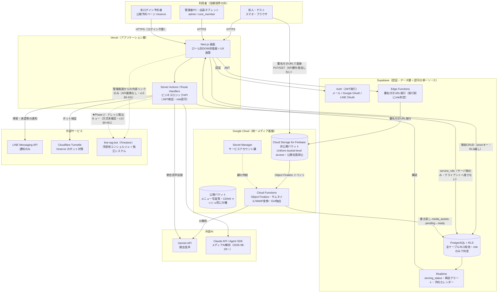
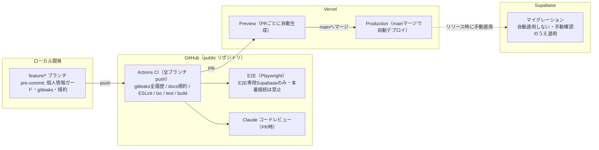
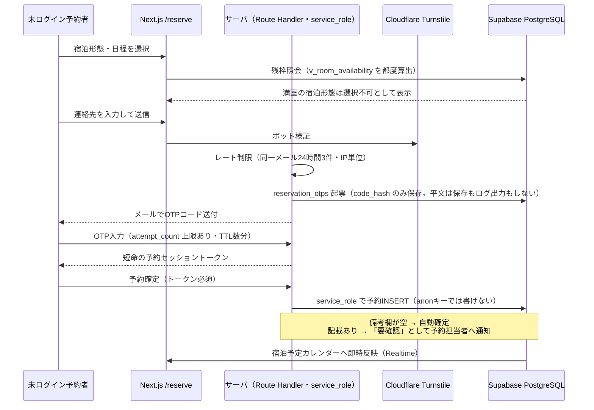
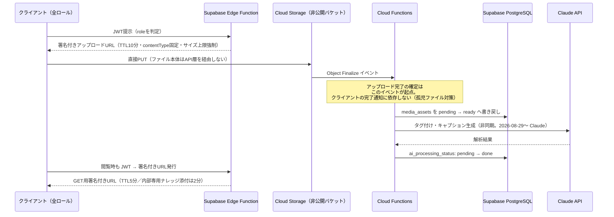
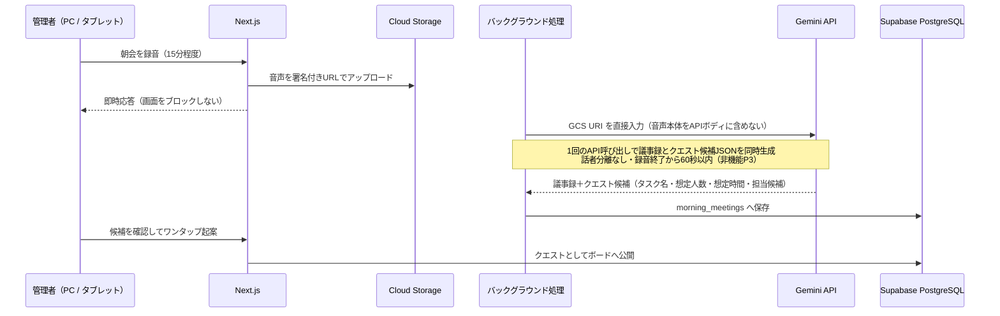
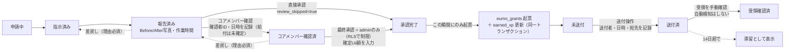
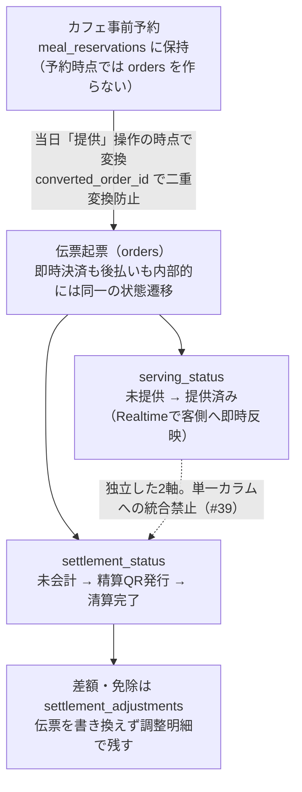
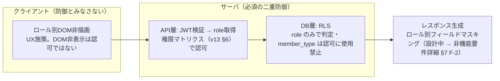

# システムアーキテクチャ

> [[浮遊街アプリ 統合ナレッジベース (Master Index)]] の子ノート（セクション4）

## 設計前提
- 無料枠の制限（Supabaseのプロジェクト数上限やDB容量500MBの壁）を考慮。
- 将来のマルチテナント化（他コミュニティへの展開）を見据えた疎結合設計。

## 技術スタック
| レイヤー | 技術 |
| --- | --- |
| フロントエンド | Next.js（Vercelホスティング）／Tailwind CSS |
| UIモック | Claude Artifactsで最速生成（HTMLモック） |
| バックエンド/DB | Supabase（PostgreSQL, 認証, Realtime, Edge Functions, Row Level Security） |
| **メディアストレージ** | **Cloud Storage for Firebase（GCS）** — 画像・動画・PDF・朝会音声。**Firebase Authentication / Security Rules は使用しない**（下記「ストレージ認可」参照） |
| **メディア後処理** | Cloud Functions for Firebase（サムネイル生成、WebP/MP4変換、Exif抽出、Vision APIタグ付け） |
| AI基盤 | Claude API / Agent SDK（**メディアAI解析を含む**／2026-08-29〜）。朝会音声のみ Gemini API |
| RAG/ベクトル検索 | ~~pgvector（Supabase内）または OpenSearch~~ → **2026-08-16確定：line-rag-bot（Firestore）に統合**。浮遊街アプリ本体は独自のベクトル検索基盤を持たない（v13 §9 #31） |
| API/連携層 | MCP（Model Context Protocol） |
| 通知基盤 | LINE Messaging API |
| 外部連携基盤 | EUMO API（決済・残高基盤）／FEL（将来のデータ連携） |
| 共通スキーマ管理 | Shared Schema Repository（TypeScriptパッケージ／OpenAPIとしてGitHub管理） |

## ★ ストレージ認可の一元化（2026-08-14 決定 ／ 正本 §5.11.2）

**格納は Firebase に一本化し、認可判定は Supabase に一元化する（署名付きURL方式）。**

Firebase Security Rules の `request.auth` は Firebase Authentication を前提とするため、素直に使うと「Supabase Auth と Firebase Auth」という認証・認可の二系統が生まれる。これを避けるため、以下を**設計上の不可侵ルール**とする。

| # | 不可侵ルール | 理由 |
| --- | --- | --- |
| 1 | **Firebase Authentication を導入しない** | ユーザー識別子とロールの所在を Supabase 1箇所に保つ |
| 2 | **Firebase Security Rules に認可ロジックを書かない** | ルールは「全拒否」のみとし、判定ロジックの二重管理を発生させない |
| 3 | **GCSバケットは公開アクセス全面禁止**（Uniform bucket-level access） | 署名付きURL以外の経路を物理的に塞ぐ |
| 4 | **ロール判定の実装箇所は Supabase（RLS ＋ Edge Function）のみ** | 単一のソース・オブ・トゥルース |

```text
[クライアント] --①JWT--> [Supabase Edge Function] --署名付きURL(PUT/10分)-->
[クライアント] --②直接PUT--> [Cloud Storage] --③Object Finalize--> [Cloud Functions]
                                                    --④書き戻し--> [Supabase: media_assets]
[クライアント] --⑤JWT--> [Edge Function] --⑥署名付きURL(GET/5分)--> [Cloud Storage]
```

- アップロード完了の記録は**クライアントの完了通知ではなく Object Finalize イベント**を起点とする（通信断で「孤児ファイル」が残り課金だけ発生するのを防ぐ）
- 署名付きURLの有効期限：アップロード10分／閲覧5分／**内部専用ナレッジの添付は2分**
- 公開画像（メニュー写真等）にCDNキャッシュを効かせる場合は、**非公開バケットとは別に公開バケットを分離**する
- 朝会音声も本基盤へ統合（Vertex AI が GCS URI を直接入力として扱えるため、処理経路が短くなる）

## インフラ構成図（Phase 1）（2026-08-28 新設）

> 本節は D層（設計）の正式なインフラ構成図である。オンボーディング資料の概要図（システム構成図・簡易処理フロー）の詳細版にあたり、食い違う場合は正本 v13 と本節を優先する。出典: 本書技術スタック表・v13 §5.11.2・§9 #31・`CLAUDE.md` §6。

### 全体構成図（信頼境界つき）



**この図から読み取ってほしい5点**

| # | ポイント | 根拠 |
| --- | --- | --- |
| 1 | **認可判定は Supabase 側のみ**。Firebase Authentication / Security Rules は不採用（ルールは全拒否のみ） | 本書「ストレージ認可の一元化」・v13 §5.11.2 |
| 2 | **ファイル本体は API 層を通らない**。アップロードもダウンロードも署名付きURLで GCS と直接やり取りする | v13 §8（アップロード性能） |
| 3 | **Phase 1 では line-rag-bot とは API 連携が存在しない**。結合点は管理画面からの外部リンクのみ。**Phase 2 でナレッジ投入の連携が入る**（下記5） | v13 §9 #31・#61・外部連携設計.md §2 |
| 4 | **未ログイン予約者（/reserve）の書き込みは必ずサーバ（service_role）経由**。anon キーに公開テーブルの INSERT 権限を与えない | API設計.md §2-2b |
| 5 | ~~**★ネットワーク層の防御（WAF／FW）はこの図に存在しない**。省略ではなく実際に無い~~ → **2026-09-05 更新：3前線の構成を採用して F-9 へ回答済み**（Vercel WAF／`anon` 権限の削り込み＋RLS／GCS の IAM・バケット設定）。ただし**図そのものは未更新**であり、図に防御が描かれていない状態は変わらない。詳細は本書「ネットワーク層の防御」節の**「★ 採用する構成」** | 2026-09-03 オーナー指摘・非機能 F-9 ／ **2026-09-05 オーナー決定** |

> [!note] Phase 2 のナレッジ取込経路について（2026-09-03 決定 ／ v13 §9 #61）
> **浮遊街アプリのデータを浮遊街コンシェルジュのナレッジ空間へ投入する**方針が決定した。
> 図では `V2 -.-> E3` の破線で示している。ただし **実装方式は未確定**であり、
> 推奨案は「アプリは**取込キュー用コレクション**へ生テキストとメタデータのみを書き、
> 埋め込み生成と `knowledge_*` への upsert は bot 側の既存 `KnowledgeIndexer` が行う」方式である
> （`KnowledgeIndexer` が generated chunk の唯一のライターであるという不変条件を壊さないため）。
> ⚠️ **投入にあたっては、個人情報・金額・運営メモを機械的に弾くガードが必須**。
> LINE 側ロールは自己申告のため、`target_role` によるフィルタはガードとして機能しない。
> 詳細は `QUESTIONS.md` 2026-09-03 起票分・`CONSOLIDATED_DECISIONS.md` §15。

### 環境・デプロイ構成図



- 環境変数のキー名は `.env.example` が正（キー名と説明のみを列挙。実値は Vercel / GitHub Secrets に置く）
- dev / staging / prod の環境分離は WBS 1-1（Supabase プロジェクト作成・環境構築）のスコープ
- CI・フックの詳細は `CLAUDE.md` §6 を正とする

### コンポーネント責務表

| コンポーネント | 入力 | 出力 | 認可の持ち場 |
| --- | --- | --- | --- |
| Next.js 画面（Vercel） | ブラウザ HTTPS | Supabase（anon＋RLS）・Route Handlers | DOM非描画（**UXのみ。認可ではない** = v13 §5.9.3） |
| Server Actions / Route Handlers | JWT付きリクエスト・公開フォーム | Supabase（service_role）・Turnstile・Gemini/Claude・LINE通知 | JWT検証＋role認可（RLSと**二重に**効かせる） |
| Supabase Auth | メール / Google / LINE OAuth | JWT | 認証の単一ソース |
| PostgreSQL＋RLS | anon / service_role 接続 | Realtimeへの変更イベント | 行レベル認可の単一ソース（`role` のみで判定） |
| Supabase Realtime | DB変更イベント | 購読クライアントへの配信 | RLS準拠の購読制御（脅威分析 F-3 → [[非機能要件詳細]] §7） |
| Supabase Edge Functions | JWT | 署名付きURL | 発行前の role 判定（ストレージ認可の唯一の実装箇所） |
| Cloud Storage for Firebase | 署名付きURLの PUT/GET | Object Finalize イベント | **認可を持たない**（Security Rules は全拒否のみ） |
| Cloud Functions | Object Finalize・スケジュール起動 | media_assets 書き戻し・**Claude呼び出し（メディアAI解析／2026-08-29変更）** | サービスアカウント（鍵は Secret Manager 管理） |
| Gemini / Claude API | サーバ側からのみ呼び出し | 生成結果 | APIキー（環境変数・クライアントへ出さない） |
| LINE Messaging API | サーバ側からのみ呼び出し | 利用者・管理者への push 通知 | チャネルトークン（環境変数） |

### ネットワーク層の防御（2026-09-03 新設 ／ 非機能 F-9・~~★未決~~ → **2026-09-05 回答済み**）

> [!info] 本節の読み方（2026-09-05 追記）
> 以下の「存在しない」という記述は **2026-09-03 時点の調査結果**であり、**記録として残す**。
> **2026-09-05 のオーナー決定により F-9 は回答済み**となり、本節末尾の
> **「★ 採用する構成（2026-09-05 オーナー決定 ／ F-9 への回答）」が現行の設計**である。
> 現状把握を先に読みたい場合は、そちらへ進んでよい。

> [!warning] 本構成に**ネットワーク層の防御（WAF／ファイアウォール）は存在しない**（2026-09-03 時点）
> 2026-09-03 のオーナー指摘（「FW見当たらない」）を受け、両リポジトリの設計文書を全文検索した結果、
> **`WAF` / `ファイアウォール` / `firewall` / `Cloud Armor` / `IP制限` / `ネットワーク制限` はいずれも 0 件**だった。
> 上の全体構成図に FW を描いていないのは省略ではなく、**実際に存在しない**ためである。

**存在する L7 防御は2つだけ**である。

| 現存する防御 | 適用範囲 | 限界 |
| --- | --- | --- |
| Cloudflare Turnstile | `/reserve` のみ | CAPTCHA 相当であって WAF ではない |
| レート制限 | OTP 発行のみ | それ以外は未定義（[[非機能要件詳細]] §7-3 **F-7**） |

#### なぜ Supabase だけでは外部アクセスを遮断できないのか

| # | 理由 |
| --- | --- |
| 1 | Data API（PostgREST / Auth / Storage / Realtime）は `https://<ref>.supabase.co` として**常時インターネットに露出**する。ブラウザから直接叩かれる前提の BaaS 設計 |
| 2 | Supabase の **Network Restrictions（IP許可リスト）は Postgres への直接接続にのみ適用**され、**PostgREST 等の HTTPS API には適用されない**（公式ドキュメント明記） |
| 3 | `anon` キーはビルド時にクライアント JS へ埋め込まれる（`NEXT_PUBLIC_`）＝**公開情報**であり秘密ではない |
| 4 | カスタムドメインを設定しても元の `.supabase.co` は**稼働し続け無効化できない**ため、前段に CDN/WAF を置いてもオリジンが露出したままになる |

> **したがって、インターネットと会員370名の個人情報の間に立っているのは RLS 1枚のみである。**
> これが [[非機能要件詳細]] §7-3 の **F-6（RLSポリシーのDDLが未作成）が全ギャップ中で最も危険**である理由にあたる。
> RLS はこのシステムの「最後の砦」ではなく「**唯一の砦**」である。

#### ⚠️ 構造的な論点：トラフィックの一部は設計上 Vercel を迂回する

`API設計.md` §1 の原則①「単純CRUD は Supabase クライアントから RLS 越しに直接アクセスし、独自APIを作らない」
により、**トラフィックの相当部分が意図的に Vercel を通らない**（上の全体構成図の `V1 → S2` の経路）。
そのため **Vercel WAF を導入してもこの経路には効かない**。「WAF を1つ入れれば済む」構成ではない。

#### 対策オプション（★オーナー承認待ち・`QUESTIONS.md` 2026-09-03 起票分）

| # | オプション | 守る範囲 | 費用の目安 | 工数 | 評価 |
| --- | --- | --- | --- | --- | --- |
| **N-3** | **RLS の厳格化（F-6 を最優先タスク化）** | **全経路** | 無料 | WBS 2-2 に既存 | ⭐⭐ **必須・代替手段が存在しない** |
| **N-1** | **Vercel WAF**（IPブロック・カスタムルール・レート制限） | Vercel 経由（Server Actions・`/reserve`・管理API） | 基本機能は全プラン無料。レート制限は Hobby から利用可 | 0.5日（設定のみ・再デプロイ不要） | ⭐ **即実施可**。F-7 の受け皿にもなる |
| N-2 | Supabase Network Restrictions | **Postgres 直接接続のみ**（HTTPS API には効かない） | Pro プラン機能 | 0.25日 | △ 効果は限定的だが設定は容易 |
| N-4 | 直アクセスを廃止し全トラフィックを Server Actions 経由へ | 全経路が WAF 配下に入る | 無料 | 大（`API設計.md` §1 の原則変更＋実装量増） | Phase 2 以降 |
| N-5 | `line-rag-bot`：`allUsers` 公開の Cloud Run 前段に LB ＋ Cloud Armor | 公開 Webhook | LB・ポリシーの固定費が発生（要試算） | 1〜2日 | ○ **実稼働側のため優先度は高い** |

- N-3 と N-1 は競合しない。**N-3 は必須、N-1 は安価な保険**という位置づけ
- N-5 は浮遊街アプリではなく `line-rag-bot` 側の課題（[[Knowledge/インフラ・セキュリティ/2026-09-02_浮遊街アプリ・line-rag-bot_インフラ構成とセキュリティ対応リスト.md|インフラ構成とセキュリティ対応リスト]] P1-2）

#### ★ 採用する構成（2026-09-05 オーナー決定 ／ F-9 への回答）

> [!success] 「FW を1枚貼る」構成は採らない。**経路ごとに別の技術で塞ぐ**
> 上の N-1〜N-5 は**検討時の選択肢一覧として残す**（記録のため削除しない）。
> 2026-09-05 のオーナー決定により、防御を **3つの前線**に分けて具体化する。
> 単一の壁を立てられないのは、`API設計.md` §1 原則①により**トラフィックの一部が設計上 Vercel を迂回する**ためである
> （上記「構造的な論点」・`CONSOLIDATED_DECISIONS.md` §1「Supabase への直接アクセスは Phase 1 で維持する」）。

**前提となるプラン**: **Vercel は Hobby（無料）／Supabase は無料枠**（`CONSOLIDATED_DECISIONS.md` §1・2026-09-05 決定）。
このため **N-2（Supabase Network Restrictions）は対象外**とする。理由は2つあり、**Pro プラン機能である**ことに加え、
**Postgres への直接接続（5432）にしか適用されず HTTPS Data API を守らない**ため、無料枠の制約が無かったとしても
本件の防御にはならない（上表 N-2 の「効果は限定的」を、無料枠決定を受けて**不採用**へ確定させたもの）。

| 前線 | 守る経路 | 使う技術 | この前線が**効かない**範囲 |
| --- | --- | --- | --- |
| **前線1** | ブラウザ → **Vercel** → Supabase（Server Actions・`/api/*`・管理画面） | **Vercel WAF**（Hobby の無料機能） | **Vercel を通らない経路すべて**（＝直アクセス・Supabase Auth のSDK直呼び） |
| **前線2** | ブラウザ → **Supabase 直**（PostgREST・Realtime・Auth） | **`anon` 権限の削り込み ＋ RLS ＋ 正規JWT の入手経路の制限** | （最後の砦。この内側に別の壁は無い） |
| **前線3** | ブラウザ ⇄ **GCS**（署名付きURL） | **IAM ＋ バケット設定（公開禁止・WORM）** | 発行済み署名付きURL自体の転送・共有 |

---

##### 前線1: Vercel を通る経路 → Vercel WAF（無料）

**全プランで無料**の機能（Hobby でも使える）:

| 機能 | 内容 | 本プロジェクトでの使い方 |
| --- | --- | --- |
| Managed DDoS 緩和 | プラットフォーム側で常時有効 | 設定不要。既定で効く |
| ボット対策・IPブロック | 既知の悪性トラフィックの遮断、手動でのIPブロック | 攻撃元が特定できた際の緊急遮断枠として温存する |
| **Attack Challenge Mode** | 攻撃検知時に**手動でONにするワンスイッチ**。全リクエストにブラウザチェック（チャレンジ）を挟む | **常時ONにはしない**。攻撃を受けた際の緊急対応手順として `docs/operations/` の運用手順へ載せる（正規会員にも摩擦が出るため） |

**⚠️ Hobby プランの枠は「カスタムルール3本・IPブロック3件」**（2026-09-05 時点。Vercel 公式ドキュメント
[WAF Custom Rules](https://vercel.com/docs/vercel-firewall/vercel-waf/custom-rules) で **Hobby 3本 / Pro 40本**を確認した。
**⚠️ 要確認**: IPブロックの上限「3件」は本数の裏取りが取れていないため、設定時に実機で確認すること）。
3本しか無いため、**何に使うかを設計として確定させる**必要がある。

| # | 対象パス | アクション | 目的 | 評価 |
| --- | --- | --- | --- | --- |
| **R1** | `/api/public/*` | **IP単位のレート制限** | OTP乱発・予約スパムの抑止。**F-7（レート制限がOTP以外で未定義）の受け皿** | ⭐ **採用**。ここは未認証で到達できる唯一の書き込み経路であり、かつ**必ず Vercel を通る**（`service_role` はサーバ側のみ）ため WAF が確実に効く |
| **R2** | 認証系パス（ログイン・パスワードリセット） | レート制限 | 総当たり対策 | ⚠️ **条件付き**。下記「R2 の妥当性」を参照 |
| **R3** | 管理系パス（`/admin/*` 等） | **日本国外からのアクセスをブロック** | 運営スタッフは国内のみのため、攻撃面を地理的に切る | ⭐ **採用**。管理画面は Vercel が配信するため確実に効く |

> [!warning] R2 の妥当性：**Supabase Auth をクライアントSDKで呼ぶ限り、Vercel WAF は効かない**
> `supabase-js` の `signInWithPassword()` / `resetPasswordForEmail()` は、ブラウザから
> **`https://<ref>.supabase.co/auth/v1/*` へ直接**発行される。この経路は前線1ではなく**前線2**に属し、
> **Vercel の `/login` にレート制限をかけても総当たりは素通りする**（攻撃者は画面を経由せずAPIを直接叩けるため）。
> したがって**総当たり対策の本体は前線2の「Supabase Auth 標準のレート制限」に置く**。
>
> R2 の枠を活かすには次のいずれかを選ぶ。**採否はオーナー判断（未確定）**:
> - **(a) 認証フローを Server Action 経由へ寄せる**（ブラウザは `/login` を叩き、サーバ側で Supabase Auth を呼ぶ）。
>   R2 が実効を持つようになる。ただし `API設計.md` §1 の直アクセス原則の**例外を1つ作る**ことになる
> - **(b) R2 の枠を `/admin/*` のレート制限へ振り替える**（R3 の国外ブロックと併用し、国内からの管理画面総当たりを抑える）
> - **(c) R2 を使わず1枠空けておく**（インシデント時に即席ルールを入れる余地として温存する）
>
> **⚠️ 要確認**: R3 の国外ブロックは、**運営スタッフが海外渡航中に管理画面へ入れなくなる**副作用を持つ。
> 緊急時の解除手順（ルールを一時無効化する）を運用手順へ明記すること。**一般会員向け画面は国外ブロックしない**
> （海外在住・旅行中の会員が締め出されるため）。

**⚠️ Hobby で使えない機能（2026-09-05 時点の確認）**: **Persistent Actions**（レート制限に抵触したクライアントを
一定時間自動でブロックし続ける機能）は **Pro / Enterprise のみ**。Hobby のレート制限は
**そのリクエストを弾くだけ**で、攻撃元を継続的に締め出す動作はしない。継続的な遮断が必要になった場合は
**手動IPブロック（3件枠）または Attack Challenge Mode で凌ぐ**運用になる。

**Pro へ移行した場合**: カスタムルールは **40本**まで増える。上記のような枠の取り合いは解消し、
R1〜R3 に加えてエンドポイント別・ロール別の細かい制限を足せる。移行時期は
`CONSOLIDATED_DECISIONS.md` §1 の「収益化した時点で Pro へ移行する」と同じ判断に乗せる。

---

##### 前線2: Supabase へ直接アクセスする経路 → ★ここが本丸

> [!important] 壁を立てるのではなく、**`anon` ロールの権限を削り込むことが実質的なファイアウォールになる**
> `anon` キーは `NEXT_PUBLIC_` でクライアントJSに埋め込まれる**公開情報**であり、秘密として守ることはできない。
> しかし **`anon` で読めるものが何も無ければ、鍵が公開されていること自体は問題にならない**。
> 「壁が無いのでキーを隠す」のではなく「**キーが開いても、その先に何も開かない状態にする**」ことで、
> 直アクセス経路の攻撃面を消す。これが本構成における実質的なファイアウォールである。

**原則: `anon` にテーブル・ビュー・関数の権限を与えない（原則ゼロ）。**

公開予約フローは `API設計.md` §2-2b のとおり**サーバ側 `service_role` を通す設計**であり
（`/api/public/*` は Server Action / Route Handler 内部でのみ書き込む）、
**ブラウザの `anon` キーがテーブルへ触る必要が無い**。

> [!note] DDL 本体はここに書かない
> `GRANT` / `REVOKE` の具体的な DDL は **`DB物理設計.md` §6** に記載する。
> 本書は「**原則**」と「**なぜそれが防御になるか**」だけを扱い、実装は同節を参照すること
> （設計の二重管理を避けるため。`CLAUDE.md` §1.1）。

**⚠️ `anon` に権限が必要な箇所の検証**（`API設計.md` のエンドポイント一覧を全件突き合わせた結果）:

| 検証対象 | `anon` のテーブル権限は必要か | 根拠 |
| --- | --- | --- |
| 公開予約フロー（`/api/public/reservations`・`otp`・`otp/verify`） | **不要** | サーバ側 `service_role` 経由（`API設計.md` §2-2b の警告「anonキーで直接DBを触らせない」） |
| **未認証の残枠表示**（`GET /api/public/availability`） | **不要** | `/api/public/*` としてサーバ側で `v_room_availability` を読む設計。ブラウザは Vercel の API を叩く |
| **未認証の料金表示**（`GET /api/public/rates`） | **不要** | 同上 |
| `GET /api/availability`・`/api/quests`・`/api/menu-items`・`/api/accommodation-rates`（認可「全員」） | **不要** | 「全員」は**全ロール**の意味であって未認証ではない。`API設計.md` §1「認証：全エンドポイントで検証必須」。未認証向けには別途 `/api/public/*` が用意されており、**この分離自体が認証必須である傍証**にあたる |
| メディア（`/api/media/*`） | **不要** | 認可は「本人」。かつ実体は GCS（前線3） |
| Supabase Storage | **不要** | **使用しない**（メディアは Cloud Storage for Firebase へ一本化・本書「ストレージ認可の一元化」） |
| Realtime（`serving_status`・再訪アラート・宿泊カレンダー） | **不要（ただし下記の要確認あり）** | 購読対象はいずれもログイン後の画面（客側の提供状況・管理者/コアメンバー画面・本人カレンダー）。`authenticated` で足りる |

→ **結論: `anon` のテーブル権限はゼロにできる。**

> [!warning] ⚠️ 要確認（この3点だけは実装着手前に潰すこと）
> 1. **⭐ 未ログインの `/reserve` が残枠を Realtime で購読する設計なのか**。
>    v13 §5.2.5 は残枠の「表示箇所」に**公開予約ページ `/reserve`（未ログイン）**を挙げ、
>    かつ更新手段を「**Supabase Realtime で即時反映**」と書いている。また本書の公開予約フロー図にも
>    `DB->>W: 宿泊予定カレンダーへ即時反映（Realtime）`（W ＝ `Next.js /reserve`）という矢印がある。
>    **この2つを字義どおり読むと、未ログインのブラウザが Realtime を購読する＝`anon` に権限が要る**ことになる。
>    → **設計意図は「運営側カレンダーへの反映」であり、`/reserve` の残枠はサーバ取得
>    （`/api/public/availability`）で足りる**というのが本書の解釈だが、**明記が無いため確定できない**。
>    **ここを確定させないと `anon` 権限ゼロの可否が決まらない**（`QUESTIONS.md` の F-9 項へ残課題として記載）
> 2. **`/reserve` の画面実装が、残枠を `supabase-js` で直接読んでいないか**。
>    設計上は `/api/public/availability` を叩く前提だが、実装時にクライアントSDKで
>    `v_room_availability` を読むと `anon` SELECT が必要になり、原則が崩れる。**実装レビューの確認項目とする**
> 3. **卓上QR等から「未ログインの客」が提供状況を見る導線が生まれないか**。
>    現時点の設計では `serving_status` の購読者は**チェックイン中のログイン済み利用者**に限られ
>    （注文自体が「現在チェックイン中のユーザーのみ」可能・v13 §5.4.1）、
>    設計書全体で「卓上QR」「テーブルQR」の記述は**0件**である。よって現状 `anon` は不要。
>    ただし将来この導線が追加された場合は `orders` への `anon` SELECT が必要になるため、
>    **その場合でもテーブルへ直接権限を与えず**、`/api/public/*` と同じくサーバ経由（または注文単位の
>    短命トークン）で解くこと

> [!note] ⚠️ 図中のラベル「単純CRUD（anonキー・RLS越し）」は誤解を招くため要修正
> 本書の全体構成図は直アクセス経路を `V1 -->|"単純CRUD（anonキー・RLS越し）"| S2` と描いているが、
> **ログイン後の直アクセスで RLS 判定に使われるのは `anon` ロールではなく、利用者の JWT（`authenticated`）である。**
> `anon` キーは `apikey` ヘッダとして同時に送られるだけで、権限の主体ではない。
> 本節の「`anon` 権限ゼロ」と矛盾して読めるため、**図のラベルを「単純CRUD（ログイン済みJWT・RLS越し）」へ
> 改める**ことを提案する（★提案・本PRでは図本体を変更していない）。

> [!note] 「`anon` 権限ゼロ」と「`anon` キーの廃止」は別物
> `anon` キーは **Supabase Auth（GoTrue）を呼ぶ際の `apikey` ヘッダとして必須**であり、
> サインアップ・ログイン・パスワードリセットには引き続き必要である。
> ここで削るのは **PostgREST 経由で到達できるテーブル・ビュー・関数の権限**であって、キーそのものではない。
> **この区別を取り違えると「anon キーを消せばよい」という誤った実装に進むため、明示しておく。**

**`authenticated` に対しては RLS が壁になる。** 2026-09-05 の **A案（PII別テーブル分離）**決定により、
個人情報は `member_profiles_private` へ分離され、**行単位の RLS だけで保護が完結する**
（列マスキング不要・`CONSOLIDATED_DECISIONS.md` §3）。正規のJWTを持つ利用者が直アクセスしても、
**自分の行の外へは出られない**。

**正規JWTの入手経路を絞る（攻撃者に「正規の会員になられる」ことを防ぐ最初の関門）:**

RLS は「JWTの持ち主として正当な範囲」を守るが、**攻撃者が自分でアカウントを作れば正規のJWTを手に入れられる**。
そこで**入口そのものを絞る**。

| 手段 | 内容 | 状態 |
| --- | --- | --- |
| **Cloudflare Turnstile** | **Supabase Auth に組み込みの CAPTCHA 連携がある**（ダッシュボードの Authentication > Bot and Abuse Protection で有効化し、hCaptcha / Turnstile を選択）。**サインアップ・サインイン・パスワードリセット**に適用される。無料 | ⭐ **採用**。`/reserve` の Turnstile（`非機能要件詳細.md` §2-6 で既定）とは**別の適用箇所**である点に注意（あちらは予約フォーム、こちらは Auth） |
| **メール確認の必須化** | 確認済みメールでなければ本登録を完了させない | ⭐ **採用**。2026-09-05 決定「アカウント作成時にメールアドレスを登録させる」と整合 |

> **⚠️ 要確認**: Supabase の CAPTCHA 連携について、**サインアップ経路の一部で CAPTCHA が迂回される**旨の
> 不具合報告が公開Issueに存在する（supabase/supabase #29231・#35750）。**有効化しただけで満足せず、
> 実装時に「CAPTCHAトークン無しのリクエストが拒否されること」をテストで確認すること。**

**Supabase Auth 標準のレート制限を明示的に設定する（F-7 の本体）:**

Supabase はダッシュボードの **Authentication > Rate Limits** で認証系のレート制限を設定できる。
**F-7（レート制限がOTP発行以外で未定義）の実体はここで埋める。**

| 対象 | 方針 |
| --- | --- |
| OTP・メール送信 | `API設計.md` §2-2b の「同一メール24時間3件」と整合する値を設定する |
| ログイン試行 | 総当たり対策の**本体**（前線1の R2 では守れないため） |
| サインアップ | Turnstile と併用し、大量アカウント生成を抑える |

> [!warning] ⚠️ **新規論点（2026-09-05 発見）: 既定SMTPの「2通/時」が公開予約フローと衝突する**
> Supabase の**既定の組み込みSMTP は認証メールが 2通/時**に制限されている（無料枠・既定設定）。
> このままでは**公開予約ページの OTP 発行（`POST /api/public/reservations/otp`）が実運用に耐えない**。
> カスタムSMTP（Resend / SendGrid 等）を設定すると既定 30件/時となり、
> Authentication > Rate Limits で調整可能になる。
> **→ 「無料枠で開始する」決定の下でも、カスタムSMTP の用意は事実上の必須要件になる。**
> **⚠️ 要確認**: 採用するSMTPプロバイダと、その無料枠で1日あたり何通まで送れるか（費用が発生するか）。
> `QUESTIONS.md` へ起票する。
> あわせて、**設定したレート制限が期待どおり適用されない**旨の公開Issue報告がある（supabase/auth #2333 等）。
> **設定後に実測で確認すること。**

**使わない口を閉じる（攻撃面の削減）:**

| 対象 | 方針 | 理由 |
| --- | --- | --- |
| **Realtime publication** | **使用するテーブルだけを publication に登録し、未使用テーブルは除外する** | 既定で全テーブルを流すと、RLS の緩みがそのまま配信に乗る（`非機能要件詳細.md` §7-3 **F-3** と同じ経路） |
| **pg_graphql** | **使用しないなら無効化する**（本プロジェクトは GraphQL を使わない） | PostgREST とは別に、もう1つのクエリ入口が開いたままになるため |
| **PostgREST が公開するスキーマ** | **公開が必要なスキーマのみに絞る**（Exposed schemas 設定） | 内部用スキーマを作った場合に、意図せず Data API から見えることを防ぐ |

> **⚠️ 要確認**: 上記3点はいずれも Supabase ダッシュボード／設定での操作であり、**無料枠で設定可能かを実機で確認する**
> （特に pg_graphql の無効化可否）。設定手順は WBS 1-1（環境構築）の作業項目として起票すること。

---

##### 前線3: Cloud Storage → IAM とバケット設定

| 項目 | 設定 | 理由 |
| --- | --- | --- |
| **Uniform bucket-level access** | **有効化（ACL を無効化）** | オブジェクト単位ACLが残ると、IAM だけでは実効権限を把握できなくなる |
| **Public access prevention** | **`enforced`** | `allUsers` / `allAuthenticatedUsers` の付与を構造的に禁止し、事故による公開を防ぐ |
| 到達手段 | **署名付きURLのみ**。バケットへの直接の読み書きを許可しない | 認可判定を Supabase 側に一元化する既定方針（本書「ストレージ認可の一元化」）を維持するため |
| 署名付きURLの TTL | **既定値を維持**: アップロード **10分** ／ 閲覧 **5分** ／ 内部専用ナレッジ **2分** | `非機能要件詳細.md` §2-2。**URL自体が資格情報**であるため短命に保つ |

**サービスアカウントは用途ごとに分ける。**

| SA の用途 | 与える権限 | 与えない権限 |
| --- | --- | --- |
| メディアの署名付きURL発行 | 対象バケットへの読み書き（＋署名用） | 監査バケットへの一切のアクセス |
| メディア後処理（Cloud Functions） | 対象バケットの読み取り・書き戻し | 監査バケットへの一切のアクセス |
| **監査ログの書き込み** | **「作成のみ」**（オブジェクトの新規作成のみ許可） | **読み取り・上書き・削除を与えない** |

> [!important] 監査バケットへの書き込みSAを「作成のみ」にする理由（**改ざん耐性**）
> 監査ログの価値は「**後から書き換えられないこと**」にある。書き込み用SAに削除・上書き権限があると、
> **アプリ側が侵害された時点で監査証跡ごと消せてしまい、証跡が証跡でなくなる**。
> 作成のみに絞れば、侵害されても**過去のログには手が届かない**。
> これは後述「監査ログの保管構成」の **Bucket Lock（WORM）と二重で効かせる**設計である
> （IAM で「消す権限を渡さない」／Bucket Lock で「権限があっても消せなくする」）。
> **⚠️ 要確認**: 付与するロールの具体名（`roles/storage.objectCreator` 相当）が、
> 監査ログの書き込みパターン（同名オブジェクトの再作成が発生しないか）と両立するかを実装時に確認する。

---

##### まとめ: どの経路を通っても、最後に守っているのは RLS である

```text
経路A: ブラウザ →[Vercel WAF]→ Vercel →[service_role]→ Supabase →[RLS]→ データ
経路B: ブラウザ ────────────────────────────────────→ Supabase →[RLS]→ データ
                  ↑ ここに WAF は無い（設計上の迂回）     ↑ anon 権限ゼロ
経路C: ブラウザ ⇄ GCS（署名付きURL・IAM・公開禁止）  ※ URL発行の可否は Supabase 側で判定
```

- **経路A・経路B は、いずれも最後に RLS を通る。** 前線1（WAF）と前線2（`anon` 権限の削り込み）は
  **RLS の手前で攻撃面を減らすもの**であって、RLS を置き換えるものではない
- **⚠️ Vercel WAF は Vercel を通る経路にしか効かない。したがって RLS の代替にはならない。**
  「WAF を入れたから RLS は後回しでよい」という判断は、**経路B が丸ごと無防備になる**ため誤りである
- したがって **F-6（RLSポリシーDDLが未作成）は、本構成を採用した後も引き続き最優先の課題**である
  （N-3「RLS の厳格化」は必須・代替手段が存在しない、という上表の評価は変わらない）

## バックエンドの処理方式とデータフロー（Phase 1）（2026-08-28 新設）

> これまで DB物理設計・API設計・非機能要件詳細の3文書に分散していた「データの流れ」を、横断ビューとして1箇所に図解する。**個別の仕様（カラム定義・エンドポイント定義・SLA値）は各詳細設計が正**であり、本節と食い違う場合は詳細設計側を修正せず本節を直す。

### 処理方式の原則（既存決定の集約）

| # | 原則 | 内容 | 出典 |
| --- | --- | --- | --- |
| 1 | CRUDとロジックの分担 | 一覧・詳細等の単純CRUDは Supabase クライアントから RLS 越しに直接アクセスし、独自APIを作らない。承認処理・QR発行・ロール昇格等のビジネスロジックのみ専用エンドポイント | API設計.md §1 |
| 2 | 書き込み経路は3種のみ | ①ログイン済みクライアント→RLS直 ②サーバ（service_role。**公開エンドポイントは必ずこれ**） ③Cloud Functions の書き戻し | API設計.md §2-2b・v13 §5.11.2 |
| 3 | 集計値を直接更新しない | `stay_tickets`・`uii_balance` 等はトリガーで再計算（アプリからの直接UPDATE禁止）。残枠は `v_room_availability` ビューで都度算出 | v13 §9 #25・#37 |
| 4 | 状態は「事実の記録」で表す | 送付と受領の分離、提供と会計の独立2軸、取引明細主義・物理削除の原則禁止 | v13 §9 #35・#39、DB物理設計.md §1 |
| 5 | 重い処理は画面応答をブロックしない | 朝会音声・メディアAI解析はバックグラウンド処理（`ai_processing_status` 等で進捗管理） | 非機能要件詳細.md P3・API設計.md §2-10 |
| 6 | Realtime の使用箇所は限定列挙 | `serving_status`（客側反映）・再訪アラート（**管理者・コアメンバー画面のみ**）・宿泊予定カレンダー | v13 §5.4・§5.8.4・§5.2.3 |

### フロー1: 公開予約 `/reserve`（未認証→OTP→予約確定）



出典: v13 §5.2.3・§9 #46、API設計.md §2-2b

### フロー2: メディアアップロード（署名付きURL→Object Finalize→AI解析）



出典: v13 §5.11.2・§5.11.5・§9 #56、API設計.md §2-10、DB物理設計.md §3-7

> [!note] メディアAI解析のエンジンは Gemini → **Claude** へ変更（2026-08-29 オーナー決定）
> **Gemini は朝会音声（フロー3）に残す**。ここでの Claude の役割は
> **用途タグの適合度スコア算出とキャプション案の生成**（Phase 2／DB物理設計.md §3-7）。
> サムネイル生成・WebP変換・Exif抽出は従来どおり Cloud Functions 側の非AI処理。
> ⚠️ **写真からのAI判定（収穫可否・設備点検・献立提案）は本フローに含まれない**。
> 2026-08-29 に **LINE（`line-rag-bot`）側での実装（A案）へ確定**した（v13 §9 #56）。

### フロー3: 朝会音声→議事録→クエスト起案（60秒SLA）



出典: v13 §5.1、API設計.md §2-3、非機能要件詳細.md §1 P3

### フロー4: クエスト承認二段階→Uii給付（送付と受領の分離）



- 送付（`send`）と受領確認（`confirm-receipt`）を**1本のAPIにまとめない**。統合すると「送ったが届いていない」給付が検出できなくなる（API設計.md §2-4b）

出典: v13 §5.3・§5.3.1・§9 #35、API設計.md §2-4／§2-4b、DB物理設計.md §3-1・§3-8

### フロー5: 注文→会計（提供と会計の独立2軸）



- 金額計算: 単品Uii = `floor(単価×0.8)` → 明細行 → 伝票合算。**Uii価格はマスタに保存せず都度算出**し、マスタ改定は過去伝票を書き換えない（v13 §9 #40）

出典: v13 §5.4・§5.5・§9 #39・#48、DB物理設計.md §3-2・§3-6

### フロー6: 認証・認可の二重防御（リクエストの通り道）



出典: v13 §5.9.3・§2、非機能要件詳細.md §2-1

### 非同期ジョブ一覧と実行基盤（★提案・未確定）

> [!important] 提案（2026-08-28 起票・オーナー承認待ち）
> 各設計書で「非同期」「定期ジョブ」とだけ書かれ、**実行基盤（Edge Function / Cloud Functions / Cloud Scheduler / pg_cron）が未指定**だった。以下の3レーン案を提案し `QUESTIONS.md` へ起票した。**承認までは確定扱いしない。**

| レーン | 対象ジョブ | 提案基盤 | 理由 |
| --- | --- | --- | --- |
| ① GCSイベント起点の重処理 | メディアAI解析・サムネイル生成、朝会音声の議事録生成 | Cloud Functions（Object Finalize 起点） | v13 §5.11.2 の書き戻し経路と同一で部品が増えない。音声もメディアも同じバケットに載る（§5.11 朝会音声統合） |
| ② DB内で完結する掃除 | `reservation_otps` 期限切れ削除、`eumo_grants` 14日滞留フラグ、`settlement_adjustments` 90日滞留フラグ | pg_cron（Supabase 拡張） | 外部リソース不要・SQLのみで完結。DB内の事実だけで判定できる |
| ③ DBとGCSをまたぐ日次バッチ | 孤児ファイル検出・削除（`pending` 24時間超・DB未登録オブジェクト） | Cloud Scheduler → Cloud Functions | 両側の突合が必要でDB内だけでは完結しない。非機能要件詳細.md §2-2 の「Cloud Scheduler 等」想定と整合 |


## 監査ログの保管構成（2026-09-05 オーナー決定 ／ 非機能 A6・F-5）

> [!success] **監査ログは GCS に保存する。長期保管の正本は GCS 側**
> 2026-09-05 のオーナー決定。運用画面から参照する**直近分のみ Postgres に置き**、
> **10年保存（非機能 A6）は GCS 側で担保する**。
> これは `非機能要件詳細.md` §5 #5 が指摘していた「A6 の10年蓄積は **DB 500MB 上限**と正面から衝突する。
> GCS への外部化が事実上の必須要件になる」への回答にあたる。

### 二層構成

| 層 | 置き場所 | 役割 | 保持 |
| --- | --- | --- | --- |
| **運用層** | Supabase PostgreSQL | 運用画面（顧客詳細・伝票履歴）から**その場で参照する**直近分 | **下表の提案値**（短期） |
| **保管層（正本）** | **GCS の監査専用バケット** | **長期保管の正本**。改ざん不可・10年保存 | **10年（WORM）** |

**正本は GCS 側である。** Postgres 側は「運用画面の応答性のために手元に置いた写し」であって、
**期限が来たら消してよい**。逆に GCS 側は**消せない**（後述の Bucket Lock）。

### Postgres 側の保持期間（★提案）

| ログ種別 | 提案する Postgres 保持期間 | 根拠 |
| --- | --- | --- |
| **理由必須操作の監査ログ**（伝票編集・単価上書き・宿泊日数調整・免除・名寄せの成立/解除・遡及修正） | **90日** | 運用画面での用途は「直近の問い合わせ対応」と「締め処理の確認」に集中する。**月次の締めと四半期の振り返りを跨げる最小期間**が90日である。それ以前の照会は頻度が低く、GCS からの取り出しで足りる |
| **ログイン履歴** | **30日** | 運用上の用途は**不正アクセスの一次調査**に限られ、長期の傾向分析は GCS 側で行えばよい。行数が会員数×ログイン頻度で線形に増えるため、最も短く切る |
| **AI対話履歴** | **Postgres に置かない**（下記の⚠️を参照） | 発生源が浮遊街アプリ本体ではないため |

**容量の根拠（DB 500MB 上限との兼ね合い）:**

- 無料枠の **DB 上限は 500MB**、かつ `非機能要件詳細.md` §7-4 は **「容量が 300MB を超えた時点で再評価」**を再評価条件としている。
  監査ログは**追記のみで単調増加する**唯一の種類のデータであり、**上限に最初に到達させる要因になりうる**
- 粗い桁の確認として、理由必須操作が 1日100行・1行500バイトなら 10年で約 180MB。
  これは**監査ログ1種類だけで 500MB の3分の1**にあたる。ログイン履歴を足せばさらに増える。
  **無期限に Postgres へ積む選択肢は成立しない**
- **⚠️ 要確認**: 上記はオーダーを確認するための概算であり、**実際の行数試算は未実施**である。
  `非機能要件詳細.md` §6 #2（同時接続数とプラン選定）と併せて行う容量試算の中で、**保持期間の数値を確定させる**こと。
  本節の 90日 / 30日 は**その試算までの暫定提案**である

> [!warning] ⚠️ **新規論点: A6 の「AI対話履歴」は浮遊街アプリ本体の DB に存在しない**
> 非機能 A6 は保存対象に **AI対話履歴**を明記しているが、`API設計.md` §2-6 のとおり
> **浮遊街アプリ本体はアプリ内AIチャットUIを持たず、当該領域のエンドポイントはゼロ件**である。
> AI との対話は **`line-rag-bot`（LINE Webhook・Firestore）側で発生する**。
> したがって **A6 を満たすには、監査ログのエクスポート元が2系統になる**:
> ① 浮遊街アプリ（Supabase PostgreSQL）／② `line-rag-bot`（Firestore）。
> **②の経路は現時点でどの設計文書にも存在しない。** `QUESTIONS.md` へ新規論点として起票する。

### 10年保存の担保: Retention Policy ＋ Bucket Lock（WORM 化）

| 設定 | 内容 | 効果 |
| --- | --- | --- |
| **Retention Policy** | バケットに保持期間（10年）を設定する | 保持期間が満了するまで**オブジェクトを削除・上書きできない** |
| **Bucket Lock** | 保持ポリシーを**ロックする** | **ロック後は保持期間の短縮・ポリシーの解除ができない**。プロジェクトの**管理者権限を持つ者でも削除・改ざんができなくなる（WORM）** |

> [!important] なぜ IAM だけでは足りないのか
> 前線3の「監査バケットへの書き込みSAは**作成のみ**」は、**アプリが侵害された場合**に証跡を守る。
> しかし **IAM は権限を持つ者（プロジェクト管理者・侵害された管理者アカウント）には効かない**。
> **Bucket Lock は「権限があっても消せない」状態を作る**ため、両者は代替ではなく**二重の防御**として併用する。
> - IAM: **消す権限を渡さない**
> - Bucket Lock: **権限があっても消せなくする**
>
> **⚠️ 要確認（不可逆な操作である）**: **Bucket Lock は解除できない。**
> 誤って過大な保持期間（例: 100年）でロックすると、**そのバケットは事実上永久に削除できなくなり、
> 保管料金が発生し続ける**。ロック実行前に、保持期間の値と対象バケットをオーナーが確認する手順を
> 運用手順（`docs/operations/`）へ入れること。**dev 環境ではロックしない**（検証のたびに消せなくなるため）。

### ⚠️ メディア用バケットと必ず分離する

**監査ログ用バケットと、メディア（写真・動画・朝会音声）用バケットを同一にしてはならない。**

理由: メディア側には `非機能要件詳細.md` §4 のとおり **「一時ファイルは7日で自動削除」「30〜90日で Nearline / Coldline / Archive へ自動転送」**という
**ライフサイクル（削除を含む）**が設定される。一方 監査バケットは **Retention Policy により削除不可**である。
**同一バケットに同居させると、削除するライフサイクルと削除させない保持ポリシーが正面衝突する**
（保持期間内のオブジェクトは削除されず、ライフサイクル設定が意図どおり効かない状態になる）。
バケットを分ければ、それぞれに矛盾しない設定を与えられる。

| バケット | ライフサイクル | 保持ポリシー |
| --- | --- | --- |
| メディア用 | 一時ファイル7日削除／30〜90日で Nearline・Coldline・Archive へ | **設定しない** |
| **監査ログ用** | **Nearline → Archive への自動遷移のみ（削除は設定しない）** | **10年 ＋ Bucket Lock** |

**ストレージクラス**: 監査ログは書き込み後ほとんど読まれないため、**Nearline → Archive の自動遷移**とする
（アクセス頻度が下がるほど保管単価が下がる）。
**⚠️ 要確認**: Archive クラスは**取り出し時に費用と最低保存期間の課金が発生する**ため、
遷移までの日数（例: 90日で Nearline、365日で Archive）は費用試算のうえ確定すること。

### 対象イベント

| # | 対象 | 出典 | 備考 |
| --- | --- | --- | --- |
| 1 | **ログイン** | 非機能 A6 | A6 の明記事項 |
| 2 | **AI対話履歴** | 非機能 A6 | A6 の明記事項。**ただし発生源は `line-rag-bot` 側**（上記⚠️） |
| 3 | クエスト登録／承認、Uii付与 | 非機能 A6 | 取引明細方式のため既存テーブルで記録済み |
| 4 | **理由入力必須の操作**（伝票編集・単価上書き・宿泊日数調整・免除操作 等） | **`API設計.md` §1 監査ログ方針** | `operator_id` ＋ `reason` をリクエストボディ必須項目としてAPI層で強制する |
| 5 | 名寄せの成立・解除 | v13 §5.8.3 | 「誰が・いつ・どのレコードを・どの根拠で」 |
| 6 | 精算済み伝票の遡及修正 | v13 §5.6.5 | 通常の編集ログとは別に**警告レベル**で記録 |

> [!note] `API設計.md` §1 の監査ログ方針との関係
> §1 の方針（**理由入力必須の操作は `operator_id` ＋ `reason` を必須項目とする**）は
> **「何を記録するか」をAPI層で強制するルール**であり、本節は**「記録したものをどこへ・どれだけ置くか」**を定める。
> **両者は競合せず、入口（API設計）と保管（本節）の役割分担**にあたる。
> §1 は本節の追加により**変更されない**（`API設計.md` 側にも同旨を追記した）。

### ⚠️ Postgres の外に出た時点で RLS は効かない

**GCS へ書き出した監査ログには RLS が適用されない。** アクセス制御は **GCP IAM に移る**。

| 層 | アクセス制御の主体 |
| --- | --- |
| Postgres 上の監査ログ（直近分） | **Supabase RLS** |
| **GCS 上の監査ログ（正本・長期）** | **GCP IAM（＋ Bucket Lock）** |

これは前線2の「最後に守っているのは RLS である」という原則の**唯一の例外**である。
**監査ログには氏名・連絡先・金額・運営メモといった S 格付けの情報が含まれうる**（`非機能要件詳細.md` §7-1）ため、
**GCS 側の IAM 設計を RLS と同等の厳格さで行う必要がある**。

- 監査バケットの**読み取り権限は最小限の人（オーナー・監査対応者）に限定**する。一般の管理者ロールに配らない
- 書き込みは**「作成のみ」のSA**（前線3）。**読み取り権限を書き込みSAに与えない**
- **⚠️ 要確認**: 監査対応時に誰がどう取り出すか（取り出し手順・承認者）を運用手順へ定めること。**現時点で未設計**

### ⚠️ 日次エクスポートは「非同期ジョブ実行基盤の未決」に依存する

Postgres → GCS の日次エクスポートは**定期ジョブ**であり、その実行基盤は
`WBS_Phase1.md` §16-1 が **「真のブロッカー」**と位置づける **非同期ジョブ実行基盤の選定（Cloud Functions / pg_cron / Cloud Scheduler）が未決**であることに依存する。

- **本節の構成は、実行基盤が決まるまで実装に着手できない**
- 本書「非同期ジョブ一覧と実行基盤」の**レーン③（DBとGCSをまたぐ日次バッチ）**に相当する
- `非機能要件詳細.md` §7-4 の「`pg_dump` を GCS へ日次エクスポートする」緩和策と**同じジョブレーンに相乗りできる**
  （バックアップ不在の緩和策と監査ログの外部化を1つのジョブで両立させる余地がある）

### 🚫 禁止事項: 監査ログと AI対話履歴を `line-rag-bot` のナレッジ空間へ投入しない

> [!danger] **監査ログ・AI対話履歴を浮遊街コンシェルジュ（`line-rag-bot`）のナレッジ空間へ投入してはならない**
> v13 §9 #61 により「浮遊街アプリのデータをナレッジ空間へ投入する」方針（Phase 2）が示されているが、
> **その前提となる個人情報の機械的ガードが未決**である
> （`CONSOLIDATED_DECISIONS.md` §15「**これが決まらないうちに投入を始めると個人情報が LINE へ露出する**」）。
>
> **監査ログは、投入対象として最も危険な部類のデータである**:
> - **氏名・連絡先・金額・変更理由・運営メモ**が構造的に含まれる
> - **LINE 側のロールは自己申告であり詐称を見逃す決定**（§7-4 受容済みリスク）と併用すると、
>   **`target_role` によるフィルタはガードとして機能しない**
>
> したがって **#61 のガード方式が確定するまで、監査ログと AI対話履歴はナレッジ投入の対象から除外する**。
> これは Phase 2 の設計制約として本書に記録する。

### ⚠️ 法定保存期間との関係（未整理の論点）

`docs/spec/requirements/gap_analysis_hotel_fb.md` は、**A6 の「10年以上」に対し、法令側は
帳簿7年・宿泊者名簿3年といった区分別の要件を持つ**点をギャップ（△）として指摘している。
本節は**一律10年の WORM 保管**を提案しているが、**区分ごとに保存期間を変えるべきか**は未整理である。
**一律10年は法定要件を上回るため要件充足の観点では安全側**だが、
**個人情報を必要以上に長く保持することの是非**（データ最小化の原則）は別途オーナー判断が要る。
`QUESTIONS.md` の F-5 関連項目へ引き継ぐ。

---

## ⚠️ 課金モデルの正確な整理（2026-09-05）

> [!warning] 「**全面無料枠**」という表現は **GCP には当てはまらない**
> `CONSOLIDATED_DECISIONS.md` §1 の 2026-09-05 決定は「コストは全面的に無料枠で開始する」と記録しているが、
> これは **Vercel と Supabase について正しく、GCP については正しくない**。
> **正確には「Supabase と Vercel は無料枠、GCP は従量課金（Blaze）」である。**

| プラットフォーム | 課金モデル | 備考 |
| --- | --- | --- |
| **Vercel** | **Hobby（無料）** | 非商用利用限定。収益化時に Pro（$20/月）へ移行（§7-4 受容済みリスク） |
| **Supabase** | **無料枠**（dev / prod とも） | DB 500MB・プロジェクト2つ・日次バックアップ無し |
| **GCP（Cloud Storage / Cloud Functions / Cloud Scheduler）** | **⚠️ Blaze（従量課金）。請求先アカウントの紐付けが前提** | **無料枠内に収まる想定であっても、課金が有効なアカウントである**点が Vercel / Supabase と決定的に異なる |

**なぜ区別が必要か**: Blaze は**上限のない従量課金**である。無料枠を超えた分は**そのまま請求される**。
Vercel Hobby / Supabase 無料枠が「**超えたら止まる**」のに対し、**GCP は「超えたら課金され続ける」**。
したがって **GCP だけは、コスト暴走に対する能動的な監視が必要**になる。

- 本構成で **Blaze が必須になる要素**: メディア用 GCS バケット、**監査ログ用 GCS バケット（本書上記）**、
  ライフサイクル管理（Nearline / Coldline / Archive への自動遷移）、
  メディア後処理の Cloud Functions、日次バッチの Cloud Scheduler
- **既存の予算アラート（月5,000円）が、この監視の役割を担う**（v13 §5.11.4・§8、本書「非機能要件（抜粋）」）。
  これは**コスト管理であると同時に、`非機能要件詳細.md` §7-2 の D（サービス妨害）に対する検知手段**でもある
  （大量アップロードによる課金増を検知する）
- **⚠️ 要確認**: 監査ログの GCS 保管を追加したことで、**月5,000円の予算アラート水準が妥当かを再確認する**必要がある。
  Nearline / Archive の単価は低いものの、**10年間 削除されずに積み上がる**性質のデータが新たに加わったためである。
  費用試算は未実施（`非機能要件詳細.md` §6 #2 の試算に含める）
## MCP Gatewayの役割
- 分離された各テナント（浮遊街・FEL・将来の他コミュニティ）のデータやAIログを、セキュアかつ疎結合にルーティングする中継層。
- データベース接続を直接行わず、MCPを介した連携を前提とすることで、インフラ分離を維持しながら共通ロジック・共通AIエージェントの再利用を可能にする。

## アーキテクチャ制約（開発用AIへの指示ルール）
Claudeにコード生成・設計を依頼する際は以下を`.cursorrules`等に明記する：

```text
【アーキテクチャ制約】
・すべてのドメインロジック（特に場所データやクエスト定義）は、UIやインフラ層から分離すること（クリーンアーキテクチャの徹底）。
・特定コミュニティ（浮遊街）固有のロジックは src/domains/floating_city/ に隔離し、
  汎用的な src/domains/core/ に依存させないこと。

【メタデータ設計とインフラ分離】
・新しいエンティティを作成する際は、ロジックのハードコーディングを避け、JSONやスキーマで制御できる構造にすること。
・FEL連携を見据え、「場所データ（Place/PlaceLog）」を扱う際は、
  共通語彙（Shared Schema）との互換性を維持したスキーマ設計を行うこと。
・インフラは浮遊街とFELで分離するため、データベース接続は直接ではなく、
  MCP（Model Context Protocol）を介した疎結合な連携を前提としたコードを出力すること。
```

## 非機能要件（抜粋・v13/UI_UX整理より）
- **レスポンス時間**: 画面応答3秒以内 / AI回答時間5秒以内
- **同時接続数**: 通常50名 / ピーク・イベント時最大200名（将来1,000名対応）
- **可用性**: 稼働率99.5%以上、RTO 6時間以内、RPO 24時間以内
- **バックアップ**: 日次自動バックアップ、DB保持期間30日
- **監査ログ**: ログイン、クエスト登録/承認、Uii付与、AI対話履歴等を10年以上保存
  - **2026-09-05 追記（実現方式の確定）**: **正本は GCS に置く**。運用画面用の直近分のみ Postgres に置き、**10年保存は GCS の Retention Policy ＋ Bucket Lock（WORM）で担保**する。詳細は本書**「監査ログの保管構成」**節
- **障害監視**: API/DB/AI/バッチ/外部API（EUMO等）連携障害をLINE経由で管理者へ即時通知
- **音声処理**: 朝会音声（15分程度）に対し、録音終了から議事録生成・クエスト抽出完了まで60秒以内
- **メディアストレージのオートスケール**: Blazeプランにより容量追加作業なしで自動拡張。30〜90日経過したオリジナルデータは Nearline / Coldline / Archive へ自動転送。一時ファイルは7日で自動削除
- **コスト制御**: 月額予算アラート（例：5,000円）を設定し、予測消費額の到達時に管理者へ通知
  - **⚠️ 2026-09-05 追記**: 「全面無料枠」は **Supabase と Vercel にのみ当てはまる**。**GCP は Blaze（従量課金）**であり、超過分は請求される。この予算アラートは **GCP に対する能動的な監視**として機能する。詳細は本書**「⚠️ 課金モデルの正確な整理」**節
- **アップロード性能**: 署名付きURLによりファイル本体がAPI層を経由しない。50MB程度でもタイムアウト・サーバ負荷を発生させない
- **認可の二重防御**: 画面上の非表示（クライアント）と RLS・API によるサーバサイド認可を**必ず両方**実装する。クライアント側の制御のみに依存した実装を禁止する
- **ナレッジ検索の情報隔離**: `target_role` によるメタデータフィルタをサーバ側で強制し、内部専用ナレッジがゲスト・一般会員のAI回答に混入しないこと。**プロンプト指示による抑制を隔離手段としない**
- **孤児ファイルの防止**: `pending` のまま24時間実体が確認できないレコード、およびDB未登録のオブジェクトを定期ジョブで検出・削除

## セキュリティ・個人情報保護
- 認証：メール認証、Google OAuth、LINE OAuth
- 通信・データ暗号化：TLS 1.2以上、Supabase標準DB暗号化、Vercel暗号化基盤
- 個人情報最小化：ニックネーム登録を推奨
- 退会プロセス：①論理削除 → ②30日後匿名化 → ③必要に応じ物理削除

## 関連ノート
- [[会員データモデル_ユーザーテーブル定義]]
- [[浮遊街アプリ 統合ナレッジベース (Master Index)]]
- [[FEL連携アーキテクチャ]]
- [[ER図_概念データモデル]]
- [[浮遊街アプリ 総合要件定義・設計書_v13]]
- [[非機能要件詳細]]（暗号化・鍵管理／脅威モデリングは同書 §2-7・§7）
