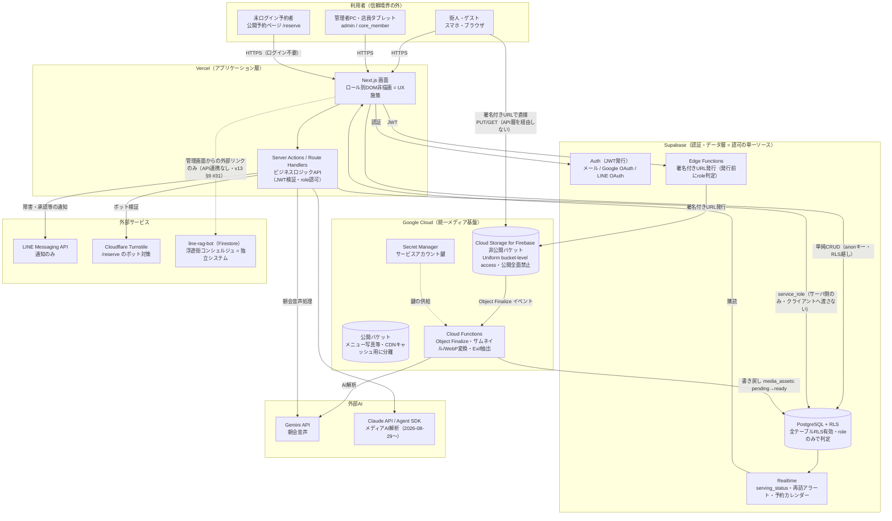
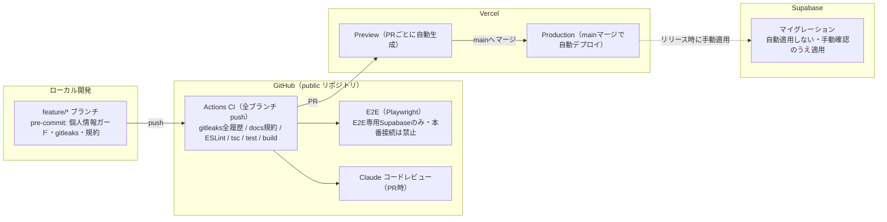
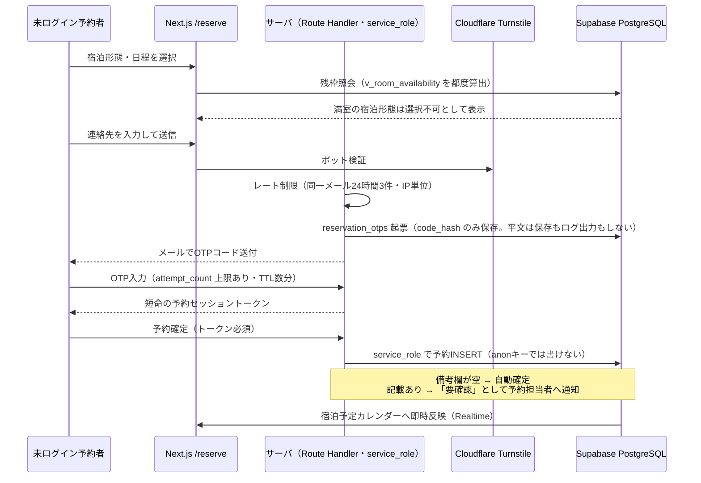
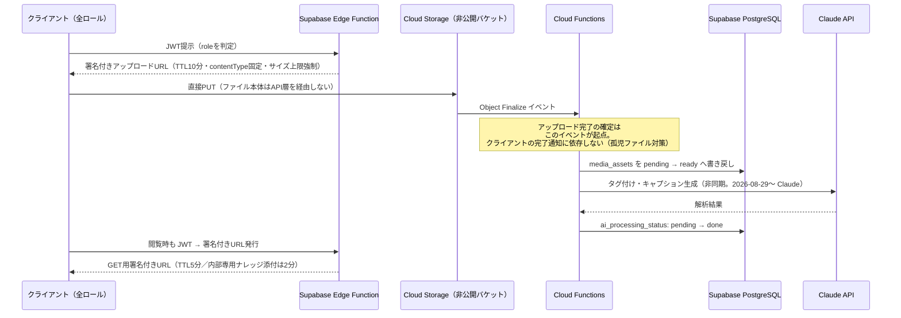
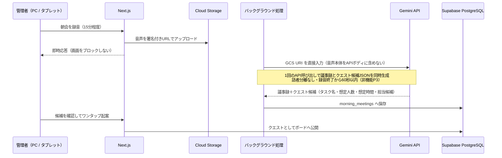
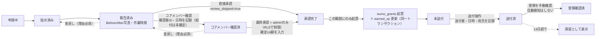
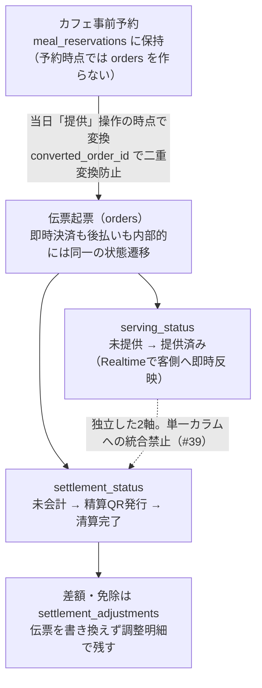
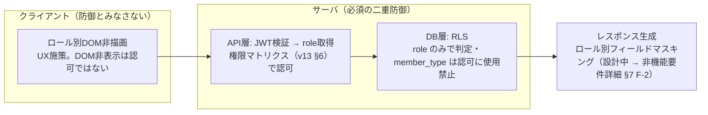

# システムアーキテクチャ

> [[浮遊街アプリ 統合ナレッジベース (Master Index)]] の子ノート（セクション4）

## 設計前提
- 無料枠の制限（Supabaseのプロジェクト数上限やDB容量500MBの壁）を考慮。
- 将来のマルチテナント化（他コミュニティへの展開）を見据えた疎結合設計。

## 技術スタック
| レイヤー | 技術 |
| --- | --- |
| フロントエンド | Next.js（Vercelホスティング）／Tailwind CSS |
| UIモック | Claude Artifactsで最速生成（HTMLモック） |
| バックエンド/DB | Supabase（PostgreSQL, 認証, Realtime, Edge Functions, Row Level Security） |
| **メディアストレージ** | **Cloud Storage for Firebase（GCS）** — 画像・動画・PDF・朝会音声。**Firebase Authentication / Security Rules は使用しない**（下記「ストレージ認可」参照） |
| **メディア後処理** | Cloud Functions for Firebase（サムネイル生成、WebP/MP4変換、Exif抽出、Vision APIタグ付け） |
| AI基盤 | Claude API / Agent SDK（**メディアAI解析を含む**／2026-08-29〜）。朝会音声のみ Gemini API |
| RAG/ベクトル検索 | ~~pgvector（Supabase内）または OpenSearch~~ → **2026-08-16確定：line-rag-bot（Firestore）に統合**。浮遊街アプリ本体は独自のベクトル検索基盤を持たない（v13 §9 #31） |
| API/連携層 | MCP（Model Context Protocol） |
| 通知基盤 | LINE Messaging API |
| 外部連携基盤 | EUMO API（決済・残高基盤）／FEL（将来のデータ連携） |
| 共通スキーマ管理 | Shared Schema Repository（TypeScriptパッケージ／OpenAPIとしてGitHub管理） |

## ★ ストレージ認可の一元化（2026-08-14 決定 ／ 正本 §5.11.2）

**格納は Firebase に一本化し、認可判定は Supabase に一元化する（署名付きURL方式）。**

Firebase Security Rules の `request.auth` は Firebase Authentication を前提とするため、素直に使うと「Supabase Auth と Firebase Auth」という認証・認可の二系統が生まれる。これを避けるため、以下を**設計上の不可侵ルール**とする。

| # | 不可侵ルール | 理由 |
| --- | --- | --- |
| 1 | **Firebase Authentication を導入しない** | ユーザー識別子とロールの所在を Supabase 1箇所に保つ |
| 2 | **Firebase Security Rules に認可ロジックを書かない** | ルールは「全拒否」のみとし、判定ロジックの二重管理を発生させない |
| 3 | **GCSバケットは公開アクセス全面禁止**（Uniform bucket-level access） | 署名付きURL以外の経路を物理的に塞ぐ |
| 4 | **ロール判定の実装箇所は Supabase（RLS ＋ Edge Function）のみ** | 単一のソース・オブ・トゥルース |

```text
[クライアント] --①JWT--> [Supabase Edge Function] --署名付きURL(PUT/10分)-->
[クライアント] --②直接PUT--> [Cloud Storage] --③Object Finalize--> [Cloud Functions]
                                                    --④書き戻し--> [Supabase: media_assets]
[クライアント] --⑤JWT--> [Edge Function] --⑥署名付きURL(GET/5分)--> [Cloud Storage]
```

- アップロード完了の記録は**クライアントの完了通知ではなく Object Finalize イベント**を起点とする（通信断で「孤児ファイル」が残り課金だけ発生するのを防ぐ）
- 署名付きURLの有効期限：アップロード10分／閲覧5分／**内部専用ナレッジの添付は2分**
- 公開画像（メニュー写真等）にCDNキャッシュを効かせる場合は、**非公開バケットとは別に公開バケットを分離**する
- 朝会音声も本基盤へ統合（Vertex AI が GCS URI を直接入力として扱えるため、処理経路が短くなる）

## インフラ構成図（Phase 1）（2026-08-28 新設）

> 本節は D層（設計）の正式なインフラ構成図である。オンボーディング資料の概要図（システム構成図・簡易処理フロー）の詳細版にあたり、食い違う場合は正本 v13 と本節を優先する。出典: 本書技術スタック表・v13 §5.11.2・§9 #31・`CLAUDE.md` §6。

### 全体構成図（信頼境界つき）



**この図から読み取ってほしい4点**

| # | ポイント | 根拠 |
| --- | --- | --- |
| 1 | **認可判定は Supabase 側のみ**。Firebase Authentication / Security Rules は不採用（ルールは全拒否のみ） | 本書「ストレージ認可の一元化」・v13 §5.11.2 |
| 2 | **ファイル本体は API 層を通らない**。アップロードもダウンロードも署名付きURLで GCS と直接やり取りする | v13 §8（アップロード性能） |
| 3 | **line-rag-bot とは API 連携が存在しない**。結合点は管理画面からの外部リンクのみ | v13 §9 #31・外部連携設計.md §2 |
| 4 | **未ログイン予約者（/reserve）の書き込みは必ずサーバ（service_role）経由**。anon キーに公開テーブルの INSERT 権限を与えない | API設計.md §2-2b |

### 環境・デプロイ構成図



- 環境変数のキー名は `.env.example` が正（キー名と説明のみを列挙。実値は Vercel / GitHub Secrets に置く）
- dev / staging / prod の環境分離は WBS 1-1（Supabase プロジェクト作成・環境構築）のスコープ
- CI・フックの詳細は `CLAUDE.md` §6 を正とする

### コンポーネント責務表

| コンポーネント | 入力 | 出力 | 認可の持ち場 |
| --- | --- | --- | --- |
| Next.js 画面（Vercel） | ブラウザ HTTPS | Supabase（anon＋RLS）・Route Handlers | DOM非描画（**UXのみ。認可ではない** = v13 §5.9.3） |
| Server Actions / Route Handlers | JWT付きリクエスト・公開フォーム | Supabase（service_role）・Turnstile・Gemini/Claude・LINE通知 | JWT検証＋role認可（RLSと**二重に**効かせる） |
| Supabase Auth | メール / Google / LINE OAuth | JWT | 認証の単一ソース |
| PostgreSQL＋RLS | anon / service_role 接続 | Realtimeへの変更イベント | 行レベル認可の単一ソース（`role` のみで判定） |
| Supabase Realtime | DB変更イベント | 購読クライアントへの配信 | RLS準拠の購読制御（脅威分析 F-3 → [[非機能要件詳細]] §7） |
| Supabase Edge Functions | JWT | 署名付きURL | 発行前の role 判定（ストレージ認可の唯一の実装箇所） |
| Cloud Storage for Firebase | 署名付きURLの PUT/GET | Object Finalize イベント | **認可を持たない**（Security Rules は全拒否のみ） |
| Cloud Functions | Object Finalize・スケジュール起動 | media_assets 書き戻し・**Claude呼び出し（メディアAI解析／2026-08-29変更）** | サービスアカウント（鍵は Secret Manager 管理） |
| Gemini / Claude API | サーバ側からのみ呼び出し | 生成結果 | APIキー（環境変数・クライアントへ出さない） |
| LINE Messaging API | サーバ側からのみ呼び出し | 利用者・管理者への push 通知 | チャネルトークン（環境変数） |

## バックエンドの処理方式とデータフロー（Phase 1）（2026-08-28 新設）

> これまで DB物理設計・API設計・非機能要件詳細の3文書に分散していた「データの流れ」を、横断ビューとして1箇所に図解する。**個別の仕様（カラム定義・エンドポイント定義・SLA値）は各詳細設計が正**であり、本節と食い違う場合は詳細設計側を修正せず本節を直す。

### 処理方式の原則（既存決定の集約）

| # | 原則 | 内容 | 出典 |
| --- | --- | --- | --- |
| 1 | CRUDとロジックの分担 | 一覧・詳細等の単純CRUDは Supabase クライアントから RLS 越しに直接アクセスし、独自APIを作らない。承認処理・QR発行・ロール昇格等のビジネスロジックのみ専用エンドポイント | API設計.md §1 |
| 2 | 書き込み経路は3種のみ | ①ログイン済みクライアント→RLS直 ②サーバ（service_role。**公開エンドポイントは必ずこれ**） ③Cloud Functions の書き戻し | API設計.md §2-2b・v13 §5.11.2 |
| 3 | 集計値を直接更新しない | `stay_tickets`・`uii_balance` 等はトリガーで再計算（アプリからの直接UPDATE禁止）。残枠は `v_room_availability` ビューで都度算出 | v13 §9 #25・#37 |
| 4 | 状態は「事実の記録」で表す | 送付と受領の分離、提供と会計の独立2軸、取引明細主義・物理削除の原則禁止 | v13 §9 #35・#39、DB物理設計.md §1 |
| 5 | 重い処理は画面応答をブロックしない | 朝会音声・メディアAI解析はバックグラウンド処理（`ai_processing_status` 等で進捗管理） | 非機能要件詳細.md P3・API設計.md §2-10 |
| 6 | Realtime の使用箇所は限定列挙 | `serving_status`（客側反映）・再訪アラート（**管理者・コアメンバー画面のみ**）・宿泊予定カレンダー | v13 §5.4・§5.8.4・§5.2.3 |

### フロー1: 公開予約 `/reserve`（未認証→OTP→予約確定）



出典: v13 §5.2.3・§9 #46、API設計.md §2-2b

### フロー2: メディアアップロード（署名付きURL→Object Finalize→AI解析）



出典: v13 §5.11.2・§5.11.5・§9 #56、API設計.md §2-10、DB物理設計.md §3-7

> [!note] メディアAI解析のエンジンは Gemini → **Claude** へ変更（2026-08-29 オーナー決定）
> **Gemini は朝会音声（フロー3）に残す**。ここでの Claude の役割は
> **用途タグの適合度スコア算出とキャプション案の生成**（Phase 2／DB物理設計.md §3-7）。
> サムネイル生成・WebP変換・Exif抽出は従来どおり Cloud Functions 側の非AI処理。
> ⚠️ **写真からのAI判定（収穫可否・設備点検・献立提案）は本フローに含まれない**。
> 2026-08-29 に **LINE（`line-rag-bot`）側での実装（A案）へ確定**した（v13 §9 #56）。

### フロー3: 朝会音声→議事録→クエスト起案（60秒SLA）



出典: v13 §5.1、API設計.md §2-3、非機能要件詳細.md §1 P3

### フロー4: クエスト承認二段階→Uii給付（送付と受領の分離）



- 送付（`send`）と受領確認（`confirm-receipt`）を**1本のAPIにまとめない**。統合すると「送ったが届いていない」給付が検出できなくなる（API設計.md §2-4b）

出典: v13 §5.3・§5.3.1・§9 #35、API設計.md §2-4／§2-4b、DB物理設計.md §3-1・§3-8

### フロー5: 注文→会計（提供と会計の独立2軸）



- 金額計算: 単品Uii = `floor(単価×0.8)` → 明細行 → 伝票合算。**Uii価格はマスタに保存せず都度算出**し、マスタ改定は過去伝票を書き換えない（v13 §9 #40）

出典: v13 §5.4・§5.5・§9 #39・#48、DB物理設計.md §3-2・§3-6

### フロー6: 認証・認可の二重防御（リクエストの通り道）



出典: v13 §5.9.3・§2、非機能要件詳細.md §2-1

### 非同期ジョブ一覧と実行基盤（★提案・未確定）

> [!important] 提案（2026-08-28 起票・オーナー承認待ち）
> 各設計書で「非同期」「定期ジョブ」とだけ書かれ、**実行基盤（Edge Function / Cloud Functions / Cloud Scheduler / pg_cron）が未指定**だった。以下の3レーン案を提案し `QUESTIONS.md` へ起票した。**承認までは確定扱いしない。**

| レーン | 対象ジョブ | 提案基盤 | 理由 |
| --- | --- | --- | --- |
| ① GCSイベント起点の重処理 | メディアAI解析・サムネイル生成、朝会音声の議事録生成 | Cloud Functions（Object Finalize 起点） | v13 §5.11.2 の書き戻し経路と同一で部品が増えない。音声もメディアも同じバケットに載る（§5.11 朝会音声統合） |
| ② DB内で完結する掃除 | `reservation_otps` 期限切れ削除、`eumo_grants` 14日滞留フラグ、`settlement_adjustments` 90日滞留フラグ | pg_cron（Supabase 拡張） | 外部リソース不要・SQLのみで完結。DB内の事実だけで判定できる |
| ③ DBとGCSをまたぐ日次バッチ | 孤児ファイル検出・削除（`pending` 24時間超・DB未登録オブジェクト） | Cloud Scheduler → Cloud Functions | 両側の突合が必要でDB内だけでは完結しない。非機能要件詳細.md §2-2 の「Cloud Scheduler 等」想定と整合 |

## MCP Gatewayの役割
- 分離された各テナント（浮遊街・FEL・将来の他コミュニティ）のデータやAIログを、セキュアかつ疎結合にルーティングする中継層。
- データベース接続を直接行わず、MCPを介した連携を前提とすることで、インフラ分離を維持しながら共通ロジック・共通AIエージェントの再利用を可能にする。

## アーキテクチャ制約（開発用AIへの指示ルール）
Claudeにコード生成・設計を依頼する際は以下を`.cursorrules`等に明記する：

```text
【アーキテクチャ制約】
・すべてのドメインロジック（特に場所データやクエスト定義）は、UIやインフラ層から分離すること（クリーンアーキテクチャの徹底）。
・特定コミュニティ（浮遊街）固有のロジックは src/domains/floating_city/ に隔離し、
  汎用的な src/domains/core/ に依存させないこと。

【メタデータ設計とインフラ分離】
・新しいエンティティを作成する際は、ロジックのハードコーディングを避け、JSONやスキーマで制御できる構造にすること。
・FEL連携を見据え、「場所データ（Place/PlaceLog）」を扱う際は、
  共通語彙（Shared Schema）との互換性を維持したスキーマ設計を行うこと。
・インフラは浮遊街とFELで分離するため、データベース接続は直接ではなく、
  MCP（Model Context Protocol）を介した疎結合な連携を前提としたコードを出力すること。
```

## 非機能要件（抜粋・v13/UI_UX整理より）
- **レスポンス時間**: 画面応答3秒以内 / AI回答時間5秒以内
- **同時接続数**: 通常50名 / ピーク・イベント時最大200名（将来1,000名対応）
- **可用性**: 稼働率99.5%以上、RTO 6時間以内、RPO 24時間以内
- **バックアップ**: 日次自動バックアップ、DB保持期間30日
- **監査ログ**: ログイン、クエスト登録/承認、Uii付与、AI対話履歴等を10年以上保存
- **障害監視**: API/DB/AI/バッチ/外部API（EUMO等）連携障害をLINE経由で管理者へ即時通知
- **音声処理**: 朝会音声（15分程度）に対し、録音終了から議事録生成・クエスト抽出完了まで60秒以内
- **メディアストレージのオートスケール**: Blazeプランにより容量追加作業なしで自動拡張。30〜90日経過したオリジナルデータは Nearline / Coldline / Archive へ自動転送。一時ファイルは7日で自動削除
- **コスト制御**: 月額予算アラート（例：5,000円）を設定し、予測消費額の到達時に管理者へ通知
- **アップロード性能**: 署名付きURLによりファイル本体がAPI層を経由しない。50MB程度でもタイムアウト・サーバ負荷を発生させない
- **認可の二重防御**: 画面上の非表示（クライアント）と RLS・API によるサーバサイド認可を**必ず両方**実装する。クライアント側の制御のみに依存した実装を禁止する
- **ナレッジ検索の情報隔離**: `target_role` によるメタデータフィルタをサーバ側で強制し、内部専用ナレッジがゲスト・一般会員のAI回答に混入しないこと。**プロンプト指示による抑制を隔離手段としない**
- **孤児ファイルの防止**: `pending` のまま24時間実体が確認できないレコード、およびDB未登録のオブジェクトを定期ジョブで検出・削除

## セキュリティ・個人情報保護
- 認証：メール認証、Google OAuth、LINE OAuth
- 通信・データ暗号化：TLS 1.2以上、Supabase標準DB暗号化、Vercel暗号化基盤
- 個人情報最小化：ニックネーム登録を推奨
- 退会プロセス：①論理削除 → ②30日後匿名化 → ③必要に応じ物理削除

## 関連ノート
- [[会員データモデル_ユーザーテーブル定義]]
- [[浮遊街アプリ 統合ナレッジベース (Master Index)]]
- [[FEL連携アーキテクチャ]]
- [[ER図_概念データモデル]]
- [[浮遊街アプリ 総合要件定義・設計書_v13]]
- [[非機能要件詳細]]（暗号化・鍵管理／脅威モデリングは同書 §2-7・§7）
