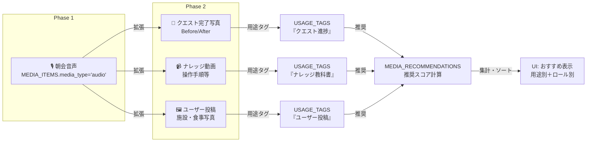

# 浮遊街アプリ データモデル図（ER図）

## 概要

Supabase PostgreSQL 上に構築される浮遊街アプリの論理データモデルです。
主要エンティティ、属性、および関係（リレーション）を可視化します。

**注記**: 詳細なカラム定義・型・制約は [[DB物理設計.md]] を参照。

> [!important] 2026-09-05：個人情報を `MEMBER_PROFILES_PRIVATE` へ分離した（A案）
> オーナー承認により、会員の個人情報（氏名・カナ・住所・出身地・誕生年月）を**会員本体とは別のテーブル**へ
> 分離した。RLS は**行**にしか効かないため、氏名と表示用カラムが同居していると
> 「他人の行を読める」ポリシーを書いた瞬間に氏名・住所まで返ってしまうからである。
> 分離すれば**行単位のRLSだけで保護が完結**する。詳細は [[会員データモデル_ユーザーテーブル定義]] §5.2b、
> ポリシーの実体は [[DB物理設計]] §6。
>
> **`USERS` は物理テーブル `members` に対応する。** 本図の他エンティティが持つ `user_id` は
> 物理的には `members.member_id` である（命名の統一は §「本図と物理設計の不整合」を参照）。

---

## ER図（Mermaid形式）

```mermaid
erDiagram
    USERS {
        uuid id PK "会員ID（物理: members.member_id）"
        uuid auth_user_id UK "auth.users(id)。NULL=アプリ未登録。RLSの本人判定はこの列のみ"
        string legacy_member_no UK "旧会員番号。表示フォールバックに使う"
        string nickname "ニックネーム。NULL可。未設定時に本名へ落とさない"
        string role "ロール (admin/core_member/member/guest/custom)"
        string account_status "アカウント状態 (pre_registered/active/withdrawn)"
        string member_type "立場 (親方/街人コア/街人一般/ゲスト)。認可に使わない"
        integer stay_tickets "集計キャッシュ"
        integer uii_balance "集計キャッシュ(Phase2)"
        integer earned_xp "獲得XP"
        timestamp created_at "作成日時"
        timestamp updated_at "更新日時"
    }

    MEMBER_PROFILES_PRIVATE {
        uuid member_id PK "USERSへの1対1・FK・ON DELETE CASCADE"
        string full_name "氏名【個人情報】"
        string full_name_kana "氏名カナ【個人情報】"
        string birth_ym "誕生年月【個人情報】"
        string address "住所【個人情報・宿泊法】"
        string hometown "出身地【個人情報】"
        timestamp created_at "作成日時"
        timestamp updated_at "更新日時"
    }

    MEMBER_IDENTIFIERS {
        uuid identifier_id PK "識別子ID"
        uuid member_id FK "会員ID"
        string kind "email/phone/line_user_id/discord"
        string value "実値【個人情報】"
        boolean is_verified "本人確認済み。本人には書かせない"
        boolean is_primary "主連絡先か"
    }

    MEMBER_NOTES {
        uuid note_id PK "メモID"
        uuid member_id FK "会員ID"
        text body "運営メモ【個人情報・本人にも見せない】"
        string visibility "core_only / admin_only"
        uuid author_id FK "記入者"
    }

    MEMBERSHIPS {
        uuid id PK "会員権ID"
        uuid user_id FK "ユーザーID"
        date issued_on "発行日"
        date expires_on "有効期限（2027/4/30等）"
        integer stay_tickets_issued "付与宿泊券枚数"
        string status "ステータス (active/expired/withdrawn)"
        timestamp created_at "作成日時"
    }

    ROOMS {
        uuid id PK "部屋ID"
        string room_number "部屋番号"
        string room_type "部屋タイプ (コテージ/ゲストハウス/テント等)"
        integer capacity "収容定員"
        string status "ステータス (available/occupied/maintenance/closed)"
        text notes "備考"
        timestamp created_at "作成日時"
    }

    ROOM_ASSIGNMENTS {
        uuid id PK "部屋割当ID"
        uuid room_id FK "部屋ID"
        uuid user_id FK "ユーザーID"
        uuid booking_id FK "予約ID"
        date check_in_date "チェックイン日"
        date check_out_date "チェックアウト日"
        timestamp assigned_at "割当日時"
        timestamp ended_at "終了日時（部屋移動時等）"
    }

    BOOKINGS {
        uuid id PK "予約ID"
        uuid user_id FK "ユーザーID"
        string guest_type "ゲスト種別 (会員/ゲスト)"
        integer adults_count "大人人数"
        integer children_count "子供人数"
        date check_in_date "チェックイン日"
        date check_out_date "チェックアウト日"
        string accommodation_type "宿泊場所タイプ"
        string status "ステータス (confirmed/pending/cancelled)"
        timestamp cancelled_at "キャンセル日時"
        string cancel_reason "キャンセル理由"
        text notes "備考"
        timestamp created_at "作成日時"
    }

    STAY_TICKETS {
        uuid id PK "宿泊チケットID"
        uuid user_id FK "ユーザーID"
        uuid membership_id FK "会員権ID"
        integer quantity "枚数"
        integer remaining_quantity "残枚数"
        string status "ステータス (active/used/expired)"
        date issued_on "発行日"
        date expires_on "有効期限"
        timestamp created_at "作成日時"
    }

    STAY_TICKET_TRANSACTIONS {
        uuid id PK "チケット取引ID"
        uuid stay_ticket_id FK "チケットID"
        uuid user_id FK "ユーザーID"
        uuid booking_id FK "予約ID"
        string transaction_type "取引種別 (issue/consume/refund/adjust)"
        integer quantity "数量"
        string reason "理由"
        timestamp occurred_at "発生日時"
    }

    QUESTS {
        uuid id PK "クエストID"
        string title "タイトル"
        text description "説明"
        string category "カテゴリ"
        string difficulty "難易度"
        integer reward_uii "報酬Uii額"
        integer required_people "募集人数"
        string execution_mode "実行形態 (onsite/remote/hybrid)"
        boolean guest_allowed "ゲスト開放フラグ"
        string required_certification "必須資格"
        string status "ステータス (draft/published/completed/archived)"
        timestamp created_at "作成日時"
        timestamp updated_at "更新日時"
    }

    QUEST_APPLICATIONS {
        uuid id PK "クエスト申請ID"
        uuid quest_id FK "クエストID"
        uuid user_id FK "ユーザーID"
        string status "ステータス (pending/approved/rejected/withdrawn)"
        text reason "理由/コメント"
        timestamp applied_at "申請日時"
        timestamp decided_at "決定日時"
    }

    QUEST_COMPLETIONS {
        uuid id PK "完了報告ID"
        uuid quest_application_id FK "クエスト申請ID"
        uuid user_id FK "ユーザーID"
        timestamp started_at "開始日時"
        timestamp ended_at "終了日時"
        integer duration_minutes "作業時間（分）"
        string before_photo_url "Before写真URL"
        string after_photo_url "After写真URL"
        string status "ステータス ★二段階承認 (報告済み/コアメンバー確認済/承認完了/差戻し)"
        uuid reviewed_by FK "コアメンバー確認者ID ★承認者とは別カラム"
        timestamp reviewed_at "コアメンバー確認日時"
        boolean review_skipped "管理者が確認を飛ばして直接承認したか"
        uuid approved_by FK "最終承認者ID（adminのみ）"
        timestamp approved_at "最終承認日時"
        uuid rejected_by FK "差戻し実施者ID"
        text rejection_reason "差戻し理由（差戻し時は必須）"
        text notes "備考"
        timestamp submitted_at "提出日時"
    }

    WORK_LOG_REVIEWS {
        uuid id PK "確認ログID"
        uuid quest_completion_id FK "完了報告ID"
        uuid reviewer_id FK "確認者ID"
        timestamp reviewed_at "確認日時"
        text comment "コメント"
    }

    EUMO_GRANTS {
        uuid id PK "給付ID"
        uuid user_id FK "対象会員ID"
        uuid quest_id FK "対象クエストID"
        uuid quest_completion_id FK "起票元の完了報告ID"
        integer amount_uii "確定Uii額"
        string status "★送付と受領は別状態 (未送付/送付済/受領確認済/送付失敗)"
        string eumo_url "Eumo送付用URL"
        string sent_to "送付先（メール／LINE）"
        string sent_channel "送付経路 (email/line/in_person)"
        uuid sent_by FK "送付者ID"
        timestamp sent_at "送付日時"
        uuid received_confirmed_by FK "受領確認者ID（Phase1は手動確認）"
        timestamp received_confirmed_at "受領確認日時"
        text failure_reason "送付失敗理由"
    }

    MENU_ITEMS {
        uuid id PK "メニューID"
        string name "商品名"
        string category "カテゴリ（フード／ドリンク／直売所）"
        decimal unit_price_jpy "単価（円）★Uii価格は保存せず都度算出"
        text description "説明文"
        uuid image_media_id FK "商品画像メディアID"
        integer display_order "表示順"
        boolean is_sold_out "SOLDOUTフラグ"
        boolean is_published "公開フラグ（物理削除しない）"
        date available_from "有効期間開始"
        date available_until "有効期間終了"
    }

    ACCOMMODATION_RATES {
        uuid id PK "料金ID"
        string room_type "宿泊形態（6種）"
        string member_category "会員区分 (member/non_member)"
        decimal price_per_night_jpy "1泊あたり単価（円）"
        date effective_from "適用開始日 ★改定は期間を区切って追加"
        date effective_until "適用終了日（NULL＝現行）"
        text note "備考"
    }

    ORDERS {
        uuid id PK "伝票ID"
        string receipt_number UK "伝票番号"
        uuid user_id FK "ユーザーID"
        uuid ordered_by_user_id FK "注文者ID（代理の場合）"
        decimal total_amount_jpy "合計金額（円）"
        integer total_amount_uii "合計金額（Uii）"
        string payment_status "決済ステータス (unpaid/paid/cancelled)"
        string serving_status "提供ステータス (未提供/提供済み) ★決済と独立した2軸"
        timestamp served_at "提供日時"
        uuid served_by FK "提供操作者ID"
        string order_type "注文種別 (self/proxy)"
        string order_source "注文元 (cafe/shop/other)"
        timestamp ordered_at "注文日時"
        timestamp cancelled_at "キャンセル日時"
        string cancel_reason "キャンセル理由"
        timestamp created_at "作成日時"
        timestamp updated_at "更新日時"
    }

    ORDER_ITEMS {
        uuid id PK "明細ID"
        uuid order_id FK "伝票ID"
        uuid product_id FK "商品ID"
        string product_name "商品名"
        integer quantity "数量"
        decimal unit_price_jpy "単価（円）"
        integer unit_price_uii "単価（Uii）"
        decimal line_total_jpy "行合計（円）"
        integer line_total_uii "行合計（Uii）"
        timestamp created_at "作成日時"
    }

    SETTLEMENT_ADJUSTMENTS {
        uuid id PK "差額調整ID"
        uuid order_id FK "伝票ID"
        uuid user_id FK "ユーザーID"
        string adjustment_type "調整種別 (surcharge/refund)"
        decimal amount_jpy "金額（円）"
        integer amount_uii "金額（Uii）"
        string reason "理由"
        string status "ステータス (pending/settled/waived)"
        date original_settlement_date "元々の精算日"
        timestamp created_at "作成日時"
        timestamp settled_at "精算日時"
    }

    AUDIT_LOGS {
        uuid id PK "ログID"
        uuid user_id FK "実施者ID"
        string entity_type "対象エンティティ種別 (order/booking/quest/member等)"
        uuid entity_id "対象エンティティID"
        string action "操作 (create/update/delete/approve/review)"
        text changes "変更内容（JSON）"
        text reason "実施理由"
        string ip_address "IPアドレス"
        timestamp occurred_at "発生日時"
    }

    KNOWLEDGE_ITEMS {
        uuid id PK "ナレッジID"
        uuid created_by_user_id FK "作成者ID"
        string title "タイトル"
        text content "本文"
        string category_id "カテゴリ"
        string target_role "対象者 (guest/member/core_member/admin)"
        string type "種別 (faq/manual/recipe/procedure)"
        string[] keywords "キーワード配列"
        string[] usage_scenes "使用場面配列"
        string status "ステータス (draft/published/archived)"
        timestamp created_at "作成日時"
        timestamp updated_at "更新日時"
    }

    MORNING_SESSIONS {
        uuid id PK "朝会セッションID"
        timestamp session_date "朝会実施日"
        uuid audio_media_id FK "音声ファイルメディアID"
        string transcript "文字起こし"
        text meeting_minutes "議事録サマリー"
        string[] quest_suggestions "クエスト候補JSON配列"
        string status "ステータス (recorded/transcribed/reviewed/published)"
        timestamp created_at "作成日時"
    }

    MEDIA_ITEMS {
        uuid id PK "メディアID"
        uuid uploaded_by_user_id FK "アップロード者ID"
        string gcs_uri "GCS上のURI"
        string media_type "メディア種別 (image/video/audio/pdf)"
        string file_name "ファイル名"
        integer file_size_bytes "ファイルサイズ（バイト）"
        string mime_type "MIMEタイプ (image/jpeg等)"
        string caption "キャプション・説明文"
        string[] usage_tags "用途タグ配列"
        string source_entity_type "参照元エンティティ種別"
        uuid source_entity_id "参照元エンティティID"
        json metadata "カスタムメタデータJSON"
        string status "ステータス (draft/published/archived)"
        integer view_count "閲覧数（集計用）"
        timestamp created_at "作成日時"
        timestamp updated_at "更新日時"
    }

    MEDIA_CATEGORIES {
        uuid id PK "カテゴリID"
        string category_name "カテゴリ名"
        text description "説明"
        integer display_order "表示順序"
        string icon_emoji "アイコン絵文字"
        timestamp created_at "作成日時"
    }

    USAGE_TAGS {
        uuid id PK "用途タグID"
        string tag_name "タグ名"
        string tag_color "タグカラー (hex)"
        string media_type_filter "対象メディア種別"
        integer usage_frequency "使用頻度（集計用）"
        timestamp created_at "作成日時"
    }

    MEDIA_COLLECTIONS {
        uuid id PK "コレクションID"
        uuid created_by_user_id FK "作成者ID"
        string collection_name "コレクション名（ユーザーが命名）"
        text description "コレクションの説明"
        uuid[] media_ids "含まれるメディアID配列"
        string status "ステータス (draft/published/shared)"
        timestamp created_at "作成日時"
        timestamp updated_at "更新日時"
    }

    MEDIA_RECOMMENDATIONS {
        uuid id PK "推奨ID"
        uuid media_id FK "メディアID"
        string usage_scene "推奨シーン（朝会/クエスト/ナレッジ等）"
        integer recommendation_score "推奨スコア（0-100）"
        string reason "推奨理由"
        string[] recommended_for_roles "推奨対象ロール配列"
        timestamp created_at "作成日時"
        timestamp updated_at "更新日時"
    }

    MEDIA_LIKES {
        uuid id PK "いいねID"
        uuid media_id FK "メディアID"
        uuid user_id FK "ユーザーID"
        timestamp liked_at "いいね日時"
    }

    XP_HISTORY {
        uuid id PK "XP履歴ID"
        uuid user_id FK "ユーザーID"
        integer xp_earned "獲得XP"
        string source "源泉 (quest_completion/social_action等)"
        uuid source_id "源泉エンティティID"
        timestamp earned_at "獲得日時"
    }

    BADGES {
        uuid id PK "バッジID"
        uuid user_id FK "ユーザーID"
        string badge_type "バッジ種別 (contributor/helper/expert等)"
        text description "説明"
        timestamp awarded_at "授与日時"
    }

    %% リレーション定義
    USERS ||--|| MEMBER_PROFILES_PRIVATE : "個人情報(1対1)"
    USERS ||--o{ MEMBER_IDENTIFIERS : "識別子"
    USERS ||--o{ MEMBER_NOTES : "運営メモ"
    USERS ||--o{ MEMBERSHIPS : has
    USERS ||--o{ ROOM_ASSIGNMENTS : "stays_in"
    USERS ||--o{ BOOKINGS : "makes"
    USERS ||--o{ STAY_TICKETS : "receives"
    USERS ||--o{ QUEST_APPLICATIONS : "applies_for"
    USERS ||--o{ QUEST_COMPLETIONS : "completes"
    USERS ||--o{ ORDERS : "places"
    USERS ||--o{ SETTLEMENT_ADJUSTMENTS : "has"
    USERS ||--o{ AUDIT_LOGS : "performs"
    USERS ||--o{ KNOWLEDGE_ITEMS : "creates"
    USERS ||--o{ XP_HISTORY : "earns"
    USERS ||--o{ BADGES : "receives"
    USERS ||--o{ MEDIA_ITEMS : "uploads"
    USERS ||--o{ MEDIA_COLLECTIONS : "creates"
    USERS ||--o{ MEDIA_LIKES : "likes"

    MEMBERSHIPS ||--o{ STAY_TICKETS : "issues"

    ROOMS ||--o{ ROOM_ASSIGNMENTS : "accommodates"

    BOOKINGS ||--o{ ROOM_ASSIGNMENTS : "allocates_to"
    BOOKINGS ||--o{ STAY_TICKET_TRANSACTIONS : "consumes"

    STAY_TICKETS ||--o{ STAY_TICKET_TRANSACTIONS : "tracks"

    QUESTS ||--o{ QUEST_APPLICATIONS : "has"
    QUEST_APPLICATIONS ||--o{ QUEST_COMPLETIONS : "leads_to"
    QUEST_COMPLETIONS ||--o{ WORK_LOG_REVIEWS : "reviewed_by_multiple"
    QUEST_COMPLETIONS ||--o| EUMO_GRANTS : "grants_on_final_approval"
    USERS ||--o{ EUMO_GRANTS : "receives"

    ORDERS ||--o{ ORDER_ITEMS : "contains"
    ORDERS ||--o{ SETTLEMENT_ADJUSTMENTS : "generates"
    MENU_ITEMS ||--o{ ORDER_ITEMS : "priced_at_order_time"

    ACCOMMODATION_RATES ||--o{ BOOKINGS : "priced_by_effective_period"

    MORNING_SESSIONS ||--o{ QUESTS : "suggests"
    MORNING_SESSIONS ||--o{ MEDIA_ITEMS : "includes_audio"

    MEDIA_ITEMS ||--o{ MEDIA_RECOMMENDATIONS : "has"
    MEDIA_ITEMS ||--o{ MEDIA_LIKES : "receives"
    MEDIA_ITEMS }o--|| USAGE_TAGS : "tagged_with"

    MEDIA_COLLECTIONS ||--o{ MEDIA_ITEMS : "contains"

```



---

## エンティティ説明

### 👤 認証・プロフィール関連

#### **USERS** - 会員マスタ（物理名 `members`）
- **主キー**: `id` (UUID。物理では `member_id`)
- **一意キー**: `auth_user_id`（`auth.users(id)`）、`legacy_member_no`
- **★2026-09-05：個人情報カラムを持たない。** 氏名・カナ・住所・出身地・誕生年月は `MEMBER_PROFILES_PRIVATE` へ、
  メール・電話は `MEMBER_IDENTIFIERS` へ、運営メモは `MEMBER_NOTES` へ分離済み
- `auth_user_id`: Supabase Auth との結合キー。**`NULL` = アプリ未登録**（移行370名の初期状態）。
  **RLS の本人判定はこの列のみを根拠にする**。一般会員に UPDATE 権限を与えてはならない
- `role`: 権限レベル (`admin` / `core_member` / `member` / `guest` / `custom`)。**認可の唯一の根拠**
- `member_type`: 立場 (`親方` / `街人コア` / `街人一般` / `ゲスト`)。**認可には一切使用しない**（立場であり権限ではない）。
  画面表示・バッジ・再訪アラート等に用いる
- `account_status`: ライフサイクル (`pre_registered` → `active` → `withdrawn`)
- ⚠️ **個人情報は無いが、残高・XP を含むため他者へは公開しない。** 他者向け表示は `v_member_public`
  ビュー（`member_id` / `display_name` / `member_type` の3列のみ）を経由する（[[DB物理設計]] §6-4）

#### **MEMBER_PROFILES_PRIVATE** - 個人情報（★2026-09-05 新設）
- **主キー兼外部キー**: `member_id` → `USERS`（**1対1**・`ON DELETE CASCADE`）
- 個人情報を集約：氏名・カナ・誕生年月・住所・出身地
- 旅館業法対応（住所は必須項目）
- **アクセス規則**: 本人（自分の行のみ）＋ `admin` / `core_member`（全行）。それ以外には**1行も返さない**
- 名寄せキー：連絡先がない場合の第2キー `full_name_kana` + `birth_ym`（正本 §5.8.3）。
  **ユニークにはしない**（同姓同名・同誕生年月は実在しうるため、一致は「候補」でしかない）
- ⚠️ **`USERS` へ戻してはならない。** 戻すと列単位マスキングが再び必要になる

#### **MEMBER_IDENTIFIERS** - 識別子（名寄せの中核）
- **外部キー**: `member_id` → `USERS`
- `kind`: `email` / `phone` / `line_user_id` / `discord`、`value`: 正規化後の実値【個人情報】
- 検証済みのみ `(kind, value)` が一意（部分ユニーク `WHERE is_verified = true`）。未検証の重複は許容
- **`MEMBER_PROFILES_PRIVATE` と同一の保護区分**として扱う
- ⚠️ `is_verified` を本人に書かせない（他人のメールを検証済みとして登録できてしまう）

#### **MEMBER_NOTES** - 運営メモ
- **外部キー**: `member_id` → `USERS`、`author_id` → `USERS`
- `visibility`: `core_only` / `admin_only`
- **アクセス規則**: `admin` / `core_member` のみ。**本人にも見せない**（運営が本人について書いた申し送りのため）
- ⚠️ 旧図では `MEMBER_TYPES.notes` として描かれていたが、**正は独立テーブル `member_notes`**
  （[[会員データモデル_ユーザーテーブル定義]] §5.7 で 2026-09-05 に決着）

---

### 🎫 会員権・宿泊チケット関連

#### **MEMBERSHIPS** - 会員権
- **外部キー**: `user_id` → `USERS`
- 会員権の有効期限を管理。最初の満了は 2027/4/30
- `issued_on` / `expires_on`: 発行日・有効期限
- `stay_tickets_issued`: 付与宿泊券枚数（新規会員は4枚）
- **Phase 2 以降**: 失効処理・一斉満了バッチはこのテーブルをキー

#### **STAY_TICKETS** - 宿泊チケット（宿泊券マスタ）
- **外部キー**: `user_id` → `USERS` / `membership_id` → `MEMBERSHIPS`
- 宿泊券（枚数管理）
- `quantity`: 当初枚数（例：4枚）
- `remaining_quantity`: 現在の残枚数
- `status`: `active` / `used` / `expired`

#### **STAY_TICKET_TRANSACTIONS** - 宿泊チケット取引
- **外部キー**: `stay_ticket_id` → `STAY_TICKETS` / `user_id` → `USERS` / `booking_id` → `BOOKINGS`
- 宿泊チケットの消費履歴を記録
- `transaction_type`: `issue`（発行） / `consume`（消費） / `refund`（返却） / `adjust`（調整）
- **重要**: 消費はチェックアウト時に発生（§5.8.5）

---

### 🏠 宿泊・部屋関連

#### **ROOMS** - 部屋台帳
- **主キー**: `id` (UUID)
- 物理的な部屋またはベッド枠をマスタ化
- `room_type`: `コテージ` / `ゲストハウス` / `アースバッグ` / `テント` / `車中泊` / `サロン` 等（運用上は6種）
- `capacity`: 1部屋 = 1収容枠とは限らない
- `status`: `available` / `occupied` / `maintenance` / `closed`
- `place_id`（任意）: FEL の `Place`（畑・建物等）に紐づけ可能

#### **BOOKINGS** - 宿泊予約
- **外部キー**: `user_id` → `USERS`
- 宿泊予約を記録。Googleフォームから自動反映（イベント駆動）
- `status`: `confirmed` / `pending` / `cancelled`
- 備考欄が空の場合はシステムが自動確定（TO-BE §5.2.3）
- キャンセル・ノーショーは論理削除（`cancelled_at` + `cancel_reason`）
- **重要**: ノーショーでも宿泊券は消費されない（チェックイン前キャンセルは券返却不要）

#### **ROOM_ASSIGNMENTS** - 部屋割当
- **外部キー**: `room_id` → `ROOMS` / `user_id` → `USERS` / `booking_id` → `BOOKINGS`
- 「誰がどの部屋に何日から何日まで泊まったか」を記録
- 部屋移動：既存割当を終了（`ended_at` 設定）→ 新規割当追加
- **履歴として残す**（物理上書きなし）

---

### 📋 クエスト関連

#### **QUESTS** - クエスト
- **主キー**: `id` (UUID)
- `title` / `description`: 作業内容
- `category`: 作業カテゴリ（営農、施設整備等。業務カテゴリ体系準拠）
- `difficulty`: 難易度
- `reward_uii`: 報酬Uii額（承認時に確定）
- `required_people`: 募集人数
- `execution_mode`: `onsite` / `remote` / `hybrid`（遠隔クエストは独立カテゴリではなくフィルタ）
- `guest_allowed`: ゲスト開放フラグ（`guest_allowed` のみで判定。カテゴリから自動導出しない）
- `required_certification`: 必須資格（ユンボ・チェーンソー・食品衛生等）
- `status`: `draft` / `published` / `completed` / `archived`

#### **QUEST_APPLICATIONS** - クエスト受注申請
- **外部キー**: `quest_id` → `QUESTS` / `user_id` → `USERS`
- 会員がクエストへ「参加申請」を行うと作成
- `status`: `pending` / `approved` / `rejected` / `withdrawn`
- 承認は運営による業務指示と同時（マッチング成立）

#### **QUEST_COMPLETIONS** - クエスト完了報告
- **外部キー**: `quest_application_id` → `QUEST_APPLICATIONS` / `user_id` → `USERS`
- Before/After写真は **必須**
- `duration_minutes`: 実施時間
- `status`: `submitted` / `approved` / `rejected`
- 日次（1日おき）承認サイクルで判定

---

### 🛒 注文・会計関連

#### **ORDERS** - 伝票
- **主キー**: `id` (UUID)
- **一意キー**: `receipt_number`
- `user_id`: 実際の利用者
- `ordered_by_user_id`: 代理注文の場合の店員ユーザーID
- 金額は **円 ＋ Uii** で併記
- `payment_status`: `unpaid` / `paid` / `cancelled`
- **会計済み伝票も遡及修正可**（差額を `SETTLEMENT_ADJUSTMENTS` に記録）
- キャンセル：論理削除（`cancelled_at` + `cancel_reason`）

#### **ORDER_ITEMS** - 注文明細
- **外部キー**: `order_id` → `ORDERS` / `product_id` → 商品マスタ（別テーブル）
- `unit_price_uii` = `floor(unit_price_jpy × 0.8)`（単品ごとの丸め）
- `line_total_uii` = `unit_price_uii × quantity`
- 伝票Uii ≠ 伝票円 × 0.8（単品を足した方が正確）

#### **SETTLEMENT_ADJUSTMENTS** - 精算調整（差額管理）
- **外部キー**: `order_id` → `ORDERS` / `user_id` → `USERS`
- 遡及修正で生じた差額を記録（§5.6.5, §5.6.6）
- `adjustment_type`: `surcharge`（追加請求） / `refund`（返金）
- `status`: `pending` → `settled` / `waived`
- **次回繰越が基本**: 差額は未処理のまま保持し、再訪時に現地精算
- 90日滞留フラグは運営が任意タイミングで対応

---

### 📚 ナレッジ・朝会関連

#### **KNOWLEDGE_ITEMS** - ナレッジ
- **外部キー**: `created_by_user_id` → `USERS`
- **注記**: 浮遊街アプリ本体では登録UI制御のみ。本体の格納は **line-rag-bot（Firestore）** に統合（2026-08-16決定 §9 #31）
- `target_role`: `guest` / `member` / `core_member` / `admin`（4値単一値。アクセス制御キー）
- `type`: `faq` / `manual` / `recipe` / `procedure`
- `keywords[]` / `usage_scenes[]`: RAG検索キー

#### **MORNING_SESSIONS** - 朝会セッション
- **主キー**: `id` (UUID)
- 朝会の音声録音・議事録・クエスト自動抽出の履歴
- `audio_file_url`: Cloud Storage for Firebase 上の音声URI
- `quest_suggestions[]`: 自動抽出されたクエスト候補JSON配列
- `status`: `recorded` → `transcribed` → `reviewed` → `published`

---

### 📸 メディアストレージ・推奨表示関連（Phase 2 本格運用 ／ Phase 1 朝会音声から開始）

#### **MEDIA_ITEMS** - メディアアセット
- **主キー**: `id` (UUID)
- **外部キー**: `uploaded_by_user_id` → `USERS` / `source_entity_id` で参照元エンティティ（QUEST_COMPLETIONS等）を特定
- **格納先**: Cloud Storage for Firebase（GCS）。DB には URI とメタデータのみ保持
- `gcs_uri`: `gs://bucket-name/users/{user_id}/media/{media_id}/{file_name}` の形式
- `media_type`: `image` / `video` / `audio` / `pdf`（朝会音声は `audio`）
- `caption`: **ユーザーが入力するキャプション**（何をしている写真か、クエストの進捗説明等）
- `usage_tags[]`: 用途タグ配列（後述 `USAGE_TAGS` を複数選択可）
- `metadata` (JSON): 撮影日時、解像度、動画duration、EXIF情報等
- `status`: `draft`（下書き） / `published`（公開） / `archived`（アーカイブ）
- `view_count`: 閲覧数（集計キャッシュ。おすすめ表示の優先度算出に使用）

**用途例**:
- Before/After写真（クエスト完了報告）→ `source_entity_type = quest_completion`
- 朝会音声 → `source_entity_type = morning_session`
- ナレッジ添付画像 → `source_entity_type = knowledge_item`

#### **USAGE_TAGS** - 用途タグマスタ
- **主キー**: `id` (UUID)
- システム側で定義する用途タグの種別
- `tag_name`: タグ名（例：「クエスト進捗」「Before/After」「朝会スライド」「トラブル事例」等）
- `tag_color`: UI表示時の色（hex形式：`#FF6B6B`等）
- `media_type_filter`: 対象メディア種別制限（`image` / `video` / `audio` / `*全て*`）
- `usage_frequency`: 統計情報（最も使用されたタグを「おすすめ」として上位表示）

**標準タグ例**:
```
- 「クエスト進捗」（image/video） → Before/After写真に自動付与
- 「施設案内」（image/video） → ナレッジの施設画像に使用
- 「朝会記録」（audio/video） → 朝会音声・スクリーンショット
- 「トラブル対応」（image/video） → 現場トラブルの再現事例
- 「ユーザー投稿」（image/video） → 会員が投稿した体験写真
```

#### **MEDIA_COLLECTIONS** - ユーザーが作成するメディア集合
- **外部キー**: `created_by_user_id` → `USERS`
- ユーザーが複数のメディアをグループ化（例：「〇〇さんのクエスト完了履歴」「まかないレシピ画像集」）
- `media_ids[]`: 含まれるメディアID の配列
- `status`: `draft` / `published`（公開可能） / `shared`（特定ユーザーと共有）
- 共有権限は `USERS` の `role` と `share_with_user_ids[]` で管理（簡易版。Phase 2 以降で細粒度化）

#### **MEDIA_RECOMMENDATIONS** - メディア推奨ロジック
- **外部キー**: `media_id` → `MEDIA_ITEMS`
- 「このメディアは、このシーンで・このロール向けに推奨」という情報を記録
- `usage_scene`: `朝会` / `クエスト実行` / `ナレッジ参照` / `施設案内` 等
- `recommendation_score`: 推奨度（0〜100）。アルゴリズムまたは運営手動で算出
- `recommended_for_roles`: 対象ロール配列（`['guest', 'member']` など）
- **AI/アルゴリズムの候補**：
  - 同一 `usage_tags` を持つメディアの中で `view_count` が高いもの
  - 最新のメディア（撮影日時が直近のもの）
  - `MEDIA_LIKES` の高いもの（ユーザー評価）

#### **MEDIA_LIKES** - メディアへのいいね
- **外部キー**: `media_id` → `MEDIA_ITEMS` / `user_id` → `USERS`
- ユーザーがメディアに「参考になった」「いいね」を付ける機構
- `liked_at`: いいね日時（時系列で集計）
- 推奨度算出の入力信号として機能

---

### ⭐ ゲーミフィケーション関連

#### **XP_HISTORY** - XP履歴
- **外部キー**: `user_id` → `USERS`
- 獲得XP の実績記録
- `source`: `quest_completion` / `social_action` 等
- `source_id`: 源泉エンティティID（クエスト完了ID等）

#### **BADGES** - バッジ
- **外部キー**: `user_id` → `USERS`
- 貢献バッジ（ボランティア活動等による表彰）
- `badge_type`: `contributor` / `helper` / `expert` 等
- `awarded_at`: 授与日時

---

### 🔐 監査関連

#### **AUDIT_LOGS** - 監査ログ
- **外部キー**: `user_id` → `USERS`（実施者）
- **全操作の追跡**
- `entity_type` / `entity_id`: 対象エンティティ
- `action`: `create` / `update` / `delete` / `approve` / `review` 等
- `changes`: 変更内容（JSON形式）
- `reason`: 実施理由（編集理由必須 §5.6.4）
- 会計済み伝票の遡及修正は警告レベル（§5.6.5）で記録

---

## 本図と物理設計の不整合（2026-09-05 時点・未解消）

**本図は物理設計と命名・構造が一致していない箇所がある。** A案の反映にあたり洗い出した結果を記録する。
**実装の根拠は [[DB物理設計]] と [[会員データモデル_ユーザーテーブル定義]] を正とし、本図は概観用として読むこと。**

| 概念 | 本図（論理） | 物理設計（正） | 状態 |
| --- | --- | --- | --- |
| 会員本体 | `USERS` | `members` | **命名のみ相違**。本図の `user_id` は物理では `member_id` |
| 個人情報 | ~~`PROFILES`~~ → **`MEMBER_PROFILES_PRIVATE`** | `member_profiles_private` | ✅ **2026-09-05 に本改訂で一致させた** |
| 運営メモ | ~~`MEMBER_TYPES.notes`~~ → **`MEMBER_NOTES`** | `member_notes` | ✅ **2026-09-05 に本改訂で一致させた** |
| メール・電話 | ~~`USERS.email` / `phone_number`~~ → **`MEMBER_IDENTIFIERS`** | `member_identifiers` | ✅ **2026-09-05 に本改訂で一致させた** |
| 立場 | `MEMBER_TYPES`（別エンティティ） | `members.member_type`（1カラム） | ⚠️ **未解消**。1:1 の別テーブルにする必要がない |
| 予約 | `BOOKINGS`（独立エンティティ） | `check_ins`（同一テーブル・`reservation_source` で経路を区別） | ⚠️ **未解消**。[[DB物理設計]] §3-12 も同じ不整合を自ら記録している |
| 宿泊券 | `STAY_TICKETS.remaining_quantity`（**残高カラム**） | `stay_ticket_transactions`（**取引明細のみ・残高カラムを持たない**） | 🚫 **本図が誤り**。残高を直接カラムで持つ設計は、実データで15件の不整合を起こしたため**明示的に否決済み**（[[会員データモデル_ユーザーテーブル定義]] §1.3、v13 §9 #25） |
| 前泊地・後泊地 | `PROFILES.previous_residence` / `next_destination` | **物理カラム未定義** | ⚠️ **未解消**。滞在ごとに変わる値のため会員マスタには置けない（[[DB物理設計]] §6-9 ①） |

> [!warning] `STAY_TICKETS.remaining_quantity` を実装の根拠にしない
> v13 §9 #25 は「**残高カラムは集計キャッシュであり、正本は取引明細**」と定め、
> アプリからの直接 UPDATE を禁じている。本図の `remaining_quantity` はこの決定より前の描写である。

---

## リレーション・カーディナリティ

### 主要な1対多リレーション

| 親テーブル | 子テーブル | 関係性 |
|---|---|---|
| `USERS` | `MEMBER_PROFILES_PRIVATE` | **1:1**（会員1人＝個人情報1件。`member_id` が PK 兼 FK・`ON DELETE CASCADE`） |
| `USERS` | `MEMBER_IDENTIFIERS` | 1:N（メール・電話・LINE・Discord を複数持てる） |
| `USERS` | `MEMBER_NOTES` | 1:N（運営メモは追記されていく） |
| `USERS` | `MEMBERSHIPS` | 1:N（複数の会員権期を持つ可能性） |
| `MEMBERSHIPS` | `STAY_TICKETS` | 1:N（会員権に紐づく宿泊券複数枚） |
| `STAY_TICKETS` | `STAY_TICKET_TRANSACTIONS` | 1:N（1枚の券の消費履歴） |
| `USERS` | `BOOKINGS` | 1:N（複数回の宿泊予約） |
| `BOOKINGS` | `ROOM_ASSIGNMENTS` | 1:N（部屋移動対応） |
| `ROOMS` | `ROOM_ASSIGNMENTS` | 1:N（部屋の割当履歴） |
| `QUESTS` | `QUEST_APPLICATIONS` | 1:N（1クエスト＝複数申請） |
| `QUEST_APPLICATIONS` | `QUEST_COMPLETIONS` | 1:1（1申請＝1報告） |
| `ORDERS` | `ORDER_ITEMS` | 1:N（1伝票＝複数明細行） |
| `ORDERS` | `SETTLEMENT_ADJUSTMENTS` | 1:N（1伝票＝複数差額） |
| `USERS` | `ORDERS` | 1:N（1ユーザー＝複数伝票） |
| `USERS` | `XP_HISTORY` | 1:N（複数回のXP獲得） |
| `USERS` | `BADGES` | 1:N（複数バッジ授与） |
| `USERS` | `MEDIA_ITEMS` | 1:N（ユーザーが複数のメディアをアップロード） |
| `MEDIA_ITEMS` | `MEDIA_RECOMMENDATIONS` | 1:N（1メディア＝複数の推奨シーン） |
| `MEDIA_ITEMS` | `MEDIA_LIKES` | 1:N（1メディアが複数のいいねを受ける） |
| `USAGE_TAGS` | `MEDIA_ITEMS` | N:N（1つのメディアが複数タグ。1つのタグが複数メディア） |
| `MORNING_SESSIONS` | `MEDIA_ITEMS` | 1:1（朝会セッション＝音声ファイル） |

---

## 重要な設計ポイント

### 1. **Supabase RLS（Row Level Security）の活用**

各テーブルで RLS を有効化し、ユーザーが自身のデータのみアクセスできるよう制限する。
**ポリシーの正本は [[DB物理設計]] §6**。ここでは考え方だけを示す。

```sql
-- 例：個人情報テーブル（本人＋admin/core_member のみ）
CREATE POLICY mpp_select_self ON member_profiles_private
  FOR SELECT TO authenticated
  USING ( member_id = (SELECT public.current_member_id()) );

CREATE POLICY mpp_select_staff ON member_profiles_private
  FOR SELECT TO authenticated
  USING ( (SELECT public.is_staff()) );
```

> [!warning] 旧サンプル（`auth.uid() = user_id OR auth.jwt() ->> 'role' = 'admin'`）は使わない
> 本図の旧版には上記の書き方が載っていたが、**3点とも現行設計と合わない。**
>
> 1. **`auth.uid() = user_id` は成立しない。** `auth.users.id` と `members.member_id` は別の値であり、
>    両者をつなぐのは 2026-09-05 に新設した `members.auth_user_id` である。列名も `user_id` ではなく
>    `member_id` / `purchaser_id` である
> 2. **`auth.jwt() ->> 'role'` を認可に使わない。** 認可の根拠は `members.role`（DBが正本）であり、
>    JWT に焼き込んだロールは**トークン失効まで最大1時間、降格・退会が反映されない**。
>    方式選定の理由は [[DB物理設計]] §6-3
> 3. **`SECURITY DEFINER` 関数を経由しないと無限再帰する。** `members` のポリシーから `members` を
>    参照すると `42P17 infinite recursion detected in policy` になる

### 2. **監査ログ（AUDIT_LOGS）の必須化**

- 編集・削除・承認等の**すべての操作**を記録
- 「誰が・いつ・何を・なぜ」を保持
- 会計済み伝票の遡及修正は警告レベル

### 3. **宿泊チケット消費のタイミング**

- 発行：会員登録・アップグレード時（`issue`）
- **消費：チェックアウト時に発生**（§5.8.5）
- キャンセル・ノーショー時には消費が起きないため、返却処理不要

### 4. **差額管理の繰越フロー**

```
遡及修正（精算済み伝票）
    ↓
差額を SETTLEMENT_ADJUSTMENTS に記録（pending）
    ↓
マイログに「未処理差額」を表示
    ↓
次回チェックイン時にアラート表示（再訪アラート）
    ↓
現地で精算（現金/QR/返金）→ status = settled
    ↓
90日以上未処理の場合は管理画面に「滞留」フラグ
```

### 5. **メディアストレージ・認可の一元化（§5.11）**

```
物理格納: Cloud Storage for Firebase (GCS)
    ↓
DB参照: MEDIA_ITEMS（URI + メタデータ）
    ↓
認可: Supabase Edge Function（署名付きURL方式）
    ↓
Firebase Auth・Security Rules は不採用（認可を一箇所に集約）
```

**重要設計原則**:
- **ストレージ認可を二重化しない**: Firebase と Supabase で別々に認可判定するのではなく、すべて Supabase RLS + Edge Function で実装
- **署名付きURL方式**: クライアントから直接 GCS へアップロード・ダウンロード。Supabase Edge Function がURLに署名を付与し、アクセス権をチェック
- **朝会音声も同基盤**: 音声ファイルも MEDIA_ITEMS テーブルに記録し、用途タグ `朝会記録` で分類
- **メタデータは DB 正**: カスタムメタデータは GCS にも保存するが、検索・集計・推奨は Postgres SQL で実行（パフォーマンス・一貫性）

**アップロードフロー例**:
```
1️⃣ クライアント(React) が MEDIA_ITEMS を作成（status=draft）
2️⃣ Supabase Edge Function が署名付きURL を発行
3️⃣ クライアントが署名付きURL を使い、GCS へ直接アップロード
4️⃣ アップロード完了時に status = published へ変更
5️⃣ キャプション・用途タグを DB に記録
```

**推奨表示の仕組み**:
```
「この用途（usage_tags）のメディアで、
最も view_count が高く、いいね（MEDIA_LIKES）も多いものを
該当ロール向けに表示する」
↓
MEDIA_RECOMMENDATIONS.recommendation_score
に基づいて UI で上位表示
```

---

### 6. **クエスト・報酬の時系列**

```
クエスト登録（朝会から自動抽出 or 手動）
    ↓
受注申請（QUEST_APPLICATIONS.status = pending）
    ↓
運営が業務指示・承認（QUEST_APPLICATIONS.status = approved）
    ↓
Before/After報告（QUEST_COMPLETIONS.submitted_at）
    ↓
日次承認サイクル（QUEST_COMPLETIONS.status = approved）
    ↓
報酬Uii確定＆eumo送付リンク発行
```

### 6. **朝会→クエスト自動起案**

```
朝会音声録音（MORNING_SESSIONS）
    ↓
Gemini API へ投入（マルチモーダル）
    ↓
議事録＆クエスト候補JSON を同時出力
    ↓
運営がプレビューで確認・補正
    ↓
ワンタップで QUESTS 登録
```

---

## Phase 2 以降の拡張予定

### メディアストレージ本格運用（§5.11）

**Phase 1**: 朝会音声のみ（MEDIA_ITEMS 基盤は作成）
**Phase 2**: 画像・動画の推奨表示機能を本格運用



**Phase 2 実装内容**:
- `MEDIA_ITEMS` / `USAGE_TAGS` / `MEDIA_RECOMMENDATIONS` の本格運用
- 用途タグによるフィルタリング・ソート機能を全画面で有効化
- キャプション編集UI（ユーザーが撮影後にキャプションを追加）
- **メディアコレクション機能**: ユーザーが「〇〇のクエスト履歴」等のテーマでメディアをグループ化
- **推奨アルゴリズム**: 
  - `view_count` が高いメディア
  - `MEDIA_LIKES` が多いメディア
  - 最新のメディア（撮影日時が直近）
  - ロール別の `recommended_for_roles` フィルタ
- **ライフサイクル管理** (§5.11.4):
  - 古いメディアの自動アーカイブ（6ヶ月以上未アクセス）
  - ストレージ使用量の監視・予算アラート
  - 孤児ファイル（DB未登録のGCS オブジェクト）の定期削除

**アーキテクチャ**:
```
┌─────────────────────────────────────────────┐
│ クライアント(Next.js React)                   │
│ - メディアアップロード                         │
│ - キャプション入力                             │
│ - 用途タグ選択                                 │
└────────┬────────────────────────────────────┘
         │
    ┌────▼────────────────────────────────────┐
    │ Supabase Edge Function                  │
    │ - 認可判定（RLS）                        │
    │ - GCS署名付きURL発行                     │
    │ - メタデータ検証                          │
    └────┬─────────────────────────────────────┘
         │
    ┌────▼──────────────────┐
    │ Postgres (Supabase)    │ Cloud Storage for
    │ - MEDIA_ITEMS          │←─→ Firebase (GCS)
    │ - USAGE_TAGS           │
    │ - MEDIA_RECOMMENDATIONS│
    │ - MEDIA_LIKES          │
    └────────────────────────┘
```

**Firebase Security Rules は不採用** → Supabase RLS で一元管理

### スキルツリー

```
SKILLS テーブル（スキル定義）
    ↓
USER_SKILLS テーブル（ユーザーのスキルレベル：Lv1〜5）
    ↓
QUEST.required_skill 参照
    ↓
報酬Uii動的算出（Phase 2）
```

### 会員権失効

```
MEMBERSHIPS.expires_on = 2027-04-30（最初の満了）
    ↓
バッチジョブ実行（失効日の朝）
    ↓
STAY_TICKETS.status = expired に変更
    ↓
失効通知メール / LINE 送信
    ↓
管理者画面に「失効者一覧」表示
```

---

## SQL 実装例

### ケース1：注文履歴の取得（マイログ表示）

```sql
SELECT 
    o.receipt_number,
    o.ordered_at,
    o.total_amount_jpy,
    o.total_amount_uii,
    o.payment_status,
    ARRAY_AGG(
        json_build_object(
            'product_name', oi.product_name,
            'quantity', oi.quantity,
            'unit_price_uii', oi.unit_price_uii
        )
    ) AS items
FROM orders o
LEFT JOIN order_items oi ON o.id = oi.order_id
WHERE o.user_id = $1
ORDER BY o.ordered_at DESC
GROUP BY o.id
LIMIT 50;
```

### ケース2：未会計額の計算（顧客管理画面）

```sql
SELECT 
    user_id,
    SUM(total_amount_jpy) AS unpaid_jpy,
    SUM(total_amount_uii) AS unpaid_uii,
    COUNT(*) AS unpaid_count
FROM orders
WHERE payment_status = 'unpaid' 
  AND user_id = $1
GROUP BY user_id;
```

### ケース3：再訪アラート（差額繰越）

```sql
SELECT 
    sa.id,
    sa.adjustment_type,
    sa.amount_jpy,
    sa.amount_uii,
    sa.status
FROM settlement_adjustments sa
WHERE sa.user_id = $1 
  AND sa.status = 'pending'
ORDER BY sa.created_at DESC;
```

### ケース4：用途タグ別メディア取得（キャプション・ソート付き）

```sql
-- 「クエスト進捗」タグを持つ画像を、閲覧数でソート
SELECT 
    mi.id,
    mi.gcs_uri,
    mi.caption,
    mi.media_type,
    mi.view_count,
    mi.uploaded_by_user_id,
    mi.created_at,
    u.nickname,
    array_agg(DISTINCT ut.tag_name) AS tags
FROM media_items mi
LEFT JOIN users u ON mi.uploaded_by_user_id = u.id
LEFT JOIN usage_tags ut ON ut.tag_name = ANY(mi.usage_tags)
WHERE mi.usage_tags @> ARRAY['クエスト進捗']
  AND mi.status = 'published'
  AND mi.media_type = 'image'
GROUP BY mi.id, u.id
ORDER BY mi.view_count DESC, mi.created_at DESC
LIMIT 20;
```

### ケース5：推奨メディアの取得（ロール・シーン別）

```sql
-- ゲスト向けの「施設案内」推奨メディアを、推奨度でソート
SELECT 
    mr.media_id,
    mi.gcs_uri,
    mi.caption,
    mr.recommendation_score,
    mr.reason,
    COUNT(DISTINCT ml.user_id) AS like_count
FROM media_recommendations mr
LEFT JOIN media_items mi ON mr.media_id = mi.id
LEFT JOIN media_likes ml ON mi.id = ml.media_id
WHERE mr.usage_scene = '施設案内'
  AND mr.recommended_for_roles @> ARRAY['guest']
  AND mi.status = 'published'
GROUP BY mr.media_id, mi.id
ORDER BY mr.recommendation_score DESC
LIMIT 10;
```

### ケース6：朝会音声と議事録のメディア参照

```sql
-- 朝会セッションに紐づく音声ファイルと議事録を取得
SELECT 
    ms.id,
    ms.session_date,
    mi.gcs_uri AS audio_uri,
    mi.caption,
    mi.metadata->>'duration' AS duration_seconds,
    ms.transcript,
    ms.meeting_minutes
FROM morning_sessions ms
LEFT JOIN media_items mi ON ms.audio_media_id = mi.id
WHERE DATE(ms.session_date) = CURRENT_DATE
  AND mi.status = 'published';
```

---

## 画像：ER図の簡易表現

```
┌──────────────────────┐
│ USERS (= members)    │  ← 個人情報を持たない
│ - id (PK)            │
│ - auth_user_id (UK)  │  ← auth.users との結合。NULL=アプリ未登録
│ - nickname           │  ← NULL可。未設定でも本名へ落とさない
│ - role               │
└────────┬─────────────┘
         │ 1:1                 │ 1:N
         ├─────────────────────┐
         │                     │
 ┌───────▼──────────────┐  ┌───▼───────────┐
 │ MEMBER_PROFILES_     │  │ MEMBERSHIPS   │
 │ PRIVATE 【個人情報】  │  │ - user_id (FK)│
 │ - member_id (PK,FK)  │  │ - expires_on  │
 │ - full_name          │  └────────┬──────┘
 │ - address            │           │ 1:N
 │ 本人＋admin/core のみ │
                          ┌─────▼──────────┐
                          │ STAY_TICKETS   │
                          │ - quantity     │
                          │ - remaining_qt │
                          └─────┬──────────┘
                                │ 1:N
                          ┌─────▼──────────────────┐
                          │ STAY_TICKET_TRANS      │
                          │ - transaction_type     │
                          │ - quantity             │
                          └────────────────────────┘
```

---

## メディアストレージの詳細要件（§5.11より抜粋）

### 格納・ライフサイクル（§5.11.1）

| 要件 | 仕様 |
|---|---|
| **格納先** | Cloud Storage for Firebase（GCS） |
| **DB側** | URI + メタデータのみ（MEDIA_ITEMS） |
| **ファイル上限** | 特に上限なし。Blazeプランで自動スケール |
| **キャプション** | 「何をしている写真か」を入力必須（RAG検索精度向上） |
| **メタデータ** | GCS カスタムメタデータ + Postgres `metadata` JSON |

### 認可・アクセス制御（§5.11.2 重要）

| 要件 | 仕様 |
|---|---|
| **認可方式** | 署名付きURL（Supabase Edge Function発行） |
| **Firebase Auth** | 不採用。認可を一元化（不可侵ルール） |
| **Firebase Security Rules** | 不採用。Supabase RLS で管理 |
| **クライアント直接アップロード** | 署名付きURL使用。API経由ではなく GCS へ直接 |
| **ファイル検証** | Edge Function で MIMEタイプ・ウイルススキャン実施 |
| **孤児ファイル防止** | DB未登録の GCS オブジェクト、および pending 24h超過の media_items を定期削除 |

### 用途タグ・推奨表示（§5.11.3）

| 要件 | 仕様 |
|---|---|
| **タグシステム** | `USAGE_TAGS` マスタで定義。N:N リレーション（1メディア=複数タグ） |
| **推奨アルゴリズム** | view_count・いいね数・ロール別フィルタに基づく |
| **表示粒度** | 用途シーン別（朝会/クエスト/ナレッジ等）× ロール別（admin/core_member/member/guest） |
| **ソート順** | 推奨度スコア高い順 → 最新順 |

### ストレージ監視（§5.11.4）

| 要件 | 仕様 |
|---|---|
| **容量自動拡張** | Blaze プラン。手動作業なし |
| **予算アラート** | GCS 予算アラート設定。月額上限の80%到達時に通知 |
| **使用量ダッシュボード** | 管理者画面に「今月の GCS 利用量」を表示 |
| **ライフサイクルポリシー** | 6ヶ月未アクセスのメディアを自動アーカイブ（削除ではなく cold storage へ移行） |

### 朝会音声の統合（§5.1 & §5.11）

| 項目 | 仕様 |
|---|---|
| **格納** | MEDIA_ITEMS テーブル（media_type = 'audio'） |
| **参照** | MORNING_SESSIONS.audio_media_id で紐付け |
| **用途タグ** | `USAGE_TAGS.tag_name = '朝会記録'` |
| **認可** | 管理者・コアメンバーのみ再生可（RLS で制御） |
| **メタデータ** | duration, sample_rate, transcribed_at 等 |

---

## 参考資料

- 詳細なカラム定義・型・制約: [[DB物理設計.md]]
- API 設計: [[API設計.md]]
- UI/UX 設計: [[画面設計.md]]
- 外部連携: [[外部連携設計.md]]
- 要件定義: [[浮遊街アプリ 総合要件定義・設計書_v13.md]]

---

Last Updated: 2026-08-20  
Version: 1.1.0 (Draft)  
Status: 実装前レビュー待ち

**注記**: このER図は論理設計レベルです。物理実装時は、インデックス・パーティショニング・キャッシュ戦略等をDB物理設計に従って調整してください。

---

## 改訂履歴

| 版 | 日付 | 内容 |
| --- | --- | --- |
| **1.1.0** | **2026-08-20** | **正本 v1.15.0（2026-08-13 レビュー未反映分の一括反映）を反映**。①`ORDERS` に **`serving_status`（未提供／提供済み）・`served_at`・`served_by`** を追加。**決済ステータスとは独立した2軸**であり、同一カラムへ統合しない（正本 §5.4.1／§9 #39）。②`QUEST_COMPLETIONS` を**二段階承認**へ変更：`status` を `報告済み/コアメンバー確認済/承認完了/差戻し` とし、**`reviewed_by`（コアメンバー確認者）と `approved_by`（最終承認者＝admin）を別カラムで保持**。`review_skipped`・`rejection_reason` も追加（正本 §5.3.2／§9 #34）。③**`WORK_LOG_REVIEWS` を新設**（2人目以降の確認ログ）。④**`EUMO_GRANTS` を新設**：`未送付→送付済→受領確認済` を追跡し、**送付と受領を別状態で保持**（正本 §5.3.1／§9 #35）。⑤**`MENU_ITEMS`・`ACCOMMODATION_RATES` を新設**：Uii価格は保存せず都度算出、宿泊料金は**適用期間付きの履歴管理**（正本 §5.4.2／§9 #40）。⑥リレーションに `QUEST_COMPLETIONS→EUMO_GRANTS`（最終承認時に起票）・`MENU_ITEMS→ORDER_ITEMS`（注文時点の単価をコピー）・`ACCOMMODATION_RATES→BOOKINGS`（適用期間で解決）を追加。 |
| 1.0.0 | 2026-08-17 | 初版作成（論理設計レベル）。 |

> [!important] 残枠は**エンティティを持たない**
> 「ゲストハウス残り◯／アースバッグ残り◯」は保存カラム・専用テーブルを持たず、
> **`ROOMS` × `ROOM_ASSIGNMENTS` から都度算出**する（DB物理設計.md §3-12 の `v_room_availability` ビュー）。
> 加減算方式にするとダブルブッキングを招くため、残高カラムと同じ原則（正本 §9 #25）で明細を正本とする。
