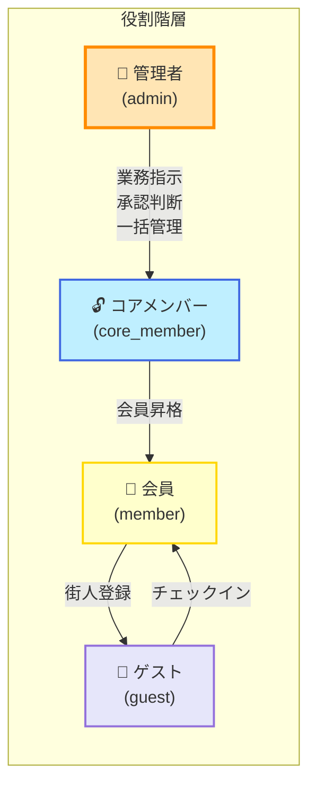

# 浮遊街アプリ ユースケース図

## 概要

浮遊街アプリの主要なアクター（利用者分類）と、各アクターが実行できるユースケース（機能・業務）の関係を可視化します。

---

## ユースケース図（Mermaid形式）

```mermaid
graph TB
    subgraph Actors ["🎭 アクター"]
        Admin["👨‍💼 管理者<br/>(admin)"]
        CoreMember["👷 コアメンバー<br/>(core_member)"]
        Member["👤 街人/会員<br/>(member)"]
        Guest["🚶 ゲスト<br/>(guest)"]
        External["🔗 外部連携<br/>LINE/eumo"]
    end

    subgraph UseCases_Morning ["🎙️ 朝会・議事録"]
        Morning["朝会音声録音"]
        GenMinutes["議事録自動生成"]
        ExtractQuest["クエスト自動抽出"]
    end

    subgraph UseCases_Quest ["📋 クエスト管理"]
        QuestView["クエスト一覧表示"]
        QuestApply["受注申請"]
        QuestReview["審査・業務指示"]
        QuestReport["Before/After報告"]
        QuestApprove["日次承認サイクル"]
        QuestPayment["報酬Uii確定＆送付"]
    end

    subgraph UseCases_Checkin ["🚪 チェックイン・アウト"]
        CheckIn["チェックイン"]
        CheckOut["チェックアウト"]
        RoomAssign["部屋割当"]
    end

    subgraph UseCases_Order ["🛒 注文・会計管理"]
        OrderSelf["セルフ注文"]
        OrderProxy["代理注文"]
        OrderEdit["注文編集・補正"]
        OrderList["注文履歴"]
        Settlement["一括精算"]
        QRPayment["精算QR発行"]
    end

    subgraph UseCases_Customer ["👤 顧客管理"]
        CustMgmt["顧客情報管理"]
        CustView["顧客サマリー表示"]
        RoomMgmt["部屋割当管理"]
        StayCalendar["宿泊予定カレンダー"]
        AdjustmentMgmt["差額管理・繰越"]
    end

    subgraph UseCases_Knowledge ["📚 ナレッジ・FAQ"]
        KnowledgeReg["ナレッジ登録"]
        KnowledgeEdit["ナレッジ編集"]
        KnowledgeRef["AI質問・FAQ参照"]
        Escalation["AI未回答時の<br/>LINE通知・代理回答"]
    end

    subgraph UseCases_Media ["📸 メディア管理"]
        MediaUpload["📸 画像・動画<br/>アップロード"]
        MediaCaption["💬 キャプション入力"]
        MediaTag["🏷️ 用途タグ付与"]
        MediaBrowse["🔍 メディア閲覧<br/>(用途別ソート)"]
        MediaRecmnd["⭐ おすすめ表示"]
        MediaLike["👍 いいね・評価"]
    end

    subgraph UseCases_Member ["👥 マイページ・会員管理"]
        MyPage["マイページ表示"]
        MyLog["マイログ閲覧"]
        RegisterMember["街人登録申請<br/>(ゲスト→会員)"]
        ApproveRegist["街人登録承認"]
    end

    %% 管理者権限
    Admin --> Morning
    Admin --> GenMinutes
    Admin --> ExtractQuest
    Admin --> QuestReview
    Admin --> QuestApprove
    Admin --> QuestPayment
    Admin --> CheckIn
    Admin --> CheckOut
    Admin --> RoomAssign
    Admin --> OrderProxy
    Admin --> OrderEdit
    Admin --> Settlement
    Admin --> CustMgmt
    Admin --> CustView
    Admin --> RoomMgmt
    Admin --> StayCalendar
    Admin --> AdjustmentMgmt
    Admin --> KnowledgeReg
    Admin --> KnowledgeEdit
    Admin --> ApproveRegist

    %% コアメンバー権限
    CoreMember --> QuestReview
    CoreMember --> QuestApprove
    CoreMember --> CheckIn
    CoreMember --> CheckOut
    CoreMember --> RoomAssign
    CoreMember --> OrderProxy
    CoreMember --> OrderEdit
    CoreMember --> Settlement
    CoreMember --> CustView
    CoreMember --> RoomMgmt
    CoreMember --> StayCalendar
    CoreMember --> AdjustmentMgmt
    CoreMember --> KnowledgeReg
    CoreMember --> KnowledgeEdit
    CoreMember --> MediaUpload
    CoreMember --> MediaCaption
    CoreMember --> MediaTag
    CoreMember --> MediaBrowse

    %% メディア関連
    Admin --> MediaUpload
    Admin --> MediaCaption
    Admin --> MediaTag
    Admin --> MediaBrowse
    Admin --> MediaRecmnd

    Member --> MediaUpload
    Member --> MediaCaption
    Member --> MediaTag
    Member --> MediaBrowse
    Member --> MediaRecmnd
    Member --> MediaLike

    Guest --> MediaBrowse
    Guest --> MediaRecmnd
    Guest --> MediaLike

    %% 会員（街人）権限
    Member --> QuestView
    Member --> QuestApply
    Member --> QuestReport
    Member --> OrderSelf
    Member --> OrderList
    Member --> QRPayment
    Member --> MyPage
    Member --> MyLog
    Member --> KnowledgeRef
    Member --> Escalation

    %% ゲスト権限
    Guest --> QuestView
    Guest --> OrderSelf
    Guest --> OrderList
    Guest --> QRPayment
    Guest --> MyPage
    Guest --> MyLog
    Guest --> KnowledgeRef
    Guest --> Escalation
    Guest --> CheckIn
    Guest --> RegisterMember

    %% 業務フロー関係
    Morning --> GenMinutes
    GenMinutes --> ExtractQuest
    QuestApply --> QuestReview
    QuestReview --> QuestReport
    QuestReport -.->|Before/After写真| MediaUpload
    MediaUpload --> MediaCaption
    MediaCaption --> MediaTag
    QuestReport --> QuestApprove
    QuestApprove --> QuestPayment
    
    OrderSelf --> OrderList
    OrderProxy --> OrderList
    OrderList --> Settlement
    
    RegisterMember --> ApproveRegist
    ApproveRegist -.->|昇格| Member
    
    CheckIn --> RoomAssign
    CheckIn --> OrderSelf
    CheckIn --> OrderProxy
    
    %% 外部連携
    External -.->|LINE通知| Escalation
    External -.->|eumo送付| QuestPayment
    External -.->|精算QR| QRPayment

    style Admin fill:#FFE5B4,stroke:#FF8C00,stroke-width:2px
    style CoreMember fill:#BFEFFF,stroke:#4169E1,stroke-width:2px
    style Member fill:#FFFFCC,stroke:#FFD700,stroke-width:2px
    style Guest fill:#E6E6FA,stroke:#9370DB,stroke-width:2px
    style External fill:#FFB6C1,stroke:#C71585,stroke-width:2px
    style QuestPayment fill:#E8F8E8
    style QRPayment fill:#E8F8E8
```



---

## ユースケース分類

### 🎙️ 朝会・議事録（Phase 1 前倒し）

| ユースケース | アクター | 説明 |
|---|---|---|
| **朝会音声録音** | 管理者 | 管理者画面（PC/タブレット）からワンタップで朝会を音声録音 |
| **議事録自動生成** | システム | 音声ファイルをGemini APIへ投入し、決定事項・共有事項を自動要約 |
| **クエスト自動抽出** | システム | 議事録から「〇〇の草刈り（2名）」等のクエスト候補をJSON出力し提案 |

### 📋 クエスト管理

| ユースケース | アクター | 説明 |
|---|---|---|
| **クエスト一覧表示** | 全ユーザー | クエストボード集約。会員・ゲストが受注可能なクエストを表示 |
| **受注申請** | 会員・ゲスト | クエストへ参加申請。ステータスは「申請中」に遷移 |
| **審査・業務指示** | 管理者・コアメンバー | 運営が申請を確認し、実行日時・場所・具体的な指示を出す（マッチング成立） |
| **Before/After報告** | 会員・ゲスト | 作業前後の写真と実施時間を添付して完了報告 |
| **日次承認サイクル** | 管理者・コアメンバー | 1日おき（日次）の報告確認。「承認」または「差戻し」を判定 |
| **報酬Uii確定・送付** | 管理者・システム | 承認時に支払Uii額を確定。eumo送付リンクを発行・案内 |

### 🚪 チェックイン・チェックアウト

| ユースケース | アクター | 説明 |
|---|---|---|
| **チェックイン** | 全ユーザー | ワンタップ/QR読み取りで宿泊開始。AI自動ウェルカムメッセージ送信 |
| **チェックアウト** | 全ユーザー | ワンタップで宿泊終了。宿泊チケット消費・会計精算 |
| **部屋割当** | 管理者・コアメンバー | チェックイン時に部屋（またはベッド枠）を選択・割当 |

### 🛒 注文・会計管理

| ユースケース | アクター | 説明 |
|---|---|---|
| **セルフ注文** | 会員・ゲスト（チェックイン中） | スマホから直接カフェ・直売所商品を注文 |
| **代理注文** | 管理者・コアメンバー・店員 | 店員タブレットから「チェックイン中のユーザー」に限定して代理注文（誤選択防止） |
| **注文編集・補正** | 管理者・コアメンバー | 管理画面から伝票の明細・単価・注文者を修正。理由入力必須 |
| **注文履歴** | 会員・ゲスト | 自身の注文履歴・未会計額・決済ステータスを常時確認 |
| **一括精算** | 管理者・コアメンバー | 未会計伝票を選択し、精算QRコード/URLを発行 |
| **精算QR発行** | システム | 精算用QRを生成。即時決済・後払いの双方に対応 |

### 👤 顧客管理画面

| ユースケース | アクター | 説明 |
|---|---|---|
| **顧客情報管理** | 管理者・コアメンバー | 顧客の基本情報（氏名・住所・連絡先等）を一元管理 |
| **顧客サマリー表示** | 管理者・コアメンバー | ニックネーム・会員種別・チェックイン状態・現在の部屋・未会計額を強調表示 |
| **部屋割当管理** | 管理者・コアメンバー | 部屋台帳（`rooms`）と割当履歴（`room_assignments`）を管理 |
| **宿泊予定カレンダー** | 管理者・コアメンバー | 確定予約を日付・部屋・人数・「要確認」フラグで可視化 |
| **差額管理・繰越** | 管理者・コアメンバー | 遡及修正による差額（追加請求/返金）を記録・繰越・精算 |

### 📚 ナレッジ・FAQ（AIコンシェルジュ）

| ユースケース | アクター | 説明 |
|---|---|---|
| **ナレッジ登録** | 管理者・コアメンバー | まかないレシピ・作業手順・トラブル対応などを登録（line-rag-bot Streamlit側で完結） |
| **ナレッジ編集** | 管理者・コアメンバー | 既存ナレッジの更新・削除（line-rag-bot側で管理） |
| **AI質問・FAQ参照** | 会員・ゲスト | LINEチャットボットへ質問。RAG検索で適切なナレッジを自動回答 |
| **AI未回答時通知・代理回答** | LINE・運営 | AIが回答できない場合はLINEグループへ通知。運営が代理返信＆自動学習 |

### 📸 メディア管理（写真・動画・キャプション・推奨表示）

| ユースケース | アクター | 説明 |
|---|---|---|
| **画像・動画アップロード** | 管理者・コアメンバー・会員 | クエスト報告時の Before/After 写真、ナレッジの補足画像等を GCS へアップロード |
| **キャプション入力** | 管理者・コアメンバー・会員 | 「何をしている写真か」「どのシーンか」を入力。RAG検索精度向上のため必須 |
| **用途タグ付与** | 管理者・コアメンバー | USAGE_TAGS マスタから複数選択。分類・推奨表示の基準になる |
| **メディア閲覧**（用途別ソート） | 全ユーザー | 「クエスト進捗」「施設案内」等の用途タグでフィルタ・ソート。キャプション付きで表示 |
| **おすすめメディア表示** | 全ユーザー | ロール・シーン別に推奨スコアの高いメディアを上位表示（view_count・いいね数に基づく） |
| **いいね・評価** | 会員・ゲスト | 参考になったメディアに「いいね」を付ける。推奨度算出に反映 |

---

### 👥 マイページ・会員管理

| ユースケース | アクター | 説明 |
|---|---|---|
| **マイページ表示** | 全ユーザー | ニックネーム・獲得XP・貢献バッジ・通算宿泊数・保持チケット数を表示 |
| **マイログ閲覧** | 会員・ゲスト | 自身の注文・決済・クエスト実績・修正履歴を時系列で確認 |
| **街人登録申請**  | ゲスト | 2段階モーダル（入力→確認）で会員登録を申請。アプリ内では決済情報を入力させない |
| **街人登録承認** | 管理者 | ゲストの申請を確認。決済QRを発行・送付。入金確認後に会員へ昇格。宿泊券4枚＋コインCB 5,000を付与 |

---

## アクター権限マトリクス



---

## 主要業務フロー

### クエスト受注～承認フロー

```
1️⃣ 朝会録音    2️⃣ 議事録自動生成    3️⃣ クエスト自動抽出
   ↓               ↓                    ↓
管理者がタップ  → Gemini API処理  →  JSON提案・プレビュー
                   ↓
               4️⃣ ワンタップ起案
                   ↓
               5️⃣ クエスト公開
                   ↓
          6️⃣ 会員が受注申請
               ↓
        7️⃣ 運営が業務指示
               ↓
      8️⃣ Before/After報告
               ↓
      9️⃣ 日次承認サイクル
               ↓
        🔟 Uii支払い＆eumo送付
```

### 注文～精算フロー

```
1️⃣ チェックイン         2️⃣ 注文（セルフ/代理）
   ↓                       ↓
ワンタップ/QR  →  スマホまたは店員タブレット
                       ↓
                   3️⃣ 明細・金額確定
                       ↓
               4️⃣ 即時決済 or 未会計
                       ↓
                5️⃣ 精算QR発行
                       ↓
         6️⃣ eumo/現金で決済
                       ↓
            7️⃣ 会計済みマーク
                       ↓
         8️⃣ チェックアウト時に繰越も清算
```

### ゲスト→会員アップグレード導線

```
1️⃣ ゲストがロック中クエスト表示
   「🔒 街人登録で解放」
           ↓
2️⃣ モーダル起動（入力①）
           ↓
3️⃣ 基本情報入力
   - ニックネーム
   - 誕生年月
   - 属性
           ↓
4️⃣ 確認画面（入力②）
           ↓
5️⃣ 申請送信
           ↓
6️⃣ 管理者が決済QR発行・送付
           ↓
7️⃣ ゲストがQR決済
           ↓
8️⃣ 管理者が入金確認→承認
           ↓
9️⃣ ゲスト → 会員へ昇格
   + 宿泊券4枚
   + コインCB 5,000
```

---

## 権限と制御の原則

### ロール別アクセス制御（§5.9 準拠）

| ユースケース | 管理者 | コアメンバー | 会員 | ゲスト |
|---|:---:|:---:|:---:|:---:|
| **朝会録音・議事録生成** | ✅ | ✖️ | ✖️ | ✖️ |
| **クエスト審査・指示** | ✅ | ✅ | ✖️ | ✖️ |
| **日次承認サイクル** | ✅ | ✅ | ✖️ | ✖️ |
| **顧客管理画面** | ✅ | ✅ | ✖️ | ✖️ |
| **ナレッジ登録** | ✅ | ✅ | ✖️ | ✖️ |
| **クエスト一覧表示** | ✅ | ✅ | ✅ | ✅ |
| **受注申請** | ✖️ | ✖️ | ✅ | ✅ |
| **Before/After報告** | ✖️ | ✖️ | ✅ | ✅ |
| **セルフ注文** | ✖️ | ✖️ | ✅ | ✅※ |
| **代理注文** | ✅ | ✅ | ✖️ | ✖️ |
| **注文編集・補正** | ✅ | ✅ | ✖️ | ✖️ |
| **AI質問・FAQ参照** | ✅ | ✅ | ✅ | ✅ |
| **街人登録申請** | ✖️ | ✖️ | ✖️ | ✅ |
| **街人登録承認** | ✅ | ✖️ | ✖️ | ✖️ |
| **画像・動画アップロード** | ✅ | ✅ | ✅ | ✖️※1 |
| **キャプション入力** | ✅ | ✅ | ✅ | ✖️※1 |
| **用途タグ付与** | ✅ | ✅ | ✖️ | ✖️ |
| **メディア閲覧**（ソート） | ✅ | ✅ | ✅ | ✅ |
| **おすすめメディア表示** | ✅ | ✅ | ✅ | ✅ |
| **いいね・評価** | ✖️ | ✖️ | ✅ | ✅ |

※1 ゲストはチェックイン中のみ注文可能（v13 §5.4）  
※2 メディアアップロードはPhase 2 本格運用。Phase 1 では朝会音声のみ（管理者・MEDIA_ITEMS基盤構築）

### 重要原則

1. **UI非表示 + サーバサイド認可**: DOM非表示のみでなく、Supabase RLS + Edge Function でサーバ側で徹底的に検証
2. **権限外URLへの直接アクセス**: 403画面表示。コンテンツ・プレビューを一切レンダリングしない
3. **親方衆の特殊扱い**: `member_type = '親方'` は**認可条件に含めない**（立場であり権限ではない）
4. **ゲスト開放クエストの見せ方**: `guest_allowed` フラグで判定。ロック表示で施錠し、登録導線として機能させる（隠さない）

---

## 今後の拡張（Phase 2 以降）

### Phase 1 で準備される機能

- **メディア基盤** (MEDIA_ITEMS テーブル・GCS接続): 朝会音声の格納用に構築。Phase 2 で画像・動画推奨表示へ拡張

### Phase 2 で本格運用予定のユースケース

- **メディア推奨表示**: 用途タグ別・ロール別のおすすめ画像・動画表示。view_count・いいね数に基づく推奨スコア
- **メディアコレクション**: ユーザーがテーマごとにメディアをグループ化（「〇〇さんのクエスト完了履歴」等）
- **ユーザー投稿機能**: 会員がスマホから写真・動画を投稿。キャプション＋用途タグで分類
- **Uii高度機能**: 個人ウォレット表示・残高管理・失効処理
- **会員権有効期限**: 有効期限表示・一斉失効バッチ（2027/4/30）
- **スキルツリー**: スキルレベル可視化・熟練度連動報酬
- **P2Pマーケット**: スキル・物品のマッチング

### Phase 3 での展開（将来）

- **IoT連携**: 蜂の巣チェック等の遠隔監視
- **マルチテナント化**: 複数コミュニティ展開
- **FEL深度連携**: 共通データ基盤化

---

Last Updated: 2026-08-17  
Version: 1.0.0 (Draft)  
Reference: [[浮遊街アプリ 総合要件定義・設計書_v13.md]]
