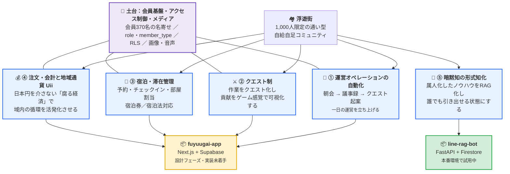
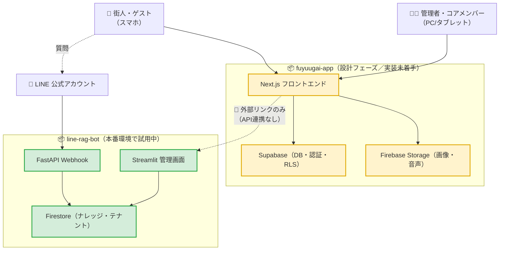
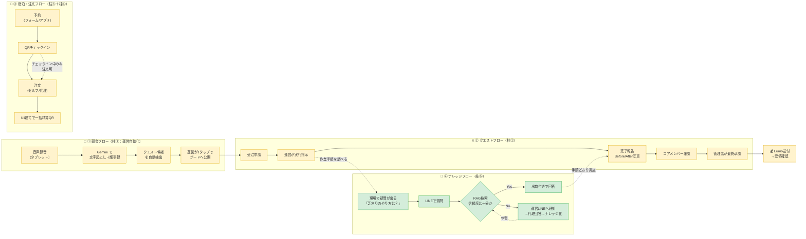
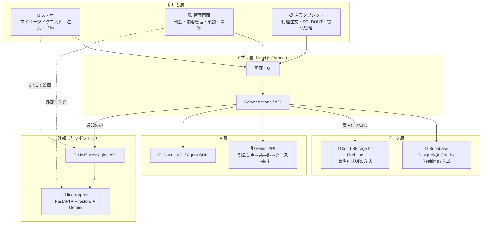
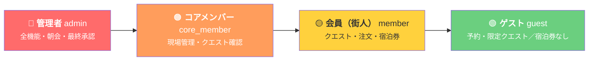
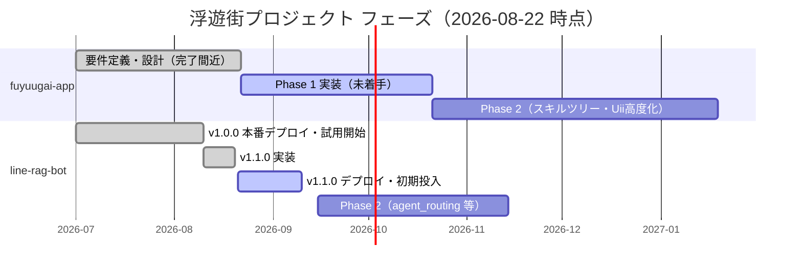
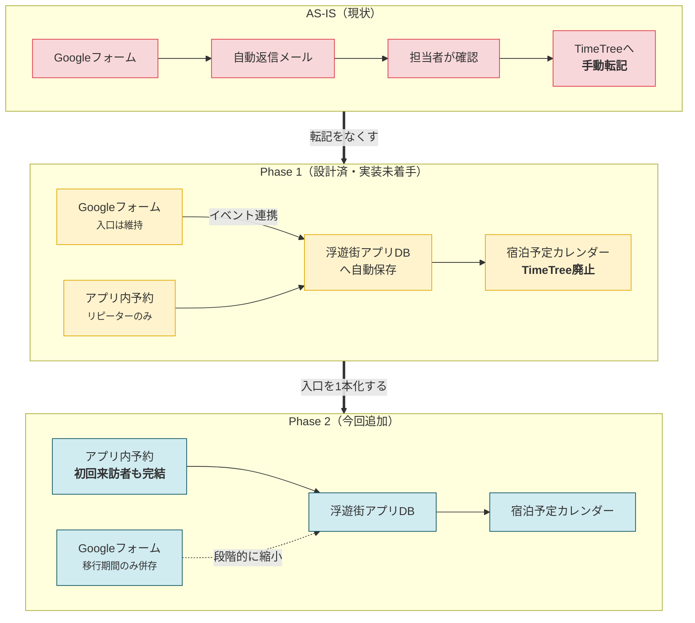
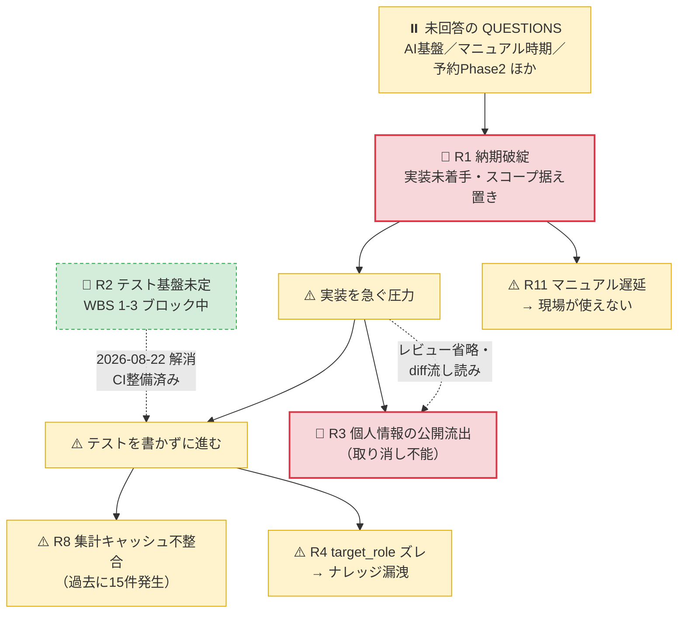
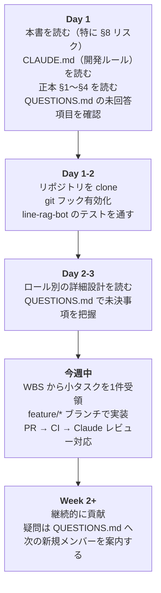

# 浮遊街アプリ オンボーディング資料（新規メンバー向け概要）

> [!info] 📚 このドキュメントについて
> 新規参画メンバーが本プロジェクトを**10分で理解する**ためのハイレベル概要資料です。
>
> - **想定対象**: 初参画の開発者・PM・デザイナー
> - **目的**: 全体像をつかみ、詳細な仕様書へ進むための足場を作る
> - **詳細の正本**: [[Projects/fuyuugai-app/docs/spec/浮遊街アプリ 総合要件定義・設計書_v13.md|総合要件定義・設計書 v13]]
> - **本書はハイレベル要約です。** 記述が正本と食い違う場合は**必ず正本が勝ちます**

> [!warning] 🚨 最初に知っておくべき2つの事実
> **① プロジェクトは2つのリポジトリで構成されています**（`fuyuugai-app` と `line-rag-bot`）。
> **② 2つは進捗フェーズが全く違います。**
>
> | リポジトリ | フェーズ | 実態 |
> |---|---|---|
> | `fuyuugai-app` | **設計フェーズ** | 要件定義・基本設計・詳細設計は揃っているが、**アプリコードはまだ0行**。リポジトリ内は `docs/` と CI 設定のみ |
> | `line-rag-bot` | **試用フェーズ** | v1.0.0 が Cloud Run の**本番環境にデプロイ済みで、LINE から実際に応答する**。ただし**本運用（運営フローに組み込んだ定常運用）は未開始**で、本番環境をそのまま使いながら試している段階。v1.1.0（構造化ナレッジ＋エスカレーション）は実装完了・デプロイ待ち |
>
> 「浮遊街アプリの開発に参加する」と聞いて来た人は、**まだ実装が始まっていない**ことに驚くはずです。逆に AI/RAG 側は既に触れる形になっています。ここを取り違えると初日の期待値が大きくズレます。
>
> なお `line-rag-bot` について「**本番稼働中**」という表現を見かけたら、**「デプロイ済みで応答する」という意味であって「運用に乗っている」ではない**と読み替えてください（2026-08-22 オーナー確認）。詳細は [[Projects/fuyuugai-app/docs/RAG基盤_line-rag-bot概要.md|RAG基盤 / line-rag-bot 概要]] §1。
>
> なお Phase 1 の期間は ~~2026年7月〜8月~~ → **2026-09-10 リリース目標（2026-08-22 オーナー確定）**、本日は 2026-08-22 です。この数字が意味するところは **[§8 プロジェクトリスク](#8--プロジェクトリスク)** を必ず読んでください。

---

## 1. プロジェクトの目的と背景

### 🎯 何をやるのか

**自給自足コミュニティ「浮遊街」の運営支援システムを開発する。**

1,000人限定の通い型コミュニティに向けて、日々の運営業務をデジタル化し、AIで運営を支援するシステムです。

### 🔥 なぜ必要か（背景）

浮遊街の運営業務は**現在ほぼ人手で回っており、ワンオペ負荷が非常に高い**状態です。

| 業務              | 現在の課題                                             |
| --------------- | ------------------------------------------------- |
| **朝会・議事録**      | 毎朝の会議を人手で記録。そこから「今日やること」を起こす作業に時間がかかる             |
| **クエスト（タスク）管理** | 紙・チャットにクエストボードが分散。進捗・完了・報酬支払いが追えない                |
| **宿泊管理**        | Googleフォーム → メール → **TimeTree へ手動転記**。二重管理と誤入力の温床 |
| **注文・会計**       | 代理注文の誤請求が起きる。誰がいくら未払いかの把握が煩雑                      |
| **FAQ・暗黙知**     | まかないレシピ・左官・草刈り等のノウハウが個人に属人化。質問のたびに誰かが対応           |

### 💡 本質的な課題

浮遊街は**地域通貨「Uii（ウイ）」を軸とした「腐る経済」**を実験しているコミュニティです。
日本円を介さない循環を作ることで、地域内の物・サービスの流通を活発化させ、持続可能性を高めるという構想があります。

このビジョンを回すには、**運営の手間を極小化すること**と、**誰が何にどれだけ貢献し、いくら受け取ったかを透明に可視化すること**の両方が不可欠です。それが本システムの存在理由です。

### 🏛️ プロダクトの5つの柱と、それを支える土台

本プロジェクトが作るものは、**5つの業務領域（柱）**と、**すべての柱が乗る共通基盤（土台）**に分解できます。
分類の軸は「**浮遊街の運営業務のどこをデジタル化するか**」です。

> [!note] ~~「三本柱」~~ → **5つの柱＋土台**（2026-08-22 改訂）
> `CLAUDE.md` §0 と Master Index には「クエスト制・地域通貨Uii・暗黙知の形式知化が**三本柱**」とあります。
> これは浮遊街を浮遊街たらしめる**コアコンセプト**（思想）を3つ挙げたものであって、**開発対象を網羅した分類ではありません**。
> 実際に Phase 1 で作るものには**宿泊管理・注文会計・朝会の自動化**が含まれており、三本柱にはその居場所がありませんでした。
>
> 本節ではコアコンセプトとしての三本柱を否定せず、**開発対象を漏れなく・重複なく（MECE）並べ直しています。**
> 「思想は3つ、作るものは5領域＋土台」と理解してください。



| # | 柱 | 何を解決するか | 実装先 | Phase 1 の範囲 |
|---|---|---|---|---|
| **①** | **運営オペレーションの自動化** | 朝会を人手で記録し「今日やること」を起こす負荷。ワンオペの起点 | `fuyuugai-app` | 音声録音 → Gemini で文字起こし・議事録 → クエスト候補抽出 → 1タップ起案 |
| **②** | **クエスト制** | 紙・チャットに分散したクエストボード。進捗・完了・報酬が追えない | `fuyuugai-app` | ボード集約、受注申請 → 実行指示 → Before/After 完了報告 → 二段階承認 → Eumo 送付・受領追跡 |
| **③** | **宿泊・滞在管理** | フォーム → メール → TimeTree 手動転記による二重管理と誤入力 | `fuyuugai-app` | 予約取り込み・アプリ内予約、QRチェックイン、部屋割当、宿泊券、残枠表示、宿泊法対応項目の収集 |
| **④** | **注文・会計と地域通貨 Uii** | 代理注文の誤請求、未払い把握の煩雑さ、円に依存した経済 | `fuyuugai-app` | セルフ／代理注文、提供ステータス、一括精算QR、**Uii は会計管理に限定**（円の2割引換算・全画面で Uii 主／円 副） |
| **⑤** | **暗黙知の形式知化** | レシピ・左官・草刈り等のノウハウが個人に属人化し、都度誰かが対応 | **`line-rag-bot`** | LINE で質問 → 出典付き回答、未回答は運営へエスカレーション → 代理回答 → ナレッジ化 |
| **土台** | **会員基盤・アクセス制御・メディア** | 上記5つすべてが「誰が・何を見てよいか」に依存する | `fuyuugai-app` | 会員370名の一括移行と名寄せ、`role`／`member_type`、RLS によるサーバサイド認可、画像・音声の署名付きURL |

> [!tip] 柱の境界（重複させないための線引き）
> MECE を保つために、隣接する柱の境界を明示しておきます。**迷ったらこの線で切ってください。**
>
> | 境界 | 線引き |
> |---|---|
> | **① と ②** | ①は「クエストが**生まれる**まで」、②は「クエストが**実行・承認される**まで」 |
> | **③ と ④** | ③は「**滞在そのもの**（枠・部屋・在館状態）」、④は「**勘定**（いくらで、誰が、精算済みか）」。宿泊料金の計算は④ |
> | **② と ④（Uii）** | 給付Uii額の**確定**は②（クエスト承認時）、その**換算ルール・表示・精算**は④ |
> | **⑤ と 他** | ⑤は他の柱と**交差はするが実装は独立**。API連携はゼロ（§2） |
> | **柱 と 土台** | 土台は単独では業務価値を生まないが、**欠けると全柱が成立しない**もの。会員・ロール・認可・メディアが該当 |

> [!important] 🔑 「RAG は別リポジトリ」＝「RAG は脇役」ではありません
> 5つの柱のうち **1本（⑤ 暗黙知の形式知化）だけが別リポジトリに実装されている**、という構造です。
> リポジトリが分かれているのは**技術スタックとデプロイ単位の都合**であって、プロダクト上の重要度の差ではありません。
>
> **リポジトリは独立、プロダクトは1つ。** これが本プロジェクトの公式な位置づけです（§3 ／ [[Projects/fuyuugai-app/docs/RAG基盤_line-rag-bot概要.md|RAG基盤 / line-rag-bot 概要]] で詳述）。

### 🧭 開発方針（判断に迷ったときの拠り所）

1. **MVPの早期構築 ＆ 現場摩擦ゼロ** — 最小機能で早く出し、現場で回しながら改善する
2. **朝会録音・議事録・クエスト自動起案を Phase 1 に前倒し** — 最も負荷の高い業務から潰す
3. **クエストボードの完全集約** — 承認・指示プロセスを厳格化
4. **Phase 1 の Uii は「会計管理特化」** — 残高・失効などの通貨機能は Phase 2 へ
5. **代理注文の誤りを構造的に防ぐ** — チェックイン中の人しか選べない等
6. **宿泊法（旅館業法）対応** — 住所・前泊地の収集は事業上必須

---

## 2. システム全体像

### 🗺️ まず全体マップ：2リポジトリ構成



> [!important] 🔑 最重要の設計判断：2つのシステムは API 連携しない
> **浮遊街アプリ本体は line-rag-bot と API 連携しません。**（2026-08-16 オーナー最終判断／正本 §9 #31）
>
> - 浮遊街アプリ本体は**独自のベクトルDBを持たない**（pgvector 案は破棄済み）
> - 浮遊街アプリ本体は**アプリ内 AI チャット UI を持たない**（エンドユーザーへの AI 応答は LINE に一本化）
> - ナレッジ登録も浮遊街アプリ側には作らず、**管理画面から Streamlit 管理画面への外部リンクを置くだけ**
>
> 「アプリからナレッジを登録する画面を作る」「RAG API を叩く」といった実装をしないこと。当初案にはあったが**明確に撤回されています**。

### 📊 簡易処理フロー（4つの業務軸）

§1 の5つの柱を日々のオペレーションに落とすと、**4本の業務フロー**になります（③宿泊と④注文・会計は現場では1本の流れとして繋がるため、ここでは1つにまとめています）。
`🟨` が `fuyuugai-app`、`🟩` が `line-rag-bot` の担当範囲です。



> [!note] ④ が他の業務フローと交差する場所
> ナレッジフローは独立して浮いているわけではなく、**クエストの実行局面で交差します。**
> 「クエストを受けた → やり方が分からない → LINEで聞く → 出典付き手順が返る → 実施して完了報告」という往復が、想定されている一番おいしい導線です。
> ただし現時点で**この往復はシステム的に自動連携していません**（点線部分は人が跨いでいる）。将来ここを繋ぐ場合の候補が、Phase 2 の「WorkLog ↔ FailurePattern フィードバック」です。

### 🏗️ システム構成図



### 👥 利用者の種類と権限



> [!danger] ⚠️ 権限（`role`）と立場（`member_type`）は別軸。ここを混ぜると事故ります
> - **`role`** … システム上のアクセス権（`admin` / `core_member` / `member` / `guest` / `custom`）→ **認可判定はこれだけで行う**
> - **`member_type`** … コミュニティ内の立場（親方 / 街人（コア） / 街人（一般） / ゲスト）→ **バッジ表示・呼称・再訪アラート専用**
>
> **親方衆44名の権限は街人（`member`）と同等です。**
> `member_type = 親方` を認可条件に混ぜると、「立場が上だから管理画面も見えるはず」という暗黙の期待が実装に紛れ込み、**顧客の氏名・連絡先・運営メモが44名へ開放される事故**につながります（正本 §2）。

---

## 3. RAG基盤 / line-rag-bot（柱⑤の実装）

> [!abstract] 📄 このセクションは**別紙へ外出し**しました（2026-08-22）
> 詳細は **[[Projects/fuyuugai-app/docs/RAG基盤_line-rag-bot概要.md|RAG基盤 / line-rag-bot 概要]]** を参照してください。
> 本節には、**RAG 担当でない人も知っておく必要がある3点**だけを残しています。

### 🔑 全メンバーが押さえるべき3点

#### ① 浮遊街アプリと line-rag-bot は **API 連携しません**

（2026-08-16 オーナー最終判断／正本 §9 #31）

- 浮遊街アプリ本体は**独自のベクトルDBを持たない**（pgvector 案は破棄済み）
- 浮遊街アプリ本体は**アプリ内 AI チャット UI を持たない**（エンドユーザーへの AI 応答は LINE に一本化）
- ナレッジ登録も浮遊街アプリ側には作らず、**管理画面から Streamlit 管理画面への外部リンクを置くだけ**

> [!danger] 「アプリからナレッジを登録する画面を作る」「RAG API を叩く」実装をしないこと
> 当初案にはありましたが**明確に撤回されています**。入口は **LINE と Streamlit の2つだけ**です。

#### ② リポジトリは独立、プロダクトは1つ

`line-rag-bot` は浮遊街アプリへ**統合しません**（リポジトリ・デプロイ・技術スタック・認証モデルが別）。
ただし**プロダクトとしては「浮遊街プロジェクト」1つ**として扱い、ドキュメント・オンボーディング・ロール定義は束ねます。

> 5つの柱のうち **1本（⑤ 暗黙知の形式知化）だけが別リポジトリにある**という構造であり、重要度の差ではありません。

#### ③ ロール定義は**唯一「揃えなければならない」接点**

ナレッジの公開範囲は `target_role` で制御します。**ズレると内部専用ナレッジがゲストに漏れます。**

| | ロール値 | 用途 |
|---|---|---|
| **浮遊街アプリ** | **5値** `admin` / `core_member` / `member` / `guest` / `custom` | 画面認可・機能認可 |
| **LINE ボット** | **2値** `member` / `guest` | ナレッジの公開範囲の出し分けのみ |

- **値の数が違うのは意図的**です（用途が違うため）。マッピングは `admin`/`core_member`/`member`/`custom` → **`member`**、`guest` → **`guest`**
- **親方衆は `member` 扱い**（両システムで一致済み）
- **`target_role` の正本は浮遊街アプリ側（正本 v13 §2）**。`line-rag-bot`（`app/roles.py`）は**追従側**。
  **`line-rag-bot` を先に変更してはいけません**（§8 R4）

### 📌 現在地（1行サマリ）

**Cloud Run の本番環境にデプロイ済みで LINE から応答するが、本運用は未開始。本番環境をそのまま使いながら試している段階。**
実装状況・既知の制限・アーキテクチャ・ユースケース・セットアップ手順は
[[Projects/fuyuugai-app/docs/RAG基盤_line-rag-bot概要.md|別紙]]にまとめています。

---

## 4. ハイレベルスケジュール

### 📅 フェーズ全体像



> [!note] 現在地
> - **`fuyuugai-app`**: 詳細設計まで完成。**実装はこれから**。ただし §9（意思決定ログ）に未決事項が残っており、テスト基盤の方針は `QUESTIONS.md` 未回答でブロック中
> - **`line-rag-bot`**: v1.1.0 のデプロイと初期ナレッジ投入が直近タスク

### 🚀 Phase 1（MVP）の機能スコープ

Phase 1 は「最小限の機能で短期構築し、現場で運用しながら高速に改善する」ことがゴールです。

| 領域 | 主な機能 |
|------|---------|
| **朝会・議事録** | 音声録音 → Gemini で文字起こし＋議事録生成 → クエスト候補の自動抽出 → ワンタップ起案 |
| **認証・チェックイン** | QR/ワンタップ チェックイン・アウト、Googleフォーム連携による予約自動反映、**アプリ内予約**（リピーター向け）、宿泊法対応項目の収集 |
| **クエスト管理** | ボード集約、受注申請、実行指示、Before/After写真付き完了報告、**二段階承認**、**Eumo給付の送付・受領追跡** |
| **顧客管理・精算** | 通算宿泊日数・宿泊券管理、注文履歴の直接編集、一括精算QR、**チェックイン中優先表示**、**宿泊枠の残数表示**、宿泊予定カレンダー |
| **注文・店舗** | セルフ注文＋代理注文（チェックイン者限定）、SOLDOUTトグル、**提供ステータス（未提供/提供済）**、**メニュー・宿泊料金マスタのCRUD** |
| **Uii（会計限定）** | 円の2割引換算（`floor(単価 × 0.8)`）、**全画面で Uii 主・円 副**、クエスト給付Uii額の確定 |
| **メディア** | 全ロールからのアップロード導線、署名付きURL直接アップロード、用途タグ・メタデータ付与 |
| **会員データ** | 親方・街人リスト（370名）の一括インポート、初回アクセス時の自動名寄せ、再訪アラート |
| **アクセス制御** | ロール別UI表示制御（権限外メニューはDOMごと非描画）＋ **サーバサイド認可（RLS）** |
| **ゲスト→街人導線** | 施錠クエスト表示 → 申請 → 管理者がQR送付 → 入金確認 → 承認 → **宿泊券4枚＋コインCB 5,000** |
| **FAQ・ナレッジ** | ※実体は `line-rag-bot`。アプリ側は管理画面からの**外部リンクのみ** |

### 📋 Phase 2 以降

| Phase | 主な内容 |
|---|---|
| **Phase 2**（2026年9月〜） | **★ 宿泊予約の完全アプリ化（初回来訪者もアプリで完結／下記）**、スキルツリー（Lv1〜5）＋**オーダーメイドクエスト（AI個人指名）**、**Uii高度機能**（残高Wallet・3ヶ月失効・EUMO API連携）、**メディアの検索＆AI推薦**、会員権の有効期限・一斉失効、Discord/LINE からのナレッジ自動吸い上げ、直売所の郵送購入、P2Pマーケット |
| **Phase 3**（将来） | IoT遠隔監視（蜂の巣チェック等）、FEL（Favorite Earth Life）連携強化、マルチテナント化 |

#### ★ 宿泊予約の段階的アプリ化（2026-08-22 方針追加）

予約の入口を**2段階でアプリへ寄せていく**方針です。フェーズごとに「入口」と「正本」が変わります。



| フェーズ | 初回来訪者の入口 | リピーターの入口 | 予約データの正本 |
|---|---|---|---|
| **AS-IS** | Googleフォーム | Googleフォーム | TimeTree（手動転記） |
| **Phase 1** | Googleフォーム<br/><small>→ イベント連携でアプリDBへ自動保存</small> | **アプリ内予約** | **浮遊街アプリ** |
| **Phase 2** | **アプリ内予約**<br/><small>フォームは移行期間のみ併存</small> | アプリ内予約 | 浮遊街アプリ |

> [!warning] ⚠️ この方針は正本 v13 §5.2.4 と競合します（正本改訂が必要）
> 正本 §5.2.4 には現在こう書かれています。
>
> > **Googleフォームは廃止しない** — 初回来訪者（アカウントを持たない人）の入口は、引き続きGoogleフォームである。（中略）「アプリからしか予約できない」状態にすると、アプリを入れていない初回客の予約経路が消滅する。
>
> Phase 2 でこれを見直すには、当時の懸念に答える必要があります。
> - **未インストールの初回客をどう受けるか**（Webブラウザで完結する予約ページを用意する等）
> - **宿泊法必須項目**（住所・前泊地・後泊地）を予約時とチェックイン時のどちらで収集するか
> - **フォーム廃止の判断基準**（アプリ経由率が何％を超えたら止めるか。`reservation_source` で計測可能）
>
> 本資料はハイレベル概要のため、**正本の改訂は別途必要**です（`QUESTIONS.md` に起票済み）。

> [!note] 補足：「フォーム → アプリDBへ自動保存」は既に Phase 1 スコープです
> ご要望のうち「Googleフォームと連携してアプリのDBに自動保存」の部分は、正本 §5.2.3 TO-BE② で**既に Phase 1 の確定仕様**になっています（イベント駆動。バッチ同期ではない）。
> ただし §5.2.3 の AS-IS 課題に「**実運用上は未達**」と明記されているとおり、**仕様はあるが実装されていない**状態です。Phase 2 の新規要件は「初回来訪者もアプリで完結」の部分だと整理しました。

> [!note] スコープ判断の考え方（覚えておくと迷いません）
> - **メディアはアップロードだけ Phase 1、検索・AI推薦は Phase 2** … 推薦は「素材が貯まっていること」が前提。母数ゼロでは機能しない
> - **オーダーメイドクエストは単独で前倒ししない** … スキルが構造化されていない状態で個人指名すると、根拠のない指名で現場の納得感を損なう
> - **会員権の失効は Phase 2** … 最初の満了が 2027/4/30 で Phase 1 期間中に発生しない。ただし**スキーマは Phase 1 で用意する**（後からカラムを足すとデータ全件見直しになる）

---

## 5. ハイレベル要件

### ⚙️ コア機能要件（5領域）

> [!note] §1 の「5つの柱」との対応
> §1 の**5つの柱は開発対象の分類**、ここの**5領域は要件の記述単位**です。**1対1で対応します。**
>
> | §1 の柱 | ここの領域 |
> |---|---|
> | ① 運営オペレーションの自動化 | ①️⃣ 朝会 → AI議事録 → クエスト自動起案 |
> | ② クエスト制 | ③️⃣ クエストの完全管理フロー |
> | ③ 宿泊・滞在管理 | ②️⃣ 宿泊管理（予約 → チェックイン → 精算） |
> | ④ 注文・会計と地域通貨 Uii | ④️⃣ 注文管理と誤請求防止 |
> | ⑤ 暗黙知の形式知化 | ⑤️⃣ AIコンシェルジュ＆暗黙知の形式知化 |
>
> **土台（会員基盤・アクセス制御・メディア）**は機能要件ではなく横断要件のため、
> このあとの**コア非機能要件**（セキュリティ・個人情報）側に記述しています。

#### ①️⃣ 朝会 → AI議事録 → クエスト自動起案

朝会をタブレットで録音 → **Gemini にマルチモーダル入力**（音声を直接渡す）→ 文字起こし＋議事録＋クエスト候補JSONを**1回のAPI呼び出しで同時生成** → 運営が確認・補正して1タップ公開。

> 💡 話者分離（Diarization）は**不要と判断**（対面朝会で「決定事項とタスクが分かればよい」ため）。Whisper＋話者分離構成は不採用。

#### ②️⃣ 宿泊管理（予約 → チェックイン → 精算）

- **入口は2本**: 初回来訪者は Googleフォーム、リピーターはアプリ内予約。**Googleフォームは廃止しない**（アプリを入れていない初回客の経路が消滅するため）
- **下流は1本**: 予約データの正本は**浮遊街アプリ**。TimeTree 連携は**不採用**、管理画面「宿泊予定カレンダー」に一本化
- **備考欄が空なら自動確定**、記載があれば「要確認」として担当者へ通知
- 部屋割当は `rooms` / `room_assignments` で管理し、部屋移動も**履歴として残す**（上書きしない）

#### ③️⃣ クエストの完全管理フロー

```
申請中 → 指示済み → 報告済み → コアメンバー確認済 → 承認完了 → Eumo送付 → 受領確認
              │            │
              └────────────┴──→ 差戻し（理由必須）
```

| 論点 | 確定内容 |
|---|---|
| コアメンバーは最終承認できるか | **できない**。給付の確定は `admin` のみ |
| 管理者は確認ステージを飛ばせるか | **飛ばせる**（少人数運営で詰まらないように）。ただし「スキップした」旨をログに残す |
| 複数のコアメンバーが確認したら | **1人目の確認で遷移**。全員一致は求めない（滞留するため） |

> 「全員が**確認できる**」と「全員の**承認が必要**」は違います。前者が要望の意図です。

#### ④️⃣ 注文管理と誤請求防止

- 注文できるのは**現在チェックイン中のユーザーのみ**（セルフ・代理の双方）
- 代理注文の選択肢にも**チェックイン中の人しか出さない**
- 打ち間違いは管理画面から補正可能。**ユーザー自身もスマホから自分の利用ログを常時確認できる**（相互確認）
- **提供ステータス（未提供/提供済）と会計ステータス（未会計/精算済）は独立した軸**

#### ⑤️⃣ AIコンシェルジュ＆暗黙知の形式知化

- まかないレシピ・左官・草刈り・農作業ルーティン等をレシピ／道具マスタとして構造化
- **回答には必ず出典を付ける**（ハルシネーション対策）
- **AI未回答時は運営LINEへ即時通知 → 代理返信 → 自動学習**
- ※ 実体は `line-rag-bot`（§3 ／ [[Projects/fuyuugai-app/docs/RAG基盤_line-rag-bot概要.md|RAG基盤 / line-rag-bot 概要]]）

### 🛡️ コア非機能要件

| 観点 | 重点事項 |
|------|---------|
| **セキュリティ（最重要）** | 認可は **Supabase RLS でサーバサイド判定**。**DOM非表示は認可ではない**。ストレージ認可は Supabase に一元化し**署名付きURL方式**（Firebase Auth・Security Rules は不採用）。内部専用ナレッジのURL TTLは短く絞る |
| **個人情報** | 旅館業法対応で**実名・住所・連絡先を保持する**。リポジトリは **public** のため、会員データは絶対にコミットしない |
| **性能** | 画面応答 **3秒以内**。宿泊残枠・チェックイン状況は Supabase Realtime で即時反映 |
| **データ整合性** | **残高・残枠をカラムに持たない**。正本は取引明細（`stay_ticket_transactions` / `room_assignments`）で、**都度算出**する。※実データで15件の不整合が発生した実績あり |
| **運用性** | PC/タブレット管理画面とスマホ利用者画面を分離。**操作マニュアルを実装と同時に提出** |
| **拡張性** | Phase 1 は浮遊街1コミュニティのみ。Phase 3 でマルチテナント化・FEL連携を想定し、共通語彙（`Place` 等）とドメイン固有拡張を分離しておく |

---

## 6. 新規メンバーの最初のステップ（Next Action）

### 📚 Day 1：読む（2〜3時間）

**優先度順に読んでください。**

| # | 対象 | ポイント |
|---|---|---|
| 1 | **本ファイル** ✅ | 今読んでいます |
| 2 | [[Projects/fuyuugai-app/CLAUDE.md\|fuyuugai-app / CLAUDE.md]] | **開発ルールの正本**。§1（ドキュメント運用）・§3（機密情報）・§4（コーディング規約）は**必読** |
| 3 | [[Projects/fuyuugai-app/docs/spec/浮遊街アプリ 総合要件定義・設計書_v13.md\|総合要件定義・設計書 v13]] | **§1〜§4（概要・システム概要・開発方針・スコープ）まで**を読む。§5以降は必要な章だけ |
| 4 | [[Projects/fuyuugai-app/QUESTIONS.md\|QUESTIONS.md]] | **未回答の論点**。ここにあるものを勝手に確定扱いしない |
| 5 | [[Projects/fuyuugai-app/docs/spec/CONSOLIDATED_DECISIONS.md\|CONSOLIDATED_DECISIONS.md]] | 「なぜそう決めたか」の索引 |
| 6 | [[Projects/fuyuugai-app/docs/RAG基盤_line-rag-bot概要.md\|RAG基盤 / line-rag-bot 概要]] | §3 の別紙。**AI/RAG 側の担当なら必読**。他の領域でも「アプリ側にRAGを作らない」理由はここ |
| 7 | [[Projects/line-rag-bot/IMPLEMENTATION_STATUS.md\|line-rag-bot / IMPLEMENTATION_STATUS.md]] | AI/RAG 側の担当なら**必読**（進捗の正本） |

### 💻 Day 1〜2：環境セットアップ

#### 📦 `fuyuugai-app`（ドキュメント中心・アプリコードはまだ無い）

```bash
git clone https://github.com/KoshiNakano1017/Fuyu.git
cd Fuyu

# Git フックを有効化（これを忘れると機密情報チェックが働きません）
git config core.hooksPath .githooks
```

> [!warning] `npm install` はまだできません
> **このリポジトリには現時点で `package.json` も `src/` も存在しません。** 中身は `docs/`・`CLAUDE.md`・`QUESTIONS.md`・`TASKS.md`・CI 設定のみです。
> Next.js プロジェクトの初期化そのものが、これからの実装タスクに含まれます。

#### 🤖 `line-rag-bot`（こちらは動かせます）

```bash
cd Projects/line-rag-bot

# venv を必ず使う（Windows の `python` は Microsoft Store のスタブなので直接叩かない）
python -m venv .venv
.venv/Scripts/python.exe -m pip install -r requirements.txt

# sample.env を参考に .env を作成
# 必須: GEMINI_API_KEY / FIRESTORE_PROJECT_ID

# Firestore 不要のテストだけ実行
.venv/Scripts/python.exe -m pytest tests/ -q

# API サーバ起動
uvicorn app.main:app --host 0.0.0.0 --port 8000

# 管理画面（Streamlit）起動 → http://localhost:8501
streamlit run streamlit_app.py
```

**Firestore を使うテストはエミュレータが必須**です（未起動だと自動 skip されます）。

```powershell
$env:JAVA_HOME = "C:\Program Files\Microsoft\jdk-21.0.12.8-hotspot"
$env:Path = "$env:JAVA_HOME\bin;$env:Path"
gcloud emulators firestore start --host-port=localhost:8080

# 別ターミナルで
$env:FIRESTORE_EMULATOR_HOST = "localhost:8080"
.\.venv\Scripts\python.exe -m pytest tests/ -q   # 期待値: 340 passed / skip 0
```

> [!important] **skip 0 件で全件パス**を確認してからコミットすること
> skip されたまま進むと、Firestore 周りの回帰に気づけません。

### 🎯 Day 2〜3：自分のロール別に深掘り

| 役割 | 次に読む |
|------|---------|
| **フロントエンド** | `docs/spec/basic-design/frontend/`（[[Projects/fuyuugai-app/docs/spec/basic-design/frontend/UI_UX設計指針.md\|UI_UX設計指針]] / [[Projects/fuyuugai-app/docs/spec/basic-design/frontend/HTMLモック_v13.md\|HTMLモック_v13]]）、[[Projects/fuyuugai-app/docs/spec/detailed-design/画面設計.md\|画面設計]] |
| **バックエンド** | `docs/spec/basic-design/backend/`、[[Projects/fuyuugai-app/docs/spec/detailed-design/DB物理設計.md\|DB物理設計]]、[[Projects/fuyuugai-app/docs/spec/detailed-design/API設計.md\|API設計]]、[[Projects/fuyuugai-app/docs/spec/データモデル図_ER_Diagram.md\|ER図]] |
| **AI / RAG** | [[Projects/line-rag-bot/docs/08-浮遊街RAG詳細設計.md\|浮遊街RAG詳細設計]]、[[Projects/line-rag-bot/CLAUDE.md\|line-rag-bot / CLAUDE.md]]、[[Projects/fuyuugai-app/docs/spec/detailed-design/外部連携設計.md\|外部連携設計]] |
| **インフラ** | `docs/spec/basic-design/infra/`、`line-rag-bot/DEPLOY.md`、`docs/07-ブランチ戦略.md` |
| **PM / 企画** | 正本 §4（スコープ）・§9（意思決定ログ）、[[Projects/fuyuugai-app/docs/spec/WBS_Phase1.md\|WBS_Phase1]]、[[Projects/fuyuugai-app/QUESTIONS.md\|QUESTIONS.md]] |

### 🚦 今週中：最初のタスクを受ける

[[Projects/fuyuugai-app/docs/spec/WBS_Phase1.md|WBS_Phase1]] と `TASKS.md` から小さいタスクを1件受け取ります。
`fuyuugai-app` は実装未着手のため、初期タスクは**基盤構築寄り**になります。

- **FE**: Next.js プロジェクト初期化、通貨表示の共通コンポーネント（WBS 0-1 が最優先）
- **BE**: Supabase スキーマのマイグレーション作成、RLS ポリシー設計
- **AI**: line-rag-bot v1.1.0 のデプロイ準備、初期ナレッジ PDF の抽出・レビュー
- **Infra**: テスト基盤の方針策定（※`QUESTIONS.md` 未回答でブロック中。まず起票確認から）

> **最初のタスクは「学習」。2番目から「貢献」**と考えてください。

---

## 7. ⚠️ 絶対に守るルール（違反すると取り返しがつきません）

> [!danger] `fuyuugai-app` リポジトリは **public（全世界に公開）**です
> push した内容は誰でも閲覧・クローンでき、検索エンジンにも載ります。
> **一度 push した情報は、後から削除しても取り消せません**（既にクローン・キャッシュされた分は残る）。
> つまり「**コミット前に気づけなければ手遅れ**」という前提で運用してください。

### ❌ 絶対にコミットしないもの

| 対象 | 補足 |
|---|---|
| **会員の個人情報** | 氏名・カナ・住所・電話番号・メール・前泊地。`Knowledge/浮遊街アプリ/会員データ/` は**リポジトリへ持ち込み禁止** |
| **実データを含む移行スクリプト** | `migration/03_seed_members.sql` は**実名370件**を含む |
| **APIキー・トークン** | Supabase `service_role` key、Claude API key、LINE channel secret、GCPサービスアカウントJSON |
| `.env` / `.env.*` | `.env.example` を除く |
| 本番DBのダンプ・実データCSV/SQL | |

### ✅ 代わりにやること

- 秘匿値は `.env.local` 等に置き、`.env.example` には**キー名と説明だけ**を書く
- コミット前に **`git diff --staged` を全文読む**
- ログに個人情報を含めない（`user_id` は可、`email` は不可）
- テストデータは**フィクスチャを自作**する（実在の会員データを使わない）
- 誤ってコミットしたら、`git rm --cached` だけでは履歴に残るため**必ずキーをローテーション**する

### 📝 その他の運用ルール（要点だけ）

| ルール | 内容 |
|---|---|
| **新規ドキュメントを作らない原則** | 既存ファイルへの追記が第一選択。`〜_new.md` `〜_final.md` 等は**禁止**。新規作成時は Master Index に登録する |
| **仕様の正本は1箇所** | `docs/spec/` 配下のみ。他の場所に仕様書を置かない（過去に旧版が新版として参照される事故あり） |
| **旧版は OLD へ** | 削除せず `docs/spec/OLD/YYYY-MM-DD_旧ファイル名_OLD.md` へ移動 |
| **意思決定には根拠リンクを残す** | 「なぜそう決めたか」を追跡できない決定は、決定として扱わない |
| **決定を覆すときは取り消し線** | `~~旧方針~~ → **新方針（YYYY-MM-DD確定）**`。履歴を消さない |
| **コミットは Conventional Commits** | 日本語の本文で「なぜ」を書く。**1コミット1論点**。仕様書改訂とコード実装は別コミット |
| **`main` への直接 push 禁止** | 短命の `feature/*` ブランチ＋PR経由 |
| **CIが赤いPRはマージしない** | Claude レビューの指摘は「対応する」か「対応しない理由を返信する」のどちらかを必ず行う |
| **矛盾を見つけたら推測で実装しない** | `QUESTIONS.md` へ起票して `BLOCKED` にする |
| **`docs/spec/background/` は読むだけ** | 一次資料。編集しない |

---

## 8. ⚡ プロジェクトリスク

> [!info] このセクションの位置づけ
> 「気をつけよう」レベルの一般論ではなく、**このプロジェクトで実際に起きている／起きた事象**に限定して列挙しています。
> 出典（正本の節番号・`QUESTIONS.md`・`WBS`・`LOOP_LOG`）を各項目に付けているので、疑わしければ一次資料を確認してください。

### 🔥 リスクマトリクス

> [!success] 2026-08-22 オーナー回答により、R2・R4・R6・R7・R12・R14 がクローズしました
> 下表は**回答反映後**の状態です。取り消し線は解消済み、⏸️ は「対応しないと明示的に判断した」項目。
> 回答の全文は `QUESTIONS.md` と `docs/spec/CONSOLIDATED_DECISIONS.md` を参照してください。

| | **影響：小** | **影響：中** | **影響：大** |
|---|---|---|---|
| **発生確率：高** | ~~R11 マニュアル遅延~~（8/23 確定見込み） | R9 名寄せ不能105名<br/>~~R6 ロール手動運用~~（2値化・詐称は許容） | **🔴 R1 納期（9/10・全スコープ）**<br/>~~R2 テスト基盤未定~~（CI整備済） |
| **発生確率：中** | ~~R12 AI基盤コスト未定~~（Claude確定） | ~~R7 仕様書へのコード混入~~（保留クローズ）<br/>~~R10 RAGコールドスタート~~（解消済）<br/>⏸️ **R16 RAG関連度の下限なし**（保留） | **🔴 R3 個人情報の公開流出**<br/>~~R4 target_role 二重管理~~（正本確定） |
| **発生確率：低** | — | R13 ベクトル検索の性能劣化<br/>（対応方針あり・Phase 2） | **R5 共有デプロイの巻き添え（残存）**<br/>R8 集計キャッシュ不整合 |

> [!danger] 残っている最重要リスクは **R1（納期）と R3（個人情報）の2つ**
> R2 が解消し「テストを書かずに進む」への直接の流入は止まりました。
> しかし **R1 は数字が動いただけで、スコープは Phase 1 全量のまま**です（残19日・45パッケージ）。
> **R1 → 急ぐ → `git diff --staged` を流し読み → R3** の連鎖は健在です（[§リスクの連鎖構造](#-リスクの連鎖構造)）。

### 🚨 最重要リスク（着任初日に知っておくべきもの）

#### 🔴 R1. Phase 1 の納期が厳しい（**2026-08-22 更新：9/10 目標へ再設定。ただし未解消**）

> [!info] 2026-08-22 オーナー回答
> **Phase 1 リリースは 9/10 目標**（残り **19日**）。**スコープは Phase 1 のまま＝絞り込みなし**。
> 前提は「モックが **8/23 の MTG で確定**し、**モック＋要件定義書を入力として Claude が実装する**ため工期は足りる」という見立て。
>
> **監視すべき前提**（崩れたら即エスカレーション）:
> - 8/23 のモック確定が**ずれ込んだら**、実装開始日がそのまま後ろへ動く
> - **Claude による実装はレビューとテストの工数を圧縮しない**。`CLAUDE.md` §4.4 が必ずテストを求める
>   3領域（認可・金額計算・個人情報）は、生成量が増えるほどレビュー負荷が増える
> - **8/31 時点で主要機能が動いていなければ**、スコープ再交渉（＝経営判断）へ上げること

| 項目 | 内容 |
|---|---|
| **事実** | Phase 1 の期間は ~~2026年7月〜8月（正本 §4）~~ → **2026-09-10 リリース目標**。本日は **2026-08-22**、残り **19日** |
| | 一方 `fuyuugai-app` には**アプリケーションコードが1行も存在しない**（`package.json` すら無い） |
| | WBS は **14機能領域・約45作業パッケージ**に分解済み（`WBS_Phase1.md`） |
| **さらに悪いこと** | 2026-08-16 の「Phase 1 スコープの再合意」で、オーナーは**選択肢A（現行スコープのまま納期内に収まる前提で進めてよい）**を選択。つまり**スコープを絞らない判断がされたまま、実装が始まっていない** |
| **加えて** | 2026-08-20 に 11項目の新規要件が Phase 1 へ追加され、WBS に 9つの作業パッケージが増えている（§14b） |
| **出典** | 正本 §4、`QUESTIONS.md`「[2026-08-15] Phase 1 スコープの再合意（納期との整合）」、`WBS_Phase1.md` §14b |

> [!danger] 新規メンバーへの含意
> **「遅れている」ではなく「まだ始まっていない」状態です。**
> 着任して最初に見るのが設計書の山であり、動くものが何もないことに戸惑うはずですが、それが現状です。
> スコープ・納期の再交渉は**技術的判断ではなく経営判断**なので、実装者が黙って残業で埋めようとしないでください。
> 気づいた時点で `QUESTIONS.md` に再起票するのが正しい行動です。

#### ~~🔴 R2. テスト基盤が未定~~ → ✅ **解消（2026-08-22 オーナー回答 R2）**

**CI（ESLint / Pytest / E2E）をコミット（push）時に実行する**方針で確定し、設定も反映済み。
WBS **1-3 のブロックは解除**された。

| リポジトリ | CI の内容 | 状態 |
|---|---|---|
| `fuyuugai-app` | gitleaks（全履歴）、ドキュメント規約、ESLint、`tsc --noEmit`、単体テスト＋カバレッジ、ビルド、**E2E（Playwright）** | push トリガを**全ブランチ**へ拡大・E2E ジョブを新設 |
| `line-rag-bot` | gitleaks（全履歴）、**Pytest（Firestore エミュレータ起動込み）** | **CI が存在しなかったため新規作成** |

> [!note] 設計上の判断
> - **「コミット時」＝ push 時**と解釈した。§5.1 が `main` への直接 push を禁じているため、
>   `branches: [main]` のままでは feature ブランチのコミットが PR 作成まで一度も検証されない。
> - **ローカル `git commit` で E2E は回さない。** ブラウザ起動を伴い数分かかるため、
>   コミットのたびに実行すると開発が止まる。二段構え（手元は軽量・CI は重量）は維持。
> - `playwright.config.*` が無い間、E2E ジョブは**自動スキップ**する（実装未着手で CI を赤くしない）。

> [!warning] ただし「CIの箱」ができただけで、E2Eの中身はまだ空
> `CLAUDE.md` §4.4 が必ずテストを要求する3領域（**認可・金額計算・個人情報**）の
> E2E シナリオ設計はこれから。特に「街人が他人の会計を閲覧できないこと」は単体テストでは検証できない。

#### 🔴 R3. public リポジトリ × 実名370名の個人情報

| 項目 | 内容 |
|---|---|
| **事実** | `fuyuugai-app` は **public リポジトリ**（`CLAUDE.md` 冒頭で明示的に警告） |
| | 旅館業法対応のため、**実名・住所・電話番号・メール・前泊地を保持する**方針が確定（§5.2） |
| | 移行対象は **370名**（街びと327＋親方衆44−重複1）。`migration/03_seed_members.sql` は**実名370件を含む** |
| **なぜ致命的か** | 一度 push した情報は、後から削除しても private 化しても**取り消せない**（既にクローン・キャッシュされた分は残る）。つまり「**コミット前に気づけなければ手遅れ**」 |
| **検出漏れの盲点** | pre-commit の gitleaks は **APIキー・トークンのパターン**を検出する仕組み。**日本語の氏名・住所は検出対象になりにくい**ため、パス名ガードと**人的チェックに依存**している |
| **出典** | `CLAUDE.md` 冒頭警告・§3.1・§6.1、Master Index（370名） |

> [!danger] 実務上の行動
> `git diff --staged` を**全文読む**こと。長いから飛ばす、が事故の入口です。
> `Knowledge/浮遊街アプリ/会員データ/` は**リポジトリへ持ち込み禁止**。テストデータは必ずフィクスチャを自作してください。

### ⚠️ 技術・品質リスク

#### ~~R4. `target_role` の二重管理~~ → ✅ **正本を確定（2026-08-22 オーナー回答 R4）**

2つのリポジトリに同じ4値（`guest` / `member` / `core_member` / `admin`）が**独立して定義**されており、
片方だけ変更すると**内部専用ナレッジがゲストに露出**する状態でした。

**`target_role` の正本は浮遊街アプリ側（正本 v13 §2）**に確定。`line-rag-bot`（`app/roles.py`）は**追従側**です。

> [!important] ロール定義を触るときのルール
> **`line-rag-bot` 側を先に変更してはいけません。** 必ず正本 v13 §2 を先に改訂し、そこから追従させます。
> 変更時は**両リポジトリを同時に確認**してください。

#### R5. line-rag-bot の共有デプロイによる巻き添え（**残存**）

浮遊街は既存クライアントと **Cloud Run / Firestore を共有**しています。
そのため「クライアントごとにタグを固定して個別アップグレードする」という通常のリリース戦略が**使えません**。

> [!info] 2026-08-22 オーナー回答：**line-rag-bot は浮遊街オリジナルとする。ただしテナント機能のコードは削除しない**
> - 汎用マルチテナント製品としての横展開は**想定しない**。`tenant_id` を浮遊街に固定して運用し、**新規テナントは増やさない**
> - 一方で `app/tenant/`・`feature_flags`・`knowledge_{tenant_id}` の**コードはそのまま残す**
> - 理由: テナント機能を削除すると、**同じ Cloud Run / Firestore で稼働中の既存クライアントの LINE ボットが停止する**ため。
>   コード残置なら工期への影響がゼロで、Phase 1（9/10）を圧迫しない

> [!warning] 「浮遊街オリジナル」でも R5 は消えません
> これは**プロダクトの位置づけ**の話であり、**実行環境が浮遊街専用になったわけではありません**。
> 既存クライアントとの相乗りは続くため、
> **「既存テナント（`feature_flags` 未設定）の挙動が1ミリも変わらないこと」というリリースゲート要件は引き続き有効**です。
>
> さらに `IMPLEMENTATION_STATUS.md` の残タスク **A3「Firestore テナント設定（fuyugai）の作成」が未完了**で、
> 浮遊街のナレッジ16件は**既定テナント `tenants/default`（既存クライアントと同じ）**に入っています。
> 固定運用にするとしても、**専用テナントへの分離は実施すべき**です。

> **`v1.1.0` をデプロイした瞬間、既存クライアントも同じコードで動く。**
> したがって「既存テナント（`feature_flags` 未設定）の挙動が1ミリも変わらないこと」が絶対要件であり、
> 後方互換の回帰テストは**リリースのゲート条件**として扱う。 — `docs/08-浮遊街RAG詳細設計.md` §2-3

#### ~~R6. LINEユーザーのロールが手動マッピング~~ → 🔄 **方針確定・実装待ち（2026-08-22 オーナー回答 R6）**

LINE 側に会員情報を取得する API がないため、従来は**運営が手作業で `user_roles` に登録**していました。
未登録ユーザーは常に `guest` へフォールバックするため、登録が追いつかないと街人がナレッジに到達できませんでした。

**新方針**: LINEユーザーごとのロール分けを**廃止**し、**初期メッセージの自己申告**で
「**運営・待ち人**」／「**ゲスト**」の2区分に分岐する。あわせて `target_role` を**4値 → 2値**（`guest` / `member`）へ統合する。

> [!info] 詐称の扱い：**Phase 1 では見逃す**（2026-08-22 オーナー判断）
> 根拠は「**LINE ボット経由で個人情報にはアクセスできない**」こと。
> コード実査でこの根拠は**妥当**と確認しました:
> - RAG が返すのは `knowledge_{tenant}` のナレッジチャンクのみで、**会員データを参照する経路が存在しません**
>   （浮遊街アプリとの API 連携がゼロのため／§9 #31）
> - 会話履歴・エスカレーションには `user_id` と質問文が残りますが、閲覧経路は
>   **認証必須の Streamlit 管理画面のみ**です（2026-08-16 に未認証公開を修正済み）

> [!warning] ただし「個人情報でない機微情報」は到達しうる
> 詐称した第三者が読めてしまうのは、運営向けナレッジに含まれる
> **運営ノウハウ・鍵や設備の扱い・原価や単価**といった情報です。
> Phase 1 で許容する以上、**この種の情報をナレッジに登録しない運用**を併せて徹底してください。
> 合言葉・招待コード照合の導入は **Phase 2 で再検討**します。
>
> なお実装時は、`app/roles.py` を直接2値化すると**共有デプロイで既存クライアントも巻き添え**になります（R5）。
> `feature_flags` によるテナント単位の切替は**残したまま**にしてください。

> [!important] アプリは5値・LINE は2値 — この非対称は意図的です（2026-08-22 確定）
> | | ロール値 | 用途 |
> |---|---|---|
> | **浮遊街アプリ** | **5値** `admin`/`core_member`/`member`/`guest`/`custom` | 画面認可・機能認可 |
> | **LINE ボット** | **2値** `member`/`guest` | ナレッジの公開範囲の出し分けのみ |
>
> **用途が違うので揃える必要はありません。** マッピングは
> `admin`/`core_member`/`member`/`custom` → **`member`**、`guest` → **`guest`**。
> `custom` は LINE 側に対応値を作らず `member` として扱います。詳細は正本 v13 §2。

#### ~~R7. 仕様書リポジトリへのアプリケーションコード混入~~ → ✅ **保留のままクローズ（2026-08-22 オーナー回答 R7）**

`docs/spec/` 配下に置かれた**560行の React 参照実装**（`ナレッジ登録UIコンポーネント_KnowledgeRegistrationForm.md`）は、
**現状のまま据え置き**と決定されました。「`docs/spec/` に実装コードを置く運用の是非」は**保留で確定**します。

- この論点を理由に**コミットを止めません**。保留していた差分は通常どおり扱ってよい
- 「アプリケーションコードは一切存在しない」は**ビルド対象のコードが無い**という意味であり、
  仕様書内のコードブロックはこれに抵触しないものとして扱う

> [!note] ただし新規追加の許可ではありません
> 本クローズは**既存分の追認**です。**新たに**参照実装を書きたくなったら、
> §1.2（新規ドキュメントを作らない原則）に従い、まず置き場所をオーナーに確認してください。

#### R8. 集計キャッシュの不整合（**過去に実際に発生**）

`members.stay_tickets` / `total_stay_days` / `uii_balance` は**集計キャッシュ**であり、正本は取引明細です。
**実データで既に15件の不整合が発生しています。** 残高・残枠を直接 UPDATE しないこと、カラムに持たせないこと（§5.2.5・§7・§9 #25）。

#### R13. ベクトル検索の全件スキャン

現在は Firestore 全件スキャン＋Python コサイン類似度（`firestore_knowledge_store.py:149`）。設計上は許容ですが、
**チャンク数 900 でカテゴリルーティングの実装に着手**する必要があります（2026-08-22 確定）。

> [!note] 「1000超で何が問題なのか」の内訳は別紙へ移しました
> 転送量・レイテンシ・課金・CPU の効き方の分解、およびカテゴリ絞り込み（`agent_routing` 有効化）による対応方針は
> [[Projects/fuyuugai-app/docs/RAG基盤_line-rag-bot概要.md|RAG基盤 / line-rag-bot 概要]] §7 に記載しています。
> **結論だけ**: 効くのは①レイテンシ（チャンク1,000件で約6MB/問）。課金は月1ドル規模で問題にならない。
> **Phase 1 は監視のみ。チャンク数 900 で着手**（＝質問と初期カテゴリに応じて検索対象をルーティングする処理）。
> 1000 は遅延が顕在化するラインで、そこから始めると間に合わないため 100 件手前をトリガにしている。
> **管理画面が 900 で警告・1000 でエラーを出すので、数えて気づく必要はありません。**

### 🏗️ 運用・データリスク

| #       | リスク              | 内容                                                                                                                           | 出典                               |
| ------- | ---------------- | ---------------------------------------------------------------------------------------------------------------------------- | -------------------------------- |
| **R9**  | **名寄せ不能な105名**   | 照合キー（メール・電話）のない105名は、**次回チェックイン時に現地で電話番号を入力**してもらう運用。現場オペレーションの負荷になり、入力されるまで履歴が繋がらない                                         | Master Index                     |
| **R10** | ~~**RAGのコールドスタート**~~ → **解消済（2026-08-22 本番実査で確認）** | 初期ナレッジ投入は**完了済み**。本番 `default` テナントの `knowledge` コレクションに**16件**（新規10件 `initial-02`〜`initial-12` ＋ 既存6件。うち2件は「Uiiの送金は eumo＝別アプリ」と読めるよう改訂済み）が768次元の埋め込み付きで登録されている。`has_knowledge=true` になるため、**「ナレッジ0件 → 素のGeminiが回答」の経路自体が塞がれた**（`app/llm/llm_service.py:60`）。<br>**ただし別の懸念が残る**: `RAG_MIN_SIMILARITY=0.0` で関連度の下限がないため、範囲外の質問でも無関係チャンクが必ず `top_k=3` 件ヒットし、それを根拠に回答してしまう（実測: 「東京の明日の天気」で sim≈0.65 のクエスト・ドリンクのチャンクが該当）。**閾値の導入は要オーナー判断・未決** | 本番Firestore実査（`scripts/inspect_knowledge.py`）2026-08-22 |
| ~~**R11**~~ | ~~**運用マニュアルの遅延**~~ → 🔄 **予定どおり進行中** | **モックは 2026-08-23 の MTG で確定予定**（2026-08-22 オーナー回答）。確定後は**モック＋要件定義書を入力として Claude が実装**するため工期は足りる見立て。着手条件②は 8/23 に充足見込み。⚠️ ただし **8/23 の確定がずれ込むと 9/10 が直撃**を受ける。またマニュアルは**実装と並走**させること（開発方針①は「同時準備・提出」を要求しており、実装完了後の着手では遅れる構造は不変） | `WBS_Phase1.md` 17-1、§9 #44 |
| ~~**R12**~~ | ~~**AI基盤の選定が未決**~~ → ✅ **解消** | **Claude で対応する**ことが確定（2026-08-22 オーナー回答）。従来「既定路線が残っただけ」だった `CONSOLIDATED_DECISIONS.md` §1 の記載が、明示的に選択された確定事項になった。※朝会音声は Gemini へ直接投入、`line-rag-bot` の回答生成も Gemini のまま（変更しない） | `QUESTIONS.md`（回答済み） |
| ~~**R14**~~ | ~~**予約不可日の制御なし**~~ → ✅ **解消** | **貸切日の運用を想定しない**ため、予約不可日制御は**実装不要**（2026-08-22 オーナー回答）。必要なのは**満室時に UI 上で選択不可にする**制御のみ。**部屋タイプ6種＝ドミトリー（旧「ゲストハウス」）／コテージ／キャンプサイト（旧「テント」）／車中泊／アースバッグ／サロン**、**収容枠は計66名**（16／3棟×2＝6／10／30／1棟×2＝2／1室×2＝2）。⚠️ 残件：正本 §5.4.2 の料金マスタは**コテージ2棟（A/B）**だが確定値は**3棟**のため、マスタ行の追加が必要 | 正本 §5.2.3、`QUESTIONS.md` |
| **R15** | **外部ツールへの個人依存**  | 予約の自動返信 Apps Script は「ひかる作成」と記録されており、**個人に紐づく資産**。担当者不在時の変更・障害対応が困難。**なお「アプリへ統合するか」は 2026-08-16 に決着済み（オープン論点⑤＝Apps Script 継続・アプリへの統合はしない）。したがって残るリスクは「統合するか否か」ではなく「属人性そのもの」**（引き継ぎ手順・共有アカウント化の未整備） | 正本 §5.2.3、`CONSOLIDATED_DECISIONS.md` §7 |
| ⏸️ **R16** | **RAG の関連度に下限が無い**（**2026-08-22 保留**） | `RAG_MIN_SIMILARITY=0.0` のため、範囲外の質問でも `top_k=3` 件が必ずヒットし、それを根拠に回答する（実測：「東京の明日の天気」に類似度≈0.65 のクエスト・ドリンクのチャンクが該当）。**オーナー判断により Phase 1 では対応しない。** 受け入れているのは「出典付きのもっともらしい誤答が出続けること」。運用での緩和策は、回答に「見当違いなら『わからない』と送ってください」等のフッタを添えエスカレーションへ誘導すること | 本番実査 2026-08-22、`app/config.py:140` |

### 🔗 リスクの連鎖構造

個別に潰すのではなく、**上流から順に潰す**必要があります。



> [!important] この図の読み方
> **R3（個人情報流出）は単独では起きません。** 「納期が厳しい → 急ぐ → `git diff --staged` を流し読みする」という経路で起きます。
> つまり**スケジュールリスクがセキュリティリスクに化ける**構造です。R1 を放置したまま R3 だけを「注意喚起」で防ごうとしても効きません。
>
> **2026-08-22 時点の更新**: R2（テスト基盤）は解消し、「テストを書かずに進む」への直接の流入は止まりました。
> ただし **R1 → 急ぐ → テスト省略／diff流し読み** の経路は**残っています**。
> R1 が解消していない（納期は動いたがスコープが未定義）以上、この図の本質は変わっていません。

### ✅ 新規メンバーができるリスク低減アクション

| いつ | やること |
|---|---|
| **着任初日** | `QUESTIONS.md` の**未回答項目**を通読する。自分の担当領域がブロックされていないか確認 |
| **初コミット前** | `git config core.hooksPath .githooks` を実行（**忘れると機密チェックが働きません**） |
| **毎コミット** | `git diff --staged` を**全文読む**。長さを理由に飛ばさない |
| **仕様の矛盾を見つけたら** | 推測で実装せず `QUESTIONS.md` へ起票して `BLOCKED` にする |
| **見積りが合わないと感じたら** | 黙って残業しない。**スコープ調整は経営判断**なので、根拠を添えて起票・エスカレーションする |
| **ロール定義を触るとき** | **正本 v13 §2 を先に改訂**し、`line-rag-bot` を追従させる。`app/roles.py` を先に触らない（R4） |
| **会員データを見たくなったら** | `Knowledge/浮遊街アプリ/会員データ/` は**持ち込み・参照ともに禁止**。構造を知りたいなら `会員データモデル_ユーザーテーブル定義.md` を読む（R3・`CLAUDE.md` §7.1） |
| **line-rag-bot を変更するとき** | 既存クライアントと**共有デプロイ**であることを思い出す。テナント単位の `feature_flags` で囲えているか確認する（R5） |

---

## 9. 🤔 よくある質問

### Q1. 仕様書が長すぎて読み切れません

**A.** 正本 v13 は 2,000行超あります。全部読む必要はありません。**§1〜§4 だけ読んで、あとは必要な章を都度引く**のが正しい使い方です。本書はそのための地図です。

### Q2. 浮遊街アプリ側に RAG やナレッジ登録画面を作るのですか？

**A.** **作りません。** 2026-08-16 のオーナー最終判断で、浮遊街アプリ本体は独自ベクトルDBもナレッジ登録UIもAI連携APIも持たないことが確定しています。管理画面に **Streamlit 管理画面への外部リンクを置くだけ**です（正本 §9 #31）。

### Q3. なぜ RAG だけ別リポジトリなのですか？いずれ統合するのですか？

**A.** **統合しません**（2026-08-22 確定）。理由は4つです。

1. **line-rag-bot はマルチテナント製品**で、浮遊街は「テナント1件」にすぎません。統合すると他クライアントへの展開経路が消滅します
2. **技術スタックが別**です（Python/FastAPI/Firestore/Cloud Run ⇔ TypeScript/Next.js/Supabase/Vercel）
3. **既に本番環境で動いています**（浮遊街分は試用中ですが、**既存クライアントは本当に運用に乗っています**）。統合は「動いているものを止める」リスクを伴います
4. **🆕 浮遊街アプリは Supabase の認証基盤を使用しており、line-rag-bot とは作りが根本的に違います**（2026-08-22 オーナー確定）。
   浮遊街アプリは認証・認可を Supabase Auth ＋ RLS に一元化する設計で、
   ロールに基づく行レベルの制御が DB 層に埋め込まれています。
   一方 line-rag-bot は LINE の `userId` を入口とし、Firestore 上の `target_role` で
   閲覧範囲を絞る別方式です。**この2つは認証モデルそのものが異なるため、
   バックエンドを寄せると片方の認可設計を捨てることになります。**
   したがって**現行の技術スタックをそのまま使用します。**

> [!tip] 「バックエンドを line-rag-bot に統合するのでは？」と聞いた人へ
> 2026-08-22 に一度その方向で検討されましたが、**上記4の理由により統合しないことで最終確定**しています。
> `docs/spec/CONSOLIDATED_DECISIONS.md` §1 に決定として記録済みです。

ただし**プロダクトとしては1つ**として扱います。RAG は5つの柱の一角（⑤ 暗黙知の形式知化）であり、脇役ではありません。「リポジトリは独立、プロダクトは1つ」と覚えてください（§3 ／ [[Projects/fuyuugai-app/docs/RAG基盤_line-rag-bot概要.md|RAG基盤 / line-rag-bot 概要]]）。

### Q4. 「親方」は管理者権限ですか？

**A.** **違います。** 親方衆44名の権限は街人（`member`）と完全に同等です。`member_type` はバッジ表示・呼称・再訪アラート専用で、**認可には一切使いません**。

### Q5. 残高や残枠をキャッシュカラムに持ってもいいですか？

**A.** **ダメです。** 正本は取引明細（`stay_ticket_transactions` / `room_assignments`）で、残高・残枠は**都度算出**します。実データで既に15件の不整合が発生しています。パフォーマンス問題が出たときのみ、集計ビュー・マテリアライズドビューを検討します。

### Q6. 仕様に矛盾を見つけました

**A.** **推測で実装しないでください。** `QUESTIONS.md` に起票して `BLOCKED` にします。正本（v13）と他ドキュメントが食い違う場合は**正本が勝ち**、他を更新します。

### Q7. line-rag-bot にクライアント専用ブランチを切ってよいですか？

**A.** **切りません。** リポジトリは常に1つ、`main` ＋ 短命の `feature/*` のみ。クライアント差分は Firestore のテナント設定（feature flag）か `app/clients/` のフック方式で吸収します（`docs/07-ブランチ戦略.md`）。

---

## 10. 🎓 学習パス



---

## 📖 リンク集

| リソース | 用途 |
|---------|------|
| [[Projects/fuyuugai-app/docs/SITEMAP.md\|SITEMAP（サイトマップ）]] | **全ドキュメントの所在**。Google Drive へ配布する唯一のページ |
| [[Projects/fuyuugai-app/docs/spec/浮遊街アプリ 総合要件定義・設計書_v13.md\|総合要件定義・設計書 v13]] | **正本**。全ての判断の最終根拠 |
| [[Projects/fuyuugai-app/docs/spec/浮遊街アプリ 統合ナレッジベース (Master Index).md\|Master Index]] | 章立てと子ノートへの入口 |
| [[Projects/fuyuugai-app/CLAUDE.md\|fuyuugai-app 開発ルール]] | 実装・コミット・PR 時の必読書 |
| [[Projects/fuyuugai-app/docs/spec/CONSOLIDATED_DECISIONS.md\|CONSOLIDATED_DECISIONS]] | 確定方針の索引・意思決定ログ |
| [[Projects/fuyuugai-app/QUESTIONS.md\|QUESTIONS]] | 未決事項（勝手に確定扱いしない） |
| [[Projects/fuyuugai-app/docs/spec/WBS_Phase1.md\|WBS_Phase1]] | Phase 1 のタスク分解と進捗 |
| [[Projects/fuyuugai-app/docs/spec/データモデル図_ER_Diagram.md\|ER図]] | 概念データモデル |
| [[Projects/fuyuugai-app/docs/spec/detailed-design/外部連携設計.md\|外部連携設計]] | line-rag-bot・LINE・eumo 等との連携 |
| [[Projects/fuyuugai-app/docs/RAG基盤_line-rag-bot概要.md\|RAG基盤 / line-rag-bot 概要]] | **本書 §3 の別紙**。RAG のアーキテクチャ・実装状況・既知の制限 |
| [[Projects/line-rag-bot/README.md\|line-rag-bot README]] | セットアップ・管理画面の使い方 |
| [[Projects/line-rag-bot/CLAUDE.md\|line-rag-bot 開発ルール]] | ローカル環境・テスト方針 |
| [[Projects/line-rag-bot/IMPLEMENTATION_STATUS.md\|line-rag-bot 実装状況]] | 進捗・残タスク・既知の制限 |
| [[Projects/line-rag-bot/docs/08-浮遊街RAG詳細設計.md\|浮遊街RAG詳細設計]] | レシピ／道具マスタ・エスカレーション設計 |
| `AI-Conversations/06_浮遊街アプリ・FELプロジェクト/` | 意思決定の根拠となった会話ログ |

---

**最終更新**: 2026-08-22（v2.5.0）  
**対応版**: fuyuugai-app 正本 v1.16.0 ／ line-rag-bot v1.1.0（本番デプロイ前・v1.0.0 を試用中）  
**次回見直し**: Phase 1 実装着手時、または正本改訂時

> [!note] v2.5.0 の変更点（2026-08-22）
> 1. **`line-rag-bot` の状態表現を訂正** — 「本番稼働中」→「**本番環境にデプロイ済み・試用中（本運用は未開始）**」
> 2. **「三本柱」を「5つの柱＋土台」へ再構成**（§1）— 宿泊・注文会計・運営自動化が三本柱から漏れていたため、開発対象を MECE に並べ直した
> 3. **§3（RAG基盤 / line-rag-bot）を別紙へ外出し** — [[Projects/fuyuugai-app/docs/RAG基盤_line-rag-bot概要.md|RAG基盤 / line-rag-bot 概要]]。本書 §3 には全メンバー必須の3点のみ残置

> [!warning] 本資料に含まれる「正本未反映」の内容
> 以下は**オーナー決定済み、または本資料側で先行して整理した内容**で、正本・`CLAUDE.md` にはまだ反映されていません。反映までは本資料が唯一の記載箇所です。
>
> | 内容 | 状態 | 反映先 |
> |---|---|---|
> | Phase 2 で初回来訪者もアプリ内予約へ移行 | 正本 §5.2.4「Googleフォームは廃止しない」と競合。**改訂必要** | 正本 §5.2.4 ／ `QUESTIONS.md`（2026-08-22） |
> | line-rag-bot は統合せず独立維持（プロダクトは1つ） | 根拠が未明文化。**`CONSOLIDATED_DECISIONS.md` への記録が必要** | `CONSOLIDATED_DECISIONS.md` ／ `QUESTIONS.md`（2026-08-22） |
> | **🆕 `line-rag-bot` は「本番稼働中」ではなく「本番環境で試用中」** | オーナー確認済み（2026-08-22）。本資料と別紙は訂正済みだが、**Master Index 以外の記述は未修正** | `CONSOLIDATED_DECISIONS.md` §1・§7 の記載（決定ログのため §2.4 に従い要相談） |
> | **🆕 「三本柱」→「5つの柱＋土台」への再構成** | 本資料 §1 で先行して整理。**`CLAUDE.md` §0・Master Index §1 は「三本柱」のまま** | `CLAUDE.md` §0 ／ Master Index §1 ／ 正本 §1.2（**要オーナー承認**） |
