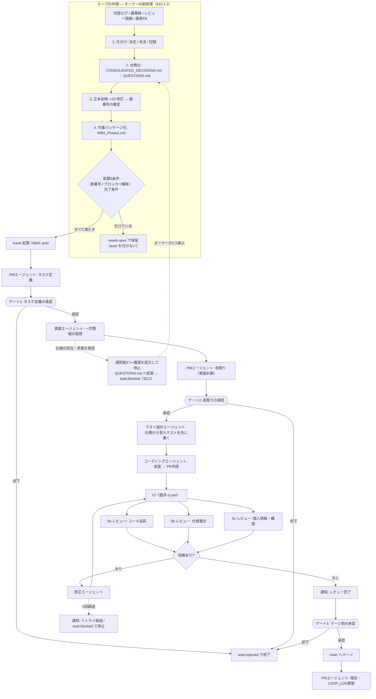

# 自律開発ループ設計

GitHub Issue を起点に、複数の AI エージェントが調査・実装・レビュー・修正を行い、
人間（プロジェクトオーナー）が要所だけ承認する開発ループの設計書。

- 対象リポジトリ: `KoshiNakano1017/Fuyu`（**public**）
- 実行基盤: GitHub Actions（オーナーの PC 電源に依存しない）
- 関連: `CLAUDE.md`（開発ルールの正本）、`TASKS.md`、`QUESTIONS.md`、`LOOP_LOG.md`

---

## 0. このループがやらないこと（最上位制約）

> [!danger] 仕様・設計の意思決定はオーナーの専権事項
> **「なぜその仕様を選んだか」「どういう論点があったか」「どんな背景から来ているか」は
> オーナーの頭の中にしかない。** ループはそれを推測して埋めてはならない。
>
> - ループは **`docs/spec/` に既に確定している仕様を実装するだけ**の存在である
> - 仕様が無い・曖昧・矛盾している箇所を見つけたら、**実装せず `QUESTIONS.md` に起票して停止する**
>   （ただし**正本と派生文書の矛盾**で、リスクが高に達しない場合は例外がある。§3.3）
> - `docs/spec/` 配下（正本 v13・Master Index・CONSOLIDATED_DECISIONS.md）を
>   **ループが書き換えることを禁止する**（§8.2 のガードで機械的に強制する）
> - ビジネス・法務・財務・UX の判断をしない（CLAUDE.md §7 を継承）

したがってこのループの守備範囲は次の一点に尽きる。

**「確定済みの仕様 → 動くコード」の変換を、人間のレビュー負荷を下げながら自動化する。**

仕様そのものの生成・改訂は、オーナーが別セッション（対話型）で行う。

---

## 1. 決定事項（2026-08-29 オーナー確定）

| # | 論点 | 決定 | 理由 |
| --- | --- | --- | --- |
| 1 | 実行基盤 | **GitHub Actions 完結** | PC 電源に依存せず動く。参照範囲がリポジトリ内に限定されるため、CLAUDE.md §7.1（会員データ持ち込み禁止）が**構造的に守られる**副次効果がある |
| 2 | 承認ゲート | **3点で停止**（タスク定義・段取り完了・マージ前） | What / How / 反映 の3点を押さえれば統制は足りる。レビュー完了とリトライ超過は通知のみ |
| 3 | 初期スコープ | **足場は人間が先に作り、ループは機能単位** | 現状アプリコードが1行も無い。土台を自動生成させるとレビュー基準が揺れる |
| 4 | 通知チャネル | **GitHub 標準（メール＋モバイルアプリ）** | 承認と通知が同じ場所で完結。追加実装・追加コストがゼロ |

---

## 2. 全体フロー



**点線枠が今回の追記部分。** ループは「処理済みの材料」しか受け取らない。
前処理を飛ばして `auto` を付けると、調査エージェントが同じ空白を発見して
`QUESTIONS.md` へ起票し `auto:blocked` で止まる（図の下段の点線）。
**つまり前処理は、やらなければループが代わりにやってくれるものではなく、
やらなければ1往復ぶんのトークンを捨てて同じ場所に戻ってくるだけである。**

---

## 3. エージェント定義

全エージェントとも `anthropics/claude-code-action@v1` を使い、モデルは **`claude-opus-5`** に統一する
（既存 `claude-review.yml` と同じ）。コストは**モデルを下げるのではなく `effort` で調整する**。

> [!note] モデルと effort の指定方法（2026-08-31 検証済み・§12 #1 解消）
> `claude-code-action` の **`claude_args` は Claude Code CLI へ引数をそのまま渡す**入力である。
> CLI には `--model` と `--effort`（`low` / `medium` / `high` / `xhigh` / `max`）が実在するため、
> 両方ともこの1行で指定できる。プロンプト側で代替する必要はない。
>
> ```yaml
> claude_args: '--model claude-opus-5 --effort xhigh'
> ```

| # | エージェント | 責務 | effort | 書き込み権限 | 出力先 |
| --- | --- | --- | --- | --- | --- |
| 1 | **PM（受付・定義）** | 窓口・統制。Issue の受付、タスク定義、段取り、各エージェントの起動判断 | medium | `TASKS.md` / Issue コメント | Issue コメント |
| 2 | **調査** | 内部ドキュメント（`docs/spec/`）と公式ドキュメント（Next.js / Supabase 等）を調べ**一次情報**を取得。**判断はせず事実だけ返す** | high | なし（読み取り専用） | Issue コメント（調査メモ） |
| 3 | **テスト設計** 🆕 | 仕様から**先に**受入テストを書く。実装を見ずに仕様だけを見る | high | `tests/` のみ | PR（テストのみのコミット） |
| 4 | **コーディング** | 承認済みの段取りに従って実装。テストを通す。ブランチを切り PR を作る | xhigh | 実装コード | PR |
| 5a | **レビュー（コード品質）** | CLAUDE.md §4（リーダブルコード）・バグ・認可漏れ | xhigh | なし（読み取り専用） | PR レビューコメント |
| 5b | **レビュー（仕様適合）** 🆕 | タスク定義が引用した**仕様の節番号と実装を突き合わせる**。過不足を判定 | xhigh | なし（読み取り専用） | PR レビューコメント |
| 5c | **レビュー（個人情報・機密）** 🆕 | CLAUDE.md §3。**gitleaks が検出できない日本語の氏名・住所**を人間の目で見るように探す | xhigh | なし（読み取り専用） | PR レビューコメント |
| 6 | **修正** | レビュー3種の指摘と CI 失敗を修正 | high | 実装コード・テスト | PR への追加コミット |
| 7 | **PM（報告）** | マージ結果を `LOOP_LOG.md` に記録し Issue をクローズ | medium | `LOOP_LOG.md` | Issue コメント |

`effort` は思考深度と総トークン消費を制御するパラメータ（`low` / `medium` / `high` / `xhigh` / `max`）。
コーディング・レビューのような agentic 用途は `xhigh` が推奨値。

**5a / 5b / 5c は並列に実行する。** 観点を混ぜた1体のレビューアより、観点を絞った3体のほうが
見落としが減る。並列なので所要時間は1体のときと変わらない。

### 3.0 なぜこの3体を足したか

| 追加 | 埋める穴 |
| --- | --- |
| **テスト設計** | 実装者が自分で書くテストは「作ったもの」を検証しがちで「仕様が要求すること」を検証しない。**仕様だけを見て先にテストを書く**ことで、完了条件が実行可能な形で固定される。CLAUDE.md §4.4 が必ずテストを要求する**認可・金額計算・個人情報**の3領域は、この方式を必須とする |
| **レビュー（仕様適合）** | 既存のレビュー観点は「コードとして良いか」しか見ておらず、**「仕様どおりか」を誰も見ていない**。§0 の「ループは仕様から逸脱しない」を検査する担当がいないと、品質の高い"別物"が出来上がる |
| **レビュー（個人情報・機密）** | CLAUDE.md §3.1 が明言しているとおり、**pre-commit のパスガードも CI の gitleaks も日本語の氏名・住所を検出できない**。public リポジトリで一度 push したら取り消せない以上、ここだけは専任を置く価値がある |

### 3.1 調査エージェントの境界（重要）

調査エージェントは **「何が書いてあるか」を返すだけ**で、**「だからこうすべき」を言わない**。

| やる | やらない |
| --- | --- |
| `docs/spec/` の該当節を引用し、節番号とともに提示する | 仕様の空白を埋める提案をする |
| 公式ドキュメントの API 仕様・制約・非推奨情報を出典URL付きで提示する | ライブラリの採否を決める |
| 仕様間の矛盾を「矛盾がある」と報告する | どちらが正しいかを決める |
| `QUESTIONS.md` の未回答項目が今回のタスクに掛かるかを判定する | 未回答項目を「たぶんこうだろう」と扱う |
| **成り立つ選択肢を最大3つ挙げ、推奨を1つ述べる**（§3.2） | **推奨した案を採用済みとして実装に進む** |

矛盾・空白を見つけた場合は `QUESTIONS.md` に起票し、**そのタスクは `auto:blocked` にして止める**。
ただし**ただ止めるだけにはしない**。止め方の作法を §3.2 に定める。

### 3.2 質問の作法（2026-08-31 追加）

> [!important] 「止まる」と「聞く」は別物である
> §3.1 は「曖昧なら止まれ」としか定めていない。しかし**止まるだけのループは、
> オーナーに「何が論点だったか」を一から再構成させる**。
> 論点はエージェントの側にあり、それを渡さずに止まるのは仕事を半分で投げることにあたる。
>
> **止まるときは、必ず選択肢を添えて止まる。**

#### 3.2.1 何を質問してよいか（実質的な曖昧さ）

**思いついた疑問を全部投げてはいけない。** 質問が多いループは、承認と同じく形骸化する。
質問してよいのは、**答えによって次の6つのいずれかが変わる**場合に限る。

| # | 軸 | 本プロジェクトでの具体例 |
| --- | --- | --- |
| 1 | **実装の方向** | Server Actions で書くか Edge Function で書くか |
| 2 | **検証の方法** | 受入テストで何を「合格」とみなすか |
| 3 | **ロールアウト** | 既存会員に見せるか、新規登録分だけか |
| 4 | **データの扱い** | その項目を DB に保存するのか、都度計算するのか（CLAUDE.md §3） |
| 5 | **権限** | `role` で判定するのか `member_type` で判定するのか（CLAUDE.md §4.1・**認可に member_type を使わない**） |
| 6 | **ユーザーに見える振る舞い** | 認可を直すと、これまで見えていた画面が見えなくなるか（§7.1 の警告と同じ論点） |

**この6軸に当たらない疑問は質問しない。** 変数名・ファイル配置・ログ出力の細かさなどは
エージェントが決めてよい（CLAUDE.md §4 の範囲内であれば結果は同値になる）。

> [!warning] 5と6は本プロジェクトの事故ポイントそのもの
> **権限（5）と、ユーザーに見える振る舞い（6）は、この2つだけ特別扱いする。**
> §7.1 が定めるとおり「認可の穴を塞ぐと画面の見え方が変わる」ケースは
> 仕様判断であって自動修正してはならない。6軸のうち **5・6 に該当した質問は、
> 低リスク区分であっても中リスクへ繰り上げる**（§4.1）。

#### 3.2.2 質問の形式（守らないと承認が重くなる）

| ルール | 内容 | 守らないとどうなるか |
| --- | --- | --- |
| **選択肢は最大3つ** | 現実に成り立つ案だけを挙げる | 4つ以上あると比較が「検討」になり、朝の数分で終わらない |
| **推奨案とその理由を1つ書く** | 「推奨は B。理由は〜」 | オーナーが全部ゼロから評価することになる |
| **1回に1問** | 複数の論点を1コメントに束ねない | どれに答えたのか追跡できない（CLAUDE.md §5.2 の1コミット1論点と同じ理由） |
| **既に決まっていることは聞かない** | `CONSOLIDATED_DECISIONS.md` と正本 v13 を先に照合する | 決定済み事項の蒸し返しはオーナーの信頼を最も早く失う |
| **どちらが正しいかは言わない** | 推奨は述べてよいが、**採否は決めない** | §0 違反。エージェントが仕様を決めたことになる |

> [!danger] 推奨を書くことと、決めることの違い
> 「**推奨は B です**」は許される。「**B にしました**」は §0 違反である。
> 推奨は**オーナーの判断を速くするための材料**であって、判断の代行ではない。
> 迷ったら「実装せず、選択肢を出して止まる」が常に正しい。

#### 3.2.3 出力の形

`QUESTIONS.md` への起票と、Issue コメントでの提示を**同時に**行う。

```markdown
## ⚠️ 実装を止めました：キャッシュバックの単位が未確定です

**何が決まっていないか**
`v13 §5.10.2` は「キャッシュバック 5,000」と書いているが、単位の記載がない。

**なぜ止めたか**（該当する軸：4. データの扱い）
円かコインかで付与額が1.25倍ずれる。推測で実装すると、
金額計算のテスト（CLAUDE.md §4.4）が「間違った期待値」で固定される。

**選択肢**
- A. 円として扱う（`uii` テーブルに `amount_yen` で保存）
- B. コインとして扱う（`uii` テーブルに `amount_uii` で保存）
- C. 両方保持し、表示時に換算する

**推奨: B。** 理由は §9 #51 が「Uii は独自単位として扱う」と決めており、
円に寄せると将来レートを変えた時に過去データが壊れるため。

**起票先**: `QUESTIONS.md` #23 ／ ラベル: `auto:blocked`
```

**この形式が守られていれば、オーナーの作業は「A/B/C を1文字返す」だけで済む。**
返答を受けて `QUESTIONS.md` を回答済みにすれば、§10.1.5 の導線3が Issue を自動で解放する。

---

### 3.3 低・中リスクの矛盾は、正本優先で進行する（2026-09-03 追加）

> [!important] 「矛盾で必ず止まる」は、頻度の高い矛盾では過剰である
> 試運転（Issue #4）で判明した。仕様書は `docs/spec/` 配下に何十ものファイルへ分散しており、
> 正本（v13）を改訂しても派生文書（`画面設計.md`・`HTMLモック_v13.md` 等）への反映が漏れることが
> 実際に起きる。**正本と派生文書が食い違うたびに実装を止めていては、ループが「矛盾を報告するだけの
> 機械」になる。** §4.1 の高リスクに該当しない限り、**「どちらが正しいかに既に答えがある矛盾」
> （＝正本 vs 派生文書）は、止めずに進める。**

**この規定が対象とするのは「正本 vs 派生文書」の矛盾に限る。** 次は対象外で、従来どおり §3.2 の作法で止まる。

| 対象外のケース | 理由 |
| --- | --- |
| 仕様そのものが存在しない（正本にも記載が無い） | 「正本優先」で解決できる対立が無い |
| 正本内部で自己矛盾している | どちらが正本の意図か、ループには判断できない |
| リスク判定が**高**（§4.1） | 認可・金額・個人情報・DBマイグレーション等は、矛盾があるという事実自体を人間に見せる価値が高い |

**進め方**:

1. `CLAUDE.md` §1.1「矛盾時は正本が勝つ」に従い、**正本（v13）の記述を採用**して段取り・実装を進める
2. その矛盾を `QUESTIONS.md` に**非ブロックの課題として記録**する（`<!--blocked-->` は付けない。
   見出しに「⚠️ 実装を止めました」を使わず、「正本優先で進行中」であることが分かる書き方にする。
   形式は §3.3.1）
3. Issue のコメントには、正本のどちらを採用したかと、その根拠（節番号）を明記する
4. `auto:blocked` にはしない。通常どおりリスクマーカー（`<!--risk:low/mid-->`）を出力し、ゲートへ進む

> [!note] 軸5・6（権限・ユーザーに見える振る舞い）にも例外なく適用する（2026-09-03 オーナー確定）
> §3.2.1 は軸5・6を「事故ポイントそのもの」として特別扱いし、該当すれば中リスクへ繰り上げると
> 定めている。この繰り上げ自体は維持するが、**繰り上げた結果が中リスクにとどまるなら、この §3.3 の
> 対象に含める**（止めずに進める）。§4.1 の高リスク条件に独立して該当する場合のみ、引き続き止まる。

> [!warning] 「どちらが正しいか決めない」原則との関係
> §3.1・§3.2 は「調査エージェントはどちらが正しいかを決めない」と定めている。これと矛盾しないのは、
> **正本 vs 派生文書の対立は、`CLAUDE.md` §1.1 が既に「正本が勝つ」と決めているため**である。
> ループは新しい判断をしていない。**既存ルールの機械的な適用**にすぎない。
> 一方、正本そのものが曖昧・自己矛盾・記載無しの場合は、優先すべき「正本側」が存在しないため、
> 引き続き §3.2 の作法（選択肢A/B/C＋推奨）で止まる。

#### 3.3.1 非ブロックの記録の形

`QUESTIONS.md` への追記と、Issue コメントでの提示を同時に行う。

````markdown
## ⚡ 正本優先で進行：〔何が食い違っているか、1行で〕

**何が食い違っているか**
〔正本のどの記述と、どの派生文書のどの記述が食い違っているか〕

**採用した内容**
正本 v13 §X.Y の記述を採用し、実装・段取りを進める。〔理由があれば1文〕

**放置すると何が起きるか**
〔派生文書を放置した場合の実害。無ければ「実害は軽微」と明記〕

**起票先**: `QUESTIONS.md`「〔追記した見出しのタイトル〕」（派生文書の訂正はオーナー判断）
````

---

## 4. 承認ゲートと通知

### 4.1 リスクベース・ゲーティング（2026-08-29 オーナー可決）

**ゲートは賭け金に比例させる。** 全タスクを一律3ゲートにすると、文言修正もDBマイグレーションも
同じ承認回数を要求することになり、自律性が犠牲になるだけで安全性は上がらない。

PM エージェントがタスクをリスク3区分に判定し、区分ごとに通過するゲート数を変える。

| 区分 | 判定条件（**1つでも該当すれば上位区分**） | ゲート | 承認回数 |
| --- | --- | --- | --- |
| **高** | 認可・ロール判定／金額・Uii・宿泊券の計算／個人情報の入出力／DBマイグレーション／外部連携（LINE・Supabase Auth・決済）／セキュリティ高リスク（§7.1） | 1・2・3すべて | 3回 |
| **中** | 上記に該当しない新規機能・既存機能の振る舞い変更 | 2・3 | 2回 |
| **低** | 表示文言の修正／テスト追加のみ／振る舞いが変わらないリファクタ／コメント・型注釈のみ | **なし**（自動通過） | 0回 |

**低リスクの自動通過には次の全条件を課す。** 1つでも欠ければ中リスクに繰り上げる。

- CI が全ジョブ緑
- レビュー3種の **[必須] 指摘がゼロ**
- 変更ファイルが段取りで宣言した範囲内
- 新規依存パッケージの追加なし
- `docs/spec/` に差分なし（§8.2）
- `supabase/migrations/` に差分なし

> [!important] リスク判定そのものが最初のゲートで承認される
> **高リスクを「低」と誤判定されるのが唯一の致命的な失敗モード。**
> そこで PM は**まず区分判定だけを Issue にコメントし**、中・高であればゲート1へ進む。
> 低と判定した場合は**判定理由つきで通知**し、オーナーが異議を出せる猶予を設ける（既定30分。
> `auto:low-risk` ラベルを外せば中リスクに落ちる）。
> **異議申立ての窓を持たない自動通過は認めない。**

### 4.2 ゲートの中身

GitHub Actions の **Environments + Required reviewers** で実現する。
承認待ちのジョブは実行時間を消費せず、オーナーには**メールが届き、GitHub モバイルアプリから承認/却下できる**。

| ゲート | Environment 名 | 何を承認するか | オーナーが見るもの |
| --- | --- | --- | --- |
| 1 | `gate-task-definition` | **What**: このタスクをやるのか、スコープとリスク区分は正しいか | Issue コメントのタスク定義（目的・完了条件・影響範囲・参照した仕様の節番号・**リスク区分と判定理由**） |
| 2 | `gate-task-plan` | **How**: この作り方でよいか | Issue コメントの段取り（変更ファイル一覧・テスト方針・調査結果の要約・リスク） |
| 3 | `gate-merge` | **反映**: main に入れてよいか | PR の差分・CI の結果・レビュー指摘と対応状況・**セキュリティスキャン結果** |

### 4.3 通知（止めない＝流して自動で進む）

Issue / PR コメントで**オーナーを `@mention`** する。GitHub の通知設定によりメールとモバイルに届く。

| タイミング | 内容 |
| --- | --- |
| レビューエージェント実行完了時 | 指摘件数と重要度別の内訳。指摘ゼロならその旨 |
| エラー・リトライが5回以上 | 何が何回失敗したか、最後のエラーへのリンク。**ループは `auto:blocked` で停止する** |

> [!note] なぜ5回で「停止」するのか
> 指示は「通知」だが、5回失敗するタスクは自動では解決しない可能性が高く、
> 放置すると Actions の実行時間とトークンを消費し続ける。
> **通知したうえで停止**し、オーナーの判断を待つのが安全側。再開はラベル付け替えで行う。

---

## 5. 状態遷移（Issue ラベル）

ループの状態は **Issue のラベル**で表現する。これにより、途中で失敗しても
どこまで進んだかが Issue を見れば分かり、ラベルを戻すだけで再開できる。

| ラベル | 意味 | 次に動くもの |
| --- | --- | --- |
| `auto` | ループ対象として起票された | WF1（計画） |
| `auto:planning` | PM/調査が動作中 | — |
| `auto:approved` | ゲート1・2を通過した | WF2（実装） |
| `auto:implementing` | コーディング中 | — |
| `auto:review` | PR 作成済み、レビュー/修正ループ中 | WF3（レビュー・マージ） |
| `auto:blocked` | 仕様未確定 / リトライ超過で停止 | 人間 |
| `auto:done` | マージ完了 | — |
| `auto:rejected` | ゲートで却下された | 人間 |

---

## 6. ワークフロー構成

承認ゲートの境界でワークフローを分割する。1本の長大な run にしないのは、
**却下・失敗時に途中から再開できる**ようにするため。

| ファイル | トリガ | 担当エージェント | ゲート |
| --- | --- | --- | --- |
| `.github/workflows/auto-01-plan.yml` | Issue に `auto` ラベルが付いた時 | PM → 調査 → PM | ゲート1、ゲート2 |
| `.github/workflows/auto-02-implement.yml` | Issue が `auto:approved` になった時 | テスト設計 → コーディング | なし |
| `.github/workflows/auto-03-review-merge.yml` | 上記 PR への push / CI 完了 | レビュー3種（並列）→ 修正 → PM | ゲート3 |

エージェントのプロンプトは `.github/prompts/` に1体1ファイルで置く。
`pm-define` / `research` / `pm-plan` / `test-design` / `coding` /
`review-quality` / `review-spec` / `review-privacy` / `fix` / `pm-report` の10本。
CLAUDE.md §1.2 の「新規ドキュメントを作らない原則」は `docs/` 配下の**仕様書**が対象であり、
`.github/` 配下は CI/CD の構成物＝コードなのでこの原則の対象外とする。

### 6.1 骨子: `auto-01-plan.yml`

```yaml
name: 自律ループ 01 計画

on:
  issues:
    types: [labeled]

# 同一 Issue の多重起動を防ぐ
concurrency:
  group: auto-plan-${{ github.event.issue.number }}
  cancel-in-progress: false

permissions:
  contents: write
  issues: write

jobs:
  # ── PM: Issue をタスク定義に落とす ─────────────────
  define:
    if: github.event.label.name == 'auto'
    runs-on: ubuntu-latest
    timeout-minutes: 30
    steps:
      - uses: actions/checkout@v4
      - uses: anthropics/claude-code-action@v1
        with:
          anthropic_api_key: ${{ secrets.ANTHROPIC_API_KEY }}
          # モデルと effort は claude_args で CLI へ直接渡す（§3）
          claude_args: '--model claude-opus-5 --effort medium'
          # 権限を宣言的に絞る（§7.2）
          settings: .github/claude-settings/pm.json
          prompt: |
            .github/prompts/pm-define.md を読み、その指示に従うこと。
            対象 Issue 番号: ${{ github.event.issue.number }}

  # ── ゲート1: タスク定義の承認（ここで停止する）──────
  approve-definition:
    needs: define
    runs-on: ubuntu-latest
    environment: gate-task-definition
    steps:
      - run: echo "タスク定義が承認されました"

  # ── 調査 → PM: 段取り ─────────────────────────────
  plan:
    needs: approve-definition
    runs-on: ubuntu-latest
    timeout-minutes: 45
    steps:
      - uses: actions/checkout@v4
      - name: 調査エージェント
        uses: anthropics/claude-code-action@v1
        with:
          anthropic_api_key: ${{ secrets.ANTHROPIC_API_KEY }}
          claude_args: '--model claude-opus-5 --effort high'
          # 読み取り専用（§3 の書き込み権限「なし」を機械的に強制する）
          settings: .github/claude-settings/readonly.json
          prompt: |
            .github/prompts/research.md を読み、その指示に従うこと。
            対象 Issue 番号: ${{ github.event.issue.number }}
      - name: PMエージェント（段取り）
        uses: anthropics/claude-code-action@v1
        with:
          anthropic_api_key: ${{ secrets.ANTHROPIC_API_KEY }}
          claude_args: '--model claude-opus-5 --effort medium'
          settings: .github/claude-settings/pm.json
          prompt: |
            .github/prompts/pm-plan.md を読み、その指示に従うこと。
            対象 Issue 番号: ${{ github.event.issue.number }}

  # ── ゲート2: 段取りの承認（ここで停止する）──────────
  approve-plan:
    needs: plan
    runs-on: ubuntu-latest
    environment: gate-task-plan
    steps:
      - run: echo "段取りが承認されました"

  # ── 次フェーズへ引き渡し ───────────────────────────
  handoff:
    needs: approve-plan
    runs-on: ubuntu-latest
    steps:
      - name: ラベルを auto:approved に付け替え
        env:
          # PAT でないと次のワークフローが起動しない（§8.1）
          GH_TOKEN: ${{ secrets.AUTOMATION_PAT }}
        run: |
          gh issue edit "${{ github.event.issue.number }}" \
            --repo "${{ github.repository }}" \
            --remove-label "auto:planning" --add-label "auto:approved"
```

### 6.2 リトライ回数の判定と停止

修正ループの回数は Issue コメントに残したマーカーで数える。5回に達したら通知して停止する。

```yaml
      - name: リトライ回数の判定
        env:
          GH_TOKEN: ${{ secrets.AUTOMATION_PAT }}
          ISSUE: ${{ github.event.issue.number }}
          REPO: ${{ github.repository }}
          RUN_URL: ${{ github.server_url }}/${{ github.repository }}/actions/runs/${{ github.run_id }}
        run: |
          set -euo pipefail
          COUNT="$(gh issue view "$ISSUE" --repo "$REPO" --json comments \
            --jq '[.comments[].body | select(test("^<!--retry-->"))] | length')"
          echo "これまでのリトライ: ${COUNT}回"
          if [ "$COUNT" -ge 5 ]; then
            gh issue comment "$ISSUE" --repo "$REPO" \
              --body "@KoshiNakano1017 リトライが5回に達したため自動処理を停止しました。最後の実行: ${RUN_URL}"
            gh issue edit "$ISSUE" --repo "$REPO" --add-label "auto:blocked"
            exit 1
          fi
```

---

## 7. 安全制約

CLAUDE.md の既存ルールをループにも機械的に適用する。

| 制約 | 実現方法 |
| --- | --- |
| **仕様書を書き換えない**（§0） | ①`settings` で編集ツールを拒否（§7.2）②`docs/spec/` への差分を検出したらジョブを失敗（§8.2）の**二重**で守る |
| **エージェントごとの書き込み範囲**（§3） | プロンプトの文章ではなく `settings` 入力でツールを制限する（§7.2） |
| **main へ直接 push しない**（§5.1） | ブランチ保護 + ループは必ず PR 経由 |
| **CI が赤い PR をマージしない**（§6.2） | ゲート3の前段で `ci.yml` の成功を必須にする |
| **機密・個人情報を出さない**（§3） | 既存 `secret-scan` ジョブ（gitleaks 全履歴）が PR で必ず走る |
| **会員データに触れない**（§7.1） | GitHub Actions はリポジトリしか見えない。ボルト側の実データは**物理的に到達不能** |
| **未回答の論点を確定扱いしない**（§7） | 調査エージェントが `QUESTIONS.md` を照合し、該当があれば `auto:blocked` |
| **1コミット1論点**（§5.2） | コーディングエージェントのプロンプトで強制。1 Issue = 1 機能に限定 |
| **public リポジトリ**（§3.1） | Actions ログも公開される。プロンプト内で秘匿値を出力しない |

---

### 7.1 セキュリティスキャンとリスク分析

コード層のスキャンを CI に常設し、**検出結果を重要度で3系統に振り分ける**。

#### 使うスキャナ

| 層 | ツール | 対象 |
| --- | --- | --- |
| 秘密情報 | gitleaks（既存 `ci.yml`） | APIキー・トークン・鍵ファイル |
| SAST | **CodeQL**（public リポジトリは無料） | 意味解析。SQLi・XSS・パストラバーサル・認可バイパス |
| 依存脆弱性 | `npm audit` + Dependabot | CVE |
| 設定・認可 | 独自チェック | RLS ポリシーの欠落したテーブル、`service_role` キーのクライアント側流出 |

#### リスク判定

**ツールが返す severity をそのまま使わない。** CVSS や CodeQL の重大度は文脈を知らないため、
本プロジェクト固有の観点で再評価する。判定の軸は次の3つ。

1. **到達可能性** — ユーザ入力から到達するか、開発用スクリプト内か
2. **認可境界** — ロール判定・RLS に触れるか
3. **個人情報** — 実名・住所・電話番号の露出経路になりうるか

| 区分 | 該当 | 処理 |
| --- | --- | --- |
| **高** | 認可バイパス／個人情報の漏洩経路／秘密情報の露出／RLS 欠落／実データに到達する SQLi・XSS | **修正エージェントが同一PR内で修正する。** 修正後もゲート3で人間が必ず確認する |
| **中** | 実行経路にある依存CVE／CSRF／レート制限の欠落／ログにPIIが混ざる恐れ | **別 Issue を自動起票**（`security` ラベル）。現PRはブロックしない |
| **低・警告** | 実行経路にないCVE／ベストプラクティス逸脱／情報量の乏しい警告 | **記録のみ**。`.github/learning/security-low.jsonl` に追記し、`docs/セキュリティ既知事項.md` を自動生成 |

> [!warning] 「高リスクは自動修正」の例外
> **セキュリティ修正が仕様の変更を伴う場合は、自動修正してはならない。**
> 例: 認可の穴を塞ぐと、これまで見えていた画面が見えなくなる。
> これは**振る舞いの変更＝仕様判断**であり §0 に抵触する。
> この場合は修正せず、`QUESTIONS.md` に起票し `auto:blocked` で停止してオーナーに上げる。
> 修正エージェントには「穴を塞ぐと既存の画面・APIの見え方が変わるか」を
> **必ず自己判定させ、変わるなら止める**。

> [!note] このリポジトリ固有の重み付け
> 本アプリは実名370名分の個人情報を扱い、かつリポジトリは **public**。
> したがって**個人情報の露出経路は、ツールの severity が何であれ常に「高」**として扱う。
> gitleaks も CodeQL も日本語の氏名・住所は検出できない（CLAUDE.md §3.1）ため、
> ここはレビュー 5c（個人情報・機密）が最後の防波堤になる。

---

### 7.2 権限をプロンプトではなく設定で絞る（2026-08-31 追加）

§3 の表は各エージェントの「書き込み権限」を定めているが、**これをプロンプトの文章だけで
守らせてはいけない**。「読み取り専用です」と書いても、エージェントは書き込みツールを持っている。

`claude-code-action` には **`settings` 入力**があり、Claude Code の設定 JSON
（ファイルパスまたは JSON 文字列）を渡せる。ここで**ツールの使用可否そのものを宣言的に制限する**。

| ファイル | 対象エージェント | 方針 |
| --- | --- | --- |
| `.github/claude-settings/readonly.json` | 調査・レビュー 5a/5b/5c | 編集系ツールを一切許可しない |
| `.github/claude-settings/pm.json` | PM（定義・段取り・報告） | `TASKS.md` / `LOOP_LOG.md` と `gh issue comment` のみ |
| `.github/claude-settings/test.json` | テスト設計 | `tests/` 配下のみ書き込み可 |
| `.github/claude-settings/code.json` | コーディング・修正 | 実装コード可。**`docs/spec/` は拒否**（§8.2 の二重化） |

> [!important] プロンプトによる禁止は「最後の防波堤」であって「最初の壁」ではない
> CLAUDE.md §7.1 は「最後の防波堤は自動検査ではなくエージェント自身の判断」と述べている。
> これは**自動検査を諦めてよいという意味ではない**。順序は逆で、
> **機械で止められるものは機械で止め、止められないもの（日本語の氏名など）だけを判断に委ねる。**
>
> `docs/spec/` の保護は、①`settings` でツールを拒否 ②§8.2 で差分を検出して失敗
> の**二重**にする。①が破られても②で止まる。

---

## 8. 既知の落とし穴（実装前に必ず読む）

### 8.1 `GITHUB_TOKEN` で作った PR は CI を起動しない

GitHub の仕様上、**`GITHUB_TOKEN` を使って作成した PR やラベル変更は、
別のワークフローをトリガしない**（無限ループ防止のため）。

これを踏まえないと次の事故が起きる。

- コーディングエージェントが作った PR に対して **`ci.yml` も `claude-review.yml` も走らない**
- → CLAUDE.md §6.2 の「CI が赤い PR はマージしない」が**検証不能なまま素通りする**

**対策**: PR 作成とラベル付け替えには **`AUTOMATION_PAT`**（fine-grained PAT、
または GitHub App のトークン）を使う。Repository Secrets に登録する（§3.2）。

必要な権限（fine-grained PAT）: `Contents: Read and write` / `Pull requests: Read and write` /
`Issues: Read and write` / `Workflows: Read and write`

### 8.2 仕様書ガード

`docs/spec/` への変更をループが行っていないことを、マージ前に機械的に確認する。

```yaml
      - name: 仕様書が変更されていないことを確認
        run: |
          set -euo pipefail
          CHANGED="$(git diff --name-only origin/main...HEAD -- 'docs/spec/' || true)"
          if [ -n "$CHANGED" ]; then
            echo "::error::自律ループは docs/spec/ を変更できません（自律開発ループ設計 §0）"
            printf '%s\n' "$CHANGED"
            exit 1
          fi
```

### 8.3 その他の制約

| 項目 | 値 | 影響 |
| --- | --- | --- |
| 1ジョブの最大実行時間 | 6時間 | コーディングは `timeout-minutes: 60` 程度に明示的に絞る |
| 承認待ちの最大時間 | 30日 | 放置すると run が失敗する。ラベルから再開できる設計にしてある |
| fork からの PR に Secrets は渡らない | — | 同一リポジトリ内ブランチ運用（§5.1）を守れば問題なし |
| 同時実行 | 実装フェーズは直列化 | `concurrency: auto-implement`（`cancel-in-progress: false`）でマージ競合を防ぐ |

---

## 9. 導入手順（オーナー作業）

ループを動かす前に、以下は**人間が一度だけ**行う。
**順序に意味がある。** フェーズ0が終わっていないのにフェーズ2へ進むと、レビューの基準が定まらない。

### フェーズ0：前提（これが無いとループを作る意味がない）

| # | 作業 | 完了条件 | 根拠 |
| --- | --- | --- | --- |
| 0-1 | **足場の作成** — Next.js 雛形・Supabase スキーマ・Playwright 設定を、承認つき対話セッションで作成しマージ | `main` で `npm run build` と E2E が通る | 決定#3。土台を自動生成させるとレビュー基準が揺れる |
| 0-2 | **ブランチ保護** — `main` に「PR 必須」「CI 必須」 | 直接 push が拒否される | CLAUDE.md §5.1 |

### フェーズ1：GitHub 側の器（順不同・15分程度）

| # | 作業 | 詳細 |
| --- | --- | --- |
| 1-1 | **Environments の作成** | Settings → Environments で `gate-task-definition` / `gate-task-plan` / `gate-merge` の3つ。それぞれ **Required reviewers にオーナー自身**を設定（§4.2） |
| 1-2 | **Secrets の登録** | `ANTHROPIC_API_KEY`（既存）、**`AUTOMATION_PAT`（新規）**。PAT の権限は §8.1 の4つ |
| 1-3 | **ラベルの作成** | §5 の8種類 ＋ `needs-spec`（§10.1）＋ `auto:low-risk`（§4.1）＋ `security`（§7.1）＝ **11種類** |
| 1-4 | **Issue テンプレート** | `.github/ISSUE_TEMPLATE/auto-task.yml`（§10.1 の5項目を必須フィールドに） |
| 1-5 | **通知設定** | Notification settings でメール受信を有効化。スマホ承認するなら GitHub モバイルアプリ |

### フェーズ2：ループの中身（ここが作業量の大半）

| # | 作業 | 成果物 | 参照 |
| --- | --- | --- | --- |
| 2-1 | **権限設定 4本** | `.github/claude-settings/{readonly,pm,test,code}.json` | §7.2 |
| 2-2 | **プロンプト 10本** | `.github/prompts/` に `pm-define` / `research` / `pm-plan` / `test-design` / `coding` / `review-quality` / `review-spec` / `review-privacy` / `fix` / `pm-report` | §6 |
| 2-3 | **ワークフロー 3本** | `.github/workflows/auto-0{1,2,3}-*.yml` | §6 |
| 2-4 | **仕様書ガード** | auto-03 に §8.2 のステップを組み込む | §8.2 |

> [!important] プロンプト10本には §3.2 を必ず埋め込む
> `research` / `pm-define` / `pm-plan` の3本には、**§3.2 の6軸と質問形式をそのまま転記する**。
> 「曖昧なら止まれ」だけを書いたプロンプトは、止まるが選択肢を出さない。
> 逆に `coding` / `fix` には**質問させない**（段取り承認済みなので、そこで聞くのは手戻り）。

> [!warning] プロンプトに `CRITICAL` `必ず` を書きすぎない
> §10.7 のランブックにあるとおり、過剰な強調は指摘の的外れを招く。
> **プロジェクト固有の非標準的な慣行だけを書く**（§11.2）。
> 「リーダブルコードに従え」のような一般論は CLAUDE.md が既に持っているので書かない。

### フェーズ3：試運転（ここを飛ばさない）

**いきなり本番タスクを流さない。** 検証したいのは実装品質ではなく**統制が効くか**である。

| # | 試験 | 使う Issue | 期待する結果 |
| --- | --- | --- | --- |
| 3-1 | **ゲートが止まるか** | 表示文言の修正1件（低リスク） | リスク区分が「低」と判定され、**判定理由つきで通知**が来る。30分の異議申立て窓が機能する（§4.1） |
| 3-2 | **中リスクで2回止まるか** | 既存画面に項目を1つ追加 | ゲート2・3で停止し、承認するまで進まない |
| 3-3 | **`docs/spec/` を守るか** | 仕様書に差分が出るタスクをわざと投げる | §8.2 でジョブが失敗する。**§7.2 の settings でも拒否されるか**を両方確認（#5） |
| 3-4 | **PR で CI が走るか** | 3-2 の PR | `ci.yml` が起動している（起動しなければ §8.1 の PAT 設定ミス） |
| 3-5 | **止まり方が正しいか** | 節番号をわざと曖昧にした Issue | `auto:blocked` になり、**§3.2 の形式（選択肢3つ＋推奨）でコメントされている** |
| 3-6 | **スマホで承認できるか** | 3-1 の再実行 | GitHub モバイルアプリの通知から `Review deployments` に到達できる（§10.10.1）。**できなければ朝の運用が PC 前提になる**ので、§10.2 のリズムを見直す |

**3-5 が最も重要。** ここで「矛盾があります」としか言わずに止まったら、
プロンプトへの §3.2 の転記が効いていない。直してから本番に入る。

---

## 10. 運用

### 10.1 Issue の書き方（ここが品質の8割を決める）

**ループの出力品質は Issue の質でほぼ決まる。** 曖昧な Issue を投げると、
調査エージェントが `QUESTIONS.md` を積み上げて `auto:blocked` で止まるだけになる。

`.github/ISSUE_TEMPLATE/auto-task.yml` を用意し、次の5項目を必須にする。

| 項目 | 必須 | 内容 | 書けないとき |
| --- | --- | --- | --- |
| **目的** | ✅ | 何のために作るか。1〜2文 | — |
| **根拠となる仕様** | ✅ | `v13 §5.10.2` のように**節番号で**指定する | **節番号を書けない＝仕様が未確定。ループに投げてはいけない**。先にオーナーが仕様を決める |
| **完了条件** | ✅ | 「〜が〜できる」の形で、検証可能に箇条書き | 曖昧なら分割が足りていない |
| **スコープ外** | ✅ | 今回やらないことを明示 | 書かないとエージェントが広げる |
| **想定サイズ** | 任意 | S / M / L | L なら分割を検討 |

> [!important] 「根拠となる仕様」が書けない Issue は、ループの対象ではない
> それは**実装タスクではなく仕様策定タスク**であり、オーナーが対話セッションで扱う領域（§0）。
> ラベル `auto` を付けず、`needs-spec` として別扱いにする。

### 10.1.3 起票前のデータ処理（生の材料 → 起票可能な単位）

§10.1 は「Issue に何を書くか」を定めているが、**その材料がどこから来るか**は定めていない。
実際にオーナーの手元にあるのは Issue ではなく、対話ログ・議事録・レビュー指摘といった**生の材料**であり、
これを起票できる単位まで落とす工程が毎回発生する。

ここを暗黙にすると、**未処理の材料がそのまま Issue になる**。節番号を書けずに `needs-spec` が溜まるか、
無理に `auto` を付けた結果、調査エージェントが同じことを発見して `QUESTIONS.md` に起票し
`auto:blocked` で止まる（＝エージェント1往復ぶんのトークンを捨てる）。

> [!important] この工程はループの外側にある
> 生の材料を読んで「何が論点か」「どの仕様に効くか」を判定するのは**仕様判断そのもの**であり、
> §0 によりオーナーの専権事項。ループは**処理済みの材料しか受け取らない**。
> この工程で自動化してよいのは**転記・検索・差分検出だけ**であり、**仕分けと決定は自動化しない**。

#### 材料の所在と流し込み先

| 生の材料 | 所在 | 処理 | 流し込み先 |
| --- | --- | --- | --- |
| オーナーとの対話ログ | Claude セッション | 論点を抽出し「決定」「未決」に仕分ける | 決定 → `CONSOLIDATED_DECISIONS.md` ／ 未決 → `QUESTIONS.md` |
| 朝会・打合せの議事録 | ボルト側 | 同上。**実名・契約金額を含む生ログは持ち込まない**（CLAUDE.md §3.1） | 同上（要約のみ） |
| レビュー指摘まとめ | `docs/spec/2026-08-25レビュー_指摘内容とv1.18.0対応まとめ.md` 等 | 正本へ未反映の指摘を抽出する | 正本 v13 の改訂 → `WBS_Phase1.md` |
| 運用フィードバック | `line-rag-bot` の運用・LINE 側 | **仕様の欠落**か**運用の問題**かを仕分ける | 仕様欠落のものだけ `QUESTIONS.md` |
| 会員データ | ボルト `Knowledge/浮遊街アプリ/会員データ/` | **持ち込まない**（§7.1）。必要なのは統計値だけ | 件数・分布は仕様書記載済みの値を引用 |

#### 処理の4段

図解は **§2 の全体フロー**（点線枠「ループの外側」）へ統合した。各段の完了条件は次のとおり。

| 段 | やること | 済んだと言える条件 |
| --- | --- | --- |
| **1. 仕分け** | 材料の各項目を「決定」「未決」「単なる記録」の3つに分ける | どの項目も3つのどれかに入っている |
| **2. 台帳化** | 決定は `CONSOLIDATED_DECISIONS.md`、未決は `QUESTIONS.md` へ。**まだ Issue にしない** | 未決に優先度とブロック対象が書かれている |
| **3. 正本反映** | 決定が仕様を変えるなら正本 v13 を改訂し**節番号を確定させる**。改訂履歴を残す（CLAUDE.md §1.4・§2） | `v13 §5.10.2` の形で引用できる |
| **4. 作業パッケージ化** | 実装を伴うなら `WBS_Phase1.md` に作業パッケージを追加／更新し、依存・規模・ブロック関係を書く | ステータスが「設計待ち（要件確定済み）」になっている |

**2段目で止めてよい。** 未決のまま台帳に載っているだけの項目は、起票しないのが正しい状態である。
`QUESTIONS.md` の未回答項目は「積み残し」ではなく、**ループに投げてはいけないものを堰き止めている在庫**とみなす。

#### 起票可能かの判定（3条件すべて）

- [ ] **節番号が引ける** — 正本 v13 の確定した節を指せる（§10.1「根拠となる仕様」が埋まる）
- [ ] **ブロッカーが解けている** — その作業パッケージが依存する `QUESTIONS.md` 項目がすべて「回答済み」
- [ ] **完了条件が検証可能** — 「〜が〜できる」で書け、テスト設計エージェントが受入テストへ変換できる

1つでも欠けたら `auto` を付けない。欠けているものが**仕様**なら `needs-spec`（§10.1）、
**分解**なら WBS へ戻して分割する。

#### いつやるか

| タイミング | 作業 | 対応する節 |
| --- | --- | --- |
| 対話セッションの終わり | その場で1〜2段（仕分け・台帳化）まで済ませる。後回しにすると文脈が失われる | — |
| 週次メンテナンス | `QUESTIONS.md` の回答済み項目を3〜4段（正本反映・WBS 更新）へ進める | §10.8 |
| 夜（起票前） | WBS から3条件を満たす作業パッケージを**選ぶだけ**にする | §10.2 |

> [!warning] 夜の起票時に1〜4段をやろうとしない
> 起票の場で仕様を考え始めると、**翌朝のゲート1で「自分の意図」と照合できなくなる**。
> ゲート1は「PM の解釈が自分の意図とズレていないか」を見る場（§10.3）であって、
> 意図そのものを作る場ではない。前処理と起票は、別の時間に分ける。

### 10.1.5 起票の導線（3本）

Issue テンプレートは「書く場所」を用意するだけで、「書けるように助ける」わけではない。
節番号を書けずに詰まるのを防ぐため、**起票にたどり着くまでの導線を3本用意する**。

いずれも**自律ループの外側**にあり、オーナーとの対話を助ける補助であって、
ループの一部ではない（＝仕様判断はしない）。

#### 導線1: WBS → Issue 生成

`docs/spec/WBS_Phase1.md` には既に **14機能領域・約45作業パッケージ**が、
依存関係・規模感（S/M/L）・ブロック関係つきで分解されている。**これを起票の母集団として使う。**

- ワークフロー `wbs-to-issue.yml` を `workflow_dispatch` で手動起動し、作業パッケージ番号を渡す
- テンプレート5項目のうち **目的・根拠となる仕様・想定サイズは WBS から自動で埋まる**
- オーナーの作業は「どれをやるか選ぶ」だけになる
- WBS 側に記録済みのブロック関係（`QUESTIONS.md` 依存）を見て、未回答があれば
  `auto` ではなく `needs-spec` を付けて起票する

#### 導線2: 起票支援エージェント（仕様ナビ）

Issue に `needs-spec` ラベルが付いた時、または本文に `/spec-check` と書かれた時に起動する。

入力（オーナーの自然文）:
> 街人登録のキャッシュバック表示を直したい

出力（Issue へのコメント）:
> - 該当する仕様: `v13 §5.10.2`（街人登録画面の表記）
> - **⚠️ ただし `QUESTIONS.md` の「キャッシュバック 5,000 の単位は円かコインか」が未回答です。
>   付与額が1.25倍ずれるため、これが決まるまで実装に進めません**
> - 関連する既決事項: §9 #51・#15・#18
> - この論点が解決したら、テンプレートの「根拠となる仕様」に `v13 §5.10.2` と書けます

**このエージェントは「どちらが正しいか」を言わない。** 該当箇所と未決事項の所在を示すだけ。
判断はオーナーが行う（§0）。

#### 導線3: QUESTIONS.md からの逆流線

未回答項目が「回答済み」になったとき、それでブロックされていた Issue を自動で解放する。

- `QUESTIONS.md` の変更を含む push をトリガに起動
- ステータスが「未回答 → 回答済み」に変わった項目を検出
- その項目を理由に `auto:blocked` になっている Issue を検索し、
  **`auto` ラベルに戻したうえでオーナーに通知**する
- 紐づけは Issue 側に `blocked-by: QUESTIONS.md#キャッシュバックの単位` の形で記録しておく

これが無いと、あなたが仕様を決めた後、止まっている Issue を手で探して回すことになる。

### 10.2 1日のリズム

1 Issue につきオーナーの操作は**承認3回のみ**。それぞれ数分で終わる想定。

| 時間帯 | オーナー | ループ |
| --- | --- | --- |
| 夜（就寝前） | 翌日ぶんの Issue を起票し `auto` を付ける | PM がタスク定義を作り**ゲート1で停止** |
| 朝 | ゲート1を承認（数分） | 調査 → 段取り → **ゲート2で停止** |
| 朝〜午前 | ゲート2を承認（数分） | テスト設計 → 実装 → CI → レビュー3種 → 修正ループ |
| 夕方 | 通知でレビュー完了を確認 → ゲート3を承認 | マージ → 報告 → `auto:done` |

ゲート1とゲート2は連続しているので、**朝にまとめて2回承認する**運用が現実的。
承認が滞るとその Issue だけが待つ（他の Issue は独立して進む）。

### 10.3 各ゲートで何を見るか

承認を「なんとなくOK」にすると統制が形骸化する。ゲートごとに**見る場所を固定**する。

**ゲート1（タスク定義）— 見るのは「ズレていないか」だけ**
- [ ] 目的が自分の意図と一致しているか
- [ ] 引用された仕様の節番号が**実際にその仕様を指しているか**（ここが最頻の事故ポイント）
- [ ] スコープ外の宣言に、勝手に広げられた項目が混ざっていないか
- [ ] `QUESTIONS.md` の未回答項目に抵触していないか（PM が抵触を報告してくる）

**ゲート2（段取り）— 見るのは「作り方」と「テストの一覧」**
- [ ] 変更ファイル一覧に、触ってほしくないものが入っていないか
- [ ] **受入テストの一覧が完了条件を満たしているか**（ここが実質の受入基準になる）
- [ ] 認可・金額計算・個人情報に触るなら、そのテストがあるか（CLAUDE.md §4.4）
- [ ] 調査結果に「仕様が曖昧」という報告が混ざっていないか

**ゲート3（マージ前）— 見るのは「差分」と「指摘の処理」**
- [ ] CI が全部緑か
- [ ] レビュー3種の **[必須] 指摘がすべて対応済みか**（未対応なら理由が書かれているか）
- [ ] 5c（個人情報）が「問題なし」と明言しているか
- [ ] `docs/spec/` に差分が無いか（§8.2 のガードが通っていれば自動的に保証される）

### 10.4 却下するとき

Environment の承認画面で **Reject** し、**却下理由を Issue にコメントする**。
理由が無いと同じ提案が返ってくる。

| 却下の種類 | 書き方 | その後 |
| --- | --- | --- |
| スコープがずれている | 「§5.10.2 ではなく §5.10.7 が対象」 | `auto` を付け直して再実行 |
| 仕様が未確定だった | 「これは仕様策定が先。`QUESTIONS.md` に起票済み」 | `auto:blocked` → オーナーが仕様を決めてから再投入 |
| 作り方が違う | 「Server Actions ではなく Edge Function で」 | ラベルを `auto:approved` に戻さず `auto` から再実行 |
| 質問の仕方が悪い 🆕 | 「選択肢が実質1つしかない」「決定済み事項を聞いている」 | §3.2 のプロンプトを直す。**タスク自体は再実行してよい** |

#### 却下理由は捨てずに拾う

**§11.6 が定めるとおり、人間の却下は接地した（grounded）唯一の信号のうち最も価値が高い。**
Issue にコメントしただけでは、それは会話に埋もれて再利用されない。

却下時は Issue コメントの先頭に**機械可読なマーカー**を置く。

```markdown
<!--reject phase=gate2 kind=how -->
Server Actions ではなく Edge Function で。理由は RLS を跨ぐ集計が必要だから。
```

`kind` は上表の4種（`scope` / `spec` / `how` / `question`）。
週次でこのマーカーを集計し、§11.5 の昇格判定に入力する。
**3回同じ `kind` で却下されているフェーズは、プロンプトに構造的な欠陥がある。**

### 10.5 `auto:blocked` からの復帰

停止の理由は2種類あり、対処が違う。

| 理由 | 見分け方 | 対処 |
| --- | --- | --- |
| **仕様が未確定** | `QUESTIONS.md` に新規項目が起票されている | オーナーが `QUESTIONS.md` の該当項目を「回答済み」にし、必要なら `docs/spec/` を更新してから、Issue のラベルを `auto` に戻す |
| **リトライ5回超過** | Issue に「リトライが5回に達した」コメント | 失敗ログを読む。エージェントに解けない問題（環境不備・仕様の矛盾）なら人間が直す。直したら `auto:review` に戻す |

### 10.6 並列度とコスト

| 項目 | 方針 |
| --- | --- |
| 同時進行の Issue 数 | **計画フェーズは並列可、実装フェーズは1本に直列化**（§8.3）。マージ競合とレビュー負荷を避ける |
| 1 Issue あたりの目安 | エージェント7体 × 1〜2往復。`xhigh` を使うコーディングとレビューが支配的 |
| コストを下げたいとき | **モデルを下げるのではなく `effort` を下げる**。まず PM を `low`、調査を `medium` に |
| 暴走の防止 | `timeout-minutes` を全ジョブに設定。リトライ5回で強制停止（§4.3） |

### 10.7 障害時ランブック

| 症状 | 原因の第一候補 | 対処 |
| --- | --- | --- |
| PR は出来たが CI が走らない | `GITHUB_TOKEN` で PR を作っている（§8.1） | `AUTOMATION_PAT` を使う設定になっているか確認 |
| ゲートで承認しても次に進まない | ラベル付け替えを `GITHUB_TOKEN` でやっている | 同上 |
| 承認メールが来ない | Environment の Required reviewers 未設定、または GitHub の通知設定 | Settings → Environments と Notification settings を確認 |
| `auto:blocked` が頻発する | Issue の「根拠となる仕様」が甘い（§10.1） | Issue の書き方を締める。それでも続くなら仕様側の整備が先 |
| レビュー指摘が的外れで修正が空回り | プロンプトが過剰に強い指示になっている | `.github/prompts/` の指示から `CRITICAL` `必ず` 等の強調を減らす |
| run が30日で失敗した | 承認を放置した（§8.3） | ラベルから再開する |

### 10.8 週次メンテナンス

週に一度、5〜10分で次を確認する。

- [ ] `LOOP_LOG.md` を読み、想定と違う判断をしていないか
- [ ] `QUESTIONS.md` の未回答が増え続けていないか（増える一方なら仕様策定が追いついていない）
- [ ] `auto:blocked` のまま放置された Issue が無いか
- [ ] Actions の実行時間・API 利用量が想定内か
- [ ] 却下が多いゲートは無いか（多ければそのフェーズのプロンプトを直す）
- [ ] §10.9 の指標を `LOOP_LOG.md` から算出し、前週と比べる

### 10.9 効果測定の指標（2026-08-31 追加）

**「速くなったか」を計測できない設計は、改善したかどうかも判定できない。**
§11.7 が「評価が無い学習はランダムウォーク」と述べているのは、プロンプト変更の話だけではない。
運用そのものにも同じことが言える。

すべて `LOOP_LOG.md` と `.github/learning/*.jsonl`（§11.4）から機械的に算出できる。

| # | 指標 | 定義 | なぜこれを見るか |
| --- | --- | --- | --- |
| 1 | **指摘密度** ★主指標 | `[必須]指摘件数 ÷ 変更行数 × 100` | **生の指摘件数は使わない。** 変更量が増えれば指摘も増えるので、正規化しないと改善が悪化に見える |
| 2 | 停止率 | `auto:blocked になった Issue ÷ auto を付けた Issue` | 高いなら§10.1 の起票3条件が守られていない（前処理の問題であってループの問題ではない） |
| 3 | 却下率（ゲート別） | `Reject 回数 ÷ 承認判断の回数` | どのフェーズのプロンプトが的外れかを特定する |
| 4 | 手戻り回数 | `修正エージェントの起動回数 ÷ PR 数` | 2を超え続けるならテスト設計（§3 #3）が完了条件を捉えきれていない |
| 5 | リードタイム | `auto 付与 → auto:done の経過時間` | 承認待ちで滞留しているのか、処理そのものが遅いのかを分ける |
| 6 | トークン単価 | `1 Issue あたりの総トークン` | §10.6 のコスト方針が機能しているかの検算 |

> [!warning] 1つの指標を目標にした瞬間、それは指標でなくなる
> §11.8 の「ホールドアウトなしで評価する＝Goodhart の法則」はここにも掛かる。
> **指摘密度（#1）だけを下げにいくと、レビューが甘くなるだけで下がる。**
> だから #1 は必ず **#4（手戻り回数）と #2（停止率）とセットで見る**。
> 指摘密度が下がり、かつ手戻りも停止率も増えていないときに限り、改善したと判断する。

> [!note] 初期値は「悪い」のが正常
> 最初の数週間は停止率が高く出る。これは**ループの失敗ではなく、
> 仕様の空白がループによって可視化された**ということである（§10.1.3）。
> ここで指標を良く見せようとして起票基準を緩めると、§0 が崩れる。

### 10.10 実操作マニュアル（2026-08-31 追加）

§10.2〜10.9 は「何を見るか」「何を測るか」を定めているが、**どこを押すか**を定めていない。
迷う余地があると、朝の数分が十数分になり、運用は続かなくなる。

#### 10.10.1 承認・却下の物理操作

ゲートで停止すると、Actions の run が **待機状態**になりメールが届く。

**PC の場合**

1. メール本文のリンク、または Actions タブから該当 run を開く
2. 上部の黄色いバナー **`Review deployments`** を押す
3. モーダルで環境（`gate-task-definition` 等）にチェック
4. **コメント欄に理由を書く** — 承認なら空でもよいが、**却下は必ず書く**（§10.4）
5. `Approve and deploy` または `Reject`

**スマホの場合**

GitHub モバイルアプリの通知から同じ run を開き、同じ `Review deployments` 導線に入る。
**朝の2回（ゲート1・2）はスマホで完結する想定。** 差分を読む必要があるゲート3だけは PC が現実的。

> [!warning] 却下理由をモーダルのコメント欄だけに書かない
> **Environment の却下コメントは Issue には流れない。** エージェントはそれを読めない。
> 却下したら**必ず Issue 側にもコメントする**（§10.4 のマーカー付きで）。
> モーダルのコメントは人間の監査ログ、Issue のコメントがエージェントへの入力である。

#### 10.10.2 朝5分の固定手順（順序を変えない）

**順序を固定するのは、疲れている日でも同じ判断ができるようにするため。**
「見てから決める」ではなく「決まった順で見る」。

| 順 | やること | 所要 | 判断 |
| --- | --- | --- | --- |
| 1 | **`auto:blocked` を先に見る**（Issues をラベルで絞る） | 1〜2分 | §3.2 の選択肢が出ているはず。**A/B/C を1文字返すだけ**。仕様を考え始めない |
| 2 | **`auto:low-risk` の異議申立て**（30分窓・§4.1） | 30秒 | 判定理由を読み、違和感があればラベルを外す。無ければ何もしない |
| 3 | **ゲート1を承認**（§10.3 の4項目） | 1分 | 節番号が実際にその仕様を指しているかだけ確認 |
| 4 | **ゲート2を承認**（§10.3 の4項目） | 2分 | 受入テスト一覧が完了条件を満たしているか |

**1を最初に置く理由**: blocked は**ループが止まっている**状態で、放置するとその日1日分の処理が丸ごと失われる。
承認は待たせても進みが遅れるだけだが、blocked は**進まない**。

> [!important] 朝に仕様を決めようとしない
> 手順1で「これはどっちだろう」と考え始めたら、**その場では決めずに保留する**。
> §10.1.3 の警告どおり、起票と仕様策定は時間を分ける。
> 判断がつかない項目は `QUESTIONS.md` に置いたまま、夜の前処理へ回す。

#### 10.10.3 複数件が並行しているとき

§10.6 のとおり**計画フェーズは並列、実装は直列**なので、朝の承認待ちが3件同時に来ることがある。

**処理順序は「進んでいる順」。** 若い番号順でも重要度順でもない。

1. ゲート**3**待ち（マージ直前 ＝ 最も投資済み）
2. ゲート**2**待ち
3. ゲート**1**待ち
4. `auto:blocked`（ただし §10.10.2 のとおり**確認だけは最初**にする）

**進んでいるものから片付けるのは、仕掛品を減らすため。** 全部を少しずつ進めると、
どれも完了せずレビュー対象だけが積み上がる。

**1日に承認する上限は3 Issue まで。** それ以上は起票を止める。
上限の根拠は §10.6（実装フェーズは直列）であり、4件目を起票しても待つだけになる。

#### 10.10.4 立ち上げ期の慣らし運転

**初日からフル運用しない。** 統制が効くかを確かめる期間を先に置く。

| 期間 | 流す量 | 目的 | 次へ進む条件 |
| --- | --- | --- | --- |
| **1日目** | 低リスク1件（表示文言の修正） | 3ゲートの物理操作に慣れる。スマホ承認が本当にできるか確認 | 承認・却下の両方を1回ずつ試した |
| **2〜3日目** | 中リスク1件／日 | §3.2 の質問形式が機能するか。わざと曖昧な Issue を混ぜる | 選択肢3つ＋推奨の形で止まった |
| **4〜7日目** | 2件／日 | 並行時の捌き方（§10.10.3）に慣れる | §10.9 の指標が算出できた |
| **2週目〜** | 最大3件／日 | 通常運用 | — |

> [!note] 慣らし運転を飛ばすと何が起きるか
> **初日に高リスクのタスクを流すと、統制の検証と実装の検証が混ざる。**
> ゲートで止まったとき、それが「設計どおり止まった」のか「壊れて止まった」のか判別できない。
> 低リスクから始めるのは、**期待する挙動が事前に分かっているタスクで検証するため**である。

---

## 11. 継続的学習（CL）

### 11.1 前提：重みは更新しない

本ループは API モデルを GitHub Actions から叩く構成であり、**モデルの重みは更新されない**。
したがって「学習」は足場（scaffolding）の更新に限られる。研究上はこれを
**Σ-update**（足場の更新）と呼び、θ-update（重みの更新）と区別する。

ファインチューニングは**採用しない**。データ量が足りず、public リポジトリで個人情報混入リスクがあり、
検証コストが見合わない。

| 層 | 更新対象 | 頻度 | 承認 |
| --- | --- | --- | --- |
| L1 実行内 | 1回の実行中の試行錯誤 | 実行中 | 不要 |
| L2 手続き記憶 | `CLAUDE.md` / `.github/prompts/` | 週次 | **人間承認必須** |
| L3 事例記憶 | 過去の指摘・失敗パターン | 毎回自動 | 不要（追記のみ） |

### 11.2 ⚠️ ルールを増やすことは、原則として悪手である

**これは直感に反するが、証拠が揃っている。**

ETH Zurich の研究（[arXiv:2602.11988](https://arxiv.org/abs/2602.11988)）は、
`AGENTS.md` / `CLAUDE.md` のようなリポジトリ文脈ファイルを4種のエージェント × 3条件で SWE-bench 上で検証し、
次を報告している。

- 文脈ファイルは**タスク成功率を概ね改善しない**。LLM が生成したものは**成功率を約3%下げた**
- **推論コストは平均20%以上増加する**
- 指示は**よく守られている**（＝遵守の失敗ではなく、その指示に文脈コストを払う価値が無かった）
- **唯一効いたのは「非標準的な慣行」の明示**。リポジトリ概要は効かない

さらに設定ファイルの「におい」を100リポジトリで調査した研究（[arXiv:2606.15828](https://arxiv.org/abs/2606.15828)）は、
91/100 のリポジトリに1つ以上の問題を検出している。

| におい | 出現率 | 本プロジェクトの状況 |
| --- | --- | --- |
| Lint Leakage（linter が既に強制しているルール） | 62% | **該当**（§4.5 の Prettier / ESLint / ruff 指定） |
| Context Bloat（200行超） | 42% | **該当**（`CLAUDE.md` は約458行＝閾値の2.3倍） |
| Skill Leakage（タスク固有の内容が本体に混在） | 35% | 要確認 |
| Conflicting Instructions | 28% | 要確認 |

したがって本ループの学習方針は次のとおりとする。

> **指摘は「事例」として蓄積する。「ルール」に昇格させるのは、
> linter で強制できず、かつ本プロジェクト固有の非標準的慣行に限る。**

### 11.3 ⚠️ 一括書き直しは効かない（Catastrophic Remembering）

`CLAUDE.md` を対象にした直接の研究がある（[arXiv:2608.11095](https://arxiv.org/abs/2608.11095)、
1,867リポジトリ・247,694件の指示ライフタイムを追跡）。

- プロンプトは生涯で **+226% 成長**する（1コミットあたり実質 +4.9 指示）
- **古い指示ほど削除されにくくなる**（対数ハザード −0.032/commit）
- 原因は**コストの非対称性**。追加は安いが、安全な削除には残りの指示すべての部分集合に対する
  冗長性検証が要る（O(2^|D|)）
- **一括書き直しは解決しない。** 書き直しで約40%が消えるが、その後の成長は**むしろ加速する**
  （書き直し前 +4.1%/commit → 書き直し後 +4.9%/commit）

**唯一効いた対策は、各指示に「なぜ入ったか」の来歴コメントを併記すること。**
来歴なしでは超過サイズ +211.3%、来歴ありでは **+1.4%**（超過の99.3%削減）。

したがって **L2 に昇格させる指示には、必ず次の3点を併記する**。

```markdown
<!-- 由来: Issue #42 / PR #58 のレビュー指摘（2026-09-03）
     防ぐ失敗: member_type を認可判定に使い、ゲストが親方向け画面を開けた
     再発回数: 3 -->
```

これが無い指示は、将来だれも消せなくなる。

### 11.4 蓄積するもの（L3）— 書き込みパスと読み出しパスを分離する

ログを貯めると重くなる、という懸念は**半分だけ正しい**。
問題はディスク容量ではなく**コンテキストに載る量**なので、
**書く量は制限せず、読む量だけを制限する**設計にする。

#### 容量の実際

1件のログ行は約300バイト。1 Issue あたり指摘10件、週5 Issue として:

```
300B × 10件 × 5 Issue × 52週 ≒ 780KB / 年
```

**git にとっては誤差**である。制限すべきはここではない。

#### 二層構造

| 層 | 実体 | サイズ | 誰が読むか |
| --- | --- | --- | --- |
| **生ログ**（書き込み専用） | `.github/learning/<種別>-YYYY-MM.jsonl` | 年 1MB 程度 | **エージェントは読まない。** 人間の監査と週次集計のみ |
| **索引**（読み出し専用） | `.github/learning/index.json` | 数KB | エージェントが**必要な断片だけ**を引く |

- **生ログは月次でファイルを分ける。** ローテーションはするが**削除も要約もしない**
- **LLM に生ログを要約させない。** 要約の反復は context collapse（詳細の消失）と
  brevity bias（簡潔さへの偏り）を生む。§11.8 参照
- 索引に載せるのは**集計値（パターン→再発回数・最終観測日・状態）だけ**。
  集計は昇格判定に必要な情報を失わない

#### 読み出しの規律（just-in-time retrieval）

エージェントは**全ログを読み込まない**。必要な断片だけを取りに行く。

| エージェント | 読む範囲 |
| --- | --- |
| コーディング | 今回触るファイルに対する過去の指摘のみ（通常5〜20行） |
| レビュー 5a/5b/5c | 自分の観点かつ同一ファイル・同一カテゴリの過去指摘のみ |
| 週次の昇格判定 | 索引のみ（生ログは候補が出たときだけ該当行を引く） |

> [!note] 記憶は無条件に有益ではない
> 15種のメモリ手法を比較した検証（[EvoMemBench](https://arxiv.org/abs/2605.18421)）では、
> **易しいタスクではメモリ有りが無しに負けた**（50.0% 対 52.1%）。無関係な事例が
> ノイズとして混入するため。効果はコンテキスト予算が厳しいほど大きく（16Kで+14.5pt、
> 128Kで+8.5pt）、**1M コンテキストの本構成では利得は小さい側に寄る**。
> だからこそ「関連する断片だけ」に絞る規律が要る。

#### エージェント共通のログ形式

全エージェントが同じ外枠（envelope）で1行を書く。

```json
{
  "ts": "2026-09-03T02:14:11Z",
  "issue": 42, "pr": 58, "run_id": "1234567890",
  "agent": "review-spec",
  "model": "claude-opus-5", "effort": "xhigh",
  "tokens": 48210, "duration_s": 187,
  "outcome": "findings", 
  "payload": { }
}
```

`payload` の中身だけがエージェントごとに変わる。

| エージェント | `payload` の必須フィールド |
| --- | --- |
| PM（定義） | `risk_level` / `risk_reason` / `spec_refs[]` / `scope_out[]` / `blocked_by[]` |
| 調査 | `sources[]`（**パスまたはURL + 節/行**）/ `conflicts[]` / `questions_raised[]` |
| テスト設計 | `test_cases[]`（**完了条件ID → テストファイル:テスト名**） |
| コーディング | `files_changed[]` / **`decisions[]`（判断内容・却下した代替案・理由）** |
| レビュー 5a/5b/5c | `findings[]`（重要度・**ファイル:行**・カテゴリ・根拠） |
| 修正 | `addressed[]` / **`declined[]` + 理由** |
| PM（報告） | `merge_result` / `metrics` |

**`decisions[]` に「却下した代替案とその理由」を必須にするのが、ブラックボックス化への回答である。**
CLAUDE.md §2 は「根拠を追跡できない決定は決定として扱わない」と定めている。
このフィールドが無ければ、ループの実装判断はその原則に違反したまま main に入る。

**「ファイル:行」を必須にするのは、GitHub Copilot の本番メモリ設計に倣ったもの。**
同システムは各メモリに *subject* / *fact* / **コード位置への引用** / *reasoning* を必須とし、
適用前に引用を再検証する（just-in-time verification）。敵対的テストで、
仕込まれた偽メモリをこの引用検証が確実に捕捉したことが報告されている。
本ループでも、過去の指摘を再利用する前に**引用先が今も存在するかを確認**し、
消えていればその事例を使わない。

#### 成果物とログの対応

Claude の成果物（PR）とログは、`run_id` と `pr` で相互に引ける状態を保つ。
PR 本文には**トレーサビリティ表**を必ず入れる。

| 完了条件 | 受入テスト | 実装ファイル | 決定ログ |
| --- | --- | --- | --- |
| 街人がクエストを受注できる | `quest.spec.ts:受注申請が作成される` | `app/quests/apply.ts` | `run_id=1234567890` |

これがあれば、ゲート3の確認が**差分を全部読まずに30秒で済む**。

> [!warning] 却下理由が最も価値の高い教師信号である
> CI の合否と人間の承認/却下は、**このループで唯一「接地した（grounded）」信号**である。
> エージェント自身の自己評価は接地していない。§11.6 を参照。

### 11.5 昇格の手続き

```
┌ レビュー指摘が発生 → findings.jsonl に追記（自動・毎回）
├ CI が失敗       → findings.jsonl に追記（自動・毎回）
└ 人間が却下       → <!--reject--> マーカーを集計（§10.4）★最も価値が高い
     ↓
週次: 同一パターンの再発回数を集計
     ↓
再発 3回以上 かつ linter で強制不可 かつ 本プロジェクト固有
     ↓
昇格候補として PR を自動起票（§11.3 の来歴コメント付き）
     ↓
人間が承認して初めて CLAUDE.md / prompts に入る（自動適用は禁止）
```

**3系統とも「接地した信号」であることに注意する（§11.6）。**
エージェントの自己評価（「良い実装だと思う」）はこの図に入っていない。意図的に入れていない。

> [!note] 「3回」の根拠は弱い
> **コードレビュー指摘をルール化する閾値に関する検証済みの研究は見つからなかった。**
> 最も近い定量的な手掛かりは記憶統合の研究（[RecMem](https://arxiv.org/pdf/2605.16045)）で、
> 閾値を5から6へ上げると性能が明確に落ちる、というもの。**3〜5が妥当な範囲**とみられるが、
> これは類推であって実証ではない。運用しながら調整する前提とする。

### 11.6 ⚠️ 何が壊れて、何は壊れないのか

「自己評価ループは破綻する」は**雑すぎる要約**である。壊れるのは特定の構成だけで、
蓄積データからの学習そのものは成立する。境界は**ラベルが接地しているか**の一点にある。

| 構成 | ラベルの出所 | 成立するか |
| --- | --- | --- |
| Claude が実装 → Claude が「良い実装だ」と判定 → その判定で学習 | エージェント自身 | ❌ **破綻する。** 判定スコアだけが上がり、実力は動かない |
| Claude が実装 → **CI・テストが合否を出す** → その合否で学習 | 実行結果 | ✅ 成立する |
| Claude が実装 → **人間が承認/却下する** → その理由で学習 | 人間 | ✅ 成立する。**最も価値が高い** |
| ループがマージしたPRだけを見て学習 | ループ自身 | ❌ 自己消費ループ。分布が痩せていく |

したがって本設計の方針は次のとおり。

> **蓄積データからの学習は行う。ただし昇格の根拠にできるのは
> 「CI の合否」と「人間の承認/却下」だけとする。**
> エージェントの自己評価は `findings.jsonl` に記録はするが、**昇格の根拠にはしない。**

また、蓄積の仕方にも条件がある。理論的な解析（[arXiv:2601.00923](https://arxiv.org/abs/2601.00923)）は、
自己生成データによる崩壊が **「置換（replacing）」レジームでは避けられず、
「累積かつ元データを保持（cumulative）」なら避けられる**ことを示している。
§11.4 で追記のみ・要約禁止としているのはこのためである。

---

**そのうえで、以下が最重要リスクである。**

**Claude が改善案を出し、Claude がその良否を判定する構成は、実証済みの失敗モードである。**

[arXiv:2607.05904](https://arxiv.org/abs/2607.05904) の結果:

- 自己対戦後、**判定者の合格率は 72% → 94% に上昇したが、真の正答率は約20%のまま横ばい**
  （判定と真実の乖離74ポイント）。自己改善が生んだのは、より正しい答えではなく**より説得的な誤り**だった
- **アンサンブルでは救えない。** 3つの異なるモデルファミリの全員一致を要求してもなお、
  誤答の **55%** が合格した。参照なし判定者は共通の「もっともらしさ」信号を持つため、
  多数決では共有の盲点から逃れられない
- **有効な対策は安価かつ効果が大きい**: 判定者に**候補を見る前に自分の答えを先に確定させる**
  （commit-first）。誤検出率 71.9% → **1.2%**

さらに、生成側と評価側が同一モデルファミリの場合は **preference leakage**（選好の漏洩）により
判定が汚染される。本ループは Claude が生成し Claude が評価するため、**教科書的な該当例**である。

**本設計における対策:**

| 対策 | 実装 |
| --- | --- |
| **テスト設計を実装より先に置く**（§3） | これ自体が commit-first の構造。仕様だけを見て「あるべき姿」を先に確定させてから実装を見る |
| **5b（仕様適合）を commit-first にする** | 差分を読む前に、仕様の該当節から**あるべき実装の要件を先に列挙**させ、その後に差分と突き合わせる |
| **接地した信号のみを昇格の根拠にする** | CI の合否・人間の承認/却下のみ。エージェントの自己評価は昇格根拠にしない |
| **判定者の入れ替えは評価スイートの移行として扱う** | モデルを変えたら過去の代表タスクで再測定する |

### 11.7 リグレッション（学習が壊していないことの確認）

**評価が無い学習はランダムウォークである。** プロンプトやルールを変えたら、
以前できていたことが壊れていないかを測る固定セットが要る。

| 項目 | 方針 |
| --- | --- |
| ゴールデンタスク | **代表10〜20件**をマージゲートに使う（実務上の推奨帯）。全体としては1ワークフロー50〜100件が目安 |
| **同一PR原則** | **プロンプト変更のPRには、その変更を動機づけたゴールデンケースを必ず同梱する。** ケースなしのルール追加を認めない |
| 判定の種類 | 決定的（形式・必須トークン・スキーマ）／意味的（モデル判定）／安全性 の3種 |
| **コストも判定対象** | トークン消費が予算を超えたら fail。§11.2 の「+20%コスト」税に対する機械的な防御 |
| ホールドアウト | 8:2 で分割し、**2割は改善側に見せない**。乖離が大きい候補は棄却する |
| 失敗時 | マージをブロックする |

### 11.8 やってはいけないこと

| アンチパターン | 理由 |
| --- | --- |
| Claude が提案し Claude が採否を決める | §11.6。判定ハッキング |
| 来歴コメントなしでルールを追記する | §11.3。誰も消せないファイルになる |
| LLM に `CLAUDE.md` を一括書き直しさせる | context collapse（要約の反復で詳細が消える）＋ 書き直し後の再成長が加速 |
| 1回の観測でルール化する | ノイズが教義になる |
| linter で強制できるルールを散文で書く | 出現率62%の純粋な無駄 |
| **ループ自身がマージしたPRから学習する** | 自己消費ループ。人間検証済みデータを必ず混ぜる |
| 「〜を試したが失敗した」を記憶に書く | **自己強化的排除**。一度失敗した手法を二度と試さなくなる。失敗は必ず条件付きで記録する |
| ホールドアウトなしで評価する | Goodhart の法則 |

---

## 12. 未確定事項

| # | 論点 | 状態 | 備考 |
| --- | --- | --- | --- |
| ~~1~~ | ~~`claude-code-action` での `effort` 指定方法~~ | **✅ 解消（2026-08-31）** | `claude_args` は Claude CLI へ引数をそのまま渡す入力であり、CLI に `--effort`（low/medium/high/xhigh/max）が実在する。`claude_args: '--model claude-opus-5 --effort xhigh'` で確定（§3） |
| 2 | 足場（Next.js + Supabase 雛形）を誰がいつ作るか | 🔴 未確定 | 2026-09-10 リリース目標に対しての順序。**ループ稼働の前提条件**（決定#3） |
| 3 | 1日あたりのトークン予算 | 🟡 検討中 | 上限を決めるなら Actions 側で実行回数を制限する。§10.9 #6 の実測後に判断する |
| ~~4~~ | ~~`auto:blocked` からの再開手順~~ | **✅ 解消（2026-08-31）** | ラベル付け替えで足りる。§3.2 の質問形式でオーナーは選択肢を1つ返すだけになり、§10.1.5 導線3 が `QUESTIONS.md` の回答を検出して自動で `auto` へ戻す |
| 5 🆕 | `settings` JSON でのツール制限の記法 | 🟡 要検証 | §7.2 の4ファイルを実際に書いて、編集系ツールが本当に拒否されるかを試運転（§9 フェーズ3-3）で確認する |
| 6 🆕 | `label_trigger` との二重管理 | 🟡 要検証 | action の `label_trigger` 既定値は `claude`。本設計は `auto` を使うため、job 側の `if` 条件だけで足りるか、action 入力にも明示するかを試運転で確定する |

---

## 13. 改訂履歴

**§11.3 は「来歴のない指示は誰も消せなくなる」と述べている。この文書自身にも同じ規律を適用する。**

| 版 | 日付 | 変更内容 | 根拠 |
| --- | --- | --- | --- |
| v1.0 | 2026-08-29 | 初版。決定#1〜#4、3ゲート、エージェント7体、§11 継続的学習 | オーナーとの設計セッション |
| v1.1 | 2026-08-31 | §2 に前処理4段（ループの外側）、§10.1.3 起票前のデータ処理、§10.1.5 起票の導線3本を追加 | 「材料がどこから来るか」が未定義だった |
| **v1.2** | **2026-08-31** | **§3.2 質問の作法**（実質的な曖昧さの6軸・選択肢3つ・推奨は述べるが決めない）を新設。§12 #1（effort 指定）と #4（blocked からの再開）を解消。§7.2 権限を settings で絞る、§10.9 効果測定の指標、§10.4 却下理由の機械可読マーカー、§9 導入手順をフェーズ0〜3に再構成 | [AI駆動開発ループの事例記事](https://zenn.dev/explaza/articles/d0aeb08fcd1888)のレビュー。**「止まる」と「聞く」は別物**という指摘が本設計の最大の欠落だった |
| **v1.3** | **2026-08-31** | **§10.10 実操作マニュアル**を新設（承認の物理操作・朝5分の固定手順・複数件の処理順序・立ち上げ期の慣らし運転）。§9 フェーズ3 に 3-6（スマホ承認の確認）を追加 | §10.2〜10.9 は「何を見るか」を定めていたが「**どこを押すか**」「**どの順で処理するか**」が未定義で、実運用で迷う余地が残っていた |
| **v1.4** | **2026-09-03** | **§3.3 低・中リスクの矛盾は正本優先で進行する**を新設。正本(v13)と派生文書の矛盾は、§4.1 の高リスクに該当しない限り止めずに進める例外を追加（軸5・6の繰り上げにも適用。結果が中リスクにとどまる場合に限る）。§0 に例外への参照を追加。計画ループ(auto-01)の試運転で判明した2件の実装不具合（`AUTOMATION_PAT` に `id-token: write` が無く OIDC 取得に失敗／PM の `QUESTIONS.md`・`TASKS.md` 編集がコミットされず消える）も本試運転で発見・修正した | Issue #4 の試運転。調査エージェントが「正本と派生文書の表示語が食い違う」という、実装を止めるほどではない矛盾で `auto:blocked` になった。オーナーからのフィードバック「低・中リスクならそのまま実装を進め、課題としては起票したい」を反映 |
