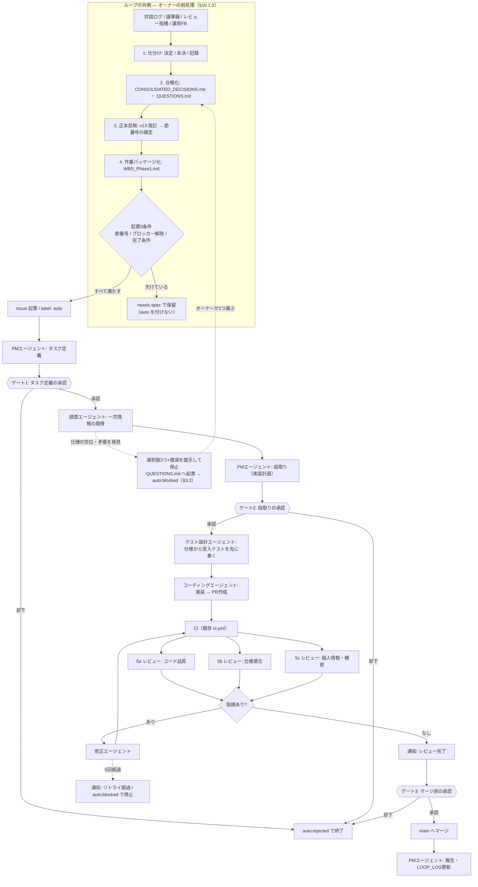
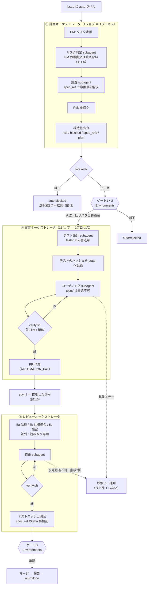

# 自律開発ループ設計

> [!note] 本文中の色について
> <span style="color:#8b949e">グレー</span>＝旧構成（現在は置き換え済み。経緯として残す）
> <span style="color:#d29922">黄</span>＝当時の前提が誤りだったと後から判明した記述
> 色の無い本文＝現行の設計
> <!-- 由来: 2026-09-13 段3〜5の実装 / 防ぐ失敗: ワークフロー駆動時代の記述と現行設計が同じ見た目で並び、どちらを根拠に実装すべきか読み取れない -->

GitHub Issue を起点に、複数の AI エージェントが調査・実装・レビュー・修正を行い、
人間（プロジェクトオーナー）が要所だけ承認する開発ループの設計書。

- 対象リポジトリ: `KoshiNakano1017/Fuyu`（**public**）
- 実行基盤: GitHub Actions（オーナーの PC 電源に依存しない）
- 関連: `CLAUDE.md`（開発ルールの正本）、`TASKS.md`、`QUESTIONS.md`、`LOOP_LOG.md`

---

## 0. このループがやらないこと（最上位制約）

> [!danger] 仕様・設計の意思決定はオーナーの専権事項
> **「なぜその仕様を選んだか」「どういう論点があったか」「どんな背景から来ているか」は
> オーナーの頭の中にしかない。** ループはそれを推測して埋めてはならない。
>
> - ループは **`docs/spec/` に既に確定している仕様を実装するだけ**の存在である
> - 仕様が無い・曖昧・矛盾している箇所を見つけたら、**実装せず `QUESTIONS.md` に起票して停止する**
>   （ただし**正本と派生文書の矛盾**で、リスクが高に達しない場合は例外がある。§3.3）
> - `docs/spec/` 配下（正本 v13・Master Index・CONSOLIDATED_DECISIONS.md）を
>   **ループが書き換えることを禁止する**（§8.2 のガードで機械的に強制する）
>   — ただし `WBS_Phase1.md` の**進捗セル**だけは対象外。下記の注記を読むこと
> - ビジネス・法務・財務・UX の判断をしない（CLAUDE.md §7 を継承）

> [!important] `WBS_Phase1.md` の進捗セルは、この禁止の対象ではない（2026-09-13 オーナー決定）
> <!-- 由来: 2026-09-13 オーナー決定（WBS の自動更新を導線5 として追加）/ 防ぐ失敗: 「ループが docs/spec/ を書けるようになった」と一般化して読み、正本 v13 や CONSOLIDATED_DECISIONS.md まで書き換え可能だと解釈する -->
> **上の禁止が列挙しているのは「正本 v13・Master Index・CONSOLIDATED_DECISIONS.md」であり、
> `WBS_Phase1.md` は含まれていない。** `CLAUDE.md` §1.5.1 の分類でも、WBS は
> **層E（計画・進捗）**であって層B（規範）ではない（`TASKS.md`・`LOOP_LOG.md` と同じ層で、
> この2つはループが既に書いている）。
>
> にもかかわらず §8.2 のガードは**パスで判定**していたため、`docs/spec/` 配下を一律に弾き、
> **§0 の規則より広く効いていた。** この不一致を解消するのが §10.1.5 導線5 である。
>
> | 対象 | ループの書き込み |
> | --- | --- |
> | 正本 v13 ／ Master Index ／ `CONSOLIDATED_DECISIONS.md` ／ `requirements/` ／ `basic-design/` ／ `detailed-design/` | ❌ **従来どおり全面禁止** |
> | `WBS_Phase1.md` の **実装% ／ 総合% ／ ステータス**（該当作業パッケージ1行のみ） | ✅ 導線5 で許可 |
> | `WBS_Phase1.md` の **設計% ／ 概要 ／ 依存 ／ 規模**、および他の行 | ❌ 禁止 |
>
> **「列挙は例示であって限定ではない」という読み方も成り立つため、
> 曖昧なまま運用せず、2026-09-13 にオーナーが上表を明示的に決定した。**
> 機械的な担保は §8.2（ガード2枚構成）にある。

したがってこのループの守備範囲は次の一点に尽きる。

**「確定済みの仕様 → 動くコード」の変換を、人間のレビュー負荷を下げながら自動化する。**

仕様そのものの生成・改訂は、オーナーが別セッション（対話型）で行う。

---

## 1. 決定事項（2026-08-29 オーナー確定）

| # | 論点 | 決定 | 理由 |
| --- | --- | --- | --- |
| 1 | 実行基盤 | **GitHub Actions 完結** | PC 電源に依存せず動く。参照範囲がリポジトリ内に限定されるため、CLAUDE.md §7.1（会員データ持ち込み禁止）が**構造的に守られる**副次効果がある |
| 2 | 承認ゲート | **3点で停止**（タスク定義・段取り完了・マージ前） | What / How / 反映 の3点を押さえれば統制は足りる。レビュー完了とリトライ超過は通知のみ |
| 3 | 初期スコープ | **足場は人間が先に作り、ループは機能単位** | 現状アプリコードが1行も無い。土台を自動生成させるとレビュー基準が揺れる |
| 4 | 通知チャネル | **GitHub 標準（メール＋モバイルアプリ）** | 承認と通知が同じ場所で完結。追加実装・追加コストがゼロ |

---

## 2. 全体フロー



**点線枠が今回の追記部分。** ループは「処理済みの材料」しか受け取らない。
前処理を飛ばして `auto` を付けると、調査エージェントが同じ空白を発見して
`QUESTIONS.md` へ起票し `auto:blocked` で止まる（図の下段の点線）。
**つまり前処理は、やらなければループが代わりにやってくれるものではなく、
やらなければ1往復ぶんのトークンを捨てて同じ場所に戻ってくるだけである。**

---

## 3. エージェント定義

<span style="color:#8b949e">全エージェントとも `anthropics/claude-code-action@v1` を使い、モデルは **`claude-opus-5`** に統一する
（既存 `claude-review.yml` と同じ）。</span>コストは**モデルを下げるのではなく `effort` で調整する**。

> [!note] 実行の土台は **Claude Agent SDK**（2026-09-13 段3で確定）
> <!-- 由来: 2026-09-13 段3（plan.mjs 新設）/ 防ぐ失敗: 「エージェント＝claude-code-action」という前提で新しい連携コードを書き、ジョブ境界でまたエージェントが死ぬ -->
> 計画フェーズ（`auto-01`）は `claude-code-action` を**使わなくなった**。
> `automation/orchestrator/plan.mjs` が **`@anthropic-ai/claude-agent-sdk`**（`package.json` の
> `devDependencies`）を通じて Claude Code をライブラリとして呼び、4体を1プロセスで回す。
> **SDK に触れるのは `automation/orchestrator/lib/runAgent.mjs` の1ファイルだけ**で、
> 他のコードは SDK を知らない（差し替え点を1箇所に閉じるため）。
>
> - **モデルと effort は定義の frontmatter から来る**（`model:` / `effort:`）。
>   `runAgent.mjs` がそれを SDK の `options.model` / `options.effort` へ渡す。
> - <span style="color:#8b949e">下記 `claude_args` の指定方法は、まだ `claude-code-action` を使っている
>   `auto-02` / `auto-03` にのみ当てはまる。</span>

> [!note] <span style="color:#8b949e">モデルと effort の指定方法（2026-08-31 検証済み・§12 #1 解消）</span>
> <span style="color:#8b949e">`claude-code-action` の **`claude_args` は Claude Code CLI へ引数をそのまま渡す**入力である。
> CLI には `--model` と `--effort`（`low` / `medium` / `high` / `xhigh` / `max`）が実在するため、
> 両方ともこの1行で指定できる。プロンプト側で代替する必要はない。</span>
>
> ```yaml
> claude_args: '--model claude-opus-5 --effort xhigh'
> ```

| # | エージェント | 責務 | effort | 書き込み権限 | 出力先 |
| --- | --- | --- | --- | --- | --- |
| 1 | **PM（受付・定義）** | 窓口・統制。Issue の受付、タスク定義、段取り、各エージェントの起動判断 | medium | `TASKS.md` / Issue コメント | Issue コメント |
| 2 | **調査** | 内部ドキュメント（`docs/spec/`）と公式ドキュメント（Next.js / Supabase 等）を調べ**一次情報**を取得。**判断はせず事実だけ返す** | high | なし（読み取り専用） | Issue コメント（調査メモ） |
| 3 | **テスト設計** 🆕 | 仕様から**先に**受入テストを書く。実装を見ずに仕様だけを見る | high | `tests/` のみ | PR（テストのみのコミット） |
| 4 | **コーディング** | 承認済みの段取りに従って実装。テストを通す。ブランチを切り PR を作る | xhigh | 実装コード | PR |
| 5a | **レビュー（コード品質）** | CLAUDE.md §4（リーダブルコード）・バグ・認可漏れ | xhigh | なし（読み取り専用） | PR レビューコメント |
| 5b | **レビュー（仕様適合）** 🆕 | タスク定義が引用した**仕様の節番号と実装を突き合わせる**。過不足を判定 | xhigh | なし（読み取り専用） | PR レビューコメント |
| 5c | **レビュー（個人情報・機密）** 🆕 | CLAUDE.md §3。**gitleaks が検出できない日本語の氏名・住所**を人間の目で見るように探す | xhigh | なし（読み取り専用） | PR レビューコメント |
| 6 | **修正** | レビュー3種の指摘と CI 失敗を修正 | high | 実装コード・テスト | PR への追加コミット |
| 7 | **PM（報告）** | マージ結果を `LOOP_LOG.md` に記録し Issue をクローズ | medium | `LOOP_LOG.md` | Issue コメント |

`effort` は思考深度と総トークン消費を制御するパラメータ（`low` / `medium` / `high` / `xhigh` / `max`）。
コーディング・レビューのような agentic 用途は `xhigh` が推奨値。

**5a / 5b / 5c は並列に実行する。** 観点を混ぜた1体のレビューアより、観点を絞った3体のほうが
見落としが減る。並列なので所要時間は1体のときと変わらない。

### 3.0 なぜこの3体を足したか

| 追加 | 埋める穴 |
| --- | --- |
| **テスト設計** | 実装者が自分で書くテストは「作ったもの」を検証しがちで「仕様が要求すること」を検証しない。**仕様だけを見て先にテストを書く**ことで、完了条件が実行可能な形で固定される。CLAUDE.md §4.4 が必ずテストを要求する**認可・金額計算・個人情報**の3領域は、この方式を必須とする |
| **レビュー（仕様適合）** | 既存のレビュー観点は「コードとして良いか」しか見ておらず、**「仕様どおりか」を誰も見ていない**。§0 の「ループは仕様から逸脱しない」を検査する担当がいないと、品質の高い"別物"が出来上がる |
| **レビュー（個人情報・機密）** | CLAUDE.md §3.1 が明言しているとおり、**pre-commit のパスガードも CI の gitleaks も日本語の氏名・住所を検出できない**。public リポジトリで一度 push したら取り消せない以上、ここだけは専任を置く価値がある |

### 3.1 調査エージェントの境界（重要）

調査エージェントは **「何が書いてあるか」を返すだけ**で、**「だからこうすべき」を言わない**。

| やる | やらない |
| --- | --- |
| `docs/spec/` の該当節を引用し、節番号とともに提示する | 仕様の空白を埋める提案をする |
| 公式ドキュメントの API 仕様・制約・非推奨情報を出典URL付きで提示する | ライブラリの採否を決める |
| 仕様間の矛盾を「矛盾がある」と報告する | どちらが正しいかを決める |
| `QUESTIONS.md` の未回答項目が今回のタスクに掛かるかを判定する | 未回答項目を「たぶんこうだろう」と扱う |
| **成り立つ選択肢を最大3つ挙げ、推奨を1つ述べる**（§3.2） | **推奨した案を採用済みとして実装に進む** |

矛盾・空白を見つけた場合は `QUESTIONS.md` に起票し、**そのタスクは `auto:blocked` にして止める**。
ただし**ただ止めるだけにはしない**。止め方の作法を §3.2 に定める。

### 3.2 質問の作法（2026-08-31 追加）

> [!important] 「止まる」と「聞く」は別物である
> §3.1 は「曖昧なら止まれ」としか定めていない。しかし**止まるだけのループは、
> オーナーに「何が論点だったか」を一から再構成させる**。
> 論点はエージェントの側にあり、それを渡さずに止まるのは仕事を半分で投げることにあたる。
>
> **止まるときは、必ず選択肢を添えて止まる。**

#### 3.2.1 何を質問してよいか（実質的な曖昧さ）

**思いついた疑問を全部投げてはいけない。** 質問が多いループは、承認と同じく形骸化する。
質問してよいのは、**答えによって次の6つのいずれかが変わる**場合に限る。

| # | 軸 | 本プロジェクトでの具体例 |
| --- | --- | --- |
| 1 | **実装の方向** | Server Actions で書くか Edge Function で書くか |
| 2 | **検証の方法** | 受入テストで何を「合格」とみなすか |
| 3 | **ロールアウト** | 既存会員に見せるか、新規登録分だけか |
| 4 | **データの扱い** | その項目を DB に保存するのか、都度計算するのか（CLAUDE.md §3） |
| 5 | **権限** | `role` で判定するのか `member_type` で判定するのか（CLAUDE.md §4.1・**認可に member_type を使わない**） |
| 6 | **ユーザーに見える振る舞い** | 認可を直すと、これまで見えていた画面が見えなくなるか（§7.1 の警告と同じ論点） |

**この6軸に当たらない疑問は質問しない。** 変数名・ファイル配置・ログ出力の細かさなどは
エージェントが決めてよい（CLAUDE.md §4 の範囲内であれば結果は同値になる）。

> [!warning] 5と6は本プロジェクトの事故ポイントそのもの
> **権限（5）と、ユーザーに見える振る舞い（6）は、この2つだけ特別扱いする。**
> §7.1 が定めるとおり「認可の穴を塞ぐと画面の見え方が変わる」ケースは
> 仕様判断であって自動修正してはならない。6軸のうち **5・6 に該当した質問は、
> 低リスク区分であっても中リスクへ繰り上げる**（§4.1）。

#### 3.2.2 質問の形式（守らないと承認が重くなる）

| ルール | 内容 | 守らないとどうなるか |
| --- | --- | --- |
| **選択肢は最大3つ** | 現実に成り立つ案だけを挙げる | 4つ以上あると比較が「検討」になり、朝の数分で終わらない |
| **推奨案とその理由を1つ書く** | 「推奨は B。理由は〜」 | オーナーが全部ゼロから評価することになる |
| **1回に1問** | 複数の論点を1コメントに束ねない | どれに答えたのか追跡できない（CLAUDE.md §5.2 の1コミット1論点と同じ理由） |
| **既に決まっていることは聞かない** | `CONSOLIDATED_DECISIONS.md` と正本 v13 を先に照合する | 決定済み事項の蒸し返しはオーナーの信頼を最も早く失う |
| **どちらが正しいかは言わない** | 推奨は述べてよいが、**採否は決めない** | §0 違反。エージェントが仕様を決めたことになる |

> [!danger] 推奨を書くことと、決めることの違い
> 「**推奨は B です**」は許される。「**B にしました**」は §0 違反である。
> 推奨は**オーナーの判断を速くするための材料**であって、判断の代行ではない。
> 迷ったら「実装せず、選択肢を出して止まる」が常に正しい。

#### 3.2.3 出力の形

`QUESTIONS.md` への起票と、Issue コメントでの提示を**同時に**行う。

```markdown
## ⚠️ 実装を止めました：キャッシュバックの単位が未確定です

**何が決まっていないか**
`v13 §5.10.2` は「キャッシュバック 5,000」と書いているが、単位の記載がない。

**なぜ止めたか**（該当する軸：4. データの扱い）
円かコインかで付与額が1.25倍ずれる。推測で実装すると、
金額計算のテスト（CLAUDE.md §4.4）が「間違った期待値」で固定される。

**選択肢**
- A. 円として扱う（`uii` テーブルに `amount_yen` で保存）
- B. コインとして扱う（`uii` テーブルに `amount_uii` で保存）
- C. 両方保持し、表示時に換算する

**推奨: B。** 理由は §9 #51 が「Uii は独自単位として扱う」と決めており、
円に寄せると将来レートを変えた時に過去データが壊れるため。

**起票先**: `QUESTIONS.md` #23 ／ ラベル: `auto:blocked`
```

<span style="color:#d29922">**この形式が守られていれば、オーナーの作業は「A/B/C を1文字返す」だけで済む。**</span>
返答を受けて `QUESTIONS.md` を回答済みにすれば、§10.1.5 の導線3が Issue を自動で解放する。

> [!warning] 訂正（2026-09-13 判明）— **コメントだけでは再開しない**
> <!-- 由来: 2026-09-13 auto-01 の停止メッセージ修正 / 防ぐ失敗: 指示どおり A/B/C を返信したのにループが動かず、原因不明のまま Issue が滞留する -->
> **Issue へのコメントは、どのワークフローも起動しない。** `issue_comment` を拾っているのは
> `claude-review.yml` だけで、その `if` 条件は **PR に紐づくコメント限定**である。
> つまり「1文字返す」だけでは何も起きない。**必要な操作は2つ**である。
>
> 1. 選択肢への回答を Issue にコメントする（エージェントへの入力になる）
> 2. **`auto:blocked` を外し、`auto` ラベルを付け直す**（これが再開の引き金）
>
> 詳細は §10.5。旧 `auto-01-plan.yml` の停止メッセージは「選択肢から1つ返信してください」と
> しか書いておらず、**実行不能な指示**だった（2026-09-13 に修正済み）。

---

### 3.3 低・中リスクの矛盾は、正本優先で進行する（2026-09-03 追加）

> [!important] 「矛盾で必ず止まる」は、頻度の高い矛盾では過剰である
> 試運転（Issue #4）で判明した。仕様書は `docs/spec/` 配下に何十ものファイルへ分散しており、
> 正本（v13）を改訂しても派生文書（`画面設計.md`・`HTMLモック_v13.md` 等）への反映が漏れることが
> 実際に起きる。**正本と派生文書が食い違うたびに実装を止めていては、ループが「矛盾を報告するだけの
> 機械」になる。** §4.1 の高リスクに該当しない限り、**「どちらが正しいかに既に答えがある矛盾」
> （＝正本 vs 派生文書）は、止めずに進める。**

**この規定が対象とするのは「正本 vs 派生文書」の矛盾に限る。** 次は対象外で、従来どおり §3.2 の作法で止まる。

| 対象外のケース | 理由 |
| --- | --- |
| 仕様そのものが存在しない（正本にも記載が無い） | 「正本優先」で解決できる対立が無い |
| 正本内部で自己矛盾している | どちらが正本の意図か、ループには判断できない |
| リスク判定が**高**（§4.1） | 認可・金額・個人情報・DBマイグレーション等は、矛盾があるという事実自体を人間に見せる価値が高い |

**進め方**:

1. `CLAUDE.md` §1.1「矛盾時は正本が勝つ」に従い、**正本（v13）の記述を採用**して段取り・実装を進める
2. その矛盾を `QUESTIONS.md` に**非ブロックの課題として記録**する（`<!--blocked-->` は付けない。
   見出しに「⚠️ 実装を止めました」を使わず、「正本優先で進行中」であることが分かる書き方にする。
   形式は §3.3.1）
3. Issue のコメントには、正本のどちらを採用したかと、その根拠（節番号）を明記する
4. `auto:blocked` にはしない。通常どおりリスクマーカー（`<!--risk:low/mid-->`）を出力し、ゲートへ進む

> [!note] 軸5・6（権限・ユーザーに見える振る舞い）にも例外なく適用する（2026-09-03 オーナー確定）
> §3.2.1 は軸5・6を「事故ポイントそのもの」として特別扱いし、該当すれば中リスクへ繰り上げると
> 定めている。この繰り上げ自体は維持するが、**繰り上げた結果が中リスクにとどまるなら、この §3.3 の
> 対象に含める**（止めずに進める）。§4.1 の高リスク条件に独立して該当する場合のみ、引き続き止まる。

> [!warning] 「どちらが正しいか決めない」原則との関係
> §3.1・§3.2 は「調査エージェントはどちらが正しいかを決めない」と定めている。これと矛盾しないのは、
> **正本 vs 派生文書の対立は、`CLAUDE.md` §1.1 が既に「正本が勝つ」と決めているため**である。
> ループは新しい判断をしていない。**既存ルールの機械的な適用**にすぎない。
> 一方、正本そのものが曖昧・自己矛盾・記載無しの場合は、優先すべき「正本側」が存在しないため、
> 引き続き §3.2 の作法（選択肢A/B/C＋推奨）で止まる。

#### 3.3.1 非ブロックの記録の形

`QUESTIONS.md` への追記と、Issue コメントでの提示を同時に行う。

````markdown
## ⚡ 正本優先で進行：〔何が食い違っているか、1行で〕

**何が食い違っているか**
〔正本のどの記述と、どの派生文書のどの記述が食い違っているか〕

**採用した内容**
正本 v13 §X.Y の記述を採用し、実装・段取りを進める。〔理由があれば1文〕

**放置すると何が起きるか**
〔派生文書を放置した場合の実害。無ければ「実害は軽微」と明記〕

**起票先**: `QUESTIONS.md`「〔追記した見出しのタイトル〕」（派生文書の訂正はオーナー判断）
````

---

## 4. 承認ゲートと通知

### 4.1 リスクベース・ゲーティング（2026-08-29 オーナー可決）

**ゲートは賭け金に比例させる。** 全タスクを一律3ゲートにすると、文言修正もDBマイグレーションも
同じ承認回数を要求することになり、自律性が犠牲になるだけで安全性は上がらない。

PM エージェントがタスクをリスク3区分に判定し、区分ごとに通過するゲート数を変える。

| 区分 | 判定条件（**1つでも該当すれば上位区分**） | ゲート | 承認回数 |
| --- | --- | --- | --- |
| **高** | 認可・ロール判定／金額・Uii・宿泊券の計算／個人情報の入出力／DBマイグレーション／外部連携（LINE・Supabase Auth・決済）／セキュリティ高リスク（§7.1） | 1・2・3すべて | 3回 |
| **中** | 上記に該当しない新規機能・既存機能の振る舞い変更 | 2・3 | 2回 |
| **低** | 表示文言の修正／テスト追加のみ／振る舞いが変わらないリファクタ／コメント・型注釈のみ | **なし**（自動通過） | 0回 |

**低リスクの自動通過には次の全条件を課す。** 1つでも欠ければ中リスクに繰り上げる。

- CI が全ジョブ緑
- レビュー3種の **[必須] 指摘がゼロ**
- 変更ファイルが段取りで宣言した範囲内
- 新規依存パッケージの追加なし
- `docs/spec/` に差分なし（§8.2）
- `supabase/migrations/` に差分なし

> [!important] リスク判定そのものが最初のゲートで承認される
> **高リスクを「低」と誤判定されるのが唯一の致命的な失敗モード。**
> そこで PM は**まず区分判定だけを Issue にコメントし**、中・高であればゲート1へ進む。
> 低と判定した場合は**判定理由つきで通知**し、オーナーが異議を出せる猶予を設ける（既定30分。
> `auto:low-risk` ラベルを外せば中リスクに落ちる）。
> **異議申立ての窓を持たない自動通過は認めない。**

### 4.2 ゲートの中身

GitHub Actions の **Environments + Required reviewers** で実現する。
承認待ちのジョブは実行時間を消費せず、オーナーには**メールが届き、GitHub モバイルアプリから承認/却下できる**。

| ゲート | Environment 名 | 何を承認するか | オーナーが見るもの |
| --- | --- | --- | --- |
| 1 | `gate-task-definition` | **What**: このタスクをやるのか、スコープとリスク区分は正しいか | Issue コメントのタスク定義（目的・完了条件・影響範囲・参照した仕様の節番号・**リスク区分と判定理由**） |
| 2 | `gate-task-plan` | **How**: この作り方でよいか | Issue コメントの段取り（変更ファイル一覧・テスト方針・調査結果の要約・リスク） |
| 3 | `gate-merge` | **反映**: main に入れてよいか | PR の差分・CI の結果・レビュー指摘と対応状況・**セキュリティスキャン結果** |

### 4.3 通知（止めない＝流して自動で進む）

Issue / PR コメントで**オーナーを `@mention`** する。GitHub の通知設定によりメールとモバイルに届く。

| タイミング | 内容 |
| --- | --- |
| レビューエージェント実行完了時 | 指摘件数と重要度別の内訳。指摘ゼロならその旨 |
| エラー・リトライが5回以上 | 何が何回失敗したか、最後のエラーへのリンク。**ループは `auto:blocked` で停止する** |

> [!note] なぜ5回で「停止」するのか
> 指示は「通知」だが、5回失敗するタスクは自動では解決しない可能性が高く、
> 放置すると Actions の実行時間とトークンを消費し続ける。
> **通知したうえで停止**し、オーナーの判断を待つのが安全側。再開はラベル付け替えで行う。

---

## 5. 状態遷移（Issue ラベル）

ループの状態は **Issue のラベル**で表現する。これにより、途中で失敗しても
どこまで進んだかが Issue を見れば分かり、ラベルを戻すだけで再開できる。

| ラベル | 意味 | 次に動くもの |
| --- | --- | --- |
| `auto` | ループ対象として起票された | WF1（計画） |
| `auto:planning` | PM/調査が動作中 | — |
| `auto:approved` | ゲート1・2を通過した | WF2（実装） |
| `auto:implementing` | コーディング中 | — |
| `auto:review` | PR 作成済み、レビュー/修正ループ中 | WF3（レビュー・マージ） |
| `auto:blocked` | 仕様未確定 / リトライ超過で停止 | 人間 |
| `auto:done` | マージ完了 | — |
| `auto:rejected` | ゲートで却下された | 人間 |

---

## 6. 実行機構

> [!note] 2026-09-07 にワークフロー駆動から**エージェント駆動**へ切り替えた（§12.1）
> 移行前の実行機構（`auto-0{1,2,3}.yml` の3本構成・YAML 骨子・マーカー方式のリトライ判定）は
> [[docs/OLD/2026-09-08_自律開発ループ設計_ワークフロー駆動版_OLD.md]] に全文を凍結してある。
> **`OLD/` 配下は参照専用**であり、実装判断の根拠にしてはならない（`CLAUDE.md` §1.3）。

実行の責務を2つに分ける。**境目は「人間が承認する場所」**である（理由は §12.1.1）。

| | 実体 | 受け持つもの |
| --- | --- | --- |
| **外側** | `.github/workflows/auto-0*.yml` | 起動トリガ ／ ゲート（Environments）／ ラベル遷移 ／ 次フェーズへの引き渡し |
| **内側** | `automation/orchestrator/*.mjs` | エージェントの起動順 ／ 受け渡し ／ 反復 ／ エラー分類 ／ state の更新 |

### 6.1 外側：ワークフロー

| ファイル | トリガ | 呼ぶもの | ゲート | 実態（2026-09-13） |
| --- | --- | --- | --- | --- |
| `auto-01-plan.yml` | Issue に `auto` ラベル | `orchestrator/plan.mjs` | ゲート1・ゲート2 | ✅ **この形になっている**（段4 で 416行 → 296行） |
| `auto-02-implement.yml` | Issue が `auto:approved` | `orchestrator/implement.mjs` | なし | ✅ **この形になっている**（段7）。`--phase tests` ／ `--phase code` の2回呼び |
| `auto-03-review-merge.yml` | PR への push ／ CI 完了 | `orchestrator/review.mjs` | ゲート3 | ✅ **この形になっている**（段7）。`<!--retry-->` の計数は**廃止**。`<!--risk:*-->` は**意図的に残す**（下記） |

<!-- 由来: 2026-09-13 段7の完了（c4cd184 オーケストレータ新設 → 018de23 で3本とも配線）/ 防ぐ失敗: 「auto-02・auto-03 は旧構成のまま」と読んで、既に廃止した grep 経路を前提に改修する -->

> [!note] `auto-03` に残る2つは、消し忘れではない
> <!-- 由来: 2026-09-13 段7の完了 / 防ぐ失敗: 「grep は全廃したはず」と読んで、フェーズ間の引き渡しごと削る -->
> | 残っているもの | なぜ残すか |
> | --- | --- |
> | `<!--risk:(high\|mid\|low)-->` の grep | 計画フェーズ（`auto-01`）の**リスク区分をゲート3へ引き渡す**ため。§12.1.4 がワークフローの持ち分と認めている6つのうち「引き渡し」にあたる。**見つからなければ警告のうえ `high` 扱い**（安全側フェイル） |
> | PM 報告ジョブの `claude-code-action` | **マージ後**の報告であり `review.mjs` の守備範囲外。オーケストレータへ通す利得が無い |
>
> ジョブ ID `verdict` も温存してある。後続の `risk` / `merge` / `report` が
> `needs.verdict.outputs.findings` と `privacy_reject` を読んでおり、**外形を保ったまま中身だけ差し替えた**ためである。

**ワークフローが持つのは §12.1.4 の6つだけ**（ゲート ／ `AUTOMATION_PAT` ／ `concurrency` ／
`timeout-minutes` ／ §8.2 の仕様書ガード ／ `ci.yml`・pre-commit）。
判定や分岐をここへ書き足さない。書き足した時点で、それは内側の仕事を外へ漏らしている。

> [!warning] `concurrency` は「書けば安全」ではない（2026-09-13 に3本とも修正）
> <!-- 由来: 2026-09-13 Issue #4 の自己ロック調査 / 防ぐ失敗: ワークフロー自身のラベル書き込みが、承認待ちで pending していた自分の run を消す -->
> 詳細は §8.4。`on: issues: types: [labeled]` は**ラベル名で絞れない**ため、
> ワークフロー自身がラベルを書き換えるたびに「何もしない run」が生成される。
> これを本番と同じ concurrency グループに入れていると、
> **pending 中だったオーナーの再開 run をキャンセルする**。`auto-01` / `auto-02` / `auto-03` の
> 3本とも、空振り run を `run_id` で隔離する形へ修正済み。

### 6.2 内側：オーケストレータ

**プロンプトではなくコードで書く。** ゲートは `if` 文であるべきで、
エージェントに制御フローを渡すと「説得できる門番」ができる（§0 の担保が消える）。

- エージェント定義は `automation/agents/*.md` に1体1ファイル（§3 の10体 ＋ `risk-classify`
  ＋ `issue-draft` ＋ `wbs-resolve`＝**計 13 体**。`issue-draft` は §10.1.5 導線2 で追加された
  起票支援、`wbs-resolve` は導線1補遺の WBS 番号の曖昧一致）
- **権限は2層。** frontmatter の `tools:` がツール層、`automation/settings/*.json` がパス層（§12.1.3）
- 定義と権限の整合性は `automation/scripts/check_agents.py` が検査する
- 正本の節番号は `automation/scripts/spec_ref.py` で解決する。
  **解決できない参照はゲート1へ到達する前に落ちる**（§10.3 の事故ポイントの機械化）

#### 共通ライブラリ（2026-09-13 段3で新設）

<!-- 由来: 2026-09-13 段3（plan.mjs ＋ lib/ 5本）/ 防ぐ失敗: 各オーケストレータが SDK 呼び出し・state 書式・スキーマ検証を各々に持ち、3箇所で仕様がズレる -->

| ファイル | 持つもの |
| --- | --- |
| `lib/agents.mjs` | `automation/agents/*.md` の frontmatter と本文を読み、`tools` / `settings` / `model` / `effort` / プロンプト本文を返す |
| `lib/runAgent.mjs` | **SDK に触れる唯一のファイル。** `query()` の呼び出し、ツール層・パス層の適用、`PreToolUse` フックによるパス規則の補完（§7.2.1）、使用量の回収 |
| `lib/schema.mjs` | 構造化出力のスキーマ（`RISK` / `PLAN` / `IMPLEMENT` / `REVIEW`）と検証、`maxRisk()`（リスクの繰り上げ）、本文からの JSON 抽出 |
| `lib/state.mjs` | `automation/state/issue-<n>.json` の読み書き、エラー指紋、種別別の試行回数、トークン累積（§6.3） |
| `lib/gh.mjs` | `gh` CLI の呼び出し・Issue / PR コメント・`GITHUB_OUTPUT` への書き出し |

エージェントの起動順と受け渡しは **§12.1.2 の処理フロー図**を正とする
（ただし実装では図と意図的に違えた点が2つある。§12.1.2 の注記を参照）。

### 6.3 エラーの扱い

回数ではなく**種別**で分ける。試運転で実際に起きた2件（OIDC 取得失敗・PM の編集が未コミット）は
いずれも基盤側の失敗であり、何回リトライしても直らない種類だった（§13 v1.4）。

| 種別 | 例 | 扱い |
| --- | --- | --- |
| **基盤** | OIDC 取得失敗 ／ PAT 権限不足 ／ Secrets 未設定 | **リトライしない。** 即通知して停止する |
| 一過性 | 429 ／ 5xx | 指数バックオフで再試行する |
| **タスク** | テスト失敗 ／ 型エラー ／ lint | オーケストレータ内で反復。打ち切りは回数ではなく**トークン予算**（§12 #3） |
| **仕様** | 段取りの前提が崩れた | リトライしない。§3.2 の作法で `auto:blocked` |

**同じエラー指紋が2回**出たら、予算に達する前にエスカレーションする。
状態は `automation/state/issue-<n>.json` に置き、
**再開は PR ＋ Issue ＋ state から復元できること**（エージェントの記憶に依存させない）。

## 7. 安全制約

CLAUDE.md の既存ルールをループにも機械的に適用する。

| 制約 | 実現方法 |
| --- | --- |
| **仕様書を書き換えない**（§0） | ①`settings` で編集ツールを拒否（§7.2）②`docs/spec/` への差分を検出したらジョブを失敗（§8.2）の**二重**で守る |
| **エージェントごとの書き込み範囲**（§3） | プロンプトの文章ではなく `settings` 入力でツールを制限する（§7.2） |
| **main へ直接 push しない**（§5.1） | ブランチ保護 + ループは必ず PR 経由 |
| **CI が赤い PR をマージしない**（§6.2） | ゲート3の前段で `ci.yml` の成功を必須にする |
| **機密・個人情報を出さない**（§3） | 既存 `secret-scan` ジョブ（gitleaks 全履歴）が PR で必ず走る |
| **会員データに触れない**（§7.1） | GitHub Actions はリポジトリしか見えない。ボルト側の実データは**物理的に到達不能** |
| **未回答の論点を確定扱いしない**（§7） | 調査エージェントが `QUESTIONS.md` を照合し、該当があれば `auto:blocked` |
| **1コミット1論点**（§5.2） | コーディングエージェントのプロンプトで強制。1 Issue = 1 機能に限定 |
| **public リポジトリ**（§3.1） | Actions ログも公開される。プロンプト内で秘匿値を出力しない |

---

### 7.1 セキュリティスキャンとリスク分析

コード層のスキャンを CI に常設し、**検出結果を重要度で3系統に振り分ける**。

#### 使うスキャナ

| 層 | ツール | 対象 |
| --- | --- | --- |
| 秘密情報 | gitleaks（既存 `ci.yml`） | APIキー・トークン・鍵ファイル |
| SAST | **CodeQL**（public リポジトリは無料） | 意味解析。SQLi・XSS・パストラバーサル・認可バイパス |
| 依存脆弱性 | `npm audit` + Dependabot | CVE |
| 設定・認可 | 独自チェック | RLS ポリシーの欠落したテーブル、`service_role` キーのクライアント側流出 |

#### リスク判定

**ツールが返す severity をそのまま使わない。** CVSS や CodeQL の重大度は文脈を知らないため、
本プロジェクト固有の観点で再評価する。判定の軸は次の3つ。

1. **到達可能性** — ユーザ入力から到達するか、開発用スクリプト内か
2. **認可境界** — ロール判定・RLS に触れるか
3. **個人情報** — 実名・住所・電話番号の露出経路になりうるか

| 区分 | 該当 | 処理 |
| --- | --- | --- |
| **高** | 認可バイパス／個人情報の漏洩経路／秘密情報の露出／RLS 欠落／実データに到達する SQLi・XSS | **修正エージェントが同一PR内で修正する。** 修正後もゲート3で人間が必ず確認する |
| **中** | 実行経路にある依存CVE／CSRF／レート制限の欠落／ログにPIIが混ざる恐れ | **別 Issue を自動起票**（`security` ラベル）。現PRはブロックしない |
| **低・警告** | 実行経路にないCVE／ベストプラクティス逸脱／情報量の乏しい警告 | **記録のみ**。`.github/learning/security-low.jsonl` に追記し、`docs/セキュリティ既知事項.md` を自動生成 |

> [!warning] 「高リスクは自動修正」の例外
> **セキュリティ修正が仕様の変更を伴う場合は、自動修正してはならない。**
> 例: 認可の穴を塞ぐと、これまで見えていた画面が見えなくなる。
> これは**振る舞いの変更＝仕様判断**であり §0 に抵触する。
> この場合は修正せず、`QUESTIONS.md` に起票し `auto:blocked` で停止してオーナーに上げる。
> 修正エージェントには「穴を塞ぐと既存の画面・APIの見え方が変わるか」を
> **必ず自己判定させ、変わるなら止める**。

> [!note] このリポジトリ固有の重み付け
> 本アプリは実名370名分の個人情報を扱い、かつリポジトリは **public**。
> したがって**個人情報の露出経路は、ツールの severity が何であれ常に「高」**として扱う。
> gitleaks も CodeQL も日本語の氏名・住所は検出できない（CLAUDE.md §3.1）ため、
> ここはレビュー 5c（個人情報・機密）が最後の防波堤になる。

---

### 7.2 権限をプロンプトではなく設定で絞る（2026-08-31 追加）

> [!warning] 2026-09-08 訂正：権限は**2層**であり、`settings/*.json` は無くならない
> エージェント方式では frontmatter の `tools:` がツール層を担うが、**パスを表現できない**。
> 読み取り専用のエージェント（調査・レビュー3種・リスク判定）は `tools:` だけで足りるが、
> **書き込み先を限定する必要があるエージェント**（PM は `TASKS.md` など3ファイルのみ、
> コーディングは `tests/` 以外）は本節の settings が**引き続き必須**である。
> 消すと逆に権限が緩む。詳細と検査方法は §12.1.3。

§3 の表は各エージェントの「書き込み権限」を定めているが、**これをプロンプトの文章だけで
守らせてはいけない**。「読み取り専用です」と書いても、エージェントは書き込みツールを持っている。

`claude-code-action` には **`settings` 入力**があり、Claude Code の設定 JSON
（ファイルパスまたは JSON 文字列）を渡せる。ここで**ツールの使用可否そのものを宣言的に制限する**。

<span style="color:#8b949e">| ファイル | 対象エージェント | 方針 |
| --- | --- | --- |
| `.github/claude-settings/readonly.json` | 調査・レビュー 5a/5b/5c | 編集系ツールを一切許可しない |
| `.github/claude-settings/pm.json` | PM（定義・段取り・報告） | `TASKS.md` / `LOOP_LOG.md` と `gh issue comment` のみ |
| `.github/claude-settings/test.json` | テスト設計 | `tests/` 配下のみ書き込み可 |
| `.github/claude-settings/code.json` | コーディング・修正 | 実装コード可。**`docs/spec/` は拒否**（§8.2 の二重化） |</span>

**現行の置き場所は `automation/settings/` で、6本ある**（段2 で `.github/claude-settings/` から移した）。

| ファイル | 対象エージェント |
| --- | --- |
| `automation/settings/readonly.json` | レビュー 5a/5b/5c ほか読み取り専用 |
| `automation/settings/research.json` | 調査 |
| `automation/settings/pm.json` | PM（定義・段取り・報告） |
| `automation/settings/test.json` | テスト設計 |
| `automation/settings/code.json` | コーディング・修正 |
| `automation/settings/draft.json` | 起票支援（§10.1.5 導線2） |
| `automation/settings/wbs-resolve.json` | WBS 番号の曖昧一致（§10.1.5 導線1補遺） |

> [!important] プロンプトによる禁止は「最後の防波堤」であって「最初の壁」ではない
> CLAUDE.md §7.1 は「最後の防波堤は自動検査ではなくエージェント自身の判断」と述べている。
> これは**自動検査を諦めてよいという意味ではない**。順序は逆で、
> **機械で止められるものは機械で止め、止められないもの（日本語の氏名など）だけを判断に委ねる。**
>
> `docs/spec/` の保護は、①`settings` でツールを拒否 ②§8.2 で差分を検出して失敗
> の**二重**にする。①が破られても②で止まる。

#### 7.2.1 ⚠️ `Write(...)` のパス規則は**効かない**（2026-09-13 判明）

<!-- 由来: 2026-09-13 段3（runAgent.mjs の実装中に SDK の権限評価を確認）/ 防ぐ失敗: 「settings に書いたから塞がっている」と思い込み、コーディングエージェントが Write で受入テストを上書きする -->

> [!danger] 設定ファイルに書いてあることと、実際に効いていることは違った
> **Claude Code がパス規則を評価するのは `Edit(path)` と `Read(path)` だけ**である。
> `Write(...)` / `NotebookEdit(...)` / `Glob(...)` のパス規則は
> **「受け付けるが参照しない」**（起動時に警告を出すだけで、拒否判定には使われない）。
>
> したがって <span style="color:#d29922">`automation/settings/code.json` の
> `"deny": ["Write(tests/**)"]` は**効いていなかった**</span>。
> コーディング・修正エージェントは `Edit` では `tests/` を触れなかったが、
> **`Write` なら受入テストを丸ごと上書きできた**。
> これは §11.6 の commit-first と §12.1.5 が「塞いだ」としていた穴そのものである。
>
> さらに <span style="color:#d29922">`check_agents.py` は文字列 `Write(tests/**)` が
> 存在すれば合格と判定していた</span>ため、**検査も通り抜けていた**。

**塞ぎ方は3重にした。** 1つが破れても残り2つで止まる。

| # | 実装 | 何を担保するか |
| --- | --- | --- |
| 1 | `lib/runAgent.mjs` の **`PreToolUse` フック** | `Edit(<glob>)` の拒否から **`Write` 拒否を自動で補完**する。フックは権限評価の最前段に立ち、`bypassPermissions` でも効く。拒否した書き込みは Actions ログに `::warning::` で残る |
| 2 | `implement.mjs` / `review.mjs` の **sha256 照合** | テスト設計の直後に `tests/` と `e2e/` のハッシュを `state` へ固定し、コーディング／修正の各周回で照合する。1バイトでも変わっていれば停止する（**実行後の検出**） |
| 3 | `check_agents.py` の判定変更 | **`Edit(<glob>)` の拒否を必須**にし、`Write(<glob>)` しか無い設定は「塞がっていない」と判定する。加えて `inert_path_rules()` が**参照されないパス規則を警告として名指し**する |

> [!important] 設定の書き手には「両方書く」ことを求める
> `code.json` には `Edit(tests/**)` と `Write(tests/**)` の両方が入っている。
> **`Write(...)` の側は Claude Code からは無視されるが、意図の記録としては残す**
> （消すと「なぜ Edit だけ書いてあるのか」が読めなくなる）。
> 実効を持つのは `Edit(...)` と、それを補完する #1 のフックである。

---

## 8. 既知の落とし穴（実装前に必ず読む）

### 8.1 `GITHUB_TOKEN` で作った PR は CI を起動しない

GitHub の仕様上、**`GITHUB_TOKEN` を使って作成した PR やラベル変更は、
別のワークフローをトリガしない**（無限ループ防止のため）。

これを踏まえないと次の事故が起きる。

- コーディングエージェントが作った PR に対して **`ci.yml` も `claude-review.yml` も走らない**
- → CLAUDE.md §6.2 の「CI が赤い PR はマージしない」が**検証不能なまま素通りする**

**対策**: PR 作成とラベル付け替えには **`AUTOMATION_PAT`**（fine-grained PAT、
または GitHub App のトークン）を使う。Repository Secrets に登録する（§3.2）。

必要な権限（fine-grained PAT）: `Contents: Read and write` / `Pull requests: Read and write` /
`Issues: Read and write` / `Workflows: Read and write`

### 8.2 仕様書ガード（2枚構成）

`docs/spec/` への変更をループが行っていないことを、マージ前に機械的に確認する。

<!-- 由来: 2026-09-13 導線5（WBS 進捗の自動反映）の設計 / 防ぐ失敗: 「ガードを緩めた」と読んで、WBS 以外の仕様書にも差分を許してしまう -->

> [!warning] ガードは1枚から**2枚に増える**（緩和ではない）
> 導線5（§10.1.5）の導入により、`WBS_Phase1.md` は**進捗セルに限り**ループが書けるようになる。
> しかし `docs/spec/` 配下の他のファイルは従来どおり全面禁止である（§0）。
> したがって「WBS を除外する」だけでは不十分で、**除外した分を別のガードで受ける**必要がある。
>
> **`spec-guard` を縮小して `wbs-guard` を新設する。合計の厳しさは下がらない。**

#### ガード① `spec-guard` — WBS 以外に差分があれば失敗

```yaml
      - name: 仕様書が変更されていないことを確認
        run: |
          set -euo pipefail
          CHANGED="$(git diff --name-only origin/main...HEAD \
            -- 'docs/spec/' ':(exclude)docs/spec/WBS_Phase1.md' || true)"
          if [ -n "$CHANGED" ]; then
            echo "::error::自律ループは docs/spec/ を変更できません（自律開発ループ設計 §0）"
            printf '%s\n' "$CHANGED"
            exit 1
          fi
```

`:(exclude)` パススペックが意図どおり WBS だけを除外することは**実測で確認済み**（2026-09-13）。

#### ガード② `wbs-guard` — WBS の差分が許可セルだけかを検証

**テキスト差分の grep ではなく、構造比較で判定する。**
`origin/main` 側と `HEAD` 側の `WBS_Phase1.md` をそれぞれ表としてパースし、
**変化したセルの集合が許可集合の部分集合か**を確認する。

| 検査 | 失敗させる条件 |
| --- | --- |
| 対象行 | Issue のマーカー `<!--wbs:4-2-->` が指す**1行以外**が変化した |
| 対象列 | **実装% ／ 総合% ／ ステータス以外**の列が変化した |
| 表の構造 | 行の追加・削除、列数の変化、見出しの変化 |
| パース可否 | **パースできない**（表が壊れた）→ 即失敗 |

> [!important] なぜ grep ではなく構造比較なのか
> §12.1.1 が記録しているとおり、**文字列で繋ぐ判定は空振りする**。
> 「`| 4-2 |` を含む行だけ変わっているか」を正規表現で見ると、
> セル内に `|` を含む記述や太字装飾で簡単に破綻し、しかも**空振りは緑になる**（危険側に倒れる）。
> 表としてパースし、**パースできなければ失敗**させることで、安全側に倒す。

#### エージェントの権限は変更しない

`automation/settings/*.json` の `Edit(docs/spec/**)` deny は**そのまま**である。
WBS を書くのは `wbs_update.py`（ワークフローの `run:` ステップ）であって、エージェントではない。
これにより §7.2.1 が記録する「パス規則は `Edit` / `Read` しか評価されない」問題を踏まずに済む。

### 8.3 その他の制約

| 項目 | 値 | 影響 |
| --- | --- | --- |
| 1ジョブの最大実行時間 | 6時間 | コーディングは `timeout-minutes: 60` 程度に明示的に絞る |
| 承認待ちの最大時間 | 30日 | 放置すると run が失敗する。ラベルから再開できる設計にしてある |
| fork からの PR に Secrets は渡らない | — | 同一リポジトリ内ブランチ運用（§5.1）を守れば問題なし |
| 同時実行 | 実装フェーズは直列化 | <span style="color:#d29922">`concurrency: auto-implement`（`cancel-in-progress: false`）でマージ競合を防ぐ</span> → **この書き方が自己キャンセルを起こした。§8.4 を必ず読む** |

### 8.4 `concurrency` の自己キャンセル（2026-09-13 に3本とも修正）

<!-- 由来: 2026-09-13 Issue #4 が承認待ちのまま進まなくなった件の調査 / 防ぐ失敗: ワークフロー自身のラベル書き込みが、pending 中だった自分の再開 run を消す -->

> [!danger] `cancel-in-progress: false` は「キャンセルされない」を意味しない
> GitHub は**1つの concurrency グループにつき pending を1本しか保持しない**。
> `cancel-in-progress: false` が守るのは**実行中（in-progress）の run** だけで、
> **承認待ちで pending している run は、新しい run が来ると追い出される。**

問題の連鎖はこうだった。

1. `on: issues: types: [labeled]` には**ラベル名のフィルタが書けない**
   （`if:` は job 側の条件なので、**run そのものは必ず生成される**）
2. ワークフロー自身が `auto:planning` / `auto:blocked` / `auto:approved` を付け替える
3. その書き込みが `labeled` イベントを発火し、**何もしない空振り run** が生まれる
4. 空振り run が本番と同じ concurrency グループに入る
5. **ゲートで pending していたオーナーの承認待ち run が、空振り run に追い出されてキャンセルされる**

**対策**: 実際に仕事をする run だけを本番グループへ入れ、空振り run には `run_id` で
一意なグループを与えて隔離する。`auto-01` / `auto-02` / `auto-03` の3本すべてに適用済み。

```yaml
concurrency:
  group: >-
    ${{ github.event.label.name == 'auto'
        && format('auto-plan-{0}', github.event.issue.number)
        || format('auto-plan-noop-{0}', github.run_id) }}
  cancel-in-progress: false
```

### 8.5 Issue コメントはワークフローを起動しない（2026-09-13 判明）

<!-- 由来: 2026-09-13 auto-01 の停止メッセージ修正 / 防ぐ失敗: エージェントが「返信してください」と案内し、オーナーが従っても何も起きない -->

このリポジトリで `issue_comment` を拾っているワークフローは **`claude-review.yml` の1本だけ**で、
その `if` 条件は `github.event.issue.pull_request != null`（＝**PR に紐づくコメント限定**）である。

- **Issue へのコメントは、自律ループのどのワークフローも起動しない**
- 再開の引き金になるのは **ラベルが「付いた」こと**だけ
- 同じラベルを付け直しても、**既に付いている状態では `labeled` イベントは発生しない**。
  一度外してから付け直す必要がある

<span style="color:#d29922">旧 `auto-01-plan.yml` の停止メッセージは「選択肢から1つ返信してください」としか
書いておらず、**指示どおり操作しても何も起きない**状態だった。</span>
現在は「①回答をコメントする ②`auto:blocked` を外して `auto` を付け直す」の2手順を明記している。

---

## 9. 導入手順（オーナー作業）

ループを動かす前に、以下は**人間が一度だけ**行う。
**順序に意味がある。** フェーズ0が終わっていないのにフェーズ2へ進むと、レビューの基準が定まらない。

### フェーズ0：前提（これが無いとループを作る意味がない）

| # | 作業 | 完了条件 | 根拠 |
| --- | --- | --- | --- |
| 0-1 | **足場の作成** — Next.js 雛形・Supabase スキーマ・Playwright 設定を、承認つき対話セッションで作成しマージ | `main` で `npm run build` と E2E が通る | 決定#3。土台を自動生成させるとレビュー基準が揺れる |
| 0-2 | **ブランチ保護** — `main` に「PR 必須」「CI 必須」 | 直接 push が拒否される | CLAUDE.md §5.1 |

### フェーズ1：GitHub 側の器（順不同・15分程度）

| # | 作業 | 詳細 |
| --- | --- | --- |
| 1-1 | **Environments の作成** | Settings → Environments で `gate-task-definition` / `gate-task-plan` / `gate-merge` の3つ。それぞれ **Required reviewers にオーナー自身**を設定（§4.2） |
| 1-2 | **Secrets の登録** | `ANTHROPIC_API_KEY`（既存）、**`AUTOMATION_PAT`（新規）**。PAT の権限は §8.1 の4つ |
| 1-3 | **ラベルの作成** | §5 の8種類 ＋ `needs-spec`（§10.1）＋ `auto:low-risk`（§4.1）＋ `security`（§7.1）＝ **11種類** |
| 1-4 | **Issue テンプレート** | `.github/ISSUE_TEMPLATE/auto-task.yml`（§10.1 の5項目を必須フィールドに） |
| 1-5 | **通知設定** | Notification settings でメール受信を有効化。スマホ承認するなら GitHub モバイルアプリ |

### フェーズ2：ループの中身（ここが作業量の大半）

<span style="color:#8b949e">| # | 作業 | 成果物 | 参照 |
| --- | --- | --- | --- |
| 2-1 | **権限設定 4本** | `.github/claude-settings/{readonly,pm,test,code}.json` | §7.2 |
| 2-2 | **プロンプト 10本** | `.github/prompts/` に `pm-define` / `research` / `pm-plan` / `test-design` / `coding` / `review-quality` / `review-spec` / `review-privacy` / `fix` / `pm-report` | §6 |
| 2-3 | **ワークフロー 3本** | `.github/workflows/auto-0{1,2,3}-*.yml` | §6 |
| 2-4 | **仕様書ガード** | auto-03 に §8.2 のステップを組み込む | §8.2 |</span>

**現行の構成は下記に置き換わっている**（プロンプトと権限設定は §12.1.6 段2 でエージェント定義へ統合した）。

<!-- 由来: 2026-09-13 段3〜5の実装 / 防ぐ失敗: 導入手順を読んで .github/prompts/ を作り直し、実体（automation/agents/）と二重管理になる -->

| # | 作業 | 成果物 | 状態 |
| --- | --- | --- | --- |
| 2-1 | **権限設定 6本** | `automation/settings/*.json`（§7.2） | ✅ |
| 2-2 | **エージェント定義 12本** | `automation/agents/*.md`（frontmatter に `tools` / `settings` / `model` / `effort`） | ✅ |
| 2-3 | **オーケストレータ 3本 ＋ lib 5本** | `automation/orchestrator/{plan,implement,review}.mjs` ／ `lib/*.mjs`（§6.2） | ✅ 3本とも存在。ただし呼ばれているのは `plan.mjs` のみ（§6.1） |
| 2-4 | **ワークフロー 3本** | `.github/workflows/auto-0{1,2,3}-*.yml` | ⚠️ `auto-01` のみ新構成。`auto-02` / `auto-03` は旧構成のまま |
| 2-5 | **仕様書ガード** | auto-03 に §8.2 のステップを組み込む | ✅ |

> [!important] プロンプト10本には §3.2 を必ず埋め込む
> `research` / `pm-define` / `pm-plan` の3本には、**§3.2 の6軸と質問形式をそのまま転記する**。
> 「曖昧なら止まれ」だけを書いたプロンプトは、止まるが選択肢を出さない。
> 逆に `coding` / `fix` には**質問させない**（段取り承認済みなので、そこで聞くのは手戻り）。

> [!warning] プロンプトに `CRITICAL` `必ず` を書きすぎない
> §10.7 のランブックにあるとおり、過剰な強調は指摘の的外れを招く。
> **プロジェクト固有の非標準的な慣行だけを書く**（§11.2）。
> 「リーダブルコードに従え」のような一般論は CLAUDE.md が既に持っているので書かない。

### フェーズ3：試運転（ここを飛ばさない）

**いきなり本番タスクを流さない。** 検証したいのは実装品質ではなく**統制が効くか**である。

| # | 試験 | 使う Issue | 期待する結果 |
| --- | --- | --- | --- |
| 3-1 | **ゲートが止まるか** | 表示文言の修正1件（低リスク） | リスク区分が「低」と判定され、**判定理由つきで通知**が来る。30分の異議申立て窓が機能する（§4.1） |
| 3-2 | **中リスクで2回止まるか** | 既存画面に項目を1つ追加 | ゲート2・3で停止し、承認するまで進まない |
| 3-3 | **`docs/spec/` を守るか** | 仕様書に差分が出るタスクをわざと投げる | §8.2 でジョブが失敗する。**§7.2 の settings でも拒否されるか**を両方確認（#5） |
| 3-4 | **PR で CI が走るか** | 3-2 の PR | `ci.yml` が起動している（起動しなければ §8.1 の PAT 設定ミス） |
| 3-5 | **止まり方が正しいか** | 節番号をわざと曖昧にした Issue | `auto:blocked` になり、**§3.2 の形式（選択肢3つ＋推奨）でコメントされている** |
| 3-6 | **スマホで承認できるか** | 3-1 の再実行 | GitHub モバイルアプリの通知から `Review deployments` に到達できる（§10.10.1）。**できなければ朝の運用が PC 前提になる**ので、§10.2 のリズムを見直す |

**3-5 が最も重要。** ここで「矛盾があります」としか言わずに止まったら、
プロンプトへの §3.2 の転記が効いていない。直してから本番に入る。

---

## 10. 運用

### 10.1 Issue の書き方（ここが品質の8割を決める）

**ループの出力品質は Issue の質でほぼ決まる。** 曖昧な Issue を投げると、
調査エージェントが `QUESTIONS.md` を積み上げて `auto:blocked` で止まるだけになる。

`.github/ISSUE_TEMPLATE/auto-task.yml` を用意し、次の5項目を必須にする。

| 項目 | 必須 | 内容 | 書けないとき |
| --- | --- | --- | --- |
| **目的** | ✅ | 何のために作るか。1〜2文 | — |
| **根拠となる仕様** | ✅ | `v13 §5.10.2` のように**節番号で**指定する | **節番号を書けない＝仕様が未確定。ループに投げてはいけない**。先にオーナーが仕様を決める |
| **完了条件** | ✅ | 「〜が〜できる」の形で、検証可能に箇条書き | 曖昧なら分割が足りていない |
| **スコープ外** | ✅ | 今回やらないことを明示 | 書かないとエージェントが広げる |
| **想定サイズ** | 任意 | S / M / L | L なら分割を検討 |

> [!important] 「根拠となる仕様」が書けない Issue は、ループの対象ではない
> それは**実装タスクではなく仕様策定タスク**であり、オーナーが対話セッションで扱う領域（§0）。
> ラベル `auto` を付けず、`needs-spec` として別扱いにする。

### 10.1.3 起票前のデータ処理（生の材料 → 起票可能な単位）

§10.1 は「Issue に何を書くか」を定めているが、**その材料がどこから来るか**は定めていない。
実際にオーナーの手元にあるのは Issue ではなく、対話ログ・議事録・レビュー指摘といった**生の材料**であり、
これを起票できる単位まで落とす工程が毎回発生する。

ここを暗黙にすると、**未処理の材料がそのまま Issue になる**。節番号を書けずに `needs-spec` が溜まるか、
無理に `auto` を付けた結果、調査エージェントが同じことを発見して `QUESTIONS.md` に起票し
`auto:blocked` で止まる（＝エージェント1往復ぶんのトークンを捨てる）。

> [!important] この工程はループの外側にある
> 生の材料を読んで「何が論点か」「どの仕様に効くか」を判定するのは**仕様判断そのもの**であり、
> §0 によりオーナーの専権事項。ループは**処理済みの材料しか受け取らない**。
> この工程で自動化してよいのは**転記・検索・差分検出だけ**であり、**仕分けと決定は自動化しない**。

#### 材料の所在と流し込み先

| 生の材料 | 所在 | 処理 | 流し込み先 |
| --- | --- | --- | --- |
| オーナーとの対話ログ | Claude セッション | 論点を抽出し「決定」「未決」に仕分ける | 決定 → `CONSOLIDATED_DECISIONS.md` ／ 未決 → `QUESTIONS.md` |
| 朝会・打合せの議事録 | ボルト側 | 同上。**実名・契約金額を含む生ログは持ち込まない**（CLAUDE.md §3.1） | 同上（要約のみ） |
| レビュー指摘まとめ | `docs/spec/2026-08-25レビュー_指摘内容とv1.18.0対応まとめ.md` 等 | 正本へ未反映の指摘を抽出する | 正本 v13 の改訂 → `WBS_Phase1.md` |
| 運用フィードバック | `line-rag-bot` の運用・LINE 側 | **仕様の欠落**か**運用の問題**かを仕分ける | 仕様欠落のものだけ `QUESTIONS.md` |
| 会員データ | ボルト `Knowledge/浮遊街アプリ/会員データ/` | **持ち込まない**（§7.1）。必要なのは統計値だけ | 件数・分布は仕様書記載済みの値を引用 |

#### 処理の4段

図解は **§2 の全体フロー**（点線枠「ループの外側」）へ統合した。各段の完了条件は次のとおり。

| 段 | やること | 済んだと言える条件 |
| --- | --- | --- |
| **1. 仕分け** | 材料の各項目を「決定」「未決」「単なる記録」の3つに分ける | どの項目も3つのどれかに入っている |
| **2. 台帳化** | 決定は `CONSOLIDATED_DECISIONS.md`、未決は `QUESTIONS.md` へ。**まだ Issue にしない** | 未決に優先度とブロック対象が書かれている |
| **3. 正本反映** | 決定が仕様を変えるなら正本 v13 を改訂し**節番号を確定させる**。改訂履歴を残す（CLAUDE.md §1.4・§2） | `v13 §5.10.2` の形で引用できる |
| **4. 作業パッケージ化** | 実装を伴うなら `WBS_Phase1.md` に作業パッケージを追加／更新し、依存・規模・ブロック関係を書く | ステータスが「設計待ち（要件確定済み）」になっている |

**2段目で止めてよい。** 未決のまま台帳に載っているだけの項目は、起票しないのが正しい状態である。
`QUESTIONS.md` の未回答項目は「積み残し」ではなく、**ループに投げてはいけないものを堰き止めている在庫**とみなす。

#### 起票可能かの判定（3条件すべて）

- [ ] **節番号が引ける** — 正本 v13 の確定した節を指せる（§10.1「根拠となる仕様」が埋まる）
- [ ] **ブロッカーが解けている** — その作業パッケージが依存する `QUESTIONS.md` 項目がすべて「回答済み」
- [ ] **完了条件が検証可能** — 「〜が〜できる」で書け、テスト設計エージェントが受入テストへ変換できる

1つでも欠けたら `auto` を付けない。欠けているものが**仕様**なら `needs-spec`（§10.1）、
**分解**なら WBS へ戻して分割する。

> [!important] 条件3 の補遺 — 完了条件はテスト設計が導出してよい（2026-09-13 オーナー決定）
> 条件3 を満たさない Issue は従来ここで止まっていた。**調査結果からの導出**を認めることで、
> テスト設計エージェント（§3 #3）が完了条件を作れるようにした。新しいエージェントは足していない。
>
> | 段 | 担当 | 何をするか |
> | --- | --- | --- |
> | 計画 | `research` | 出力に「**検証可能な事実**」を追加。値・状態・許可/拒否が一意に決まる記述を**節番号つき**で並べる |
> | 実装 | `test-design` | 完了条件が無い／穴埋めのままなら、その事実を「〜が〜できる」へ**翻訳**する。翻訳であって考案ではない |
>
> **歯止め:**
>
> 1. **材料が無ければ導出しない。** 調査結果が空、または節番号が1つも無ければ `blocked` で止まる
> 2. **1件ごとに根拠の節番号を必須にする**（`acceptance[].basis`）。書けないものは導出しない
> 3. **出どころを機械可読にする**（`acceptance[].origin` = `issue` / `derived`）
> 4. **導出したら必ず Issue へ掲示する。** オーケストレータが `derived` を検出して警告つきで
>    コメントし、`state.acceptanceDerived` に残す
>
> > [!danger] これはゲート1・2 の**後**に起きる
> > 導出された完了条件は**誰の承認も経ずに受入基準になる**（§11.6 の commit-first により、
> > テストが先に固定されるため）。掲示を見て違っていれば、ラベルを `auto:blocked` へ戻すこと。
> > 「空欄で止まる」ほうが「もっともらしい基準で進む」より安い、という §10.1.5 導線2 と
> > 同じ判断をここにも適用している。

> [!bug] 併せて修正した実行不能な手順（2026-09-13）
> `test-design` の frontmatter は `tools: Read, Glob, Grep, Write, Edit` で **Bash を持たない**
> （実装を見せないための制限・§3 #3）。副作用として `gh issue view` も打てないため、
> **定義側の手順1「Issue のコメントを読み、タスク定義（完了条件）を特定する」は実行不能だった。**
> テスト設計は完了条件を一度も見ないまま受入テストを書いていたことになる。
>
> 権限を緩めると §3 #3 の隔離が壊れるので、`plan.mjs` が調査結果を `pm-plan` へ渡すのと同じく
> **材料はオーケストレータが集めて渡す**形にした（`implement.mjs` の `collectTestContext`）。
> あわせて `wbs-to-issue.yml` が生成する**穴埋めテンプレート（`- [ ] 〔…〕`）を「未記入」として
> 正しく扱う**処理を入れた（`stripTemplate`）。これが無いと、穴埋めの角括弧が完了条件として
> テストへ落ちる。

#### いつやるか

| タイミング | 作業 | 対応する節 |
| --- | --- | --- |
| 対話セッションの終わり | その場で1〜2段（仕分け・台帳化）まで済ませる。後回しにすると文脈が失われる | — |
| 週次メンテナンス | `QUESTIONS.md` の回答済み項目を3〜4段（正本反映・WBS 更新）へ進める | §10.8 |
| 夜（起票前） | WBS から3条件を満たす作業パッケージを**選ぶだけ**にする | §10.2 |

> [!warning] 夜の起票時に1〜4段をやろうとしない
> 起票の場で仕様を考え始めると、**翌朝のゲート1で「自分の意図」と照合できなくなる**。
> ゲート1は「PM の解釈が自分の意図とズレていないか」を見る場（§10.3）であって、
> 意図そのものを作る場ではない。前処理と起票は、別の時間に分ける。

### 10.1.5 起票の導線（5本）

Issue テンプレートは「書く場所」を用意するだけで、「書けるように助ける」わけではない。
節番号を書けずに詰まるのを防ぐため、**起票にたどり着くまでの導線を5本用意する**。

導線1〜4 は**自律ループの外側**にあり、オーナーとの対話を助ける補助であって、
ループの一部ではない（＝仕様判断はしない）。

<!-- 由来: 2026-09-13 オーナー決定（機能単位の起票と WBS 自動更新）/ 防ぐ失敗: 「導線は3本」と読んで、導線4・5 の存在に気づかないまま起票単位を作業パッケージに限定して実装する -->

> [!warning] 導線5 だけは、ループの**内側**にある
> 導線1〜4 が「起票に至るまで」を助けるのに対し、**導線5 は完了後に `WBS_Phase1.md` へ進捗を書き戻す**。
> これは `docs/spec/` 配下への**書き込み**であり、§0 の禁止事項との関係を明示する必要がある。
> **§10.1.5 導線5 を読む前に、§0 の「進捗セルは禁止対象ではない」注記を必ず読むこと。**

| # | 導線 | 向き | 状態 |
| --- | --- | --- | --- |
| 1 | WBS → Issue 生成 | 起票 | ✅ 実装済み（2026-09-03） |
| 2 | 起票支援エージェント（完了条件・スコープ外の起草） | 起票 | ✅ 実装済み（2026-09-13） |
| 3 | `QUESTIONS.md` からの逆流線 | 解放 | 🔴 未実装 |
| 4 | **機能領域 → エピック → 子 Issue の順次払い出し** | 起票 | 🔴 **未実装（2026-09-13 設計）** |
| 5 | **マージ → WBS 進捗の自動反映** | 書き戻し | 🔴 **未実装（2026-09-13 設計）** |

#### 導線1: WBS → Issue 生成 ✅ 実装済み（2026-09-03）

`docs/spec/WBS_Phase1.md` には **実装対象61作業パッケージ**が、依存関係・規模感（S/M/L）・
進捗率・ブロック関係つきで分解されている（2026-09-03 全面改訂）。**これを起票の母集団として使う。**

**実装**: `.github/workflows/wbs-to-issue.yml` ＋ `automation/scripts/wbs_to_issue.py`

- ワークフローを `workflow_dispatch` で手動起動し、作業パッケージ番号を渡す（例: `3-5b`）
- テンプレート5項目のうち **目的・根拠となる仕様・想定サイズは WBS から自動で埋まる**
- WBS 側に記録済みのブロック関係（`QUESTIONS.md` 依存）を見て、ブロック中なら `needs-spec` を付ける
- 廃止・不要化・Phase 2 移送済みのパッケージは**起票を拒否する**（掘り起こしは操作ミスのため）

> [!important] 実装で1点、設計から意図的に外した — `auto` を自動では付けない
> 当初は「オーナーの作業は『どれをやるか選ぶ』だけになる」と書いていたが、
> **起票可能かの3条件（§10.1.3）のうち3つ目は機械には判定できない**ことが実装時に判明した。
>
> | 条件 | 自動判定 | 根拠 |
> | --- | --- | --- |
> | 1. 節番号が引ける | ✅ | WBS の概要・ステータス欄、無ければ機能領域の見出しから抽出 |
> | 2. ブロッカーが解けている | ✅ | WBS のステータス欄で判定 |
> | 3. **完了条件が検証可能** | ❌ | **WBS に完了条件そのものが書かれていない** |
>
> 完了条件を機械が考案すれば3条件は形式上そろうが、それは**起票の場で仕様を考える**ことであり、
> §10.1.3 が明示的に禁じている。そうすると翌朝のゲート1が「PM の解釈とオーナーの意図の照合」ではなく
> 「PM の解釈と機械の解釈の照合」になり、**ゲートが空回りする**。
>
> ~~したがって Issue の**「完了条件」「スコープ外」は意図的に空欄**で生成し、
> 既定では無ラベルで作る。人がそこを埋めてから `auto` を手で付ける。
> オーナーの作業は「選ぶだけ」ではなく「**選ぶ＋完了条件を書く**」になる。~~
>
> **⚠️ 2026-09-13 オーナー決定により、この判断を撤回した。** 下記「導線2」を参照。
> **完了条件とスコープ外は起票支援エージェントが起草し、オーナーは承認する**形に変えた。

##### 導線1補遺: 番号の取りこぼしと曖昧一致（2026-09-13）

> [!bug] 「入力が完全一致しない」ように見えた失敗は、**すべてパーサ側の不具合だった**
> オーナーから「WBS からコピペしているのに起票できない」という報告があり調査した。
> 入力は**最初から正しかった**。`wbs_to_issue.py` に3件の欠陥があった。
>
> | # | 欠陥 | 症状 | 影響 |
> | --- | --- | --- | --- |
> | ① | 区切り行の判定が `-{3,}`（ダッシュ3本以上）。Markdown 仕様は1本以上 | `--:` を含む区切り行を認識できず、**ヘッダが確定せず表が丸ごと消える** | `§0-1`・`§2` の2表。`2-1`〜`2-6`・`0-1` が **exit 3 で起票不能** |
> | ② | 一致した**最初の**行を採用 | 冒頭 §S-2 サマリー表（列構成が違う）が本体表より先に当たる | `0-1`/`1-1`/`1-2`/`1-3`/`7-1` が**タイトル空・§番号ゼロ・`needs-spec`** |
> | ③ | 拾った §番号をすべて `v13 §…` として出力 | `CLAUDE.md §4.4` を `v13 §4.4` と誤記録 | 4件が誤帰属。うち2件は `spec_ref.py` が解決不能（exit 3）、2件は**別の節を指したまま通る** |
>
> ③ は §10.3 が「最頻の事故ポイント」と呼ぶ誤帰属そのものである。`v13 §7.1`（実在しない）や
> `v13 §1.1`（実在するが無関係）が「根拠となる仕様」に載り、**起票支援エージェントが
> 起草を諦めるか、誤った節を根拠に起草する**状態だった。
>
> **教訓**: エラーメッセージが「完全一致させてください」と**利用者を責める文面**だったため、
> 原因の切り分けが遅れた。機械が自分の側を疑わない文面は、そのぶん人の時間を奪う。

修正後の起票は **4段**になった。エージェントが関与するのは段2だけで、**その答えは必ず段3で
決定論的に再検証される**（§8.2 の二重防御と同じ形）。

| 段 | 担当 | 内容 |
| --- | --- | --- |
| 1 | スクリプト | `normalize_id()` で表記ゆれ（太字・全角・`§`・空白・ハイフン異体字）を吸収して引く |
| 2 | **`wbs-resolve`** | 段1 で引けなかったときだけ起動。候補一覧から**番号を1つ指すだけ** |
| 3 | スクリプト | 段2 の答えを `wbs_to_issue.py` へ渡し直す。**実在しなければここで落ちる** |
| 4 | スクリプト | Issue 本文を WBS から組み立てる（段2 の出力は本文に一切使わない） |

> [!important] なぜ「エージェントは動かさない」という導線1の原則を緩めたか
> 当初 導線1 は「スクリプトによる転記のみ」と定めていた。これを緩めたのは
> **2026-09-13 オーナー決定**による。ただし緩めたのは「**どの行か**」の特定だけで、
> 次の3点で歯止めを掛けている。
>
> 1. `wbs-resolve.json` は `gh` を持たない。**このエージェントは Issue を作れない**
> 2. 返した番号はスクリプトが再検証する。**実在しない番号は通らない**
> 3. Issue 本文は必ず WBS から組み直す。**エージェントの文章は本文に入らない**
>
> したがって「起票の場で仕様を考える」余地は生まれない（§0 は保たれる）。
> エージェントが特定した場合は Issue 冒頭に**入力との差分が注記**され、オーナーが気づける。
> 特定できなければ `WBS_UNRESOLVED` を返してワークフローは停止する
> ——**寄せるより止まるほうが安い**（誤起票は誰も気づけないため）。

> [!warning] ★ 2026-09-13：上の判断を撤回した（オーナー決定）
> **決定**: 完了条件とスコープ外を**起票支援エージェントに起草させ、オーナーは承認するだけ**にする。
> オーナーが打ち込むのは **WBS の番号**と、確認が要る場合の **A/B/C の1文字**だけになる。
>
> **撤回した理由**: 上記の懸念（ゲート1が「PM の解釈と機械の解釈の照合」になる）は
> 論理としては正しいが、**オーナーの運用負荷が実際の律速になっていた**。
> 1タスクごとに完了条件を人が書き起こすコストが、起票そのものを止めていた。
>
> **懸念が消えたわけではない。** 代わりに2つの歯止めを置く。
>
> | 歯止め | 実装 |
> | --- | --- |
> | **仕様を作る側へ回らせない** | `automation/settings/draft.json` が `Write` / `Edit` を全面拒否する。**`docs/spec/` を物理的に1文字も書けない**。起草エージェントができるのは「既に決まっていることを検証可能な文へ翻訳する」ことだけである |
> | **分からないものを埋めさせない** | 仕様から読み取れない論点は**埋めずに `⚠️ 要オーナー確認` として残し、§3.2 の作法（選択肢3つ＋推奨）で提示**する。オーナーが1文字返す形で**意図の表明が残る** |
>
> **残るリスクを明記しておく**: 起草がもっともらしく誤っていた場合、オーナーが
> 追認してしまう可能性は消えていない。**空欄は人の目に留まるが、それらしい嘘は素通りする。**
> 起草エージェントに**根拠の節番号を必ず添えさせる**のはこのためであり、
> ゲート1では「起草の根拠節が実際にその内容を書いているか」を見ることになる。
>
> 入力 `start_loop: true` を渡せば `auto` まで付けられるが、条件1・2 が満たされない場合は
> ワークフローが拒否する（安全側へ倒す）。

> [!note] `AUTOMATION_PAT` を使う理由
> Issue 作成とラベル付けに `GITHUB_TOKEN` を使うと、**そのイベントは他のワークフローを起動しない**
> （GitHub の再帰実行防止の仕様）。`auto` を付けても `auto-01-plan.yml` が発火しないため、
> `AUTOMATION_PAT` を使う。これは `auto-01-plan.yml` が push 時に PAT で認証を張り直しているのと同じ制約。

#### 導線2: 起票支援エージェント（完了条件・スコープ外の起草）✅ 実装済み（2026-09-13）

**実装**: `automation/agents/issue-draft.md` ＋ `automation/settings/draft.json`
／ `.github/workflows/wbs-to-issue.yml` の `draft` 入力（既定 `true`）

導線1 が Issue を作った直後に、**同じワークフローの中で**起動する。
仕様を読み、**完了条件とスコープ外を起草して Issue 本文へ書き込む**。

##### オーナーの操作はこれだけになる

| # | 操作 | 場所 |
| --- | --- | --- |
| 1 | WBS の番号を打つ（例 `2-1`） | Actions タブ → `WBS → Issue 生成` → Run workflow |
| 2 | 起草を読む。`⚠️ 要オーナー確認` があれば **A/B/C を1文字コメント** | Issue（モバイルアプリ可） |
| 3 | **`auto` ラベルを付ける ← これが承認** | Issue（モバイルアプリ可） |

**1 だけがモバイルアプリで実行できない**（アプリは `workflow_dispatch` に非対応）。
モバイルブラウザで PC 版表示にすれば可能。

##### 何を書き、何を書かないか

| | 内容 |
| --- | --- |
| **書く** | 既に決まっていることを**検証可能な文へ翻訳**する。各項目に**根拠の節番号を必ず添える** |
| **書かない** | 仕様に無い品質基準／実装方法の指定／検証手段が存在しない条件 |
| **埋めずに残す** | 仕様から読み取れない論点は `⚠️ 要オーナー確認` とし、**§3.2 の作法（選択肢3つ＋推奨）**で出す |

> [!danger] もっともらしく埋める方が、空欄で出すより危険である
> **空欄は人の目に留まるが、それらしい嘘は素通りする。**
> だから起草エージェントには「分からないものを埋める」より
> 「**分からないと言う**」方を明示的に要求している。
>
> 物理的な担保として `draft.json` が `Write` / `Edit` を全面拒否しており、
> **`docs/spec/` を1文字も書き換えられない**。仕様を作る側へは構造的に回れない。

##### 旧仕様（`needs-spec` / `/spec-check` 起動の仕様ナビ）

当初の導線2 は、`needs-spec` ラベルまたは `/spec-check` で起動し、
**該当する仕様と未決事項の所在を示すだけ**の補助として設計されていた。
その役割は上記の起草エージェントに吸収されている（仕様を読んで未決を照合する手順は同じ）。
`needs-spec` 起動の経路は**未実装のまま**であり、必要になった時点で足す。

入力（オーナーの自然文）:
> 街人登録のキャッシュバック表示を直したい

出力（Issue へのコメント）:
> - 該当する仕様: `v13 §5.10.2`（街人登録画面の表記）
> - **⚠️ ただし `QUESTIONS.md` の「キャッシュバック 5,000 の単位は円かコインか」が未回答です。
>   付与額が1.25倍ずれるため、これが決まるまで実装に進めません**
> - 関連する既決事項: §9 #51・#15・#18
> - この論点が解決したら、テンプレートの「根拠となる仕様」に `v13 §5.10.2` と書けます

**このエージェントは「どちらが正しいか」を言わない。** 該当箇所と未決事項の所在を示すだけ。
判断はオーナーが行う（§0）。

#### 導線3: QUESTIONS.md からの逆流線

未回答項目が「回答済み」になったとき、それでブロックされていた Issue を自動で解放する。

- `QUESTIONS.md` の変更を含む push をトリガに起動
- ステータスが「未回答 → 回答済み」に変わった項目を検出
- その項目を理由に `auto:blocked` になっている Issue を検索し、
  **`auto` ラベルに戻したうえでオーナーに通知**する
- 紐づけは Issue 側に `blocked-by: QUESTIONS.md#キャッシュバックの単位` の形で記録しておく

これが無いと、あなたが仕様を決めた後、止まっている Issue を手で探して回すことになる。

#### 導線4: 機能領域 → エピック → 子 Issue の順次払い出し 🔴 未実装（2026-09-13 設計）

<!-- 由来: 2026-09-13 オーナー決定（もう一段ハイレベルな単位で指示を出したい）/ 防ぐ失敗: 機能領域を指定したら配下の作業パッケージを一括で起票し、依存関係と WIP 上限（§10.6・§10.10.3）を同時に壊す -->

導線1 は**作業パッケージ番号1件**を入力に取る。しかしオーナーが実際に持っている意図の単位は
「§4 朝会録音・議事録自動生成 ＆ クエスト自動起案をやりたい」という**機能領域**であることが多い。
番号を入力するには、毎回 WBS を開いて配下のどれが先かを調べる必要があり、これが起票の律速になっていた。

**入力を機能領域まで広げる。** `4` / `§4` / 「朝会録音・議事録自動生成」のいずれでも受ける
（曖昧一致は導線1 の `wbs-resolve` をそのまま流用する）。作業パッケージに解決すれば従来どおり、
**機能領域に解決したらエピックモードへ入る**。

##### 一括ファンアウトにしない（ここが設計の中心）

機能領域を指定したとき、配下の作業パッケージを**まとめて起票してはならない**。2つの制約に同時に違反する。

| 制約 | 一括するとどうなるか |
| --- | --- |
| §10.6（実装フェーズは直列）・§10.10.3（1日に承認する上限は3 Issue） | §3 は**8件**あるため即座に上限を超える。§4 でも3件で上限ちょうど |
| WBS の依存列（例: `4-3` は `4-2, 5-1` に依存） | 依存を無視して並走し、先行が固まる前に後続を実装して手戻りになる |

したがって**親 Issue（エピック）が、依存順で先頭の未ブロック作業パッケージを1件だけ子 Issue 化する**。
**同時在庫は1件**（2026-09-13 オーナー決定）。子が `auto:done` になった時点で次を払い出す。

```
親 Issue #20「§4 朝会録音・議事録自動生成 ＆ クエスト自動起案」  ラベル auto:epic
  本文 = 依存順のチェックリスト
    - [ ] 4-1 朝会テキスト投入UI              依存なし        ← 先頭
    - [ ] 4-2 議事録の構造化 ＋ クエスト候補起案  依存 4-1
    - [ ] 4-3 候補プレビュー・ワンタップ起案     依存 4-2, 5-1  ⚠️ 5-1 未完
          │
          └─ 子 Issue #21「4-1 …」起草済み・ラベルなし
                    │
                    └─ オーナーが auto を付ける ← これが承認（導線2 と同じ）
                              │
                            ループが回る → auto:done
                              │
                              └─ 引き金（AUTOMATION_PAT で付与すること。§8.1）
                                    │
                                    └─ 子 Issue #22「4-2 …」を払い出す
```

##### `auto` は引き続きオーナーが手で付ける

**払い出しを自動化しても、承認まで自動化してはならない。**
導線2 の [!danger]（もっともらしく埋める方が、空欄で出すより危険である）はエピックでも変わらない。
子 Issue の完了条件は起票支援エージェントの起草であり、**レビューを経ずに `auto` が付くと、
起草の誤りがそのまま実装に流れる**。

オーナーの操作は「WBS を開いて番号を調べて打つ」から「**通知を見て1タップ**」に減る。
**回数は減らず、1回あたりの負荷が減る。** ここを取り違えて承認まで省くと §0 が崩れる。

##### 払い出しが止まる条件（暴走の防止）

| 条件 | 挙動 |
| --- | --- |
| 子が `auto:blocked` / `auto:rejected` になった | **払い出しを停止**し、オーナーに通知する |
| 次の作業パッケージの依存が未完（例: `4-3` の `5-1`） | 停止して通知する。**別領域の依存を勝手に起票しない** |
| オーナーが親 Issue を閉じた | 停止する |

**エピックは「Issue 工場」ではない。** 止まる条件を持たない払い出しは実装してはならない。

#### 導線5: マージ → WBS 進捗の自動反映 🔴 未実装（2026-09-13 設計）

<!-- 由来: 2026-09-13 オーナー決定（WBS の自動更新も自律ループで対応したい）/ 防ぐ失敗: 「ループが docs/spec/ を書けるようになった」と一般化して読み、正本 v13 や CONSOLIDATED_DECISIONS.md まで書き換え可能だと解釈する -->

> [!danger] 本導線は `docs/spec/` への**書き込み**である。適用範囲を取り違えないこと
> 書き込んでよいのは **`WBS_Phase1.md` の、該当作業パッケージ1行の、進捗3セルだけ**である。
> **正本 v13・Master Index・CONSOLIDATED_DECISIONS.md は従来どおり1文字も書けない**（§0）。
> 根拠と機械的な担保は §8.2 にある。

##### なぜ「仕様書ガードの緩和」ではないのか

§0 が禁止しているのは **`docs/spec/` 配下（正本 v13・Master Index・CONSOLIDATED_DECISIONS.md）**である。
一方 §8.2 のガードは**パスで判定**しており、`docs/spec/` 配下を一律に弾いていた。
`WBS_Phase1.md` は §0 の列挙に無く、`CLAUDE.md` §1.5.1 の分類でも
**層E（計画・進捗）**であって層B（規範）ではない。`TASKS.md`・`LOOP_LOG.md` と同じ層であり、
この2つはループが既に書いている（`pm.json` が `Edit(TASKS.md)` を許可している）。

**つまりガードが §0 の規則より広く効いていた。** 導線5 はこのズレを解消するものであり、
§0 の緩和ではない。**ただし「列挙は例示であって限定ではない」という読み方も成り立つため、
2026-09-13 にオーナーが「WBS の進捗セルは禁止対象に含めない」と明示的に決定した**（§0 の注記）。

##### 書くのはスクリプトであって、エージェントではない

導線1 と同じ原則を適用する。**エージェントに markdown を自由編集させない。**

```
実装オーケストレータ → automation/scripts/wbs_update.py --package 4-2 --status done
                        （ワークフローの run: ステップ。決定的なセル書き換え）
```

この設計には重要な副次効果がある。**`automation/settings/*.json` を1文字も変更しなくてよい。**

| 防御層 | 導線5 導入後 |
| --- | --- |
| `code.json` / `test.json` / `pm.json` の `Edit(docs/spec/**)` deny | **変更しない**（エージェントは引き続き `docs/spec/` を1文字も書けない） |
| §7.2.1 が記録する「パス規則は `Edit`/`Read` しか評価されない」問題 | **踏まない**（settings を触らないため） |
| §8.2 のガード | 2枚構成へ（下記・§8.2） |

**エージェントの権限を広げずに機能を足せる。** ここを「WBS 更新エージェントを作って
`Edit(docs/spec/WBS_Phase1.md)` を許可する」と設計すると、§7.2.1 の挙動不審なパス規則に
依存することになり、かつエージェントが WBS 全体を書き換える余地が生まれる。

##### いつ書くか — PR の中（マージ後ではない）

**WBS の更新はコード変更と同じ PR に、別コミットとして載せる**（`CLAUDE.md` §5.2「仕様書の改訂と
コード実装は別コミットに分ける」）。

| | PR 内で更新（採用） | マージ後に更新（不採用） |
| --- | --- | --- |
| ゲート3の差分レビュー | **WBS の変更が差分に出る**（§10.3 のチェックリストで見える） | 通らない。オーナーの目に触れずに `docs/spec/` 配下が動く |
| 却下したとき | ブランチごと破棄され、**WBS も元に戻る** | コードは入らないのに WBS だけ進む危険 |
| 原子性 | コードと進捗が同時に入る／同時に入らない | ずれうる |

##### 更新してよいセル（該当作業パッケージの1行のみ）

| 列 | 自動更新 | 理由 |
| --- | --- | --- |
| 実装% ／ 総合% ／ ステータス | ✅ | **マージが完了したことは機械が知っている事実**であり、判断を含まない |
| 設計% | ❌ | 設計の進捗はオーナー・仕様側の判断（§0） |
| 概要 ／ 依存 ／ 規模 | ❌ | 仕様判断そのもの |
| 他の行・見出し・行の増減 | ❌ | 該当1行以外は触らせない |

> [!important] 「実装100%」の契約
> **完了条件をすべて満たしてマージされた ＝ 100%。** 中間値をループが判断することはない。
> 部分的にしか満たせないなら、それは**作業パッケージの粒度が粗い**ということであり、
> WBS 側で分割するのが正しい対処である（§10.1.3 段4）。
> ループに「70%」を書かせ始めた時点で、それは進捗の転記ではなく**評価**になる。

### 10.2 1日のリズム

1 Issue につきオーナーの操作は**承認3回のみ**。それぞれ数分で終わる想定。

| 時間帯 | オーナー | ループ |
| --- | --- | --- |
| 夜（就寝前） | 翌日ぶんの Issue を起票し `auto` を付ける | PM がタスク定義を作り**ゲート1で停止** |
| 朝 | ゲート1を承認（数分） | 調査 → 段取り → **ゲート2で停止** |
| 朝〜午前 | ゲート2を承認（数分） | テスト設計 → 実装 → CI → レビュー3種 → 修正ループ |
| 夕方 | 通知でレビュー完了を確認 → ゲート3を承認 | マージ → 報告 → `auto:done` |

ゲート1とゲート2は連続しているので、**朝にまとめて2回承認する**運用が現実的。
承認が滞るとその Issue だけが待つ（他の Issue は独立して進む）。

### 10.3 各ゲートで何を見るか

承認を「なんとなくOK」にすると統制が形骸化する。ゲートごとに**見る場所を固定**する。

**ゲート1（タスク定義）— 見るのは「ズレていないか」だけ**
- [ ] 目的が自分の意図と一致しているか
- [ ] 引用された仕様の節番号が**実際にその仕様を指しているか**（ここが最頻の事故ポイント）
- [ ] スコープ外の宣言に、勝手に広げられた項目が混ざっていないか
- [ ] `QUESTIONS.md` の未回答項目に抵触していないか（PM が抵触を報告してくる）

**ゲート2（段取り）— 見るのは「作り方」と「テストの一覧」**
- [ ] 変更ファイル一覧に、触ってほしくないものが入っていないか
- [ ] **受入テストの一覧が完了条件を満たしているか**（ここが実質の受入基準になる）
- [ ] 認可・金額計算・個人情報に触るなら、そのテストがあるか（CLAUDE.md §4.4）
- [ ] 調査結果に「仕様が曖昧」という報告が混ざっていないか

**ゲート3（マージ前）— 見るのは「差分」と「指摘の処理」**
- [ ] CI が全部緑か
- [ ] レビュー3種の **[必須] 指摘がすべて対応済みか**（未対応なら理由が書かれているか）
- [ ] 5c（個人情報）が「問題なし」と明言しているか
- [ ] `docs/spec/` に差分が無いか（§8.2 のガードが通っていれば自動的に保証される）

### 10.4 却下するとき

Environment の承認画面で **Reject** し、**却下理由を Issue にコメントする**。
理由が無いと同じ提案が返ってくる。

| 却下の種類 | 書き方 | その後 |
| --- | --- | --- |
| スコープがずれている | 「§5.10.2 ではなく §5.10.7 が対象」 | `auto` を付け直して再実行 |
| 仕様が未確定だった | 「これは仕様策定が先。`QUESTIONS.md` に起票済み」 | `auto:blocked` → オーナーが仕様を決めてから再投入 |
| 作り方が違う | 「Server Actions ではなく Edge Function で」 | ラベルを `auto:approved` に戻さず `auto` から再実行 |
| 質問の仕方が悪い 🆕 | 「選択肢が実質1つしかない」「決定済み事項を聞いている」 | §3.2 のプロンプトを直す。**タスク自体は再実行してよい** |

#### 却下理由は捨てずに拾う

**§11.6 が定めるとおり、人間の却下は接地した（grounded）唯一の信号のうち最も価値が高い。**
Issue にコメントしただけでは、それは会話に埋もれて再利用されない。

却下時は Issue コメントの先頭に**機械可読なマーカー**を置く。

```markdown
<!--reject phase=gate2 kind=how -->
Server Actions ではなく Edge Function で。理由は RLS を跨ぐ集計が必要だから。
```

`kind` は上表の4種（`scope` / `spec` / `how` / `question`）。
週次でこのマーカーを集計し、§11.5 の昇格判定に入力する。
**3回同じ `kind` で却下されているフェーズは、プロンプトに構造的な欠陥がある。**

### 10.5 `auto:blocked` からの復帰

停止の理由は2種類あり、対処が違う。

| 理由 | 見分け方 | 対処 |
| --- | --- | --- |
| **仕様が未確定** | `QUESTIONS.md` に新規項目が起票されている | オーナーが `QUESTIONS.md` の該当項目を「回答済み」にし、必要なら `docs/spec/` を更新してから、Issue のラベルを `auto` に戻す |
| **リトライ5回超過** | Issue に「リトライが5回に達した」コメント | 失敗ログを読む。エージェントに解けない問題（環境不備・仕様の矛盾）なら人間が直す。直したら `auto:review` に戻す |
| **基盤エラー**（新方式） | `⛔ 基盤エラーで停止しました` コメント | **リトライしても直らない**（§6.3）。Secrets・PAT 権限・SDK の導入を直してからラベルを付け直す |
| **同一指紋が2回**（新方式） | `同一のエラー指紋（…）が2回続きました` コメント | 同じ失敗を繰り返している。回数を増やしても解けないので、人間が原因を取り除く |

> [!warning] 再開は「ラベルを付け直す」ことでしか起きない（2026-09-13 判明）
> <!-- 由来: 2026-09-13 段4（auto-01 の停止メッセージ修正）/ 防ぐ失敗: コメントだけ返して再開したつもりになり、Issue が静かに滞留する -->
> §8.5 のとおり、**Issue へのコメントはワークフローを起動しない。**
> 回答のコメントは*エージェントへの入力*にはなるが、*引き金*にはならない。
>
> 1. 回答（A/B/C など）を Issue にコメントする
> 2. **`auto:blocked` を外し、`auto` を付け直す** ← これが引き金
>
> `auto` が既に付いている場合は、**一度外してから付け直す**
> （同じラベルを付け直しても `labeled` イベントは発生しない）。

### 10.6 並列度とコスト

| 項目 | 方針 |
| --- | --- |
| 同時進行の Issue 数 | **計画フェーズは並列可、実装フェーズは1本に直列化**（§8.3）。マージ競合とレビュー負荷を避ける |
| 1 Issue あたりの目安 | エージェント7体 × 1〜2往復。`xhigh` を使うコーディングとレビューが支配的 |
| コストを下げたいとき | **モデルを下げるのではなく `effort` を下げる**。まず PM を `low`、調査を `medium` に |
| 暴走の防止 | `timeout-minutes` を全ジョブに設定。リトライ5回で強制停止（§4.3） |

### 10.7 障害時ランブック

| 症状 | 原因の第一候補 | 対処 |
| --- | --- | --- |
| PR は出来たが CI が走らない | `GITHUB_TOKEN` で PR を作っている（§8.1） | `AUTOMATION_PAT` を使う設定になっているか確認 |
| ゲートで承認しても次に進まない | ラベル付け替えを `GITHUB_TOKEN` でやっている | 同上 |
| 承認メールが来ない | Environment の Required reviewers 未設定、または GitHub の通知設定 | Settings → Environments と Notification settings を確認 |
| `auto:blocked` が頻発する | Issue の「根拠となる仕様」が甘い（§10.1） | Issue の書き方を締める。それでも続くなら仕様側の整備が先 |
| レビュー指摘が的外れで修正が空回り | プロンプトが過剰に強い指示になっている | `.github/prompts/` の指示から `CRITICAL` `必ず` 等の強調を減らす |
| run が30日で失敗した | 承認を放置した（§8.3） | ラベルから再開する |

### 10.8 週次メンテナンス

週に一度、5〜10分で次を確認する。

- [ ] `LOOP_LOG.md` を読み、想定と違う判断をしていないか
- [ ] `QUESTIONS.md` の未回答が増え続けていないか（増える一方なら仕様策定が追いついていない）
- [ ] `auto:blocked` のまま放置された Issue が無いか
- [ ] Actions の実行時間・API 利用量が想定内か
- [ ] 却下が多いゲートは無いか（多ければそのフェーズのプロンプトを直す）
- [ ] §10.9 の指標を `LOOP_LOG.md` から算出し、前週と比べる

### 10.9 効果測定の指標（2026-08-31 追加）

**「速くなったか」を計測できない設計は、改善したかどうかも判定できない。**
§11.7 が「評価が無い学習はランダムウォーク」と述べているのは、プロンプト変更の話だけではない。
運用そのものにも同じことが言える。

すべて `LOOP_LOG.md` と `.github/learning/*.jsonl`（§11.4）から機械的に算出できる。

| # | 指標 | 定義 | なぜこれを見るか |
| --- | --- | --- | --- |
| 1 | **指摘密度** ★主指標 | `[必須]指摘件数 ÷ 変更行数 × 100` | **生の指摘件数は使わない。** 変更量が増えれば指摘も増えるので、正規化しないと改善が悪化に見える |
| 2 | 停止率 | `auto:blocked になった Issue ÷ auto を付けた Issue` | 高いなら§10.1 の起票3条件が守られていない（前処理の問題であってループの問題ではない） |
| 3 | 却下率（ゲート別） | `Reject 回数 ÷ 承認判断の回数` | どのフェーズのプロンプトが的外れかを特定する |
| 4 | 手戻り回数 | `修正エージェントの起動回数 ÷ PR 数` | 2を超え続けるならテスト設計（§3 #3）が完了条件を捉えきれていない |
| 5 | リードタイム | `auto 付与 → auto:done の経過時間` | 承認待ちで滞留しているのか、処理そのものが遅いのかを分ける |
| 6 | トークン単価 | `1 Issue あたりの総トークン` | §10.6 のコスト方針が機能しているかの検算 |

> [!warning] 1つの指標を目標にした瞬間、それは指標でなくなる
> §11.8 の「ホールドアウトなしで評価する＝Goodhart の法則」はここにも掛かる。
> **指摘密度（#1）だけを下げにいくと、レビューが甘くなるだけで下がる。**
> だから #1 は必ず **#4（手戻り回数）と #2（停止率）とセットで見る**。
> 指摘密度が下がり、かつ手戻りも停止率も増えていないときに限り、改善したと判断する。

> [!note] 初期値は「悪い」のが正常
> 最初の数週間は停止率が高く出る。これは**ループの失敗ではなく、
> 仕様の空白がループによって可視化された**ということである（§10.1.3）。
> ここで指標を良く見せようとして起票基準を緩めると、§0 が崩れる。

### 10.10 実操作マニュアル（2026-08-31 追加）

> [!note] 本節と §9・§10 の操作部分は、独立したマニュアルへ抽出してある（2026-09-13）
> <!-- 由来: 2026-09-13 オーナー依頼によるマニュアル化 / 防ぐ失敗: 朝の5分のために 1800行の設計書を開き、操作以外の節を読み進めてしまう -->
> **[[Projects/fuyuugai-app/docs/operations/自律開発ループ_オーナー操作マニュアル.md|自律開発ループ オーナー操作マニュアル]]**
>
> 日々の操作（起票・承認・却下・blocked 復帰）はそちらを開く方が速い。
> **本設計書が正本であることは変わらない。** マニュアルは操作部分の抜粋であり、
> 食い違った場合は本設計書が優先する。設計を変更したらマニュアル側も追随させること。

§10.2〜10.9 は「何を見るか」「何を測るか」を定めているが、**どこを押すか**を定めていない。
迷う余地があると、朝の数分が十数分になり、運用は続かなくなる。

#### 10.10.1 承認・却下の物理操作

ゲートで停止すると、Actions の run が **待機状態**になりメールが届く。

**PC の場合**

1. メール本文のリンク、または Actions タブから該当 run を開く
2. 上部の黄色いバナー **`Review deployments`** を押す
3. モーダルで環境（`gate-task-definition` 等）にチェック
4. **コメント欄に理由を書く** — 承認なら空でもよいが、**却下は必ず書く**（§10.4）
5. `Approve and deploy` または `Reject`

**スマホの場合**

GitHub モバイルアプリの通知から同じ run を開き、同じ `Review deployments` 導線に入る。
**朝の2回（ゲート1・2）はスマホで完結する想定。** 差分を読む必要があるゲート3だけは PC が現実的。

> [!warning] 却下理由をモーダルのコメント欄だけに書かない
> **Environment の却下コメントは Issue には流れない。** エージェントはそれを読めない。
> 却下したら**必ず Issue 側にもコメントする**（§10.4 のマーカー付きで）。
> モーダルのコメントは人間の監査ログ、Issue のコメントがエージェントへの入力である。

#### 10.10.2 朝5分の固定手順（順序を変えない）

**順序を固定するのは、疲れている日でも同じ判断ができるようにするため。**
「見てから決める」ではなく「決まった順で見る」。

| 順 | やること | 所要 | 判断 |
| --- | --- | --- | --- |
| 1 | **`auto:blocked` を先に見る**（Issues をラベルで絞る） | 1〜2分 | §3.2 の選択肢が出ているはず。**A/B/C を1文字返し、続けて `auto:blocked` を外して `auto` を付け直す**（コメントだけでは再開しない。§8.5）。仕様を考え始めない |
| 2 | **`auto:low-risk` の異議申立て**（30分窓・§4.1） | 30秒 | 判定理由を読み、違和感があればラベルを外す。無ければ何もしない |
| 3 | **ゲート1を承認**（§10.3 の4項目） | 1分 | 節番号が実際にその仕様を指しているかだけ確認 |
| 4 | **ゲート2を承認**（§10.3 の4項目） | 2分 | 受入テスト一覧が完了条件を満たしているか |

**1を最初に置く理由**: blocked は**ループが止まっている**状態で、放置するとその日1日分の処理が丸ごと失われる。
承認は待たせても進みが遅れるだけだが、blocked は**進まない**。

> [!important] 朝に仕様を決めようとしない
> 手順1で「これはどっちだろう」と考え始めたら、**その場では決めずに保留する**。
> §10.1.3 の警告どおり、起票と仕様策定は時間を分ける。
> 判断がつかない項目は `QUESTIONS.md` に置いたまま、夜の前処理へ回す。

#### 10.10.3 複数件が並行しているとき

§10.6 のとおり**計画フェーズは並列、実装は直列**なので、朝の承認待ちが3件同時に来ることがある。

**処理順序は「進んでいる順」。** 若い番号順でも重要度順でもない。

1. ゲート**3**待ち（マージ直前 ＝ 最も投資済み）
2. ゲート**2**待ち
3. ゲート**1**待ち
4. `auto:blocked`（ただし §10.10.2 のとおり**確認だけは最初**にする）

**進んでいるものから片付けるのは、仕掛品を減らすため。** 全部を少しずつ進めると、
どれも完了せずレビュー対象だけが積み上がる。

**1日に承認する上限は3 Issue まで。** それ以上は起票を止める。
上限の根拠は §10.6（実装フェーズは直列）であり、4件目を起票しても待つだけになる。

#### 10.10.4 立ち上げ期の慣らし運転

**初日からフル運用しない。** 統制が効くかを確かめる期間を先に置く。

| 期間 | 流す量 | 目的 | 次へ進む条件 |
| --- | --- | --- | --- |
| **1日目** | 低リスク1件（表示文言の修正） | 3ゲートの物理操作に慣れる。スマホ承認が本当にできるか確認 | 承認・却下の両方を1回ずつ試した |
| **2〜3日目** | 中リスク1件／日 | §3.2 の質問形式が機能するか。わざと曖昧な Issue を混ぜる | 選択肢3つ＋推奨の形で止まった |
| **4〜7日目** | 2件／日 | 並行時の捌き方（§10.10.3）に慣れる | §10.9 の指標が算出できた |
| **2週目〜** | 最大3件／日 | 通常運用 | — |

> [!note] 慣らし運転を飛ばすと何が起きるか
> **初日に高リスクのタスクを流すと、統制の検証と実装の検証が混ざる。**
> ゲートで止まったとき、それが「設計どおり止まった」のか「壊れて止まった」のか判別できない。
> 低リスクから始めるのは、**期待する挙動が事前に分かっているタスクで検証するため**である。

---

## 11. 継続的学習（CL）

### 11.1 前提：重みは更新しない

本ループは API モデルを GitHub Actions から叩く構成であり、**モデルの重みは更新されない**。
したがって「学習」は足場（scaffolding）の更新に限られる。研究上はこれを
**Σ-update**（足場の更新）と呼び、θ-update（重みの更新）と区別する。

ファインチューニングは**採用しない**。データ量が足りず、public リポジトリで個人情報混入リスクがあり、
検証コストが見合わない。

| 層 | 更新対象 | 頻度 | 承認 |
| --- | --- | --- | --- |
| L1 実行内 | 1回の実行中の試行錯誤 | 実行中 | 不要 |
| L2 手続き記憶 | `CLAUDE.md` / `.github/prompts/` | 週次 | **人間承認必須** |
| L3 事例記憶 | 過去の指摘・失敗パターン | 毎回自動 | 不要（追記のみ） |

### 11.2 ⚠️ ルールを増やすことは、原則として悪手である

**これは直感に反するが、証拠が揃っている。**

ETH Zurich の研究（[arXiv:2602.11988](https://arxiv.org/abs/2602.11988)）は、
`AGENTS.md` / `CLAUDE.md` のようなリポジトリ文脈ファイルを4種のエージェント × 3条件で SWE-bench 上で検証し、
次を報告している。

- 文脈ファイルは**タスク成功率を概ね改善しない**。LLM が生成したものは**成功率を約3%下げた**
- **推論コストは平均20%以上増加する**
- 指示は**よく守られている**（＝遵守の失敗ではなく、その指示に文脈コストを払う価値が無かった）
- **唯一効いたのは「非標準的な慣行」の明示**。リポジトリ概要は効かない

さらに設定ファイルの「におい」を100リポジトリで調査した研究（[arXiv:2606.15828](https://arxiv.org/abs/2606.15828)）は、
91/100 のリポジトリに1つ以上の問題を検出している。

| におい | 出現率 | 本プロジェクトの状況 |
| --- | --- | --- |
| Lint Leakage（linter が既に強制しているルール） | 62% | **該当**（§4.5 の Prettier / ESLint / ruff 指定） |
| Context Bloat（200行超） | 42% | **該当**（`CLAUDE.md` は約458行＝閾値の2.3倍） |
| Skill Leakage（タスク固有の内容が本体に混在） | 35% | 要確認 |
| Conflicting Instructions | 28% | 要確認 |

したがって本ループの学習方針は次のとおりとする。

> **指摘は「事例」として蓄積する。「ルール」に昇格させるのは、
> linter で強制できず、かつ本プロジェクト固有の非標準的慣行に限る。**

### 11.3 ⚠️ 一括書き直しは効かない（Catastrophic Remembering）

`CLAUDE.md` を対象にした直接の研究がある（[arXiv:2608.11095](https://arxiv.org/abs/2608.11095)、
1,867リポジトリ・247,694件の指示ライフタイムを追跡）。

- プロンプトは生涯で **+226% 成長**する（1コミットあたり実質 +4.9 指示）
- **古い指示ほど削除されにくくなる**（対数ハザード −0.032/commit）
- 原因は**コストの非対称性**。追加は安いが、安全な削除には残りの指示すべての部分集合に対する
  冗長性検証が要る（O(2^|D|)）
- **一括書き直しは解決しない。** 書き直しで約40%が消えるが、その後の成長は**むしろ加速する**
  （書き直し前 +4.1%/commit → 書き直し後 +4.9%/commit）

**唯一効いた対策は、各指示に「なぜ入ったか」の来歴コメントを併記すること。**
来歴なしでは超過サイズ +211.3%、来歴ありでは **+1.4%**（超過の99.3%削減）。

したがって **L2 に昇格させる指示には、必ず次の3点を併記する**。

```markdown
<!-- 由来: Issue #42 / PR #58 のレビュー指摘（2026-09-03）
     防ぐ失敗: member_type を認可判定に使い、ゲストが親方向け画面を開けた
     再発回数: 3 -->
```

これが無い指示は、将来だれも消せなくなる。

### 11.4 蓄積するもの（L3）— 書き込みパスと読み出しパスを分離する

ログを貯めると重くなる、という懸念は**半分だけ正しい**。
問題はディスク容量ではなく**コンテキストに載る量**なので、
**書く量は制限せず、読む量だけを制限する**設計にする。

#### 容量の実際

1件のログ行は約300バイト。1 Issue あたり指摘10件、週5 Issue として:

```
300B × 10件 × 5 Issue × 52週 ≒ 780KB / 年
```

**git にとっては誤差**である。制限すべきはここではない。

#### 二層構造

| 層 | 実体 | サイズ | 誰が読むか |
| --- | --- | --- | --- |
| **生ログ**（書き込み専用） | `.github/learning/<種別>-YYYY-MM.jsonl` | 年 1MB 程度 | **エージェントは読まない。** 人間の監査と週次集計のみ |
| **索引**（読み出し専用） | `.github/learning/index.json` | 数KB | エージェントが**必要な断片だけ**を引く |

- **生ログは月次でファイルを分ける。** ローテーションはするが**削除も要約もしない**
- **LLM に生ログを要約させない。** 要約の反復は context collapse（詳細の消失）と
  brevity bias（簡潔さへの偏り）を生む。§11.8 参照
- 索引に載せるのは**集計値（パターン→再発回数・最終観測日・状態）だけ**。
  集計は昇格判定に必要な情報を失わない

#### 読み出しの規律（just-in-time retrieval）

エージェントは**全ログを読み込まない**。必要な断片だけを取りに行く。

| エージェント | 読む範囲 |
| --- | --- |
| コーディング | 今回触るファイルに対する過去の指摘のみ（通常5〜20行） |
| レビュー 5a/5b/5c | 自分の観点かつ同一ファイル・同一カテゴリの過去指摘のみ |
| 週次の昇格判定 | 索引のみ（生ログは候補が出たときだけ該当行を引く） |

> [!note] 記憶は無条件に有益ではない
> 15種のメモリ手法を比較した検証（[EvoMemBench](https://arxiv.org/abs/2605.18421)）では、
> **易しいタスクではメモリ有りが無しに負けた**（50.0% 対 52.1%）。無関係な事例が
> ノイズとして混入するため。効果はコンテキスト予算が厳しいほど大きく（16Kで+14.5pt、
> 128Kで+8.5pt）、**1M コンテキストの本構成では利得は小さい側に寄る**。
> だからこそ「関連する断片だけ」に絞る規律が要る。

#### エージェント共通のログ形式

全エージェントが同じ外枠（envelope）で1行を書く。

```json
{
  "ts": "2026-09-03T02:14:11Z",
  "issue": 42, "pr": 58, "run_id": "1234567890",
  "agent": "review-spec",
  "model": "claude-opus-5", "effort": "xhigh",
  "tokens": 48210, "duration_s": 187,
  "outcome": "findings", 
  "payload": { }
}
```

`payload` の中身だけがエージェントごとに変わる。

| エージェント | `payload` の必須フィールド |
| --- | --- |
| PM（定義） | `risk_level` / `risk_reason` / `spec_refs[]` / `scope_out[]` / `blocked_by[]` |
| 調査 | `sources[]`（**パスまたはURL + 節/行**）/ `conflicts[]` / `questions_raised[]` |
| テスト設計 | `test_cases[]`（**完了条件ID → テストファイル:テスト名**） |
| コーディング | `files_changed[]` / **`decisions[]`（判断内容・却下した代替案・理由）** |
| レビュー 5a/5b/5c | `findings[]`（重要度・**ファイル:行**・カテゴリ・根拠） |
| 修正 | `addressed[]` / **`declined[]` + 理由** |
| PM（報告） | `merge_result` / `metrics` |

**`decisions[]` に「却下した代替案とその理由」を必須にするのが、ブラックボックス化への回答である。**
CLAUDE.md §2 は「根拠を追跡できない決定は決定として扱わない」と定めている。
このフィールドが無ければ、ループの実装判断はその原則に違反したまま main に入る。

**「ファイル:行」を必須にするのは、GitHub Copilot の本番メモリ設計に倣ったもの。**
同システムは各メモリに *subject* / *fact* / **コード位置への引用** / *reasoning* を必須とし、
適用前に引用を再検証する（just-in-time verification）。敵対的テストで、
仕込まれた偽メモリをこの引用検証が確実に捕捉したことが報告されている。
本ループでも、過去の指摘を再利用する前に**引用先が今も存在するかを確認**し、
消えていればその事例を使わない。

#### 成果物とログの対応

Claude の成果物（PR）とログは、`run_id` と `pr` で相互に引ける状態を保つ。
PR 本文には**トレーサビリティ表**を必ず入れる。

| 完了条件 | 受入テスト | 実装ファイル | 決定ログ |
| --- | --- | --- | --- |
| 街人がクエストを受注できる | `quest.spec.ts:受注申請が作成される` | `app/quests/apply.ts` | `run_id=1234567890` |

これがあれば、ゲート3の確認が**差分を全部読まずに30秒で済む**。

> [!warning] 却下理由が最も価値の高い教師信号である
> CI の合否と人間の承認/却下は、**このループで唯一「接地した（grounded）」信号**である。
> エージェント自身の自己評価は接地していない。§11.6 を参照。

### 11.5 昇格の手続き

```
┌ レビュー指摘が発生 → findings.jsonl に追記（自動・毎回）
├ CI が失敗       → findings.jsonl に追記（自動・毎回）
└ 人間が却下       → <!--reject--> マーカーを集計（§10.4）★最も価値が高い
     ↓
週次: 同一パターンの再発回数を集計
     ↓
再発 3回以上 かつ linter で強制不可 かつ 本プロジェクト固有
     ↓
昇格候補として PR を自動起票（§11.3 の来歴コメント付き）
     ↓
人間が承認して初めて CLAUDE.md / prompts に入る（自動適用は禁止）
```

**3系統とも「接地した信号」であることに注意する（§11.6）。**
エージェントの自己評価（「良い実装だと思う」）はこの図に入っていない。意図的に入れていない。

> [!note] 「3回」の根拠は弱い
> **コードレビュー指摘をルール化する閾値に関する検証済みの研究は見つからなかった。**
> 最も近い定量的な手掛かりは記憶統合の研究（[RecMem](https://arxiv.org/pdf/2605.16045)）で、
> 閾値を5から6へ上げると性能が明確に落ちる、というもの。**3〜5が妥当な範囲**とみられるが、
> これは類推であって実証ではない。運用しながら調整する前提とする。

### 11.6 ⚠️ 何が壊れて、何は壊れないのか

「自己評価ループは破綻する」は**雑すぎる要約**である。壊れるのは特定の構成だけで、
蓄積データからの学習そのものは成立する。境界は**ラベルが接地しているか**の一点にある。

| 構成 | ラベルの出所 | 成立するか |
| --- | --- | --- |
| Claude が実装 → Claude が「良い実装だ」と判定 → その判定で学習 | エージェント自身 | ❌ **破綻する。** 判定スコアだけが上がり、実力は動かない |
| Claude が実装 → **CI・テストが合否を出す** → その合否で学習 | 実行結果 | ✅ 成立する |
| Claude が実装 → **人間が承認/却下する** → その理由で学習 | 人間 | ✅ 成立する。**最も価値が高い** |
| ループがマージしたPRだけを見て学習 | ループ自身 | ❌ 自己消費ループ。分布が痩せていく |

したがって本設計の方針は次のとおり。

> **蓄積データからの学習は行う。ただし昇格の根拠にできるのは
> 「CI の合否」と「人間の承認/却下」だけとする。**
> エージェントの自己評価は `findings.jsonl` に記録はするが、**昇格の根拠にはしない。**

また、蓄積の仕方にも条件がある。理論的な解析（[arXiv:2601.00923](https://arxiv.org/abs/2601.00923)）は、
自己生成データによる崩壊が **「置換（replacing）」レジームでは避けられず、
「累積かつ元データを保持（cumulative）」なら避けられる**ことを示している。
§11.4 で追記のみ・要約禁止としているのはこのためである。

---

**そのうえで、以下が最重要リスクである。**

**Claude が改善案を出し、Claude がその良否を判定する構成は、実証済みの失敗モードである。**

[arXiv:2607.05904](https://arxiv.org/abs/2607.05904) の結果:

- 自己対戦後、**判定者の合格率は 72% → 94% に上昇したが、真の正答率は約20%のまま横ばい**
  （判定と真実の乖離74ポイント）。自己改善が生んだのは、より正しい答えではなく**より説得的な誤り**だった
- **アンサンブルでは救えない。** 3つの異なるモデルファミリの全員一致を要求してもなお、
  誤答の **55%** が合格した。参照なし判定者は共通の「もっともらしさ」信号を持つため、
  多数決では共有の盲点から逃れられない
- **有効な対策は安価かつ効果が大きい**: 判定者に**候補を見る前に自分の答えを先に確定させる**
  （commit-first）。誤検出率 71.9% → **1.2%**

さらに、生成側と評価側が同一モデルファミリの場合は **preference leakage**（選好の漏洩）により
判定が汚染される。本ループは Claude が生成し Claude が評価するため、**教科書的な該当例**である。

**本設計における対策:**

| 対策 | 実装 |
| --- | --- |
| **テスト設計を実装より先に置く**（§3） | これ自体が commit-first の構造。仕様だけを見て「あるべき姿」を先に確定させてから実装を見る |
| **5b（仕様適合）を commit-first にする** | 差分を読む前に、仕様の該当節から**あるべき実装の要件を先に列挙**させ、その後に差分と突き合わせる |
| **接地した信号のみを昇格の根拠にする** | CI の合否・人間の承認/却下のみ。エージェントの自己評価は昇格根拠にしない |
| **判定者の入れ替えは評価スイートの移行として扱う** | モデルを変えたら過去の代表タスクで再測定する |

### 11.7 リグレッション（学習が壊していないことの確認）

**評価が無い学習はランダムウォークである。** プロンプトやルールを変えたら、
以前できていたことが壊れていないかを測る固定セットが要る。

| 項目 | 方針 |
| --- | --- |
| ゴールデンタスク | **代表10〜20件**をマージゲートに使う（実務上の推奨帯）。全体としては1ワークフロー50〜100件が目安 |
| **同一PR原則** | **プロンプト変更のPRには、その変更を動機づけたゴールデンケースを必ず同梱する。** ケースなしのルール追加を認めない |
| 判定の種類 | 決定的（形式・必須トークン・スキーマ）／意味的（モデル判定）／安全性 の3種 |
| **コストも判定対象** | トークン消費が予算を超えたら fail。§11.2 の「+20%コスト」税に対する機械的な防御 |
| ホールドアウト | 8:2 で分割し、**2割は改善側に見せない**。乖離が大きい候補は棄却する |
| 失敗時 | マージをブロックする |

### 11.8 やってはいけないこと

| アンチパターン | 理由 |
| --- | --- |
| Claude が提案し Claude が採否を決める | §11.6。判定ハッキング |
| 来歴コメントなしでルールを追記する | §11.3。誰も消せないファイルになる |
| LLM に `CLAUDE.md` を一括書き直しさせる | context collapse（要約の反復で詳細が消える）＋ 書き直し後の再成長が加速 |
| 1回の観測でルール化する | ノイズが教義になる |
| linter で強制できるルールを散文で書く | 出現率62%の純粋な無駄 |
| **ループ自身がマージしたPRから学習する** | 自己消費ループ。人間検証済みデータを必ず混ぜる |
| 「〜を試したが失敗した」を記憶に書く | **自己強化的排除**。一度失敗した手法を二度と試さなくなる。失敗は必ず条件付きで記録する |
| ホールドアウトなしで評価する | Goodhart の法則 |

---

## 12. 未確定事項

| # | 論点 | 状態 | 備考 |
| --- | --- | --- | --- |
| ~~1~~ | ~~`claude-code-action` での `effort` 指定方法~~ | **✅ 解消（2026-08-31）** | `claude_args` は Claude CLI へ引数をそのまま渡す入力であり、CLI に `--effort`（low/medium/high/xhigh/max）が実在する。`claude_args: '--model claude-opus-5 --effort xhigh'` で確定（§3） |
| 2 | 足場（Next.js + Supabase 雛形）を誰がいつ作るか | 🔴 未確定 | 2026-09-10 リリース目標に対しての順序。**ループ稼働の前提条件**（決定#3） |
| 3 | 1日あたりのトークン予算 | 🟡 検討中 | 上限を決めるなら Actions 側で実行回数を制限する。§10.9 #6 の実測後に判断する |
| ~~4~~ | ~~`auto:blocked` からの再開手順~~ | **✅ 解消（2026-08-31）** | ラベル付け替えで足りる。§3.2 の質問形式でオーナーは選択肢を1つ返すだけになり、§10.1.5 導線3 が `QUESTIONS.md` の回答を検出して自動で `auto` へ戻す |
| ~~5~~ | ~~`settings` JSON でのツール制限の記法~~ | **✅ 解消（2026-09-13）／ ただし想定と違った** | <span style="color:#d29922">「書けば効く」という前提が誤りだった。</span>**パス規則が評価されるのは `Edit(path)` と `Read(path)` だけ**で、`Write(...)` / `NotebookEdit(...)` / `Glob(...)` は受け付けるが参照されない。`Write(tests/**)` は無効だった。実効は `Edit(...)` ＋ `runAgent.mjs` の `PreToolUse` フック ＋ sha256 照合の3重で担保する。詳細は **§7.2.1** |
| 6 🆕 | `label_trigger` との二重管理 | 🟡 要検証 | action の `label_trigger` 既定値は `claude`。本設計は `auto` を使うため、job 側の `if` 条件だけで足りるか、action 入力にも明示するかを試運転で確定する |
| ~~7~~ | ~~実行方式をワークフロー主導からエージェント主導へ移すか~~ | **✅ 決定（2026-09-07）** | **エージェント主導へ移すことをオーナーが決定。**書き換えるのは「エージェント間の連携」だけで、各エージェントのプロンプトと承認ゲートは流用する。処理フロー・実装順序は §12.1。決定の記録は `CONSOLIDATED_DECISIONS.md` §1 |

---

### 12.1 エージェント方式（~~検討中~~ → **✅ 決定済み ／ 2026-09-08 オーナー確定**）

> [!important] 本節は「未確定事項」ではなくなった（2026-09-08）
> オーナー確定: **「移行」という作業は存在しない。** エージェント定義11本・`auto-01`〜`auto-03`・
> 承認ゲートはすでに揃っており、**やることはタスクを流すことだけ**である。
> 2026-09-07 の決定は作り直しではなく**方式の再定義**だった。
>
> ⚠️ 実体として不足していた次の2点は **2026-09-08 に修正済み**:
> **①`auto-02`／`auto-03` の参照切れ7か所**（`automation/prompts/` を指したままだった）／
> **②frontmatter 未付与7本**（`tools:`／`settings:` が無く §7.2 の権限制限が効いていなかった）。
> 現況は `python automation/scripts/check_agents.py` が違反なし（11体すべて ok）。
>
> **本節は `## 12. 未確定事項` の配下に残っているが、内容は確定済みである。**
> 次回の構成改訂で独立した節へ移すこと。

> [!danger] ⚠️ 本節は自己矛盾していた（2026-09-13 に事実として指摘する）
> <!-- 由来: 2026-09-13 段3・4の着手時に判明 / 防ぐ失敗: 「やることはタスクを流すだけ」と読んで、未実装の段3・4 を誰も着手しないまま5日間止まる -->
> **上のオーナー確定事項の文言は書き換えない**（決定の記録であり、`CLAUDE.md` §2.4 の規律に従う）。
> そのうえで、**事実として次の食い違いがあったことを記録する。**
>
> | どこ | 何と書いてあったか |
> | --- | --- |
> | 本節 冒頭（2026-09-08 オーナー確定） | 「**『移行』という作業は存在しない**／やることは**タスクを流すことだけ**」 |
> | §12.1.6 の段取り表 | 段3 で `plan.mjs` を**書く**、段4 で `auto-01-plan.yml` を **416行→約120行に削る** |
>
> **両立しない。** 前者を読めば「もう作るものは無い」となり、後者を読めば「まだ2段残っている」となる。
> 実際に起きたのは前者の解釈で、**段3・段4 は「完了扱い」のまま 2026-09-13 まで誰も着手しなかった。**
> `plan.mjs` は存在せず、`auto-01-plan.yml` は 416行の grep 判定を抱えたままだった。
>
> **何が正しかったか**: 2026-09-08 の確定が指していたのは
> **①各エージェントのプロンプト ②承認ゲート** の2つで、これらは確かに「揃っており流すだけ」だった。
> 揃っていなかったのは **③連携（オーケストレータ）** である。
> §12.1.1 の3層分類が「書き換える対象は②だけ」と述べているのと同じ切り分けを、
> 冒頭の確定事項が**層を明示しないまま**書いたことが食い違いの原因である。

> [!important] 2026-09-07 オーナー決定済み
> 本方針は**採用が決定した**。決定の記録（決定日 / 理由 / 対象と非対象 / 根拠プロンプト）は
> `CONSOLIDATED_DECISIONS.md` §1 にある。本節は**その設計詳細**として残す。
> 本節が §12（未確定事項）の下にあるのは、後続の節番号を動かさないためであり
> （`automation/README.md` などが §12 #2・#5 を参照している）、未確定という意味ではない。

#### 12.1.1 現状の分類 ― 自律ループは「エージェントを部品にしたワークフロー」

「自律ループはエージェント実装か、ワークフローか」は二者択一ではない。**3層が混在している。**

| 層 | 現在の実装 | 分類 |
| --- | --- | --- |
| ① 各作業（調査・実装・レビュー） | `claude-code-action` ＝ Claude Code がツールを使って自律的に進める | **すでにエージェント** |
| ② 誰がいつ動くか・失敗時にどうするか | <span style="color:#8b949e">YAML の job 依存 ＋ Issue コメントの grep（`<!--risk:*-->` 等）</span> → **2026-09-13 に3本とも `plan.mjs` / `implement.mjs` / `review.mjs` へ移行済み（段3・段7）** | **ワークフロー** ←ここだけ |
| ③ 人間の承認 | Environments + Required reviewers | ワークフロー（変更しない） |

**書き換える対象は②だけである。** ①のプロンプトは概ね流用でき、③は §4.2 のまま残す。

②の本質的な制約は、**エージェント同士が文字列でしか繋がっていない**ことにある。
各エージェントはジョブ境界で終了するため、調査が見つけた事実を段取りは Issue コメントの
**文章から再構築するしかない**。マーカーの grep が空振りすれば「高リスク」へ縮退する
<span style="color:#8b949e">（`auto-01-plan.yml` の `classify` ステップ）</span>。

> [!note] 2026-09-13 時点の到達点（段7 完了により更新）
> <!-- 由来: 2026-09-13 段3・段4・段7の実装 / 防ぐ失敗: 「まだ文字列で繋がっている」と読んで、既に廃止した <!--retry--> 計数の復活を前提に改修する -->
> **判定用の grep は3本とも全廃した。** `auto-01` の `classify` / `reclassify` に続き、
> 段7 で `auto-03` の **`<!--retry-->` 計数も廃止**され、リトライの打ち切りは
> `review.mjs` 内のエラー種別分類（§6.3）へ移った。
> **エージェント間の受け渡しはプロセス内のオブジェクトになり、文字列を介さない。**
>
> 残る `<!--risk:*-->` は判定ではなく**フェーズ間（`auto-01` → ゲート3）の引き渡し**であり、
> §12.1.4 がワークフローの持ち分と認めている範囲にある（§6.1 の注記）。

> [!important] ③をエージェント側へ持っていってはならない
> Environments は「**実行時間を消費せずに停止し、メールが飛び、スマホから承認できる**」
> という primitive を無料で提供している（§4.2・§10.10.1）。エージェントのプロセスは朝まで待てない
> （§8.3 の6時間上限・課金）。したがって切断面は「**人間が承認する場所**」に置く。

#### 12.1.2 移行後の処理フロー



**現行フロー（§2）との違いは3点に集約される。**

1. **つなぎ目が「文章」から「データ」になる** — grep が消え、判定を読み取れないという失敗モードが消える
2. **エージェントがフェーズ内で死ななくなる** — 調査の発見を段取りが文章から復元しなくてよい
3. **手順が実行時に決まる** — 「テストが緑になるまで直す」がプロセス内で書ける（CI 往復が不要）

> [!warning] 実装は上の図と2点ちがう（2026-09-13 / どちらも意図的）
> <!-- 由来: 2026-09-13 段3・段4の実装 / 防ぐ失敗: 図だけを見て auto-01 の行数目標や ORC2 の責務を判断し、実装と食い違う -->
>
> **① ゲート1とゲート2を1ノードに束ねなかった。**
> 図は `ゲート1・2 Environments` を1つの箱で描いているが、**採用していない。**
> §12.1.1 の③「**Environments による承認ゲートは変更しない**」に従い、
> ゲート1（高リスクのみ）・ゲート2（高・中）・低リスクの異議申立て窓・降格・却下・引き渡しという
> **既存のゲート構成をそのまま温存した**。結果、`auto-01-plan.yml` のジョブ数は減っていない。
>
> **② PR 作成を ORC2 の中に置かなかった。**
> 図は ORC2 の末尾に `PR 作成（AUTOMATION_PAT）` を描いているが、`implement.mjs` は
> **コミット・push・PR 作成を行わない**。取り込むと `AUTOMATION_PAT` が
> オーケストレータのプロセス（＝同じプロセスで動くエージェントの手が届く範囲）に入るため
> （§12.1.7「権限はエージェント単位で切る」）。往復コストの削減は
> `verify.sh` をプロセス内に持つことで既に達成しており、PR 作成を取り込んでも往復は減らない。

#### 12.1.3 各オーケストレータの中身

**オーケストレータはプロンプトではなくコードで書く。** ゲートは `if` 文であるべきであり、
エージェントに制御フローを渡すと「説得できる門番」ができてしまう（§0 の担保が消える）。

| | 実体 | 内側の subagent | 出力 | 状態（2026-09-13） |
| --- | --- | --- | --- | --- |
| ① 計画 | `automation/orchestrator/plan.mjs`（258行） | PM定義 / リスク判定 / 調査 / PM段取り | 構造化 JSON ＋ Issue コメント（人間用） | ✅ **稼働**。`auto-01-plan.yml` が呼ぶ |
| ② 実装 | `automation/orchestrator/implement.mjs`（217行） | テスト設計 / コーディング | state 更新 ＋ `verify.sh` の結果（**PR 作成はしない**。§12.1.2 の注記②） | ⚠️ **書いたが呼ばれていない**（`auto-02` 未改修） |
| ③ レビュー | `automation/orchestrator/review.mjs`（282行） | 5a / 5b / 5c（並列）/ 修正 | PR レビューコメント ＋ 検証結果 | ⚠️ **書いたが呼ばれていない**（`auto-03` 未改修） |

<!-- 由来: 2026-09-13 段3・段7一部 / 防ぐ失敗: ファイルの存在を稼働と取り違える -->

3本とも `lib/*.mjs`（§6.2）を共有する。**SDK に触れるのは `lib/runAgent.mjs` だけ**で、
オーケストレータ本体は「どの subagent をどの順で呼び、出力をどう検証するか」しか持たない。

エージェント定義は `automation/agents/*.md` に1体1ファイルで置く。**権限は2層に分かれる。**

| 層 | どこに書くか | 何を決めるか |
| --- | --- | --- |
| **ツール層** | 定義の frontmatter `tools:` | **どのツールを持つか**。`Write` を列挙しなければ物理的に書けない |
| **パス層** | `automation/settings/*.json` | **持っているツールをどこまで使えるか**。`Edit` は持つが `tests/` は拒否、など |

```markdown
---
name: review-privacy
description: CLAUDE.md §3。gitleaks が検出できない日本語の氏名・住所を探す
tools: Read, Glob, Grep     # 編集系を列挙しない ＝ 機械的に書き込み不可能
settings: なし（書き込み系ツールを持たないため、パス制限が不要）
model: claude-opus-5
effort: xhigh
---
```

> [!warning] 「settings は定義へ吸収されて消える」は誤りだった（2026-09-07 段2の実装時に判明・訂正）
> frontmatter の `tools:` は**ツール名の並びであってパスを表現できない**。
> 読み取り専用のエージェント（調査・レビュー3種・リスク判定）は `Write`/`Edit` を
> 列挙しないだけで足りるが、**書き込み先を限定する必要があるエージェント**
> （PM は `TASKS.md` など3ファイルのみ、コーディングは `tests/` 以外）は
> **settings 側のパス制限が引き続き必須**である。settings を消すと、逆に権限が緩む。
>
> 2層に分かれる以上、両者の食い違いは人手のレビューでは防げない。
> `automation/scripts/check_agents.py` が対応関係と、設計上ゆずれない2つの不変条件
> —「**どのエージェントも `docs/spec/` を書けない**」（§0 ／ §8.2 の二重防御①）と
> 「**`coding` / `fix` は `tests/` を書けない**」（§11.6 の commit-first）— を機械的に検査する。

#### 12.1.4 YAML に残すもの（エージェントの外側に置く）

**エージェントが自分で回避できない場所に置いたままにする。** 自分の門番を兼ねさせない。

| 残すもの | 根拠 |
| --- | --- |
| Environments による3ゲート・低リスクの異議申立て窓 | §4.1・§4.2 |
| `AUTOMATION_PAT`（PR 作成・ラベル付け替え） | §8.1。`GITHUB_TOKEN` では CI が起動しない |
| `concurrency`（実装フェーズの直列化） | §8.3 |
| `timeout-minutes`（全ジョブ） | §8.3。内側ループが長くなる分ジョブ上限に近づく |
| §8.2 の仕様書ガード（`docs/spec/` 差分検出） | §7 の二重防御の②側 |
| `ci.yml` / `.githooks/pre-commit` | `CLAUDE.md` §6.1・§6.2 |

#### 12.1.5 この移行が解消する課題／しない課題

| # | 現状の課題 | 移行後 | 2026-09-13 の実態 |
| --- | --- | --- | --- |
| 1 | 判定を Issue コメントの grep で拾い、拾えなければ「高リスク」へ縮退 | **解消**。構造化出力（スキーマ強制）で受け取る | ✅ 計画フェーズのみ（`auto-03` の grep は残存） |
| 2 | エージェントがジョブ境界で死に、引き継ぎが文章の再構築になる | **解消**。同一プロセスでデータのまま渡る | ✅ 計画フェーズのみ |
| 3 | **PM が自分のリスク区分を自己判定している**（§11.6 が破綻するとした構成。§4.1 の「唯一の致命的な失敗モード」に直結） | **解消**。独立 subagent が再判定し**高い方**を採用 | ✅ `plan.mjs` が `risk-classify` に**PM の理由文を渡さず**判定させ、`maxRisk()` で繰り上げる |
| 4 | 修正のたびに CI 往復（数分＋再 checkout＋文脈喪失） | **解消**。`verify.sh` をプロセス内で反復 | ⚠️ `verify.sh` は書いたが、呼ぶ `implement.mjs` / `review.mjs` が稼働していない |
| 5 | リトライ5回がエラー種別を区別しない（§4.3）。試運転で実際に起きた2件は**基盤エラー**で、5回回しても直らない種類だった | **解消**。基盤／タスク／仕様の3分類＋同一指紋2回で即エスカレーション | ✅ `lib/state.mjs` に実装（`attempts` / `lastFingerprint` / `repeatedFingerprint`） |
| 6 | 1日あたりトークン予算を決められない（§12 #3） | **解消**。エージェントは自身の消費量を知っており、ハード上限として実装できる | 🟡 計測は実装済み（`state.tokens`・`ORC_MAX_BUDGET_USD`）。**上限値は未決**（§12 #3 は依然 検討中） |
| 7 | 設計が3箇所に重複（本設計書／`automation/README.md`／YAML コメント）。§11.3 が警告する状態そのもの | **改善**。prompts 10本＋settings 5本 → エージェント定義 N本 | ✅ エージェント定義12本 ＋ settings 6本 |

| 移行では**解消しない**もの | 対策 |
| --- | --- |
| **制御フローが静的に読めなくなる**（むしろ悪化する） | オーケストレータをコードで書き、エージェントはフェーズの中だけに閉じる（§12.1.3） |
| 承認待ちで朝まで停止できない | ゲートを YAML に残す（§12.1.4） |
| **コーディング／修正エージェントが受入テストを書き換えられる** | <span style="color:#d29922">`automation/settings/code.json` は `Edit` を許可し `tests/` を拒否していない。**方式に関係なく要修正**。①`tools` から `tests/` 書込を外す ②テストのハッシュを state に記録しマージ前に照合</span> → **2026-09-13 訂正。①は「`Edit(tests/**)` と `Write(tests/**)` を deny に書いた」で 2026-09-07 に済ませたつもりだったが、`Write(...)` のパス規則は Claude Code に参照されないため穴は残っていた**（§7.2.1）。現在は `runAgent.mjs` の `PreToolUse` フック ＋ `implement.mjs` / `review.mjs` の sha256 照合 ＋ `check_agents.py` の判定変更の3重で塞いでいる |
| **正本の節番号が実際にその仕様を指しているか**（§10.3 の「最頻の事故ポイント」）が朝の目視に依存 | 方式と独立。`spec_ref` スクリプトで解決・ハッシュ化する（下記 段1） |

#### 12.1.6 実装順序

**足場（§12 #2）が無くても段1〜5 は着手できる。** 段6 が終わるまで実装ループは検証できない。

| 段 | やること | 成果物 | 足場 | 状態（2026-09-13） |
| --- | --- | --- | --- | --- |
| 0 | ゲート境界の確定（何を YAML に残すか） | 本節の確定 | 不要 | ✅ 完了 |
| 1 | **節番号 → ファイル位置の解決**（`v13 §5.10.2` → path / heading / lines / sha256） | `automation/scripts/spec_ref.py` | 不要 | ✅ 完了（2026-09-07） |
| 2 | prompts ＋ settings → エージェント定義へ変換 | `automation/agents/*.md` | 不要 | ✅ 完了（2026-09-07 ／ 11体。`issue-draft` が加わり現在 12体） |
| 3 | 計画オーケストレータ | `automation/orchestrator/plan.mjs` ＋ `lib/*.mjs` 5本 | 不要 | ✅ **完了（2026-09-13）** |
| 4 | `auto-01-plan.yml` を削る（<span style="color:#d29922">416行 → 約120行</span>） | ゲートとラベル遷移のみ | 不要 | ✅ **完了（2026-09-13）／ ただし 296行。目標未達（下記）** |
| 5 | 試運転で回帰確認（§9 フェーズ3 の 3-3 / 3-5 がそのまま使える） | `automation/scripts/check_stages.py` | 不要 | ✅ **完了（2026-09-13）** |
| 6 | **足場を人手で作る**（§12 #2 ／ 決定#3） | `package.json` / `tests/` / `supabase/` | — | `package.json` ・ `src/` ・ `tests/` ・ `e2e/` ・ `supabase/` は実在する |
| 7 | `verify.sh` ＋ 実装・レビューオーケストレータ | 旧 `auto-02` / `auto-03` を統合 | 必要 | ✅ **完了（2026-09-13）。** `verify.sh` ・ `implement.mjs` ・ `review.mjs` を新設し（`c4cd184`）、**`auto-02` / `auto-03` から配線した**（`018de23`）。`check_stages.py` が段0〜7 すべて `[ok]` |

<!-- 由来: 2026-09-13 段3〜5および段7の実装 / 防ぐ失敗: 「段N 完了」の宣言だけが先に書かれ、成果物が無いまま次の段へ進む -->

> [!note] 段7 で実際に変わったこと（`verify.sh` の置き場所）
> <!-- 由来: 2026-09-13 段7の完了 / 防ぐ失敗: 「verify.sh を足した」だけと読み、往復削減（§12.1.8 #2）が達成済みであることを見落として二重に対策する -->
> §12.1.8 #2 が挙げていた**往復コスト**は、`verify.sh` を**オーケストレータのプロセス内**に置くことで解消した。
>
> | | 旧 | 現在 |
> | --- | --- | --- |
> | 型エラー1つの修正 | ワークフローを一周（再 checkout ＋ 文脈の読み直し） | プロセス内で緑になるまで反復 |
> | レビュー 5a / 5b / 5c | 直列。出力を PR コメントへ転記し grep で回収 | **並列**。受け渡しはプロセス内 |
>
> 運用面では §10.9 #4（手戻り回数）が下がるはずであり、**段7 の前後で比較する価値がある**。

> [!warning] 段4 は行数目標（約120行）を**達成していない**。296行である
> <!-- 由来: 2026-09-13 段4の実装 / 防ぐ失敗: 「まだ削り足りない」と読んで、温存すべきゲート構成を削る -->
> **削り残しではなく、削らないと決めた結果である。**
>
> §12.1.1 の③が「**Environments による承認ゲートは変更しない**」と定めているため、
> ゲート1（高リスク）・ゲート2（高・中）・低リスクの通知・30分の異議申立て窓・
> 降格後のゲート2・却下・次フェーズへの引き渡し、という**ゲート構成をそのまま温存した**。
> 約120行という見積りは、§12.1.2 の図がゲート1・2を**1ノードに束ねている**ことを前提にしており、
> その束ね方を**採用しなかった**（§12.1.2 の注記①）。
>
> **削除したものは目標どおり全部消えている**: `classify` / `reclassify` の grep 2ブロック、
> リスクマーカーの読み取り、判定の再構築。YAML に残ったのは
> **ゲートとラベル遷移と引き渡しだけ**であり、§12.1.4 の趣旨は満たしている。
> 行数を 120 に近づけたければ削るのはゲート構成になるので、**この目標値は撤回するのが正しい。**

**段1を先頭に置く理由**：エージェント化と独立して単体で価値が出るため。§10.3 が「最頻の事故ポイント」と
呼ぶ検査を、朝の目視から機械へ移せる。**受入テスト改変の穴（§12.1.5）は段7 の前に必ず塞ぐ。**

##### 12.1.6.1 段5 の回帰確認で緑になった項目（2026-09-13）

<!-- 由来: 2026-09-13 段5 / 防ぐ失敗: 「試運転した」とだけ書かれ、何を確かめたのか後から辿れない -->

足場の上で本番タスクを流す前の、**手元での回帰確認**である（§9 フェーズ3 の代替ではない）。

| # | 確かめたこと | 手段 |
| --- | --- | --- |
| 1 | オーケストレータ3本＋`lib/` 5本の **JS 構文** | `node --check` |
| 2 | `verify.sh` の **bash 構文** | `bash -n` |
| 3 | `auto-0{1,2,3}.yml` の **YAML パース** | パーサで読み込み |
| 4 | **エージェント定義12体が読み込める**（frontmatter・`tools`・`settings` の解決） | `lib/agents.mjs` ／ `check_agents.py` |
| 5 | **構造化出力のスキーマ検証**（必須キー・列挙値・余剰キー） | `lib/schema.mjs` の `validate()` |
| 6 | **リスクの繰り上げ**（PM の判定と独立判定の高い方を採る） | `maxRisk()` |
| 7 | **本文からの JSON 抽出**（`outputFormat` を使えない経路の保険） | `extractJson()` |
| 8 | **リトライ指紋の判定**（同一指紋2回で停止・基盤エラーは即停止） | `lib/state.mjs` の `recordAttempt()` |

**全項目が緑。** 加えて `automation/scripts/check_stages.py` を新設し、
「**段Nを完了と宣言するなら、その成果物が実在し構文が通ること**」を機械が強制するようにした。
これは §12.1 の自己矛盾（完了宣言だけが先行した）を二度と起こさないための歯止めである。

#### 12.1.7 実装時に意識すること

| 観点 | 内容 |
| --- | --- |
| **機械用と人間用のチャネルを分ける** | 判定は構造化出力で受け取り、Issue コメントは**監査用に別途出す**。現在は1本の文字列を兼用しており、grep が空振りすると縮退する |
| **権限はエージェント単位で切る** | 1プロセスにすると権限が和集合になる。frontmatter の `tools` で縛り、**書き込みフェーズと読み取り専用フェーズはジョブごと分ける** |
| **状態をエージェントの記憶の外に出す** | `automation/state/issue-<n>.json`（種別ごとの試行回数・直近エラーの指紋・累積トークン・テストのハッシュ・`spec_refs[]` の sha）。**再開は PR ＋ Issue ＋ state から復元できること** |
| **CI は絶対に外さない** | エージェントのローカル緑は接地していない信号（§11.6）。マージの根拠にできるのは **CI の合否と人間の承認だけ**。`verify.sh` は往復削減用であって CI の代替ではない |
| **Opus 5 の癖①** | 「必ず検証せよ」と書くと**過剰検証**になる。検証は構造（テスト設計先行・5b の commit-first）で担保し、プロンプトからは検証指示を**削除**する |
| **Opus 5 の癖②** | subagent を進んで増やす。オーケストレータ側で spawn 数に**決定的な上限**を置く |

#### 12.1.8 変更点一覧（どこを・どう変える・何が変わるか）

| # | どこを | どう変えるか | 何が変わるか（影響） |
| --- | --- | --- | --- |
| 1 | `auto-01-plan.yml` | ✅ **2026-09-13 完了。** 416行 → <span style="color:#d29922">約120行</span> **296行**。`classify` / `reclassify` の grep 2ブロックを消し、オーケストレータの構造化出力を読む | **「マーカーが読めず高リスクへ縮退する」が消えた。** YAML はゲートとラベルだけになった。**行数目標は未達**で、理由はゲート構成の温存（§12.1.6 の注記） |
| 2 | `auto-02` / `auto-03` | ⚠️ **未完（2026-09-13）。** `orchestrator/{implement,review}.mjs` と `verify.sh` は**書いた**が、**YAML からの呼び出しに書き換えていない**。両 YAML は `claude-code-action` を直接叩く旧構成のまま | 期待した効果（**修正1回のコストが「ワークフロー1周（数分）」→「ツール呼び出し（数秒）」**）は**まだ出ていない**。再 checkout と文脈の読み直しも残っている |
| 3 | エージェント間の受け渡し | Issue コメントの grep → 構造化出力（スキーマ強制） | 調査の発見を段取りが**文章から復元しなくてよくなる**。読み直しのトークンと解釈のブレが消える |
| 4 | リスク判定 | PM の自己判定 → `risk-classify` が独立に判定し**高い方**を採用 | §11.6 が禁じた自己評価が排除され、§4.1 の「唯一の致命的な失敗モード」に独立した目が入る |
| 5 | リトライ | Issue コメントの `<!--retry-->` を数えて5回 → state ファイルで**3分類＋エラー指紋** | **基盤エラーで5回空回りしなくなる**（試運転の2件がこれ）。§12 #3 のトークン予算がハード上限として実装可能になる |
| 6 | `automation/prompts/` | `automation/agents/` へ移動し frontmatter を付与（✅ 2026-09-07 完了） | 権限がツール層とパス層の2層で**宣言**され、`check_agents.py` が機械検査できるようになった |
| 7 | `automation/settings/*.json` | **残す。消さない**（当初「消える」と書いたのは誤り。§12.1.3） | 消すと**逆に権限が緩む**。frontmatter はパスを表現できないため |
| 8 | 正本の節番号 | 朝の目視 → `spec_ref.py` で解決（✅ 2026-09-07 完了） | **解決できない参照がゲート1へ到達する前に落ちる。** 承認時の `sha256` を残せば、ゲート3で「承認後に正本が改訂された」ことを検出できる |
| 9 | 受入テストの保護 | <span style="color:#d29922">無し → `code.json` で `tests/` 拒否 ＋ `check_agents.py`（✅ 2026-09-07 完了）</span> → **2026-09-13 訂正: この「完了」は成立していなかった**（`Write(tests/**)` が無効なため。§7.2.1）。現在は **`Edit(tests/**)` ＋ `PreToolUse` フック ＋ sha256 照合 ＋ `check_agents.py` の判定変更** | コーディングが**テストを通るように書き換える経路**が、**実行前（フック）と実行後（ハッシュ照合）の両方で**塞がった。§11.6 の commit-first が実際に成立する |
| 10 | ゲート ／ `ci.yml` ／ pre-commit ／ §8.2 ガード | **変えない** | エージェントが自分の門番を兼ねない。スマホ承認と「接地した信号」（§11.6）が維持される |
| 11 | 各エージェントのプロンプト本文 | **ほぼ流用**（出力形式のみ 段3 で構造化へ差し替え） | 移行コストの大半は②の連携部分に閉じる。①の資産は捨てない |

**書き換えるのは③〜⑤（連携）であって、①（各エージェント）でも③（承認ゲート）でもない。**

---

## 13. 改訂履歴

**§11.3 は「来歴のない指示は誰も消せなくなる」と述べている。この文書自身にも同じ規律を適用する。**

| 版 | 日付 | 変更内容 | 根拠 |
| --- | --- | --- | --- |
| v1.0 | 2026-08-29 | 初版。決定#1〜#4、3ゲート、エージェント7体、§11 継続的学習 | オーナーとの設計セッション |
| v1.1 | 2026-08-31 | §2 に前処理4段（ループの外側）、§10.1.3 起票前のデータ処理、§10.1.5 起票の導線3本を追加 | 「材料がどこから来るか」が未定義だった |
| **v1.2** | **2026-08-31** | **§3.2 質問の作法**（実質的な曖昧さの6軸・選択肢3つ・推奨は述べるが決めない）を新設。§12 #1（effort 指定）と #4（blocked からの再開）を解消。§7.2 権限を settings で絞る、§10.9 効果測定の指標、§10.4 却下理由の機械可読マーカー、§9 導入手順をフェーズ0〜3に再構成 | [AI駆動開発ループの事例記事](https://zenn.dev/explaza/articles/d0aeb08fcd1888)のレビュー。**「止まる」と「聞く」は別物**という指摘が本設計の最大の欠落だった |
| **v1.3** | **2026-08-31** | **§10.10 実操作マニュアル**を新設（承認の物理操作・朝5分の固定手順・複数件の処理順序・立ち上げ期の慣らし運転）。§9 フェーズ3 に 3-6（スマホ承認の確認）を追加 | §10.2〜10.9 は「何を見るか」を定めていたが「**どこを押すか**」「**どの順で処理するか**」が未定義で、実運用で迷う余地が残っていた |
| **v1.4** | **2026-09-03** | **§3.3 低・中リスクの矛盾は正本優先で進行する**を新設。正本(v13)と派生文書の矛盾は、§4.1 の高リスクに該当しない限り止めずに進める例外を追加（軸5・6の繰り上げにも適用。結果が中リスクにとどまる場合に限る）。§0 に例外への参照を追加。計画ループ(auto-01)の試運転で判明した2件の実装不具合（`AUTOMATION_PAT` に `id-token: write` が無く OIDC 取得に失敗／PM の `QUESTIONS.md`・`TASKS.md` 編集がコミットされず消える）も本試運転で発見・修正した | Issue #4 の試運転。調査エージェントが「正本と派生文書の表示語が食い違う」という、実装を止めるほどではない矛盾で `auto:blocked` になった。オーナーからのフィードバック「低・中リスクならそのまま実装を進め、課題としては起票したい」を反映 |
| **v1.5** | **2026-09-07** | **§12.1 エージェント方式への移行（検討中）**を新設。①各作業 ②連携 ③承認ゲート の3層のうち**②だけがワークフロー**であるという整理、移行後の処理フロー、YAML に残す範囲、解消する／しない課題、実装順序（段0〜7）を記載。§12 に #7 を追加 | オーナーとの設計相談。「自律ループはエージェント実装なのか、ワークフローに分類されるのか」という問いが起点。あわせて**受入テスト改変の穴**（`settings/code.json` が `tests/` を拒否していない）と**PM の自己リスク判定**（§11.6 違反）を発見した。⚠️ **会話ログ未取り込み** — `AI-Conversations/06_浮遊街アプリ・FELプロジェクト/` へ保存後にウィキリンクを張ること |
| **v1.6** | **2026-09-08** | **§6 を「ワークフロー構成」から「実行機構」へ全面改稿**（外側＝ワークフロー ／ 内側＝オーケストレータ の2責務に整理し、エラーの3分類を追加）。§7.2 に権限2層の訂正注記。**§12.1.8 変更点一覧**を追加。移行前の全文を [[docs/OLD/2026-09-08_自律開発ループ設計_ワークフロー駆動版_OLD.md]] へ凍結（`CLAUDE.md` §1.3） | v1.5 でエージェント駆動が決定した結果、本文にワークフロー駆動時代の実行機構（YAML 骨子・マーカー方式のリトライ計数）が残り、**どちらが現行か読み取れない状態**になっていたため。⚠️ **会話ログ未取り込み** — `AI-Conversations/06_浮遊街アプリ・FELプロジェクト/` へ保存後にウィキリンクを張ること |
| **v1.7** | **2026-09-13** | **段3〜5を実装し、段7に一部着手した結果を反映。** 冒頭に色の凡例を追加（グレー＝旧構成／黄＝誤りと判明した記述）。**§7.2.1 を新設** — `Write(...)` のパス規則は Claude Code に参照されず `Write(tests/**)` が無効だった事実と、フック・sha256 照合・`check_agents.py` の3重防御。**§8.4 / §8.5 を新設** — `concurrency` の自己キャンセル、Issue コメントはワークフローを起動しない。§6.1・§6.2・§9 フェーズ2・§12.1.3 を実態（`auto-01` のみ新構成、`auto-02`/`auto-03` は旧構成）へ更新。§12.1.6 に状態列と **§12.1.6.1（段5 の回帰確認8項目）** を追加。§12.1 の自己矛盾（冒頭の「移行という作業は存在しない」と段取り表）を注記で指摘。§12 #5 を解消扱いへ。§3.2.3・§10.5 に再開手順の訂正 | 段3（`plan.mjs` 新設・grep 判定の全廃）／段4（`auto-01-plan.yml` 416行→296行）／段5（手元の回帰確認が全て緑・`check_stages.py` 新設）の実装。⚠️ **段4 の行数目標「約120行」は未達**で、理由は §12.1.1 ③に従いゲート構成を温存したため。⚠️ **段7 は未完** — `verify.sh`・`implement.mjs`・`review.mjs` は書いたが `auto-02`/`auto-03` から呼ばれていない |
| **v1.8** | **2026-09-13** | **段7 の完了を反映。** §6.1 の実態列を `auto-02`/`auto-03` とも ✅ へ更新し、**`auto-03` に残る `<!--risk:*-->` と PM 報告ジョブの `claude-code-action` が消し忘れではない理由**（フェーズ間の引き渡し／マージ後で `review.mjs` の守備範囲外／ジョブ ID `verdict` を温存した理由）を注記として新設。§12.1.1 の分類表と到達点注記を「3本とも移行済み・`<!--retry-->` 計数は廃止」へ更新。§12.1.6 段7 を ✅ 完了とし、**`verify.sh` をプロセス内へ置いたことで §12.1.8 #2 の往復コストが解消した**旨を追記。本表の v1.6 と v1.7 が逆順だったのを時系列へ修正（内容は無改変） | `c4cd184`（オーケストレータ3本と `verify.sh` の新設）と `018de23`（auto-01〜03 の配線）により実態が段7 完了へ動いていたが、本文は v1.7 時点の「段7 未完」のままだった。§12.1 が記録している自己矛盾（宣言と実態の乖離で段3・段4 が5日間放置された件）の再発にあたるため、`check_stages.py`（段0〜7 すべて `[ok]`）と YAML の実際の呼び出しを実測して更新した。派生文書 [[Projects/fuyuugai-app/docs/operations/自律開発ループ_オーナー操作マニュアル.md\|オーナー操作マニュアル]] v0.2.0 も同時に追随させた |
| **v1.9** | **2026-09-13** | **§10.1.5 導線1 に「補遺: 番号の取りこぼしと曖昧一致」を追加。** オーナーの「コピペしているのに起票できない」報告を調査した結果、原因は入力側ではなく `wbs_to_issue.py` の欠陥3件（①区切り行 `--:` の判定漏れで `§0-1`・`§2` の表が消失 ②サマリー表の誤採用で 0-1/1-1/1-2/1-3/7-1 が空の Issue 化 ③`CLAUDE.md §4.4` 等を `v13 §4.4` と誤帰属）と判明した。修正のうえ、起票を4段構成へ変更し **`wbs-resolve`**（13体目）を追加。エージェントは「どの行か」だけを指し、その答えは段3でスクリプトが再検証する | オーナー報告（起票不可）／ §10.3 の誤帰属 |
| **v1.10** | **2026-09-13** | **§10.1.3 に「条件3 の補遺」を追加。** 完了条件が検証可能でない Issue を、`research` の「検証可能な事実」から `test-design` が**導出**できるようにした（新エージェントは追加せず、既存2体の定義と `IMPLEMENT_SCHEMA` の拡張で対応）。導出は根拠の節番号を必須とし、`origin` で出どころを機械可読にしたうえで Issue へ掲示する。**あわせて `test-design` が Bash を持たず Issue を読めないのに「Issue のコメントを読む」と指示されていた実行不能な手順を修正**し、材料はオーケストレータが渡す形にした | オーナー決定（完了条件の自動化）／ §3 #3 の隔離 |
| **v1.11** | **2026-09-13** | **§10.1.5 に導線4・導線5 を新設（設計のみ。実装は未着手）。** 導線4＝**機能領域 → エピック → 子 Issue の順次払い出し**（`4` / `§4` / 機能領域名を入力に取り、依存順で先頭の未ブロック作業パッケージを**1件だけ**子 Issue 化する。同時在庫1件。`auto` はオーナーが付けたまま）。導線5＝**マージ → WBS 進捗の自動反映**（`wbs_update.py` が実装% ／ 総合% ／ ステータスの3セルを該当1行にだけ書く）。あわせて **§0 に「`WBS_Phase1.md` の進捗セルは禁止対象ではない」注記**を追加し、**§8.2 を「仕様書ガード（2枚構成）」へ改稿**（`spec-guard` を `:(exclude)` で縮小し、`wbs-guard` を新設して構造比較で許可セルを検証する） | オーナー要望「作業パッケージ番号ではなく機能単位で指示を出したい／WBS の自動更新も自律ループで対応したい」（2026-09-13）。調査の結果、**§0 の禁止対象の列挙に `WBS_Phase1.md` は含まれておらず**、`CLAUDE.md` §1.5.1 でも WBS は層E（計画・進捗）＝`TASKS.md`・`LOOP_LOG.md` と同じ層だった。一方 §8.2 のガードはパス判定で `docs/spec/` を一律に弾いており、**規則より広く効いていた**。導線5 はこのズレの解消であって §0 の緩和ではない。ただし「列挙は例示」とも読めるため、曖昧なまま運用せずオーナーが明示的に決定した。**エージェント権限（`settings/*.json` の `Edit(docs/spec/**)` deny）は変更しない** — 書くのはスクリプトであり、§7.2.1 のパス規則の挙動不審を踏まずに済む |
